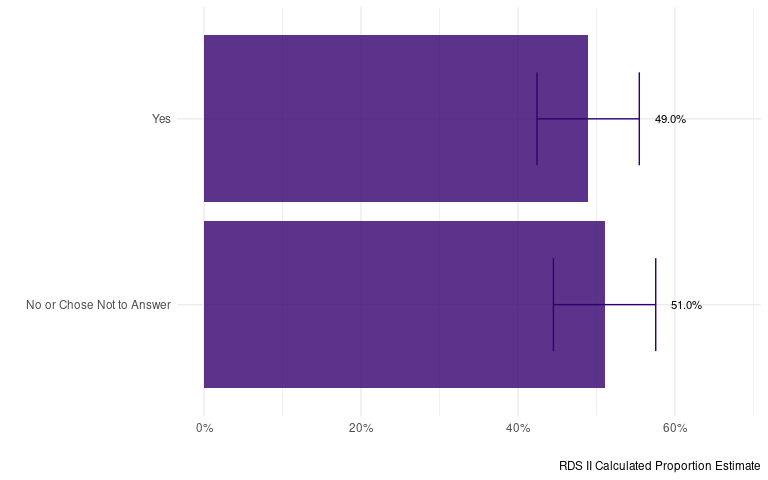

# Overview

This codebook summarizes the findings and data from the University of
Washington (UW) 2023 Seattle area homeless count project. The count was
led by Zack W. Almquist (*Lead - PI*), Paul Hebert (*Co-PI*), Nathalie
Williams (*Puget Sound Data Oversample PI*), Amy Hagopian (*Co-PI*),
June (Junhe) Yang (*Data Scientist Lead DSSG PhD*).

The data were collected using two different surveys, referred to as
**UWRDS** and **UWRDS-PSD** in the codebook. Data from both surveys were
harmonized for this codebook. We note where question phrasing differed
across surveys and when a variable was collected in only one survey.

An HTML version of this anaylsis may be downloaded [here](assets/general_codebook_html.html). 

This codebook and corresponding links were compiled by Data Science for
Social Good (DSSG) summer fellows, in alphabetical order:  
- Felix Junior Appiah Kubi,  
- Brooke Kaye,  
- Jess Robinson, and  
- Rebecca Schachtman,  
with the support of Data Scientist, June (Junhe) Yang, and Project Lead,
Zack Almquist.

We employ RDS methods for the population level statistics (details,
[here](https://uwescience.github.io/DSSG2024_understanding_homelessness/method1/)).
For information on funding and a full list of contributors, see
[Acknowledgements](https://uwescience.github.io/DSSG2024_understanding_homelessness/acknowledgements/).

# Demographics

## *Gender*

*Imputed based on ‘B4. How would you describe your gender?’
[UWRDS-PSD] and ‘25. Which of the following best describes your
gender?’ [UWRDS]*

<table class="table table-striped" style="margin-left: auto; margin-right: auto;">
<thead>
<tr>
<th style="text-align:left;">
Gender
</th>
<th style="text-align:right;">
Sample N
</th>
<th style="text-align:left;">
Sample Proportion
</th>
<th style="text-align:left;">
RDS II Estimate
</th>
<th style="text-align:left;">
RDS II 95% CI
</th>
</tr>
</thead>
<tbody>
<tr>
<td style="text-align:left;">
A gender other than singularly female or male (e.g., nonbinary,
genderfluid, agender, culturally specific gender)
</td>
<td style="text-align:right;">
10
</td>
<td style="text-align:left;">
0.99%
</td>
<td style="text-align:left;">
1.27%
</td>
<td style="text-align:left;">
[0.45%, 2.09%]
</td>
</tr>
<tr>
<td style="text-align:left;">
Do not know
</td>
<td style="text-align:right;">
1
</td>
<td style="text-align:left;">
0.10%
</td>
<td style="text-align:left;">
0.13%
</td>
<td style="text-align:left;">
[-0.07%, 0.33%]
</td>
</tr>
<tr>
<td style="text-align:left;">
Female
</td>
<td style="text-align:right;">
277
</td>
<td style="text-align:left;">
27.34%
</td>
<td style="text-align:left;">
26.54%
</td>
<td style="text-align:left;">
[20.74%, 32.34%]
</td>
</tr>
<tr>
<td style="text-align:left;">
Male
</td>
<td style="text-align:right;">
717
</td>
<td style="text-align:left;">
70.78%
</td>
<td style="text-align:left;">
71.31%
</td>
<td style="text-align:left;">
[65.51%, 77.10%]
</td>
</tr>
<tr>
<td style="text-align:left;">
Questioning
</td>
<td style="text-align:right;">
5
</td>
<td style="text-align:left;">
0.49%
</td>
<td style="text-align:left;">
0.41%
</td>
<td style="text-align:left;">
[0.28%, 0.53%]
</td>
</tr>
<tr>
<td style="text-align:left;">
Transgender
</td>
<td style="text-align:right;">
3
</td>
<td style="text-align:left;">
0.30%
</td>
<td style="text-align:left;">
0.35%
</td>
<td style="text-align:left;">
[-0.09%, 0.79%]
</td>
</tr>
<tr>
<td style="text-align:left;">
Total
</td>
<td style="text-align:right;">
1013
</td>
<td style="text-align:left;">
100.00%
</td>
<td style="text-align:left;">
100.00%
</td>
<td style="text-align:left;">

-   </td>
    </tr>
    </tbody>
    </table>

## *Race*

*Imputed based on ‘B18. Which one or more of the following would you say
best describes your race, heritage, or ancestry?’ [UWRDS-PSD] and ‘23.
Which racial groups do you identify with?’ [UWRDS]*

### *Race (Overall)*

<table class="table table-striped" style="margin-left: auto; margin-right: auto;">
<thead>
<tr>
<th style="text-align:left;">
Race
</th>
<th style="text-align:right;">
Sample N
</th>
<th style="text-align:left;">
Sample Proportion
</th>
<th style="text-align:left;">
RDS II Estimate
</th>
<th style="text-align:left;">
RDS II 95% CI
</th>
</tr>
</thead>
<tbody>
<tr>
<td style="text-align:left;">
American Indian, Alaskan Native or Indigenous
</td>
<td style="text-align:right;">
77
</td>
<td style="text-align:left;">
7.96%
</td>
<td style="text-align:left;">
8.91%
</td>
<td style="text-align:left;">
[5.17%, 12.65%]
</td>
</tr>
<tr>
<td style="text-align:left;">
Another race
</td>
<td style="text-align:right;">
14
</td>
<td style="text-align:left;">
1.45%
</td>
<td style="text-align:left;">
2.18%
</td>
<td style="text-align:left;">
[0.14%, 4.22%]
</td>
</tr>
<tr>
<td style="text-align:left;">
Asian or Asian American
</td>
<td style="text-align:right;">
20
</td>
<td style="text-align:left;">
2.07%
</td>
<td style="text-align:left;">
2.74%
</td>
<td style="text-align:left;">
[-0.03%, 5.51%]
</td>
</tr>
<tr>
<td style="text-align:left;">
Black, African American, or African
</td>
<td style="text-align:right;">
163
</td>
<td style="text-align:left;">
16.86%
</td>
<td style="text-align:left;">
18.63%
</td>
<td style="text-align:left;">
[13.53%, 23.73%]
</td>
</tr>
<tr>
<td style="text-align:left;">
Do not know
</td>
<td style="text-align:right;">
17
</td>
<td style="text-align:left;">
1.76%
</td>
<td style="text-align:left;">
2.15%
</td>
<td style="text-align:left;">
[-0.45%, 4.75%]
</td>
</tr>
<tr>
<td style="text-align:left;">
Multiracial
</td>
<td style="text-align:right;">
129
</td>
<td style="text-align:left;">
13.34%
</td>
<td style="text-align:left;">
13.42%
</td>
<td style="text-align:left;">
[9.30%, 17.54%]
</td>
</tr>
<tr>
<td style="text-align:left;">
Native Hawaiian or Pacific Islander
</td>
<td style="text-align:right;">
24
</td>
<td style="text-align:left;">
2.48%
</td>
<td style="text-align:left;">
2.28%
</td>
<td style="text-align:left;">
[0.75%, 3.82%]
</td>
</tr>
<tr>
<td style="text-align:left;">
White
</td>
<td style="text-align:right;">
523
</td>
<td style="text-align:left;">
54.08%
</td>
<td style="text-align:left;">
49.69%
</td>
<td style="text-align:left;">
[43.47%, 55.90%]
</td>
</tr>
<tr>
<td style="text-align:left;">
Total
</td>
<td style="text-align:right;">
967
</td>
<td style="text-align:left;">
100.00%
</td>
<td style="text-align:left;">
100.00%
</td>
<td style="text-align:left;">

-   </td>
    </tr>
    </tbody>
    </table>

### *Race - Multiracial Preference *

*Imputed racial category that classifies multiracial individuals as one
race with preference to Black based on ‘23. Which racial groups do you
identify with?’*

<table class="table table-striped" style="margin-left: auto; margin-right: auto;">
<thead>
<tr>
<th style="text-align:left;">
Race
</th>
<th style="text-align:right;">
Sample N
</th>
<th style="text-align:left;">
Sample Proportion
</th>
<th style="text-align:left;">
RDS II Estimate
</th>
<th style="text-align:left;">
RDS II 95% CI
</th>
</tr>
</thead>
<tbody>
<tr>
<td style="text-align:left;">
American Indian, Alaskan Native or Indigenous
</td>
<td style="text-align:right;">
136
</td>
<td style="text-align:left;">
14.06%
</td>
<td style="text-align:left;">
15.25%
</td>
<td style="text-align:left;">
[10.64%, 19.86%]
</td>
</tr>
<tr>
<td style="text-align:left;">
Another race
</td>
<td style="text-align:right;">
14
</td>
<td style="text-align:left;">
1.45%
</td>
<td style="text-align:left;">
2.18%
</td>
<td style="text-align:left;">
[0.14%, 4.22%]
</td>
</tr>
<tr>
<td style="text-align:left;">
Asian or Asian American
</td>
<td style="text-align:right;">
25
</td>
<td style="text-align:left;">
2.59%
</td>
<td style="text-align:left;">
3.26%
</td>
<td style="text-align:left;">
[0.44%, 6.08%]
</td>
</tr>
<tr>
<td style="text-align:left;">
Black, African American, or African
</td>
<td style="text-align:right;">
217
</td>
<td style="text-align:left;">
22.44%
</td>
<td style="text-align:left;">
23.63%
</td>
<td style="text-align:left;">
[18.34%, 28.92%]
</td>
</tr>
<tr>
<td style="text-align:left;">
Do not know
</td>
<td style="text-align:right;">
17
</td>
<td style="text-align:left;">
1.76%
</td>
<td style="text-align:left;">
2.15%
</td>
<td style="text-align:left;">
[-0.45%, 4.75%]
</td>
</tr>
<tr>
<td style="text-align:left;">
Native Hawaiian or Pacific Islander
</td>
<td style="text-align:right;">
32
</td>
<td style="text-align:left;">
3.31%
</td>
<td style="text-align:left;">
3.56%
</td>
<td style="text-align:left;">
[0.89%, 6.22%]
</td>
</tr>
<tr>
<td style="text-align:left;">
White
</td>
<td style="text-align:right;">
526
</td>
<td style="text-align:left;">
54.40%
</td>
<td style="text-align:left;">
49.97%
</td>
<td style="text-align:left;">
[43.75%, 56.20%]
</td>
</tr>
<tr>
<td style="text-align:left;">
Total
</td>
<td style="text-align:right;">
967
</td>
<td style="text-align:left;">
100.00%
</td>
<td style="text-align:left;">
100.00%
</td>
<td style="text-align:left;">

-   </td>
    </tr>
    </tbody>
    </table>

### *Race - Multiracial (Indigenous)*

*Imputed racial category that classifies multiracial individuals as one
race with preference to Indigenous based on ‘23. Which racial groups do
you identify with?’*

<table class="table table-striped" style="margin-left: auto; margin-right: auto;">
<thead>
<tr>
<th style="text-align:left;">
Race
</th>
<th style="text-align:right;">
Sample N
</th>
<th style="text-align:left;">
Sample Proportion
</th>
<th style="text-align:left;">
RDS II Estimate
</th>
<th style="text-align:left;">
RDS II 95% CI
</th>
</tr>
</thead>
<tbody>
<tr>
<td style="text-align:left;">
American Indian, Alaskan Native or Indigenous
</td>
<td style="text-align:right;">
177
</td>
<td style="text-align:left;">
18.30%
</td>
<td style="text-align:left;">
19.01%
</td>
<td style="text-align:left;">
[14.19%, 23.83%]
</td>
</tr>
<tr>
<td style="text-align:left;">
Another race
</td>
<td style="text-align:right;">
14
</td>
<td style="text-align:left;">
1.45%
</td>
<td style="text-align:left;">
2.18%
</td>
<td style="text-align:left;">
[0.14%, 4.22%]
</td>
</tr>
<tr>
<td style="text-align:left;">
Asian or Asian American
</td>
<td style="text-align:right;">
25
</td>
<td style="text-align:left;">
2.59%
</td>
<td style="text-align:left;">
3.26%
</td>
<td style="text-align:left;">
[0.44%, 6.08%]
</td>
</tr>
<tr>
<td style="text-align:left;">
Black, African American, or African
</td>
<td style="text-align:right;">
176
</td>
<td style="text-align:left;">
18.20%
</td>
<td style="text-align:left;">
19.87%
</td>
<td style="text-align:left;">
[14.74%, 25.01%]
</td>
</tr>
<tr>
<td style="text-align:left;">
Do not know
</td>
<td style="text-align:right;">
17
</td>
<td style="text-align:left;">
1.76%
</td>
<td style="text-align:left;">
2.15%
</td>
<td style="text-align:left;">
[-0.45%, 4.75%]
</td>
</tr>
<tr>
<td style="text-align:left;">
Native Hawaiian or Pacific Islander
</td>
<td style="text-align:right;">
32
</td>
<td style="text-align:left;">
3.31%
</td>
<td style="text-align:left;">
3.56%
</td>
<td style="text-align:left;">
[0.89%, 6.22%]
</td>
</tr>
<tr>
<td style="text-align:left;">
White
</td>
<td style="text-align:right;">
526
</td>
<td style="text-align:left;">
54.40%
</td>
<td style="text-align:left;">
49.97%
</td>
<td style="text-align:left;">
[43.75%, 56.20%]
</td>
</tr>
<tr>
<td style="text-align:left;">
Total
</td>
<td style="text-align:right;">
967
</td>
<td style="text-align:left;">
100.00%
</td>
<td style="text-align:left;">
100.00%
</td>
<td style="text-align:left;">

-   </td>
    </tr>
    </tbody>
    </table>

### *Race - Multiracial (Native Hawaiian or Pacific Islander)*

*Imputed racial category that classifies multiracial individuals as one
race with preference to Native Hawaiian or Pacific Islander based on
‘23. Which racial groups do you identify with?’*

<table class="table table-striped" style="margin-left: auto; margin-right: auto;">
<thead>
<tr>
<th style="text-align:left;">
Race
</th>
<th style="text-align:right;">
Sample N
</th>
<th style="text-align:left;">
Sample Proportion
</th>
<th style="text-align:left;">
RDS II Estimate
</th>
<th style="text-align:left;">
RDS II 95% CI
</th>
</tr>
</thead>
<tbody>
<tr>
<td style="text-align:left;">
American Indian, Alaskan Native or Indigenous
</td>
<td style="text-align:right;">
129
</td>
<td style="text-align:left;">
13.34%
</td>
<td style="text-align:left;">
14.22%
</td>
<td style="text-align:left;">
[9.71%, 18.72%]
</td>
</tr>
<tr>
<td style="text-align:left;">
Another race
</td>
<td style="text-align:right;">
14
</td>
<td style="text-align:left;">
1.45%
</td>
<td style="text-align:left;">
2.18%
</td>
<td style="text-align:left;">
[0.14%, 4.22%]
</td>
</tr>
<tr>
<td style="text-align:left;">
Asian or Asian American
</td>
<td style="text-align:right;">
25
</td>
<td style="text-align:left;">
2.59%
</td>
<td style="text-align:left;">
3.26%
</td>
<td style="text-align:left;">
[0.44%, 6.08%]
</td>
</tr>
<tr>
<td style="text-align:left;">
Black, African American, or African
</td>
<td style="text-align:right;">
197
</td>
<td style="text-align:left;">
20.37%
</td>
<td style="text-align:left;">
21.58%
</td>
<td style="text-align:left;">
[16.32%, 26.84%]
</td>
</tr>
<tr>
<td style="text-align:left;">
Do not know
</td>
<td style="text-align:right;">
17
</td>
<td style="text-align:left;">
1.76%
</td>
<td style="text-align:left;">
2.15%
</td>
<td style="text-align:left;">
[-0.45%, 4.75%]
</td>
</tr>
<tr>
<td style="text-align:left;">
Native Hawaiian or Pacific Islander
</td>
<td style="text-align:right;">
59
</td>
<td style="text-align:left;">
6.10%
</td>
<td style="text-align:left;">
6.65%
</td>
<td style="text-align:left;">
[3.64%, 9.65%]
</td>
</tr>
<tr>
<td style="text-align:left;">
White
</td>
<td style="text-align:right;">
526
</td>
<td style="text-align:left;">
54.40%
</td>
<td style="text-align:left;">
49.97%
</td>
<td style="text-align:left;">
[43.75%, 56.20%]
</td>
</tr>
<tr>
<td style="text-align:left;">
Total
</td>
<td style="text-align:right;">
967
</td>
<td style="text-align:left;">
100.00%
</td>
<td style="text-align:left;">
100.00%
</td>
<td style="text-align:left;">

-   </td>
    </tr>
    </tbody>
    </table>

## *Ethnicity*

*Imputed based on ‘B16. Do you consider yourself Hispanic or Latinx’
[UWRDS-PSD] and ‘24. What is your ethnicity?’ [UWRDS]*

<table class="table table-striped" style="margin-left: auto; margin-right: auto;">
<thead>
<tr>
<th style="text-align:left;">
Ethnicity
</th>
<th style="text-align:right;">
Sample N
</th>
<th style="text-align:left;">
Sample Proportion
</th>
<th style="text-align:left;">
RDS II Estimate
</th>
<th style="text-align:left;">
RDS II 95% CI
</th>
</tr>
</thead>
<tbody>
<tr>
<td style="text-align:left;">
Do not know
</td>
<td style="text-align:right;">
21
</td>
<td style="text-align:left;">
2%
</td>
<td style="text-align:left;">
2%
</td>
<td style="text-align:left;">
[0%, 4%]
</td>
</tr>
<tr>
<td style="text-align:left;">
Hispanic/Latin(a)(o)(x)
</td>
<td style="text-align:right;">
146
</td>
<td style="text-align:left;">
15%
</td>
<td style="text-align:left;">
15%
</td>
<td style="text-align:left;">
[11%, 20%]
</td>
</tr>
<tr>
<td style="text-align:left;">
Non-Hispanic/Non-Latin(a)(o)(x)
</td>
<td style="text-align:right;">
820
</td>
<td style="text-align:left;">
83%
</td>
<td style="text-align:left;">
83%
</td>
<td style="text-align:left;">
[78%, 87%]
</td>
</tr>
<tr>
<td style="text-align:left;">
Total
</td>
<td style="text-align:right;">
987
</td>
<td style="text-align:left;">
100%
</td>
<td style="text-align:left;">
100%
</td>
<td style="text-align:left;">

-   </td>
    </tr>
    </tbody>
    </table>

## *Age*

*Date of Birth*

### *Age (Categorical)*

*Imputed based on ‘A2. How old are you?’ [UWRDS-PSD] and ‘4. Date of
Birth’ [UWRDS]*

<table class="table table-striped" style="margin-left: auto; margin-right: auto;">
<thead>
<tr>
<th style="text-align:left;">
Age - Categorical
</th>
<th style="text-align:right;">
Sample N
</th>
<th style="text-align:left;">
Sample Proportion
</th>
<th style="text-align:left;">
RDS II Estimate
</th>
<th style="text-align:left;">
RDS II 95% CI
</th>
</tr>
</thead>
<tbody>
<tr>
<td style="text-align:left;">
18-24
</td>
<td style="text-align:right;">
26
</td>
<td style="text-align:left;">
2.5%
</td>
<td style="text-align:left;">
3.4%
</td>
<td style="text-align:left;">
[0.5%, 6.2%]
</td>
</tr>
<tr>
<td style="text-align:left;">
25-34
</td>
<td style="text-align:right;">
208
</td>
<td style="text-align:left;">
20.4%
</td>
<td style="text-align:left;">
21.2%
</td>
<td style="text-align:left;">
[16.0%, 26.3%]
</td>
</tr>
<tr>
<td style="text-align:left;">
35-44
</td>
<td style="text-align:right;">
302
</td>
<td style="text-align:left;">
29.7%
</td>
<td style="text-align:left;">
28.6%
</td>
<td style="text-align:left;">
[23.3%, 34.0%]
</td>
</tr>
<tr>
<td style="text-align:left;">
45-54
</td>
<td style="text-align:right;">
240
</td>
<td style="text-align:left;">
23.6%
</td>
<td style="text-align:left;">
22.8%
</td>
<td style="text-align:left;">
[17.8%, 27.9%]
</td>
</tr>
<tr>
<td style="text-align:left;">
55-64
</td>
<td style="text-align:right;">
180
</td>
<td style="text-align:left;">
17.7%
</td>
<td style="text-align:left;">
16.9%
</td>
<td style="text-align:left;">
[13.3%, 20.6%]
</td>
</tr>
<tr>
<td style="text-align:left;">
65+
</td>
<td style="text-align:right;">
62
</td>
<td style="text-align:left;">
6.1%
</td>
<td style="text-align:left;">
7.1%
</td>
<td style="text-align:left;">
[3.7%, 10.5%]
</td>
</tr>
<tr>
<td style="text-align:left;">
Total
</td>
<td style="text-align:right;">
1018
</td>
<td style="text-align:left;">
100.0%
</td>
<td style="text-align:left;">
100.0%
</td>
<td style="text-align:left;">

-   </td>
    </tr>
    </tbody>
    </table>

### *Age (Continuous)*

*Age - Imputed from ‘4. Date of Birth’*

<table class="table table-striped" style="margin-left: auto; margin-right: auto;">
<thead>
<tr>
<th style="text-align:left;">
Age - Continuous
</th>
<th style="text-align:right;">
Sample N
</th>
<th style="text-align:right;">
Sample Median
</th>
<th style="text-align:right;">
Sample Mean
</th>
<th style="text-align:right;">
Sample SE
</th>
<th style="text-align:right;">
RDS II Estimate
</th>
<th style="text-align:left;">
RDS II 95% CI
</th>
</tr>
</thead>
<tbody>
<tr>
<td style="text-align:left;">
•
</td>
<td style="text-align:right;">
1018
</td>
<td style="text-align:right;">
43
</td>
<td style="text-align:right;">
44.73
</td>
<td style="text-align:right;">
0.39
</td>
<td style="text-align:right;">
44.63
</td>
<td style="text-align:left;">
[42.93, 46.32]
</td>
</tr>
</tbody>
</table>

## *Birthplace*

### *Birth State*

*‘8. Birthplace: - State - In what city and state were you born? -
Imputed’ This variable is not included for UWRDS-PSD survey
observations.*

<table class="table table-striped" style="margin-left: auto; margin-right: auto;">
<thead>
<tr>
<th style="text-align:left;">
Birth State
</th>
<th style="text-align:right;">
Sample N
</th>
<th style="text-align:left;">
Sample Proportion
</th>
<th style="text-align:left;">
RDS II Estimate
</th>
<th style="text-align:left;">
RDS II 95% CI
</th>
</tr>
</thead>
<tbody>
<tr>
<td style="text-align:left;">
Alabama
</td>
<td style="text-align:right;">
6
</td>
<td style="text-align:left;">
0.77%
</td>
<td style="text-align:left;">
1.140%
</td>
<td style="text-align:left;">
[-1.27%, 3.540%]
</td>
</tr>
<tr>
<td style="text-align:left;">
Alaska
</td>
<td style="text-align:right;">
17
</td>
<td style="text-align:left;">
2.19%
</td>
<td style="text-align:left;">
1.870%
</td>
<td style="text-align:left;">
[1.04%, 2.700%]
</td>
</tr>
<tr>
<td style="text-align:left;">
Arizona
</td>
<td style="text-align:right;">
8
</td>
<td style="text-align:left;">
1.03%
</td>
<td style="text-align:left;">
1.550%
</td>
<td style="text-align:left;">
[-0.93%, 4.030%]
</td>
</tr>
<tr>
<td style="text-align:left;">
Arkansas
</td>
<td style="text-align:right;">
5
</td>
<td style="text-align:left;">
0.64%
</td>
<td style="text-align:left;">
0.810%
</td>
<td style="text-align:left;">
[0.06%, 1.550%]
</td>
</tr>
<tr>
<td style="text-align:left;">
California
</td>
<td style="text-align:right;">
85
</td>
<td style="text-align:left;">
10.94%
</td>
<td style="text-align:left;">
9.760%
</td>
<td style="text-align:left;">
[6.17%, 13.350%]
</td>
</tr>
<tr>
<td style="text-align:left;">
Colorado
</td>
<td style="text-align:right;">
12
</td>
<td style="text-align:left;">
1.54%
</td>
<td style="text-align:left;">
1.140%
</td>
<td style="text-align:left;">
[0.72%, 1.560%]
</td>
</tr>
<tr>
<td style="text-align:left;">
Connecticut
</td>
<td style="text-align:right;">
2
</td>
<td style="text-align:left;">
0.26%
</td>
<td style="text-align:left;">
0.090%
</td>
<td style="text-align:left;">
[0.06%, 0.110%]
</td>
</tr>
<tr>
<td style="text-align:left;">
Florida
</td>
<td style="text-align:right;">
25
</td>
<td style="text-align:left;">
3.22%
</td>
<td style="text-align:left;">
4.740%
</td>
<td style="text-align:left;">
[0.99%, 8.490%]
</td>
</tr>
<tr>
<td style="text-align:left;">
Georgia
</td>
<td style="text-align:right;">
5
</td>
<td style="text-align:left;">
0.64%
</td>
<td style="text-align:left;">
0.930%
</td>
<td style="text-align:left;">
[-0.45%, 2.310%]
</td>
</tr>
<tr>
<td style="text-align:left;">
Hawaii
</td>
<td style="text-align:right;">
5
</td>
<td style="text-align:left;">
0.64%
</td>
<td style="text-align:left;">
0.840%
</td>
<td style="text-align:left;">
[-1.27%, 2.950%]
</td>
</tr>
<tr>
<td style="text-align:left;">
Idaho
</td>
<td style="text-align:right;">
6
</td>
<td style="text-align:left;">
0.77%
</td>
<td style="text-align:left;">
1.000%
</td>
<td style="text-align:left;">
[-0.65%, 2.650%]
</td>
</tr>
<tr>
<td style="text-align:left;">
Illinois
</td>
<td style="text-align:right;">
16
</td>
<td style="text-align:left;">
2.06%
</td>
<td style="text-align:left;">
2.190%
</td>
<td style="text-align:left;">
[1.01%, 3.380%]
</td>
</tr>
<tr>
<td style="text-align:left;">
Indiana
</td>
<td style="text-align:right;">
4
</td>
<td style="text-align:left;">
0.51%
</td>
<td style="text-align:left;">
0.610%
</td>
<td style="text-align:left;">
[0.39%, 0.840%]
</td>
</tr>
<tr>
<td style="text-align:left;">
Iowa
</td>
<td style="text-align:right;">
5
</td>
<td style="text-align:left;">
0.64%
</td>
<td style="text-align:left;">
1.060%
</td>
<td style="text-align:left;">
[-1.73%, 3.850%]
</td>
</tr>
<tr>
<td style="text-align:left;">
Kansas
</td>
<td style="text-align:right;">
10
</td>
<td style="text-align:left;">
1.29%
</td>
<td style="text-align:left;">
1.590%
</td>
<td style="text-align:left;">
[-0.78%, 3.970%]
</td>
</tr>
<tr>
<td style="text-align:left;">
Kentucky
</td>
<td style="text-align:right;">
6
</td>
<td style="text-align:left;">
0.77%
</td>
<td style="text-align:left;">
0.540%
</td>
<td style="text-align:left;">
[-0.14%, 1.230%]
</td>
</tr>
<tr>
<td style="text-align:left;">
Louisiana
</td>
<td style="text-align:right;">
8
</td>
<td style="text-align:left;">
1.03%
</td>
<td style="text-align:left;">
1.090%
</td>
<td style="text-align:left;">
[-0.68%, 2.850%]
</td>
</tr>
<tr>
<td style="text-align:left;">
Maine
</td>
<td style="text-align:right;">
1
</td>
<td style="text-align:left;">
0.13%
</td>
<td style="text-align:left;">
0.090%
</td>
<td style="text-align:left;">
[0.07%, 0.110%]
</td>
</tr>
<tr>
<td style="text-align:left;">
Massachusetts
</td>
<td style="text-align:right;">
4
</td>
<td style="text-align:left;">
0.51%
</td>
<td style="text-align:left;">
0.590%
</td>
<td style="text-align:left;">
[0.31%, 0.870%]
</td>
</tr>
<tr>
<td style="text-align:left;">
Michigan
</td>
<td style="text-align:right;">
13
</td>
<td style="text-align:left;">
1.67%
</td>
<td style="text-align:left;">
1.450%
</td>
<td style="text-align:left;">
[0.76%, 2.140%]
</td>
</tr>
<tr>
<td style="text-align:left;">
Minnesota
</td>
<td style="text-align:right;">
10
</td>
<td style="text-align:left;">
1.29%
</td>
<td style="text-align:left;">
2.180%
</td>
<td style="text-align:left;">
[0.01%, 4.350%]
</td>
</tr>
<tr>
<td style="text-align:left;">
Mississippi
</td>
<td style="text-align:right;">
2
</td>
<td style="text-align:left;">
0.26%
</td>
<td style="text-align:left;">
0.170%
</td>
<td style="text-align:left;">
[-0.01%, 0.350%]
</td>
</tr>
<tr>
<td style="text-align:left;">
Missouri
</td>
<td style="text-align:right;">
8
</td>
<td style="text-align:left;">
1.03%
</td>
<td style="text-align:left;">
0.720%
</td>
<td style="text-align:left;">
[0.07%, 1.370%]
</td>
</tr>
<tr>
<td style="text-align:left;">
Montana
</td>
<td style="text-align:right;">
17
</td>
<td style="text-align:left;">
2.19%
</td>
<td style="text-align:left;">
1.800%
</td>
<td style="text-align:left;">
[-0.36%, 3.960%]
</td>
</tr>
<tr>
<td style="text-align:left;">
Nebraska
</td>
<td style="text-align:right;">
4
</td>
<td style="text-align:left;">
0.51%
</td>
<td style="text-align:left;">
0.550%
</td>
<td style="text-align:left;">
[-1.36%, 2.460%]
</td>
</tr>
<tr>
<td style="text-align:left;">
Nevada
</td>
<td style="text-align:right;">
1
</td>
<td style="text-align:left;">
0.13%
</td>
<td style="text-align:left;">
0.370%
</td>
<td style="text-align:left;">
[0.17%, 0.560%]
</td>
</tr>
<tr>
<td style="text-align:left;">
New Hampshire
</td>
<td style="text-align:right;">
1
</td>
<td style="text-align:left;">
0.13%
</td>
<td style="text-align:left;">
0.180%
</td>
<td style="text-align:left;">
[-0.47%, 0.840%]
</td>
</tr>
<tr>
<td style="text-align:left;">
New Jersey
</td>
<td style="text-align:right;">
8
</td>
<td style="text-align:left;">
1.03%
</td>
<td style="text-align:left;">
1.180%
</td>
<td style="text-align:left;">
[-0.36%, 2.720%]
</td>
</tr>
<tr>
<td style="text-align:left;">
New Mexico
</td>
<td style="text-align:right;">
7
</td>
<td style="text-align:left;">
0.90%
</td>
<td style="text-align:left;">
1.060%
</td>
<td style="text-align:left;">
[-1.19%, 3.310%]
</td>
</tr>
<tr>
<td style="text-align:left;">
New York
</td>
<td style="text-align:right;">
11
</td>
<td style="text-align:left;">
1.42%
</td>
<td style="text-align:left;">
1.480%
</td>
<td style="text-align:left;">
[-0.32%, 3.280%]
</td>
</tr>
<tr>
<td style="text-align:left;">
North Carolina
</td>
<td style="text-align:right;">
4
</td>
<td style="text-align:left;">
0.51%
</td>
<td style="text-align:left;">
0.580%
</td>
<td style="text-align:left;">
[-0.07%, 1.230%]
</td>
</tr>
<tr>
<td style="text-align:left;">
North Dakota
</td>
<td style="text-align:right;">
5
</td>
<td style="text-align:left;">
0.64%
</td>
<td style="text-align:left;">
0.520%
</td>
<td style="text-align:left;">
[0.32%, 0.720%]
</td>
</tr>
<tr>
<td style="text-align:left;">
Ohio
</td>
<td style="text-align:right;">
10
</td>
<td style="text-align:left;">
1.29%
</td>
<td style="text-align:left;">
1.910%
</td>
<td style="text-align:left;">
[-0.30%, 4.130%]
</td>
</tr>
<tr>
<td style="text-align:left;">
Oklahoma
</td>
<td style="text-align:right;">
7
</td>
<td style="text-align:left;">
0.90%
</td>
<td style="text-align:left;">
1.160%
</td>
<td style="text-align:left;">
[-0.74%, 3.060%]
</td>
</tr>
<tr>
<td style="text-align:left;">
Oregon
</td>
<td style="text-align:right;">
20
</td>
<td style="text-align:left;">
2.57%
</td>
<td style="text-align:left;">
2.700%
</td>
<td style="text-align:left;">
[1.38%, 4.030%]
</td>
</tr>
<tr>
<td style="text-align:left;">
Pennsylvania
</td>
<td style="text-align:right;">
8
</td>
<td style="text-align:left;">
1.03%
</td>
<td style="text-align:left;">
1.040%
</td>
<td style="text-align:left;">
[-1.03%, 3.110%]
</td>
</tr>
<tr>
<td style="text-align:left;">
South Carolina
</td>
<td style="text-align:right;">
4
</td>
<td style="text-align:left;">
0.51%
</td>
<td style="text-align:left;">
0.250%
</td>
<td style="text-align:left;">
[0.11%, 0.400%]
</td>
</tr>
<tr>
<td style="text-align:left;">
South Dakota
</td>
<td style="text-align:right;">
2
</td>
<td style="text-align:left;">
0.26%
</td>
<td style="text-align:left;">
0.210%
</td>
<td style="text-align:left;">
[-0.50%, 0.920%]
</td>
</tr>
<tr>
<td style="text-align:left;">
Tennessee
</td>
<td style="text-align:right;">
9
</td>
<td style="text-align:left;">
1.16%
</td>
<td style="text-align:left;">
0.670%
</td>
<td style="text-align:left;">
[-0.03%, 1.370%]
</td>
</tr>
<tr>
<td style="text-align:left;">
Texas
</td>
<td style="text-align:right;">
21
</td>
<td style="text-align:left;">
2.70%
</td>
<td style="text-align:left;">
3.100%
</td>
<td style="text-align:left;">
[1.56%, 4.640%]
</td>
</tr>
<tr>
<td style="text-align:left;">
Utah
</td>
<td style="text-align:right;">
4
</td>
<td style="text-align:left;">
0.51%
</td>
<td style="text-align:left;">
0.510%
</td>
<td style="text-align:left;">
[-0.17%, 1.190%]
</td>
</tr>
<tr>
<td style="text-align:left;">
Vermont
</td>
<td style="text-align:right;">
1
</td>
<td style="text-align:left;">
0.13%
</td>
<td style="text-align:left;">
0.090%
</td>
<td style="text-align:left;">
[0.01%, 0.180%]
</td>
</tr>
<tr>
<td style="text-align:left;">
Virginia
</td>
<td style="text-align:right;">
3
</td>
<td style="text-align:left;">
0.39%
</td>
<td style="text-align:left;">
0.560%
</td>
<td style="text-align:left;">
[-1.32%, 2.450%]
</td>
</tr>
<tr>
<td style="text-align:left;">
Washington
</td>
<td style="text-align:right;">
357
</td>
<td style="text-align:left;">
45.95%
</td>
<td style="text-align:left;">
42.540%
</td>
<td style="text-align:left;">
[35.83%, 49.250%]
</td>
</tr>
<tr>
<td style="text-align:left;">
West Virginia
</td>
<td style="text-align:right;">
4
</td>
<td style="text-align:left;">
0.51%
</td>
<td style="text-align:left;">
0.470%
</td>
<td style="text-align:left;">
[-0.17%, 1.120%]
</td>
</tr>
<tr>
<td style="text-align:left;">
Wisconsin
</td>
<td style="text-align:right;">
5
</td>
<td style="text-align:left;">
0.64%
</td>
<td style="text-align:left;">
0.790%
</td>
<td style="text-align:left;">
[0.15%, 1.430%]
</td>
</tr>
<tr>
<td style="text-align:left;">
Wyoming
</td>
<td style="text-align:right;">
1
</td>
<td style="text-align:left;">
0.13%
</td>
<td style="text-align:left;">
0.120%
</td>
<td style="text-align:left;">
[0.09%, 0.150%]
</td>
</tr>
<tr>
<td style="text-align:left;">
Total
</td>
<td style="text-align:right;">
777
</td>
<td style="text-align:left;">
100.00%
</td>
<td style="text-align:left;">
100.000%
</td>
<td style="text-align:left;">

-   </td>
    </tr>
    </tbody>
    </table>

### *Birth Country*

*‘8. Birthplace: - Country - In what city and state were you born? -
Imputed’ This variable is not included for UWRDS-PSD survey
observations.*

<table class="table table-striped" style="margin-left: auto; margin-right: auto;">
<thead>
<tr>
<th style="text-align:left;">
Birth Country
</th>
<th style="text-align:right;">
Sample N
</th>
<th style="text-align:left;">
Sample Proportion
</th>
<th style="text-align:left;">
RDS II Estimate
</th>
<th style="text-align:left;">
RDS II 95% CI
</th>
</tr>
</thead>
<tbody>
<tr>
<td style="text-align:left;">
Burma
</td>
<td style="text-align:right;">
1
</td>
<td style="text-align:left;">
0.12%
</td>
<td style="text-align:left;">
0.34%
</td>
<td style="text-align:left;">
[-1.030%, 1.700%]
</td>
</tr>
<tr>
<td style="text-align:left;">
Canada
</td>
<td style="text-align:right;">
4
</td>
<td style="text-align:left;">
0.48%
</td>
<td style="text-align:left;">
0.81%
</td>
<td style="text-align:left;">
[-1.110%, 2.740%]
</td>
</tr>
<tr>
<td style="text-align:left;">
Costa Rica
</td>
<td style="text-align:right;">
1
</td>
<td style="text-align:left;">
0.12%
</td>
<td style="text-align:left;">
0.34%
</td>
<td style="text-align:left;">
[0.270%, 0.410%]
</td>
</tr>
<tr>
<td style="text-align:left;">
Dominican Republic
</td>
<td style="text-align:right;">
1
</td>
<td style="text-align:left;">
0.12%
</td>
<td style="text-align:left;">
0.03%
</td>
<td style="text-align:left;">
[0.020%, 0.050%]
</td>
</tr>
<tr>
<td style="text-align:left;">
Ethiopia
</td>
<td style="text-align:right;">
3
</td>
<td style="text-align:left;">
0.36%
</td>
<td style="text-align:left;">
0.59%
</td>
<td style="text-align:left;">
[0.360%, 0.820%]
</td>
</tr>
<tr>
<td style="text-align:left;">
France
</td>
<td style="text-align:right;">
1
</td>
<td style="text-align:left;">
0.12%
</td>
<td style="text-align:left;">
0.17%
</td>
<td style="text-align:left;">
[-0.170%, 0.500%]
</td>
</tr>
<tr>
<td style="text-align:left;">
Germany
</td>
<td style="text-align:right;">
3
</td>
<td style="text-align:left;">
0.36%
</td>
<td style="text-align:left;">
0.42%
</td>
<td style="text-align:left;">
[-1.110%, 1.940%]
</td>
</tr>
<tr>
<td style="text-align:left;">
Grenada
</td>
<td style="text-align:right;">
1
</td>
<td style="text-align:left;">
0.12%
</td>
<td style="text-align:left;">
0.17%
</td>
<td style="text-align:left;">
[-0.300%, 0.630%]
</td>
</tr>
<tr>
<td style="text-align:left;">
Guam
</td>
<td style="text-align:right;">
2
</td>
<td style="text-align:left;">
0.24%
</td>
<td style="text-align:left;">
0.45%
</td>
<td style="text-align:left;">
[-0.860%, 1.760%]
</td>
</tr>
<tr>
<td style="text-align:left;">
Haiti
</td>
<td style="text-align:right;">
1
</td>
<td style="text-align:left;">
0.12%
</td>
<td style="text-align:left;">
0.08%
</td>
<td style="text-align:left;">
[0.060%, 0.110%]
</td>
</tr>
<tr>
<td style="text-align:left;">
Honduras
</td>
<td style="text-align:right;">
1
</td>
<td style="text-align:left;">
0.12%
</td>
<td style="text-align:left;">
0.11%
</td>
<td style="text-align:left;">
[-0.030%, 0.250%]
</td>
</tr>
<tr>
<td style="text-align:left;">
India
</td>
<td style="text-align:right;">
2
</td>
<td style="text-align:left;">
0.24%
</td>
<td style="text-align:left;">
0.17%
</td>
<td style="text-align:left;">
[0.120%, 0.220%]
</td>
</tr>
<tr>
<td style="text-align:left;">
Iran
</td>
<td style="text-align:right;">
1
</td>
<td style="text-align:left;">
0.12%
</td>
<td style="text-align:left;">
0.17%
</td>
<td style="text-align:left;">
[0.130%, 0.210%]
</td>
</tr>
<tr>
<td style="text-align:left;">
Italy
</td>
<td style="text-align:right;">
1
</td>
<td style="text-align:left;">
0.12%
</td>
<td style="text-align:left;">
0.17%
</td>
<td style="text-align:left;">
[-0.130%, 0.470%]
</td>
</tr>
<tr>
<td style="text-align:left;">
Japan
</td>
<td style="text-align:right;">
1
</td>
<td style="text-align:left;">
0.12%
</td>
<td style="text-align:left;">
0.06%
</td>
<td style="text-align:left;">
[0.040%, 0.080%]
</td>
</tr>
<tr>
<td style="text-align:left;">
Jordan
</td>
<td style="text-align:right;">
1
</td>
<td style="text-align:left;">
0.12%
</td>
<td style="text-align:left;">
0.17%
</td>
<td style="text-align:left;">
[-0.500%, 0.830%]
</td>
</tr>
<tr>
<td style="text-align:left;">
Kazakhstan
</td>
<td style="text-align:right;">
2
</td>
<td style="text-align:left;">
0.24%
</td>
<td style="text-align:left;">
0.19%
</td>
<td style="text-align:left;">
[-0.050%, 0.430%]
</td>
</tr>
<tr>
<td style="text-align:left;">
Kenya
</td>
<td style="text-align:right;">
2
</td>
<td style="text-align:left;">
0.24%
</td>
<td style="text-align:left;">
0.08%
</td>
<td style="text-align:left;">
[0.020%, 0.140%]
</td>
</tr>
<tr>
<td style="text-align:left;">
Korea
</td>
<td style="text-align:right;">
1
</td>
<td style="text-align:left;">
0.12%
</td>
<td style="text-align:left;">
0.04%
</td>
<td style="text-align:left;">
[0.010%, 0.060%]
</td>
</tr>
<tr>
<td style="text-align:left;">
Laos
</td>
<td style="text-align:right;">
1
</td>
<td style="text-align:left;">
0.12%
</td>
<td style="text-align:left;">
0.17%
</td>
<td style="text-align:left;">
[0.070%, 0.270%]
</td>
</tr>
<tr>
<td style="text-align:left;">
Lebanon
</td>
<td style="text-align:right;">
1
</td>
<td style="text-align:left;">
0.12%
</td>
<td style="text-align:left;">
0.11%
</td>
<td style="text-align:left;">
[0.020%, 0.210%]
</td>
</tr>
<tr>
<td style="text-align:left;">
Lunpranba
</td>
<td style="text-align:right;">
1
</td>
<td style="text-align:left;">
0.12%
</td>
<td style="text-align:left;">
0.17%
</td>
<td style="text-align:left;">
[0.020%, 0.320%]
</td>
</tr>
<tr>
<td style="text-align:left;">
Marianas islands
</td>
<td style="text-align:right;">
1
</td>
<td style="text-align:left;">
0.12%
</td>
<td style="text-align:left;">
0.02%
</td>
<td style="text-align:left;">
[0.010%, 0.030%]
</td>
</tr>
<tr>
<td style="text-align:left;">
Mexico
</td>
<td style="text-align:right;">
5
</td>
<td style="text-align:left;">
0.60%
</td>
<td style="text-align:left;">
0.85%
</td>
<td style="text-align:left;">
[0.140%, 1.570%]
</td>
</tr>
<tr>
<td style="text-align:left;">
Mumbai india
</td>
<td style="text-align:right;">
1
</td>
<td style="text-align:left;">
0.12%
</td>
<td style="text-align:left;">
0.34%
</td>
<td style="text-align:left;">
[-1.290%, 1.960%]
</td>
</tr>
<tr>
<td style="text-align:left;">
Palau
</td>
<td style="text-align:right;">
1
</td>
<td style="text-align:left;">
0.12%
</td>
<td style="text-align:left;">
0.08%
</td>
<td style="text-align:left;">
[-0.030%, 0.200%]
</td>
</tr>
<tr>
<td style="text-align:left;">
Philippines
</td>
<td style="text-align:right;">
4
</td>
<td style="text-align:left;">
0.48%
</td>
<td style="text-align:left;">
0.66%
</td>
<td style="text-align:left;">
[-0.940%, 2.250%]
</td>
</tr>
<tr>
<td style="text-align:left;">
Puerto Rico
</td>
<td style="text-align:right;">
1
</td>
<td style="text-align:left;">
0.12%
</td>
<td style="text-align:left;">
0.11%
</td>
<td style="text-align:left;">
[-0.180%, 0.410%]
</td>
</tr>
<tr>
<td style="text-align:left;">
Romania
</td>
<td style="text-align:right;">
1
</td>
<td style="text-align:left;">
0.12%
</td>
<td style="text-align:left;">
0.11%
</td>
<td style="text-align:left;">
[0.050%, 0.180%]
</td>
</tr>
<tr>
<td style="text-align:left;">
Russia
</td>
<td style="text-align:right;">
1
</td>
<td style="text-align:left;">
0.12%
</td>
<td style="text-align:left;">
0.17%
</td>
<td style="text-align:left;">
[-0.450%, 0.780%]
</td>
</tr>
<tr>
<td style="text-align:left;">
Scotland
</td>
<td style="text-align:right;">
1
</td>
<td style="text-align:left;">
0.12%
</td>
<td style="text-align:left;">
0.17%
</td>
<td style="text-align:left;">
[-0.350%, 0.680%]
</td>
</tr>
<tr>
<td style="text-align:left;">
Somalia
</td>
<td style="text-align:right;">
2
</td>
<td style="text-align:left;">
0.24%
</td>
<td style="text-align:left;">
0.13%
</td>
<td style="text-align:left;">
[0.030%, 0.240%]
</td>
</tr>
<tr>
<td style="text-align:left;">
South korea
</td>
<td style="text-align:right;">
1
</td>
<td style="text-align:left;">
0.12%
</td>
<td style="text-align:left;">
0.11%
</td>
<td style="text-align:left;">
[0.080%, 0.150%]
</td>
</tr>
<tr>
<td style="text-align:left;">
UK
</td>
<td style="text-align:right;">
1
</td>
<td style="text-align:left;">
0.12%
</td>
<td style="text-align:left;">
0.11%
</td>
<td style="text-align:left;">
[-0.140%, 0.360%]
</td>
</tr>
<tr>
<td style="text-align:left;">
Ukraine
</td>
<td style="text-align:right;">
1
</td>
<td style="text-align:left;">
0.12%
</td>
<td style="text-align:left;">
0.11%
</td>
<td style="text-align:left;">
[-0.060%, 0.280%]
</td>
</tr>
<tr>
<td style="text-align:left;">
United States
</td>
<td style="text-align:right;">
779
</td>
<td style="text-align:left;">
93.52%
</td>
<td style="text-align:left;">
92.02%
</td>
<td style="text-align:left;">
[88.060%, 95.980%]
</td>
</tr>
<tr>
<td style="text-align:left;">
Total
</td>
<td style="text-align:right;">
833
</td>
<td style="text-align:left;">
100.00%
</td>
<td style="text-align:left;">
100.00%
</td>
<td style="text-align:left;">

-   </td>
    </tr>
    </tbody>
    </table>

## *Years Lived in King County*

*‘9. How long have you lived in King County? - Imputed’ This variable is
not included for UWRDS-PSD survey observations.*

<table class="table table-striped" style="margin-left: auto; margin-right: auto;">
<thead>
<tr>
<th style="text-align:left;">
King County Tenure
</th>
<th style="text-align:right;">
Sample N
</th>
<th style="text-align:right;">
Sample Median
</th>
<th style="text-align:right;">
Sample Mean
</th>
<th style="text-align:right;">
Sample SE
</th>
<th style="text-align:right;">
RDS II Estimate
</th>
<th style="text-align:left;">
RDS II 95% CI
</th>
</tr>
</thead>
<tbody>
<tr>
<td style="text-align:left;">
•
</td>
<td style="text-align:right;">
856
</td>
<td style="text-align:right;">
19
</td>
<td style="text-align:right;">
21.55
</td>
<td style="text-align:right;">
0.6
</td>
<td style="text-align:right;">
20.35
</td>
<td style="text-align:left;">
[18.05, 22.65]
</td>
</tr>
</tbody>
</table>

# Health

## *Health Status*

*Imputed based on ‘D1. In general, would you say your health is’
[UWRDS-PSD] and ‘16. How would you rate your health status?’
[UWRDS]*

<table class="table table-striped" style="margin-left: auto; margin-right: auto;">
<thead>
<tr>
<th style="text-align:left;">
Health
</th>
<th style="text-align:right;">
Sample N
</th>
<th style="text-align:left;">
Sample Proportion
</th>
<th style="text-align:left;">
RDS II Estimate
</th>
<th style="text-align:left;">
RDS II 95% CI
</th>
</tr>
</thead>
<tbody>
<tr>
<td style="text-align:left;">
Excellent
</td>
<td style="text-align:right;">
101
</td>
<td style="text-align:left;">
9.96%
</td>
<td style="text-align:left;">
10.93%
</td>
<td style="text-align:left;">
[7.63%, 14.24%]
</td>
</tr>
<tr>
<td style="text-align:left;">
Fair
</td>
<td style="text-align:right;">
389
</td>
<td style="text-align:left;">
38.36%
</td>
<td style="text-align:left;">
37.73%
</td>
<td style="text-align:left;">
[31.84%, 43.63%]
</td>
</tr>
<tr>
<td style="text-align:left;">
Good
</td>
<td style="text-align:right;">
396
</td>
<td style="text-align:left;">
39.05%
</td>
<td style="text-align:left;">
37.35%
</td>
<td style="text-align:left;">
[31.68%, 43.03%]
</td>
</tr>
<tr>
<td style="text-align:left;">
Poor
</td>
<td style="text-align:right;">
128
</td>
<td style="text-align:left;">
12.62%
</td>
<td style="text-align:left;">
13.98%
</td>
<td style="text-align:left;">
[9.44%, 18.53%]
</td>
</tr>
<tr>
<td style="text-align:left;">
Total
</td>
<td style="text-align:right;">
1014
</td>
<td style="text-align:left;">
100.00%
</td>
<td style="text-align:left;">
100.00%
</td>
<td style="text-align:left;">

-   </td>
    </tr>
    </tbody>
    </table>

## *Disability*

*‘21. Do you identify as having a disability?’ This variable is not
included for UWRDS-PSD survey observations.*

<table class="table table-striped" style="margin-left: auto; margin-right: auto;">
<thead>
<tr>
<th style="text-align:left;">
Disability
</th>
<th style="text-align:right;">
Sample N
</th>
<th style="text-align:left;">
Sample Proportion
</th>
<th style="text-align:left;">
RDS II Estimate
</th>
<th style="text-align:left;">
RDS II 95% CI
</th>
</tr>
</thead>
<tbody>
<tr>
<td style="text-align:left;">
Choose not to answer
</td>
<td style="text-align:right;">
8
</td>
<td style="text-align:left;">
0.9%
</td>
<td style="text-align:left;">
1.3%
</td>
<td style="text-align:left;">
[-0.5%, 3.1%]
</td>
</tr>
<tr>
<td style="text-align:left;">
Do not know
</td>
<td style="text-align:right;">
23
</td>
<td style="text-align:left;">
2.7%
</td>
<td style="text-align:left;">
3.3%
</td>
<td style="text-align:left;">
[0.9%, 5.6%]
</td>
</tr>
<tr>
<td style="text-align:left;">
No
</td>
<td style="text-align:right;">
379
</td>
<td style="text-align:left;">
44.4%
</td>
<td style="text-align:left;">
46.6%
</td>
<td style="text-align:left;">
[40.0%, 53.2%]
</td>
</tr>
<tr>
<td style="text-align:left;">
Yes
</td>
<td style="text-align:right;">
444
</td>
<td style="text-align:left;">
52.0%
</td>
<td style="text-align:left;">
48.9%
</td>
<td style="text-align:left;">
[42.4%, 55.4%]
</td>
</tr>
<tr>
<td style="text-align:left;">
Total
</td>
<td style="text-align:right;">
854
</td>
<td style="text-align:left;">
100.0%
</td>
<td style="text-align:left;">
100.0%
</td>
<td style="text-align:left;">

-   </td>
    </tr>
    </tbody>
    </table>

## *Mental Illness*

*‘20. Do you identify as having a serious mental illness?’ This variable
is not included for UWRDS-PSD survey observations.*

<table class="table table-striped" style="margin-left: auto; margin-right: auto;">
<thead>
<tr>
<th style="text-align:left;">
Mental Illness
</th>
<th style="text-align:right;">
Sample N
</th>
<th style="text-align:left;">
Sample Proportion
</th>
<th style="text-align:left;">
RDS II Estimate
</th>
<th style="text-align:left;">
RDS II 95% CI
</th>
</tr>
</thead>
<tbody>
<tr>
<td style="text-align:left;">
Choose not to answer
</td>
<td style="text-align:right;">
12
</td>
<td style="text-align:left;">
1.4%
</td>
<td style="text-align:left;">
2.0%
</td>
<td style="text-align:left;">
[-0.04%, 4.1%]
</td>
</tr>
<tr>
<td style="text-align:left;">
Do not know
</td>
<td style="text-align:right;">
23
</td>
<td style="text-align:left;">
2.7%
</td>
<td style="text-align:left;">
3.1%
</td>
<td style="text-align:left;">
[0.14%, 6.1%]
</td>
</tr>
<tr>
<td style="text-align:left;">
No
</td>
<td style="text-align:right;">
508
</td>
<td style="text-align:left;">
59.4%
</td>
<td style="text-align:left;">
62.0%
</td>
<td style="text-align:left;">
[55.77%, 68.2%]
</td>
</tr>
<tr>
<td style="text-align:left;">
Yes
</td>
<td style="text-align:right;">
312
</td>
<td style="text-align:left;">
36.5%
</td>
<td style="text-align:left;">
32.8%
</td>
<td style="text-align:left;">
[26.98%, 38.7%]
</td>
</tr>
<tr>
<td style="text-align:left;">
Total
</td>
<td style="text-align:right;">
855
</td>
<td style="text-align:left;">
100.0%
</td>
<td style="text-align:left;">
100.0%
</td>
<td style="text-align:left;">

-   </td>
    </tr>
    </tbody>
    </table>

## *Substance Use*

*‘22. Do you identify as having a substance use disorder?’ This variable
is not included for UWRDS-PSD survey observations.*

<table class="table table-striped" style="margin-left: auto; margin-right: auto;">
<thead>
<tr>
<th style="text-align:left;">
Substance Use
</th>
<th style="text-align:right;">
Sample N
</th>
<th style="text-align:left;">
Sample Proportion
</th>
<th style="text-align:left;">
RDS II Estimate
</th>
<th style="text-align:left;">
RDS II 95% CI
</th>
</tr>
</thead>
<tbody>
<tr>
<td style="text-align:left;">
Choose not to answer
</td>
<td style="text-align:right;">
12
</td>
<td style="text-align:left;">
1.41%
</td>
<td style="text-align:left;">
2.03%
</td>
<td style="text-align:left;">
[-0.49%, 4.55%]
</td>
</tr>
<tr>
<td style="text-align:left;">
Do not know
</td>
<td style="text-align:right;">
7
</td>
<td style="text-align:left;">
0.82%
</td>
<td style="text-align:left;">
1.37%
</td>
<td style="text-align:left;">
[-0.94%, 3.69%]
</td>
</tr>
<tr>
<td style="text-align:left;">
No
</td>
<td style="text-align:right;">
428
</td>
<td style="text-align:left;">
50.12%
</td>
<td style="text-align:left;">
53.78%
</td>
<td style="text-align:left;">
[47.26%, 60.30%]
</td>
</tr>
<tr>
<td style="text-align:left;">
Yes
</td>
<td style="text-align:right;">
407
</td>
<td style="text-align:left;">
47.66%
</td>
<td style="text-align:left;">
42.82%
</td>
<td style="text-align:left;">
[36.44%, 49.20%]
</td>
</tr>
<tr>
<td style="text-align:left;">
Total
</td>
<td style="text-align:right;">
854
</td>
<td style="text-align:left;">
100.00%
</td>
<td style="text-align:left;">
100.00%
</td>
<td style="text-align:left;">

-   </td>
    </tr>
    </tbody>
    </table>

# Eviction

## *Ever Evicted*

*Imputed based on ‘15. Have you ever been evicted from a rental
property?’ [UWRDS] and ‘Now think about the last place you lived,
before you moved to your current residence. Were you forcibly evicted
from that last place you lived?’ [UWRDS-PSD]*

<table class="table table-striped" style="margin-left: auto; margin-right: auto;">
<thead>
<tr>
<th style="text-align:left;">
Ever Evicted
</th>
<th style="text-align:right;">
Sample N
</th>
<th style="text-align:left;">
Sample Proportion
</th>
<th style="text-align:left;">
RDS II Estimate
</th>
<th style="text-align:left;">
RDS II 95% CI
</th>
</tr>
</thead>
<tbody>
<tr>
<td style="text-align:left;">
No
</td>
<td style="text-align:right;">
696
</td>
<td style="text-align:left;">
75%
</td>
<td style="text-align:left;">
76%
</td>
<td style="text-align:left;">
[70%, 81%]
</td>
</tr>
<tr>
<td style="text-align:left;">
Yes
</td>
<td style="text-align:right;">
234
</td>
<td style="text-align:left;">
25%
</td>
<td style="text-align:left;">
24%
</td>
<td style="text-align:left;">
[19%, 30%]
</td>
</tr>
<tr>
<td style="text-align:left;">
Total
</td>
<td style="text-align:right;">
930
</td>
<td style="text-align:left;">
100%
</td>
<td style="text-align:left;">
100%
</td>
<td style="text-align:left;">

-   </td>
    </tr>
    </tbody>
    </table>

## *Age at Eviction*

*Imputed based on ‘15.1 How old were you? (please enter a number, for
example: 30) [if yes to ’15. Have you ever been evicted from a rental
property?’]’ This variable is not included for UWRDS-PSD survey
observations.*

<table class="table table-striped" style="margin-left: auto; margin-right: auto;">
<thead>
<tr>
<th style="text-align:left;">
Eviction Age
</th>
<th style="text-align:right;">
Sample N
</th>
<th style="text-align:right;">
Sample Median
</th>
<th style="text-align:right;">
Sample Mean
</th>
<th style="text-align:right;">
Sample SE
</th>
<th style="text-align:right;">
RDS II Estimate
</th>
<th style="text-align:left;">
RDS II 95% CI
</th>
</tr>
</thead>
<tbody>
<tr>
<td style="text-align:left;">
•
</td>
<td style="text-align:right;">
207
</td>
<td style="text-align:right;">
28
</td>
<td style="text-align:right;">
31.26
</td>
<td style="text-align:right;">
0.89
</td>
<td style="text-align:right;">
31.92
</td>
<td style="text-align:left;">
[28.5, 35.35]
</td>
</tr>
</tbody>
</table>

## *If Evicted, Ever Formally Evicted*

*‘15.2 Were you formally evicted by court order?’ This variable is not
included for UWRDS-PSD survey observations.*

<table class="table table-striped" style="margin-left: auto; margin-right: auto;">
<thead>
<tr>
<th style="text-align:left;">
Ever Formally Evicted
</th>
<th style="text-align:right;">
Sample N
</th>
<th style="text-align:left;">
Sample Proportion
</th>
<th style="text-align:left;">
RDS II Estimate
</th>
<th style="text-align:left;">
RDS II 95% CI
</th>
</tr>
</thead>
<tbody>
<tr>
<td style="text-align:left;">
No
</td>
<td style="text-align:right;">
108
</td>
<td style="text-align:left;">
52.4%
</td>
<td style="text-align:left;">
52.9%
</td>
<td style="text-align:left;">
[39.0%, 66.8%]
</td>
</tr>
<tr>
<td style="text-align:left;">
Yes
</td>
<td style="text-align:right;">
98
</td>
<td style="text-align:left;">
47.6%
</td>
<td style="text-align:left;">
47.1%
</td>
<td style="text-align:left;">
[33.2%, 61.0%]
</td>
</tr>
<tr>
<td style="text-align:left;">
Total
</td>
<td style="text-align:right;">
206
</td>
<td style="text-align:left;">
100.0%
</td>
<td style="text-align:left;">
100.0%
</td>
<td style="text-align:left;">

-   </td>
    </tr>
    </tbody>
    </table>

# Sleep Status

## *Location Slept Previous Night*

### *Where did you sleep last night?*

*Respondent’s sleep location based on ‘A. Regular residence’ in
[UWRDS-PSD] and ‘7. Where did you sleep last night?’ [UWRDS]*

<table class="table table-striped" style="margin-left: auto; margin-right: auto;">
<thead>
<tr>
<th style="text-align:left;">
Sleep Location
</th>
<th style="text-align:right;">
Sample N
</th>
<th style="text-align:left;">
Sample Proportion
</th>
<th style="text-align:left;">
RDS II Estimate
</th>
<th style="text-align:left;">
RDS II 95% CI
</th>
</tr>
</thead>
<tbody>
<tr>
<td style="text-align:left;">
“Tiny home”
</td>
<td style="text-align:right;">
4
</td>
<td style="text-align:left;">
0.37%
</td>
<td style="text-align:left;">
0.29%
</td>
<td style="text-align:left;">
[-0.02%, 0.61%]
</td>
</tr>
<tr>
<td style="text-align:left;">
Apartment
</td>
<td style="text-align:right;">
8
</td>
<td style="text-align:left;">
0.74%
</td>
<td style="text-align:left;">
1.17%
</td>
<td style="text-align:left;">
[-0.31%, 2.65%]
</td>
</tr>
<tr>
<td style="text-align:left;">
Car or RV
</td>
<td style="text-align:right;">
159
</td>
<td style="text-align:left;">
14.71%
</td>
<td style="text-align:left;">
13.14%
</td>
<td style="text-align:left;">
[9.56%, 16.71%]
</td>
</tr>
<tr>
<td style="text-align:left;">
Homeless shelter or hotel
</td>
<td style="text-align:right;">
100
</td>
<td style="text-align:left;">
9.25%
</td>
<td style="text-align:left;">
10.26%
</td>
<td style="text-align:left;">
[6.13%, 14.38%]
</td>
</tr>
<tr>
<td style="text-align:left;">
Mobile home or trailer
</td>
<td style="text-align:right;">
2
</td>
<td style="text-align:left;">
0.19%
</td>
<td style="text-align:left;">
0.24%
</td>
<td style="text-align:left;">
[-0.12%, 0.60%]
</td>
</tr>
<tr>
<td style="text-align:left;">
No residence, I sleep outdoors
</td>
<td style="text-align:right;">
252
</td>
<td style="text-align:left;">
23.31%
</td>
<td style="text-align:left;">
26.10%
</td>
<td style="text-align:left;">
[20.65%, 31.54%]
</td>
</tr>
<tr>
<td style="text-align:left;">
Single-family house
</td>
<td style="text-align:right;">
3
</td>
<td style="text-align:left;">
0.28%
</td>
<td style="text-align:left;">
0.36%
</td>
<td style="text-align:left;">
[-0.05%, 0.78%]
</td>
</tr>
<tr>
<td style="text-align:left;">
Something else
</td>
<td style="text-align:right;">
298
</td>
<td style="text-align:left;">
27.57%
</td>
<td style="text-align:left;">
27.08%
</td>
<td style="text-align:left;">
[22.09%, 32.07%]
</td>
</tr>
<tr>
<td style="text-align:left;">
Tent or homemade structure
</td>
<td style="text-align:right;">
255
</td>
<td style="text-align:left;">
23.59%
</td>
<td style="text-align:left;">
21.36%
</td>
<td style="text-align:left;">
[17.15%, 25.57%]
</td>
</tr>
<tr>
<td style="text-align:left;">
Total
</td>
<td style="text-align:right;">
1081
</td>
<td style="text-align:left;">
100.00%
</td>
<td style="text-align:left;">
100.00%
</td>
<td style="text-align:left;">

-   </td>
    </tr>
    </tbody>
    </table>

### *Re-coded: Where did you sleep last night?*

*7. Where did you sleep last night? - Imputed*

<table class="table table-striped" style="margin-left: auto; margin-right: auto;">
<thead>
<tr>
<th style="text-align:left;">
Sleep Location
</th>
<th style="text-align:right;">
Sample N
</th>
<th style="text-align:left;">
Sample Proportion
</th>
<th style="text-align:left;">
RDS II Estimate
</th>
<th style="text-align:left;">
RDS II 95% CI
</th>
</tr>
</thead>
<tbody>
<tr>
<td style="text-align:left;">
Chose not to answer
</td>
<td style="text-align:right;">
2
</td>
<td style="text-align:left;">
0.23%
</td>
<td style="text-align:left;">
0.20%
</td>
<td style="text-align:left;">
[-0.21%, 0.62%]
</td>
</tr>
<tr>
<td style="text-align:left;">
Commercial property (e.g. shops)
</td>
<td style="text-align:right;">
1
</td>
<td style="text-align:left;">
0.12%
</td>
<td style="text-align:left;">
0.16%
</td>
<td style="text-align:left;">
[-0.34%, 0.66%]
</td>
</tr>
<tr>
<td style="text-align:left;">
Did not sleep
</td>
<td style="text-align:right;">
18
</td>
<td style="text-align:left;">
2.10%
</td>
<td style="text-align:left;">
1.63%
</td>
<td style="text-align:left;">
[0.76%, 2.50%]
</td>
</tr>
<tr>
<td style="text-align:left;">
Doubled-up: couchsurfing, staying with friend or family
</td>
<td style="text-align:right;">
113
</td>
<td style="text-align:left;">
13.20%
</td>
<td style="text-align:left;">
12.22%
</td>
<td style="text-align:left;">
[8.09%, 16.35%]
</td>
</tr>
<tr>
<td style="text-align:left;">
Housed, other (e.g. in apartment, house)
</td>
<td style="text-align:right;">
49
</td>
<td style="text-align:left;">
5.72%
</td>
<td style="text-align:left;">
5.53%
</td>
<td style="text-align:left;">
[3.23%, 7.83%]
</td>
</tr>
<tr>
<td style="text-align:left;">
In a car, truck, or van (smaller vehicle)
</td>
<td style="text-align:right;">
81
</td>
<td style="text-align:left;">
9.46%
</td>
<td style="text-align:left;">
9.09%
</td>
<td style="text-align:left;">
[5.28%, 12.90%]
</td>
</tr>
<tr>
<td style="text-align:left;">
In a hotel or motel
</td>
<td style="text-align:right;">
20
</td>
<td style="text-align:left;">
2.34%
</td>
<td style="text-align:left;">
2.88%
</td>
<td style="text-align:left;">
[0.24%, 5.51%]
</td>
</tr>
<tr>
<td style="text-align:left;">
In a park (uncovered, like on a bench)
</td>
<td style="text-align:right;">
19
</td>
<td style="text-align:left;">
2.22%
</td>
<td style="text-align:left;">
2.34%
</td>
<td style="text-align:left;">
[1.43%, 3.25%]
</td>
</tr>
<tr>
<td style="text-align:left;">
In a public facility or transit (bus/train station, transit center,
hospital waiting room)
</td>
<td style="text-align:right;">
41
</td>
<td style="text-align:left;">
4.79%
</td>
<td style="text-align:left;">
5.73%
</td>
<td style="text-align:left;">
[2.85%, 8.61%]
</td>
</tr>
<tr>
<td style="text-align:left;">
In an RV, trailer, or bus (larger vehicle)
</td>
<td style="text-align:right;">
46
</td>
<td style="text-align:left;">
5.37%
</td>
<td style="text-align:left;">
4.22%
</td>
<td style="text-align:left;">
[2.47%, 5.97%]
</td>
</tr>
<tr>
<td style="text-align:left;">
In an abandoned building/backyard or storage structure
</td>
<td style="text-align:right;">
16
</td>
<td style="text-align:left;">
1.87%
</td>
<td style="text-align:left;">
1.77%
</td>
<td style="text-align:left;">
[0.03%, 3.52%]
</td>
</tr>
<tr>
<td style="text-align:left;">
In an overnight shelter (e.g. mission, church, resource shelter, etc.)
</td>
<td style="text-align:right;">
63
</td>
<td style="text-align:left;">
7.36%
</td>
<td style="text-align:left;">
8.66%
</td>
<td style="text-align:left;">
[4.13%, 13.20%]
</td>
</tr>
<tr>
<td style="text-align:left;">
Institutions such as jails, hospitals, or nursing facilities
</td>
<td style="text-align:right;">
2
</td>
<td style="text-align:left;">
0.23%
</td>
<td style="text-align:left;">
0.27%
</td>
<td style="text-align:left;">
[-0.06%, 0.60%]
</td>
</tr>
<tr>
<td style="text-align:left;">
Maritime accommodation (e.g. boats, cargo)
</td>
<td style="text-align:right;">
3
</td>
<td style="text-align:left;">
0.35%
</td>
<td style="text-align:left;">
0.46%
</td>
<td style="text-align:left;">
[0.10%, 0.82%]
</td>
</tr>
<tr>
<td style="text-align:left;">
Outside in a tent (or tent-like structure)
</td>
<td style="text-align:right;">
194
</td>
<td style="text-align:left;">
22.66%
</td>
<td style="text-align:left;">
20.21%
</td>
<td style="text-align:left;">
[15.53%, 24.88%]
</td>
</tr>
<tr>
<td style="text-align:left;">
Outside, not in a tent
</td>
<td style="text-align:right;">
166
</td>
<td style="text-align:left;">
19.39%
</td>
<td style="text-align:left;">
21.83%
</td>
<td style="text-align:left;">
[15.77%, 27.89%]
</td>
</tr>
<tr>
<td style="text-align:left;">
Subsidized housing, housing vouchers
</td>
<td style="text-align:right;">
4
</td>
<td style="text-align:left;">
0.47%
</td>
<td style="text-align:left;">
0.57%
</td>
<td style="text-align:left;">
[-1.01%, 2.16%]
</td>
</tr>
<tr>
<td style="text-align:left;">
Tiny homes (not self-constructed)
</td>
<td style="text-align:right;">
3
</td>
<td style="text-align:left;">
0.35%
</td>
<td style="text-align:left;">
0.23%
</td>
<td style="text-align:left;">
[-0.08%, 0.54%]
</td>
</tr>
<tr>
<td style="text-align:left;">
Transitional, supportive, or halfway housing
</td>
<td style="text-align:right;">
3
</td>
<td style="text-align:left;">
0.35%
</td>
<td style="text-align:left;">
0.39%
</td>
<td style="text-align:left;">
[-1.30%, 2.08%]
</td>
</tr>
<tr>
<td style="text-align:left;">
Unsure, unknown, ambiguous
</td>
<td style="text-align:right;">
11
</td>
<td style="text-align:left;">
1.29%
</td>
<td style="text-align:left;">
1.49%
</td>
<td style="text-align:left;">
[0.03%, 2.96%]
</td>
</tr>
<tr>
<td style="text-align:left;">
Workplace
</td>
<td style="text-align:right;">
1
</td>
<td style="text-align:left;">
0.12%
</td>
<td style="text-align:left;">
0.11%
</td>
<td style="text-align:left;">
[0.08%, 0.13%]
</td>
</tr>
<tr>
<td style="text-align:left;">
Total
</td>
<td style="text-align:right;">
856
</td>
<td style="text-align:left;">
100.00%
</td>
<td style="text-align:left;">
100.00%
</td>
<td style="text-align:left;">

-   </td>
    </tr>
    </tbody>
    </table>

## *Sheltered vs. Unsheltered*

*Binary variable representing sheltered status based on previous sleep
location for respondent*

<table class="table table-striped" style="margin-left: auto; margin-right: auto;">
<thead>
<tr>
<th style="text-align:left;">
Sheltered vs. Unsheltered
</th>
<th style="text-align:right;">
Sample N
</th>
<th style="text-align:left;">
Sample Proportion
</th>
<th style="text-align:left;">
RDS II Estimate
</th>
<th style="text-align:left;">
RDS II 95% CI
</th>
</tr>
</thead>
<tbody>
<tr>
<td style="text-align:left;">
Sheltered
</td>
<td style="text-align:right;">
111
</td>
<td style="text-align:left;">
13%
</td>
<td style="text-align:left;">
14%
</td>
<td style="text-align:left;">
[9%, 20%]
</td>
</tr>
<tr>
<td style="text-align:left;">
Unsheltered
</td>
<td style="text-align:right;">
748
</td>
<td style="text-align:left;">
87%
</td>
<td style="text-align:left;">
86%
</td>
<td style="text-align:left;">
[80%, 91%]
</td>
</tr>
<tr>
<td style="text-align:left;">
Total
</td>
<td style="text-align:right;">
859
</td>
<td style="text-align:left;">
100%
</td>
<td style="text-align:left;">
100%
</td>
<td style="text-align:left;">

-   </td>
    </tr>
    </tbody>
    </table>

## *Would Accept Shelter*

*‘12. If you were offered a space in an emergency shelter this week,
would you accept?’ This variable is not included for UWRDS-PSD survey
observations.*

<table class="table table-striped" style="margin-left: auto; margin-right: auto;">
<thead>
<tr>
<th style="text-align:left;">
Accept Shelter
</th>
<th style="text-align:right;">
Sample N
</th>
<th style="text-align:left;">
Sample Proportion
</th>
<th style="text-align:left;">
RDS II Estimate
</th>
<th style="text-align:left;">
RDS II 95% CI
</th>
</tr>
</thead>
<tbody>
<tr>
<td style="text-align:left;">
No
</td>
<td style="text-align:right;">
347
</td>
<td style="text-align:left;">
41%
</td>
<td style="text-align:left;">
41%
</td>
<td style="text-align:left;">
[35%, 48%]
</td>
</tr>
<tr>
<td style="text-align:left;">
Prefer not to answer
</td>
<td style="text-align:right;">
34
</td>
<td style="text-align:left;">
4%
</td>
<td style="text-align:left;">
4%
</td>
<td style="text-align:left;">
[1%, 7%]
</td>
</tr>
<tr>
<td style="text-align:left;">
Yes
</td>
<td style="text-align:right;">
475
</td>
<td style="text-align:left;">
55%
</td>
<td style="text-align:left;">
55%
</td>
<td style="text-align:left;">
[48%, 61%]
</td>
</tr>
<tr>
<td style="text-align:left;">
Total
</td>
<td style="text-align:right;">
856
</td>
<td style="text-align:left;">
100%
</td>
<td style="text-align:left;">
100%
</td>
<td style="text-align:left;">

-   </td>
    </tr>
    </tbody>
    </table>

## *If Accepting, Shelter Preference*

*Variable based on Which of the following would you prefer for an
emergency shelter? - Imputed. This variable is not included for
UWRDS-PSD survey observations.*

<table class="table table-striped" style="margin-left: auto; margin-right: auto;">
<thead>
<tr>
<th style="text-align:left;">
Shelter Preference
</th>
<th style="text-align:right;">
Sample N
</th>
<th style="text-align:left;">
Sample Proportion
</th>
<th style="text-align:left;">
RDS II Estimate
</th>
<th style="text-align:left;">
RDS II 95% CI
</th>
</tr>
</thead>
<tbody>
<tr>
<td style="text-align:left;">
Prefers Hotel or Motel
</td>
<td style="text-align:right;">
83
</td>
<td style="text-align:left;">
61.0%
</td>
<td style="text-align:left;">
56.6%
</td>
<td style="text-align:left;">
[39.7%, 73.5%]
</td>
</tr>
<tr>
<td style="text-align:left;">
Prefers Indoor Overnight Shelter
</td>
<td style="text-align:right;">
19
</td>
<td style="text-align:left;">
14.0%
</td>
<td style="text-align:left;">
12.3%
</td>
<td style="text-align:left;">
[6.1%, 18.5%]
</td>
</tr>
<tr>
<td style="text-align:left;">
Prefers Safe Parking Space to Live in Vehicle
</td>
<td style="text-align:right;">
5
</td>
<td style="text-align:left;">
3.7%
</td>
<td style="text-align:left;">
4.8%
</td>
<td style="text-align:left;">
[-2.3%, 12.0%]
</td>
</tr>
<tr>
<td style="text-align:left;">
Prefers Tiny House Village
</td>
<td style="text-align:right;">
29
</td>
<td style="text-align:left;">
21.3%
</td>
<td style="text-align:left;">
26.3%
</td>
<td style="text-align:left;">
[9.2%, 43.4%]
</td>
</tr>
<tr>
<td style="text-align:left;">
Total
</td>
<td style="text-align:right;">
136
</td>
<td style="text-align:left;">
100.0%
</td>
<td style="text-align:left;">
100.0%
</td>
<td style="text-align:left;">

-   </td>
    </tr>
    </tbody>
    </table>

# Experience of Homelessness

## *First Year Experiencing Homelessness*

*‘10. What year was your first experience of homelessness?’ This
variable is not included for UWRDS-PSD survey observations.*

<table class="table table-striped" style="margin-left: auto; margin-right: auto;">
<thead>
<tr>
<th style="text-align:left;">
First Homeless Year
</th>
<th style="text-align:right;">
Sample N
</th>
<th style="text-align:right;">
Sample Median
</th>
<th style="text-align:right;">
Sample Mean
</th>
<th style="text-align:right;">
Sample SE
</th>
<th style="text-align:right;">
RDS II Estimate
</th>
<th style="text-align:left;">
RDS II 95% CI
</th>
</tr>
</thead>
<tbody>
<tr>
<td style="text-align:left;">
•
</td>
<td style="text-align:right;">
850
</td>
<td style="text-align:right;">
2014
</td>
<td style="text-align:right;">
2009.84
</td>
<td style="text-align:right;">
0.42
</td>
<td style="text-align:right;">
2009.94
</td>
<td style="text-align:left;">
[2008.01, 2011.86]
</td>
</tr>
</tbody>
</table>

## *Time Experiencing Homelessness*

*Imputed based on ‘About how long have you been homeless’ [UWRDS-PSD]
and ‘17. How long have you been homeless this time?’ [UWRDS-PSD]*

<table class="table table-striped" style="margin-left: auto; margin-right: auto;">
<thead>
<tr>
<th style="text-align:left;">
Duration Homeless
</th>
<th style="text-align:right;">
Sample N
</th>
<th style="text-align:left;">
Sample Proportion
</th>
<th style="text-align:left;">
RDS II Estimate
</th>
<th style="text-align:left;">
RDS II 95% CI
</th>
</tr>
</thead>
<tbody>
<tr>
<td style="text-align:left;">
Above one year
</td>
<td style="text-align:right;">
722
</td>
<td style="text-align:left;">
72.86%
</td>
<td style="text-align:left;">
69.56%
</td>
<td style="text-align:left;">
[63.64%, 75.5%]
</td>
</tr>
<tr>
<td style="text-align:left;">
Choose not to answer
</td>
<td style="text-align:right;">
15
</td>
<td style="text-align:left;">
1.51%
</td>
<td style="text-align:left;">
1.72%
</td>
<td style="text-align:left;">
[-0.37%, 3.8%]
</td>
</tr>
<tr>
<td style="text-align:left;">
Do not know
</td>
<td style="text-align:right;">
10
</td>
<td style="text-align:left;">
1.01%
</td>
<td style="text-align:left;">
0.74%
</td>
<td style="text-align:left;">
[0.18%, 1.3%]
</td>
</tr>
<tr>
<td style="text-align:left;">
Less than a month
</td>
<td style="text-align:right;">
48
</td>
<td style="text-align:left;">
4.84%
</td>
<td style="text-align:left;">
6.01%
</td>
<td style="text-align:left;">
[2.69%, 9.3%]
</td>
</tr>
<tr>
<td style="text-align:left;">
More than a month but Less than a year
</td>
<td style="text-align:right;">
196
</td>
<td style="text-align:left;">
19.78%
</td>
<td style="text-align:left;">
21.98%
</td>
<td style="text-align:left;">
[16.66%, 27.3%]
</td>
</tr>
<tr>
<td style="text-align:left;">
Total
</td>
<td style="text-align:right;">
991
</td>
<td style="text-align:left;">
100.00%
</td>
<td style="text-align:left;">
100.00%
</td>
<td style="text-align:left;">

-   </td>
    </tr>
    </tbody>
    </table>

## *Days Homeless in Past Three Years*

*‘If you added up all the times you have been homeless in the last 3
years, about how long have you been homeless? - Imputed Total Days’ This
variable is not included for UWRDS-PSD survey observations.*

<table class="table table-striped" style="margin-left: auto; margin-right: auto;">
<thead>
<tr>
<th style="text-align:left;">
Total Days Homeless
</th>
<th style="text-align:right;">
Sample N
</th>
<th style="text-align:right;">
Sample Median
</th>
<th style="text-align:right;">
Sample Mean
</th>
<th style="text-align:right;">
Sample SE
</th>
<th style="text-align:right;">
RDS II Estimate
</th>
<th style="text-align:left;">
RDS II 95% CI
</th>
</tr>
</thead>
<tbody>
<tr>
<td style="text-align:left;">
•
</td>
<td style="text-align:right;">
860
</td>
<td style="text-align:right;">
1095
</td>
<td style="text-align:right;">
800.73
</td>
<td style="text-align:right;">
13.2
</td>
<td style="text-align:right;">
782.48
</td>
<td style="text-align:left;">
[726.84, 838.12]
</td>
</tr>
</tbody>
</table>

## *Number of Times Homeless in Past Three Years*

*‘18. Including this time, how many different times have you been
homeless in the past 3 years, that is since April 2020?’ This variable
is not included for UWRDS-PSD survey observations.*

<table class="table table-striped" style="margin-left: auto; margin-right: auto;">
<thead>
<tr>
<th style="text-align:left;">
\# Times Homeless
</th>
<th style="text-align:right;">
Sample N
</th>
<th style="text-align:left;">
Sample Proportion
</th>
<th style="text-align:left;">
RDS II Estimate
</th>
<th style="text-align:left;">
RDS II 95% CI
</th>
</tr>
</thead>
<tbody>
<tr>
<td style="text-align:left;">
1 time
</td>
<td style="text-align:right;">
569
</td>
<td style="text-align:left;">
66.55%
</td>
<td style="text-align:left;">
65.70%
</td>
<td style="text-align:left;">
[59.34%, 72.05%]
</td>
</tr>
<tr>
<td style="text-align:left;">
2 times
</td>
<td style="text-align:right;">
114
</td>
<td style="text-align:left;">
13.33%
</td>
<td style="text-align:left;">
14.42%
</td>
<td style="text-align:left;">
[9.00%, 19.84%]
</td>
</tr>
<tr>
<td style="text-align:left;">
3 times
</td>
<td style="text-align:right;">
50
</td>
<td style="text-align:left;">
5.85%
</td>
<td style="text-align:left;">
6.21%
</td>
<td style="text-align:left;">
[3.85%, 8.57%]
</td>
</tr>
<tr>
<td style="text-align:left;">
4 or more times
</td>
<td style="text-align:right;">
89
</td>
<td style="text-align:left;">
10.41%
</td>
<td style="text-align:left;">
9.44%
</td>
<td style="text-align:left;">
[5.80%, 13.08%]
</td>
</tr>
<tr>
<td style="text-align:left;">
Choose not to answer
</td>
<td style="text-align:right;">
15
</td>
<td style="text-align:left;">
1.75%
</td>
<td style="text-align:left;">
1.93%
</td>
<td style="text-align:left;">
[0.14%, 3.72%]
</td>
</tr>
<tr>
<td style="text-align:left;">
Do not know
</td>
<td style="text-align:right;">
18
</td>
<td style="text-align:left;">
2.11%
</td>
<td style="text-align:left;">
2.30%
</td>
<td style="text-align:left;">
[0.03%, 4.58%]
</td>
</tr>
<tr>
<td style="text-align:left;">
Total
</td>
<td style="text-align:right;">
855
</td>
<td style="text-align:left;">
100.00%
</td>
<td style="text-align:left;">
100.00%
</td>
<td style="text-align:left;">

-   </td>
    </tr>
    </tbody>
    </table>

## *Experiencing Chronic Homelessness*

*Binary imputed variable for HUD’s chronic homelessness designation*

<table class="table table-striped" style="margin-left: auto; margin-right: auto;">
<thead>
<tr>
<th style="text-align:left;">
Chronic Homelessness
</th>
<th style="text-align:right;">
Sample N
</th>
<th style="text-align:left;">
Sample Proportion
</th>
<th style="text-align:left;">
RDS II Estimate
</th>
<th style="text-align:left;">
RDS II 95% CI
</th>
</tr>
</thead>
<tbody>
<tr>
<td style="text-align:left;">
No
</td>
<td style="text-align:right;">
355
</td>
<td style="text-align:left;">
41%
</td>
<td style="text-align:left;">
47.1%
</td>
<td style="text-align:left;">
[40.4%, 53.7%]
</td>
</tr>
<tr>
<td style="text-align:left;">
Yes
</td>
<td style="text-align:right;">
505
</td>
<td style="text-align:left;">
59%
</td>
<td style="text-align:left;">
52.9%
</td>
<td style="text-align:left;">
[46.3%, 59.6%]
</td>
</tr>
<tr>
<td style="text-align:left;">
Total
</td>
<td style="text-align:right;">
860
</td>
<td style="text-align:left;">
100%
</td>
<td style="text-align:left;">
100.0%
</td>
<td style="text-align:left;">

-   </td>
    </tr>
    </tbody>
    </table>

# Connections

## *Number of Estimated Homeless People Known*

*Outside of your family living with you, how many people do you
personally know who are unhoused or experiencing homelessness? -
Imputed*

<table class="table table-striped" style="margin-left: auto; margin-right: auto;">
<thead>
<tr>
<th style="text-align:left;">
Estimated Connections
</th>
<th style="text-align:right;">
Sample N
</th>
<th style="text-align:right;">
Sample Median
</th>
<th style="text-align:right;">
Sample Mean
</th>
<th style="text-align:right;">
Sample SE
</th>
<th style="text-align:right;">
RDS II Estimate
</th>
<th style="text-align:left;">
RDS II 95% CI
</th>
</tr>
</thead>
<tbody>
<tr>
<td style="text-align:left;">
•
</td>
<td style="text-align:right;">
1043
</td>
<td style="text-align:right;">
10
</td>
<td style="text-align:right;">
77.5
</td>
<td style="text-align:right;">
22.31
</td>
<td style="text-align:right;">
82.79
</td>
<td style="text-align:left;">
[-21.81, 187.39]
</td>
</tr>
</tbody>
</table>

## *Number of Named Homeless People Known*

*Number of named non-household contacts*

<table class="table table-striped" style="margin-left: auto; margin-right: auto;">
<thead>
<tr>
<th style="text-align:left;">
Named Connections
</th>
<th style="text-align:right;">
Sample N
</th>
<th style="text-align:right;">
Sample Median
</th>
<th style="text-align:right;">
Sample Mean
</th>
<th style="text-align:right;">
Sample SE
</th>
<th style="text-align:right;">
RDS II Estimate
</th>
<th style="text-align:left;">
RDS II 95% CI
</th>
</tr>
</thead>
<tbody>
<tr>
<td style="text-align:left;">
•
</td>
<td style="text-align:right;">
1085
</td>
<td style="text-align:right;">
3
</td>
<td style="text-align:right;">
4.1
</td>
<td style="text-align:right;">
0.13
</td>
<td style="text-align:right;">
1.85
</td>
<td style="text-align:left;">
[1.6, 2.1]
</td>
</tr>
</tbody>
</table>

## *Number of Household Members*

*Imputed count of household members based on ‘27. Please list the
initials of all the people in your household.’*

<table class="table table-striped" style="margin-left: auto; margin-right: auto;">
<thead>
<tr>
<th style="text-align:left;">
Household Members
</th>
<th style="text-align:right;">
Sample N
</th>
<th style="text-align:right;">
Sample Median
</th>
<th style="text-align:right;">
Sample Mean
</th>
<th style="text-align:right;">
Sample SE
</th>
<th style="text-align:right;">
RDS II Estimate
</th>
<th style="text-align:left;">
RDS II 95% CI
</th>
</tr>
</thead>
<tbody>
<tr>
<td style="text-align:left;">
•
</td>
<td style="text-align:right;">
873
</td>
<td style="text-align:right;">
0
</td>
<td style="text-align:right;">
0.67
</td>
<td style="text-align:right;">
0.04
</td>
<td style="text-align:right;">
0.59
</td>
<td style="text-align:left;">
[0.49, 0.7]
</td>
</tr>
</tbody>
</table>

## *Number of Coupons Distributed*

*Total number of individuals the respondent referred who took the
survey*

<table class="table table-striped" style="margin-left: auto; margin-right: auto;">
<thead>
<tr>
<th style="text-align:left;">
Coupons Distributed
</th>
<th style="text-align:right;">
Sample N
</th>
<th style="text-align:right;">
Sample Median
</th>
<th style="text-align:right;">
Sample Mean
</th>
<th style="text-align:right;">
Sample SE
</th>
<th style="text-align:right;">
RDS II Estimate
</th>
<th style="text-align:left;">
RDS II 95% CI
</th>
</tr>
</thead>
<tbody>
<tr>
<td style="text-align:left;">
•
</td>
<td style="text-align:right;">
1106
</td>
<td style="text-align:right;">
3
</td>
<td style="text-align:right;">
2.88
</td>
<td style="text-align:right;">
0.02
</td>
<td style="text-align:right;">
2.87
</td>
<td style="text-align:left;">
[2.79, 2.95]
</td>
</tr>
</tbody>
</table>

# Benefits

## *Veteran Affairs Benefits*

*‘13. Are you receiving any of the following benefits? (Select all that
apply) - Selected Choice Veteran’s Administration (VA)’ This variable is
not included for UWRDS-PSD survey observations.*

<table class="table table-striped" style="margin-left: auto; margin-right: auto;">
<thead>
<tr>
<th style="text-align:left;">
VA Benefits
</th>
<th style="text-align:right;">
Sample N
</th>
<th style="text-align:left;">
Sample Proportion
</th>
<th style="text-align:left;">
RDS II Estimate
</th>
<th style="text-align:left;">
RDS II 95% CI
</th>
</tr>
</thead>
<tbody>
<tr>
<td style="text-align:left;">
No or Chose Not to Answer
</td>
<td style="text-align:right;">
831
</td>
<td style="text-align:left;">
96.6%
</td>
<td style="text-align:left;">
96.8%
</td>
<td style="text-align:left;">
[95%, 98%]
</td>
</tr>
<tr>
<td style="text-align:left;">
Yes
</td>
<td style="text-align:right;">
29
</td>
<td style="text-align:left;">
3.4%
</td>
<td style="text-align:left;">
3.2%
</td>
<td style="text-align:left;">
[2%, 5%]
</td>
</tr>
<tr>
<td style="text-align:left;">
Total
</td>
<td style="text-align:right;">
860
</td>
<td style="text-align:left;">
100.0%
</td>
<td style="text-align:left;">
100.0%
</td>
<td style="text-align:left;">

-   </td>
    </tr>
    </tbody>
    </table>

## *Disability Benefits*

*‘13. Are you receiving any of the following benefits? (Select all that
apply) - Selected Choice WA Aged, Blind, or Disabled cash assistance’
This variable is not included for UWRDS-PSD survey observations.*

<table class="table table-striped" style="margin-left: auto; margin-right: auto;">
<thead>
<tr>
<th style="text-align:left;">
Disability Benefits
</th>
<th style="text-align:right;">
Sample N
</th>
<th style="text-align:left;">
Sample Proportion
</th>
<th style="text-align:left;">
RDS II Estimate
</th>
<th style="text-align:left;">
RDS II 95% CI
</th>
</tr>
</thead>
<tbody>
<tr>
<td style="text-align:left;">
No or Chose Not to Answer
</td>
<td style="text-align:right;">
785
</td>
<td style="text-align:left;">
91.3%
</td>
<td style="text-align:left;">
92.2%
</td>
<td style="text-align:left;">
[89%, 95%]
</td>
</tr>
<tr>
<td style="text-align:left;">
Yes
</td>
<td style="text-align:right;">
75
</td>
<td style="text-align:left;">
8.7%
</td>
<td style="text-align:left;">
7.8%
</td>
<td style="text-align:left;">
[5%, 11%]
</td>
</tr>
<tr>
<td style="text-align:left;">
Total
</td>
<td style="text-align:right;">
860
</td>
<td style="text-align:left;">
100.0%
</td>
<td style="text-align:left;">
100.0%
</td>
<td style="text-align:left;">

-   </td>
    </tr>
    </tbody>
    </table>

## *Housing Benefits*

*‘13. Are you receiving any of the following benefits? (Select all that
apply) - Selected Choice: ’WA Housing and Essential Needs program’ -
Imputed with text response.’ This variable is not included for UWRDS-PSD
survey observations.*

<table class="table table-striped" style="margin-left: auto; margin-right: auto;">
<thead>
<tr>
<th style="text-align:left;">
Housing Benefits
</th>
<th style="text-align:right;">
Sample N
</th>
<th style="text-align:left;">
Sample Proportion
</th>
<th style="text-align:left;">
RDS II Estimate
</th>
<th style="text-align:left;">
RDS II 95% CI
</th>
</tr>
</thead>
<tbody>
<tr>
<td style="text-align:left;">
No or Chose Not to Answer
</td>
<td style="text-align:right;">
822
</td>
<td style="text-align:left;">
95.6%
</td>
<td style="text-align:left;">
97%
</td>
<td style="text-align:left;">
[96%, 98%]
</td>
</tr>
<tr>
<td style="text-align:left;">
Yes
</td>
<td style="text-align:right;">
38
</td>
<td style="text-align:left;">
4.4%
</td>
<td style="text-align:left;">
3%
</td>
<td style="text-align:left;">
[2%, 4%]
</td>
</tr>
<tr>
<td style="text-align:left;">
Total
</td>
<td style="text-align:right;">
860
</td>
<td style="text-align:left;">
100.0%
</td>
<td style="text-align:left;">
100%
</td>
<td style="text-align:left;">

-   </td>
    </tr>
    </tbody>
    </table>

## *SSI Benefits*

*‘13. Are you receiving any of the following benefits? (Select all that
apply) - Selected Choice: ’Federal Supplemental Security Income (SSI),
Social Security Disability Insurance (SSDI), or other social security
benefit’ - Imputed with text response.’ This variable is not included
for UWRDS-PSD survey observations.*

<table class="table table-striped" style="margin-left: auto; margin-right: auto;">
<thead>
<tr>
<th style="text-align:left;">
SSI Benefits
</th>
<th style="text-align:right;">
Sample N
</th>
<th style="text-align:left;">
Sample Proportion
</th>
<th style="text-align:left;">
RDS II Estimate
</th>
<th style="text-align:left;">
RDS II 95% CI
</th>
</tr>
</thead>
<tbody>
<tr>
<td style="text-align:left;">
No or Chose Not to Answer
</td>
<td style="text-align:right;">
709
</td>
<td style="text-align:left;">
82%
</td>
<td style="text-align:left;">
83%
</td>
<td style="text-align:left;">
[78%, 87%]
</td>
</tr>
<tr>
<td style="text-align:left;">
Yes
</td>
<td style="text-align:right;">
151
</td>
<td style="text-align:left;">
18%
</td>
<td style="text-align:left;">
17%
</td>
<td style="text-align:left;">
[13%, 22%]
</td>
</tr>
<tr>
<td style="text-align:left;">
Total
</td>
<td style="text-align:right;">
860
</td>
<td style="text-align:left;">
100%
</td>
<td style="text-align:left;">
100%
</td>
<td style="text-align:left;">

-   </td>
    </tr>
    </tbody>
    </table>

## *Medicaid Benefits*

*‘13. Are you receiving any of the following benefits? (Select all that
apply) - Selected Choice: ’Medicaid (in Washington state, this is Apple
Health)’ - Imputed with text response.’ This variable is not included
for UWRDS-PSD survey observations.*

<table class="table table-striped" style="margin-left: auto; margin-right: auto;">
<thead>
<tr>
<th style="text-align:left;">
Medicaid Benefits
</th>
<th style="text-align:right;">
Sample N
</th>
<th style="text-align:left;">
Sample Proportion
</th>
<th style="text-align:left;">
RDS II Estimate
</th>
<th style="text-align:left;">
RDS II 95% CI
</th>
</tr>
</thead>
<tbody>
<tr>
<td style="text-align:left;">
No or Chose Not to Answer
</td>
<td style="text-align:right;">
401
</td>
<td style="text-align:left;">
46.6%
</td>
<td style="text-align:left;">
51.0%
</td>
<td style="text-align:left;">
[44.5%, 57.6%]
</td>
</tr>
<tr>
<td style="text-align:left;">
Yes
</td>
<td style="text-align:right;">
459
</td>
<td style="text-align:left;">
53.4%
</td>
<td style="text-align:left;">
49.0%
</td>
<td style="text-align:left;">
[42.4%, 55.5%]
</td>
</tr>
<tr>
<td style="text-align:left;">
Total
</td>
<td style="text-align:right;">
860
</td>
<td style="text-align:left;">
100.0%
</td>
<td style="text-align:left;">
100.0%
</td>
<td style="text-align:left;">

-   </td>
    </tr>
    </tbody>
    </table>

## *Medicare Benefits*

*‘13. Are you receiving any of the following benefits? (Select all that
apply) - Selected Choice Medicare’ This variable is not included for
UWRDS-PSD survey observations.*

<table class="table table-striped" style="margin-left: auto; margin-right: auto;">
<thead>
<tr>
<th style="text-align:left;">
Medicare Benefits
</th>
<th style="text-align:right;">
Sample N
</th>
<th style="text-align:left;">
Sample Proportion
</th>
<th style="text-align:left;">
RDS II Estimate
</th>
<th style="text-align:left;">
RDS II 95% CI
</th>
</tr>
</thead>
<tbody>
<tr>
<td style="text-align:left;">
No or Chose Not to Answer
</td>
<td style="text-align:right;">
752
</td>
<td style="text-align:left;">
87%
</td>
<td style="text-align:left;">
87%
</td>
<td style="text-align:left;">
[84%, 91%]
</td>
</tr>
<tr>
<td style="text-align:left;">
Yes
</td>
<td style="text-align:right;">
108
</td>
<td style="text-align:left;">
13%
</td>
<td style="text-align:left;">
13%
</td>
<td style="text-align:left;">
[9%, 16%]
</td>
</tr>
<tr>
<td style="text-align:left;">
Total
</td>
<td style="text-align:right;">
860
</td>
<td style="text-align:left;">
100%
</td>
<td style="text-align:left;">
100%
</td>
<td style="text-align:left;">

-   </td>
    </tr>
    </tbody>
    </table>

## *Indian Health Service Benefits*

*‘13. Are you receiving any of the following benefits? (Select all that
apply) - Selected Choice: ’Indian Health Services’ - Imputed with text
response.’ This variable is not included for UWRDS-PSD survey
observations.*

<table class="table table-striped" style="margin-left: auto; margin-right: auto;">
<thead>
<tr>
<th style="text-align:left;">
IHS Benefits
</th>
<th style="text-align:right;">
Sample N
</th>
<th style="text-align:left;">
Sample Proportion
</th>
<th style="text-align:left;">
RDS II Estimate
</th>
<th style="text-align:left;">
RDS II 95% CI
</th>
</tr>
</thead>
<tbody>
<tr>
<td style="text-align:left;">
No or Chose Not to Answer
</td>
<td style="text-align:right;">
841
</td>
<td style="text-align:left;">
97.8%
</td>
<td style="text-align:left;">
98.4%
</td>
<td style="text-align:left;">
[97%, 100%]
</td>
</tr>
<tr>
<td style="text-align:left;">
Yes
</td>
<td style="text-align:right;">
19
</td>
<td style="text-align:left;">
2.2%
</td>
<td style="text-align:left;">
1.6%
</td>
<td style="text-align:left;">
[0%, 3%]
</td>
</tr>
<tr>
<td style="text-align:left;">
Total
</td>
<td style="text-align:right;">
860
</td>
<td style="text-align:left;">
100.0%
</td>
<td style="text-align:left;">
100.0%
</td>
<td style="text-align:left;">

-   </td>
    </tr>
    </tbody>
    </table>

## *Other Benefits*

*‘13. Are you receiving any of the following benefits? - Other -
Imputed’ This variable is not included for UWRDS-PSD survey
observations.*

<table class="table table-striped" style="margin-left: auto; margin-right: auto;">
<thead>
<tr>
<th style="text-align:left;">
Other Benefits
</th>
<th style="text-align:right;">
Sample N
</th>
<th style="text-align:left;">
Sample Proportion
</th>
<th style="text-align:left;">
RDS II Estimate
</th>
<th style="text-align:left;">
RDS II 95% CI
</th>
</tr>
</thead>
<tbody>
<tr>
<td style="text-align:left;">
No or Chose Not to Answer
</td>
<td style="text-align:right;">
409
</td>
<td style="text-align:left;">
47.6%
</td>
<td style="text-align:left;">
48.5%
</td>
<td style="text-align:left;">
[42%, 55%]
</td>
</tr>
<tr>
<td style="text-align:left;">
Yes
</td>
<td style="text-align:right;">
451
</td>
<td style="text-align:left;">
52.4%
</td>
<td style="text-align:left;">
51.5%
</td>
<td style="text-align:left;">
[45%, 58%]
</td>
</tr>
<tr>
<td style="text-align:left;">
Total
</td>
<td style="text-align:right;">
860
</td>
<td style="text-align:left;">
100.0%
</td>
<td style="text-align:left;">
100.0%
</td>
<td style="text-align:left;">

-   </td>
    </tr>
    </tbody>
    </table>

