

# Overview

This codebook summarizes findings and data about Sleep Status for
Sheltered and Unsheltered based on data from the University of
Washington (UW) 2023 Seattle area homeless count project. The count was
led by Zack W. Almquist (*Lead - PI*), Paul Hebert (*Co-PI*), Nathalie
Williams (*Puget Sound Data Oversample PI*), Amy Hagopian (*Co-PI*),
June (Junhe) Yang (*Data Scientist Lead DSSG PhD*).

The data were collected using two different surveys, referred to as
**UWRDS** and **UWRDS-PSD** in the codebook. Data from both surveys were
harmonized for this codebook. We note where question phrasing differed
across surveys and when a variable was collected in only one survey.

An HTML version of this anaylsis may be downloaded [here](assets/sheltered_codebook_html.html). 

This codebook and corresponding links were compiled by Data Science for
Social Good (DSSG) summer fellows, in alphabetical order:  
- Felix Junior Appiah Kubi,  
- Brooke Kaye,  
- Jess Robinson, and  
- Rebecca Schachtman,  
with the support of Data Scientist, June (Junhe) Yang, and Project Lead,
Zack Almquist.

We employ RDS methods for the population level statistics (details,
[here](https://uwescience.github.io/DSSG2024_understanding_homelessness/method1/)).
For information on funding and a full list of contributors, see
[Acknowledgements](https://uwescience.github.io/DSSG2024_understanding_homelessness/acknowledgements/).

# Summary

<table class="table table-striped" style="margin-left: auto; margin-right: auto;">
<thead>
<tr>
<th style="text-align:left;">
Sleep Status
</th>
<th style="text-align:right;">
Sample N
</th>
<th style="text-align:left;">
Sample Proportion
</th>
<th style="text-align:left;">
RDS II Estimate
</th>
<th style="text-align:left;">
RDS II 95% CI
</th>
</tr>
</thead>
<tbody>
<tr>
<td style="text-align:left;">
Sheltered
</td>
<td style="text-align:right;">
111
</td>
<td style="text-align:left;">
13%
</td>
<td style="text-align:left;">
14%
</td>
<td style="text-align:left;">
[9%, 20%]
</td>
</tr>
<tr>
<td style="text-align:left;">
Unsheltered
</td>
<td style="text-align:right;">
748
</td>
<td style="text-align:left;">
87%
</td>
<td style="text-align:left;">
86%
</td>
<td style="text-align:left;">
[80%, 91%]
</td>
</tr>
<tr>
<td style="text-align:left;">
Total
</td>
<td style="text-align:right;">
859
</td>
<td style="text-align:left;">
100%
</td>
<td style="text-align:left;">
100%
</td>
<td style="text-align:left;">

-   </td>
    </tr>
    </tbody>
    </table>
    
  
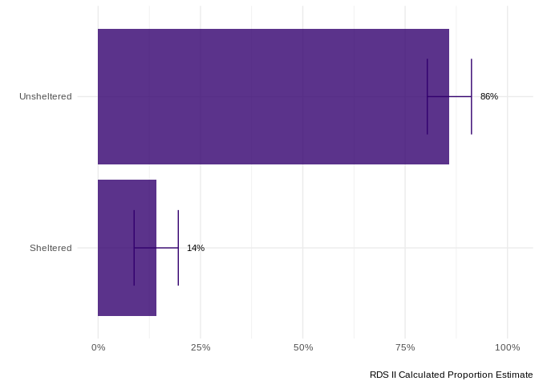

The proportion of the population experiencing homeless who are Sheltered
is 14%. The proportion of the population experiencing homeless who are
Unsheltered is 86%.

# Demographics

## *Gender*

*Imputed based on ‘B4. How would you describe your gender?’
[UWRDS-PSD] and ‘25. Which of the following best describes your
gender?’ [UWRDS]*

<table class="table table-striped" style="margin-left: auto; margin-right: auto;">
<caption>
Sheltered
</caption>
<thead>
<tr>
<th style="text-align:left;">
Gender
</th>
<th style="text-align:right;">
Sample N
</th>
<th style="text-align:left;">
Sample Proportion
</th>
<th style="text-align:left;">
RDS II Estimate
</th>
<th style="text-align:left;">
RDS II 95% CI
</th>
</tr>
</thead>
<tbody>
<tr>
<td style="text-align:left;">
A gender other than singularly female or male (e.g., nonbinary,
genderfluid, agender, culturally specific gender)
</td>
<td style="text-align:right;">
0
</td>
<td style="text-align:left;">
NA
</td>
<td style="text-align:left;">
NA
</td>
<td style="text-align:left;">
NA
</td>
</tr>
<tr>
<td style="text-align:left;">
Do not know
</td>
<td style="text-align:right;">
0
</td>
<td style="text-align:left;">
NA
</td>
<td style="text-align:left;">
NA
</td>
<td style="text-align:left;">
NA
</td>
</tr>
<tr>
<td style="text-align:left;">
Female
</td>
<td style="text-align:right;">
22
</td>
<td style="text-align:left;">
20.75%
</td>
<td style="text-align:left;">
20.01%
</td>
<td style="text-align:left;">
[3.29%, 36.73%]
</td>
</tr>
<tr>
<td style="text-align:left;">
Male
</td>
<td style="text-align:right;">
84
</td>
<td style="text-align:left;">
79.25%
</td>
<td style="text-align:left;">
79.99%
</td>
<td style="text-align:left;">
[63.27%, 96.71%]
</td>
</tr>
<tr>
<td style="text-align:left;">
Questioning
</td>
<td style="text-align:right;">
0
</td>
<td style="text-align:left;">
NA
</td>
<td style="text-align:left;">
NA
</td>
<td style="text-align:left;">
NA
</td>
</tr>
<tr>
<td style="text-align:left;">
Transgender
</td>
<td style="text-align:right;">
0
</td>
<td style="text-align:left;">
NA
</td>
<td style="text-align:left;">
NA
</td>
<td style="text-align:left;">
NA
</td>
</tr>
<tr>
<td style="text-align:left;">
Total
</td>
<td style="text-align:right;">
106
</td>
<td style="text-align:left;">

-   </td>
    <td style="text-align:left;">

    -   </td>
        <td style="text-align:left;">

        -   </td>
            </tr>
            </tbody>
            </table>
            <table class="table table-striped" style="margin-left: auto; margin-right: auto;">
            <caption>
            Unsheltered
            </caption>
            <thead>
            <tr>
            <th style="text-align:left;">
            Gender
            </th>
            <th style="text-align:right;">
            Sample N
            </th>
            <th style="text-align:left;">
            Sample Proportion
            </th>
            <th style="text-align:left;">
            RDS II Estimate
            </th>
            <th style="text-align:left;">
            RDS II 95% CI
            </th>
            </tr>
            </thead>
            <tbody>
            <tr>
            <td style="text-align:left;">
            A gender other than singularly female or male (e.g.,
            nonbinary, genderfluid, agender, culturally specific gender)
            </td>
            <td style="text-align:right;">
            7
            </td>
            <td style="text-align:left;">
            1.00%
            </td>
            <td style="text-align:left;">
            1.15%
            </td>
            <td style="text-align:left;">
            [0.32%, 1.99%]
            </td>
            </tr>
            <tr>
            <td style="text-align:left;">
            Do not know
            </td>
            <td style="text-align:right;">
            1
            </td>
            <td style="text-align:left;">
            0.14%
            </td>
            <td style="text-align:left;">
            0.19%
            </td>
            <td style="text-align:left;">
            [-0.11%, 0.49%]
            </td>
            </tr>
            <tr>
            <td style="text-align:left;">
            Female
            </td>
            <td style="text-align:right;">
            185
            </td>
            <td style="text-align:left;">
            26.32%
            </td>
            <td style="text-align:left;">
            25.33%
            </td>
            <td style="text-align:left;">
            [18.43%, 32.24%]
            </td>
            </tr>
            <tr>
            <td style="text-align:left;">
            Male
            </td>
            <td style="text-align:right;">
            504
            </td>
            <td style="text-align:left;">
            71.69%
            </td>
            <td style="text-align:left;">
            72.29%
            </td>
            <td style="text-align:left;">
            [65.39%, 79.19%]
            </td>
            </tr>
            <tr>
            <td style="text-align:left;">
            Questioning
            </td>
            <td style="text-align:right;">
            3
            </td>
            <td style="text-align:left;">
            0.43%
            </td>
            <td style="text-align:left;">
            0.52%
            </td>
            <td style="text-align:left;">
            [0.35%, 0.70%]
            </td>
            </tr>
            <tr>
            <td style="text-align:left;">
            Transgender
            </td>
            <td style="text-align:right;">
            3
            </td>
            <td style="text-align:left;">
            0.43%
            </td>
            <td style="text-align:left;">
            0.51%
            </td>
            <td style="text-align:left;">
            [-0.15%, 1.17%]
            </td>
            </tr>
            <tr>
            <td style="text-align:left;">
            Total
            </td>
            <td style="text-align:right;">
            703
            </td>
            <td style="text-align:left;">

            -   </td>
                <td style="text-align:left;">

                -   </td>
                    <td style="text-align:left;">

                    -   </td>
                        </tr>
                        </tbody>
                        </table>
                        

*The difference between individual sheltered and unsheltered is not
significant, *χ*2 = 4.75, (p = 0.835). These results were
calculated based on the mean of 1000 bootstrapped tests. This value was
calculated with replacement.*

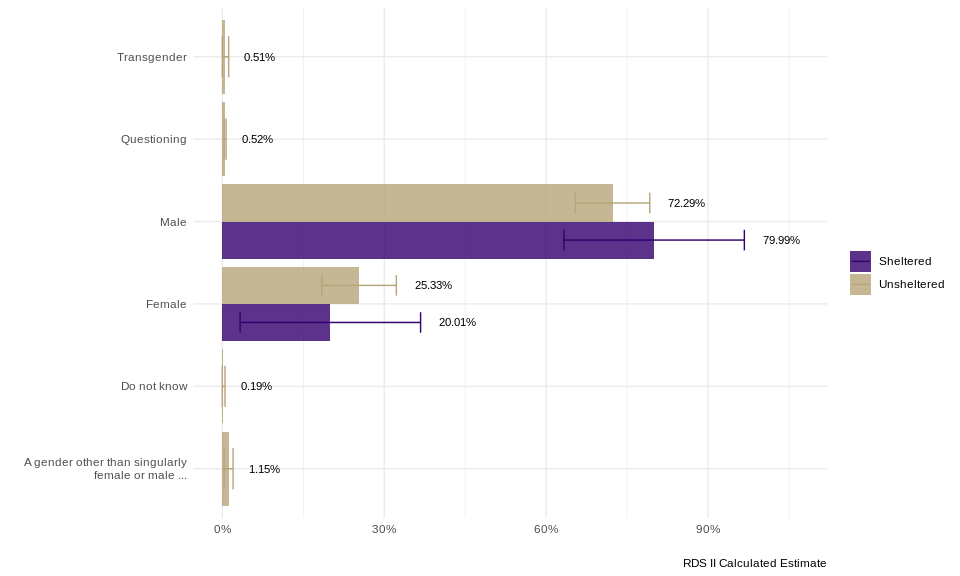

## *Race*

*Imputed based on ‘B18. Which one or more of the following would you say
best describes your race, heritage, or ancestry?’ [UWRDS-PSD] and ‘23.
Which racial groups do you identify with?’ [UWRDS]*

### *Race (Overall)*

<table class="table table-striped" style="margin-left: auto; margin-right: auto;">
<caption>
Sheltered
</caption>
<thead>
<tr>
<th style="text-align:left;">
Race
</th>
<th style="text-align:right;">
Sample N
</th>
<th style="text-align:left;">
Sample Proportion
</th>
<th style="text-align:left;">
RDS II Estimate
</th>
<th style="text-align:left;">
RDS II 95% CI
</th>
</tr>
</thead>
<tbody>
<tr>
<td style="text-align:left;">
American Indian, Alaskan Native or Indigenous
</td>
<td style="text-align:right;">
8
</td>
<td style="text-align:left;">
7.92%
</td>
<td style="text-align:left;">
14.22%
</td>
<td style="text-align:left;">
[0.00%, 28.44%]
</td>
</tr>
<tr>
<td style="text-align:left;">
Another race
</td>
<td style="text-align:right;">
1
</td>
<td style="text-align:left;">
0.99%
</td>
<td style="text-align:left;">
0.80%
</td>
<td style="text-align:left;">
[0.33%, 1.28%]
</td>
</tr>
<tr>
<td style="text-align:left;">
Asian or Asian American
</td>
<td style="text-align:right;">
9
</td>
<td style="text-align:left;">
8.91%
</td>
<td style="text-align:left;">
9.64%
</td>
<td style="text-align:left;">
[-1.41%, 20.69%]
</td>
</tr>
<tr>
<td style="text-align:left;">
Black, African American, or African
</td>
<td style="text-align:right;">
20
</td>
<td style="text-align:left;">
19.80%
</td>
<td style="text-align:left;">
22.71%
</td>
<td style="text-align:left;">
[6.29%, 39.13%]
</td>
</tr>
<tr>
<td style="text-align:left;">
Do not know
</td>
<td style="text-align:right;">
1
</td>
<td style="text-align:left;">
0.99%
</td>
<td style="text-align:left;">
2.41%
</td>
<td style="text-align:left;">
[-10.96%, 15.79%]
</td>
</tr>
<tr>
<td style="text-align:left;">
Multiracial
</td>
<td style="text-align:right;">
14
</td>
<td style="text-align:left;">
13.86%
</td>
<td style="text-align:left;">
13.28%
</td>
<td style="text-align:left;">
[2.68%, 23.88%]
</td>
</tr>
<tr>
<td style="text-align:left;">
Native Hawaiian or Pacific Islander
</td>
<td style="text-align:right;">
3
</td>
<td style="text-align:left;">
2.97%
</td>
<td style="text-align:left;">
2.87%
</td>
<td style="text-align:left;">
[-1.22%, 6.97%]
</td>
</tr>
<tr>
<td style="text-align:left;">
White
</td>
<td style="text-align:right;">
45
</td>
<td style="text-align:left;">
44.55%
</td>
<td style="text-align:left;">
34.06%
</td>
<td style="text-align:left;">
[14.40%, 53.72%]
</td>
</tr>
<tr>
<td style="text-align:left;">
Total
</td>
<td style="text-align:right;">
101
</td>
<td style="text-align:left;">

-   </td>
    <td style="text-align:left;">

    -   </td>
        <td style="text-align:left;">

        -   </td>
            </tr>
            </tbody>
            </table>
            <table class="table table-striped" style="margin-left: auto; margin-right: auto;">
            <caption>
            Unsheltered
            </caption>
            <thead>
            <tr>
            <th style="text-align:left;">
            Race
            </th>
            <th style="text-align:right;">
            Sample N
            </th>
            <th style="text-align:left;">
            Sample Proportion
            </th>
            <th style="text-align:left;">
            RDS II Estimate
            </th>
            <th style="text-align:left;">
            RDS II 95% CI
            </th>
            </tr>
            </thead>
            <tbody>
            <tr>
            <td style="text-align:left;">
            American Indian, Alaskan Native or Indigenous
            </td>
            <td style="text-align:right;">
            50
            </td>
            <td style="text-align:left;">
            7.45%
            </td>
            <td style="text-align:left;">
            7.21%
            </td>
            <td style="text-align:left;">
            [3.50%, 10.91%]
            </td>
            </tr>
            <tr>
            <td style="text-align:left;">
            Another race
            </td>
            <td style="text-align:right;">
            11
            </td>
            <td style="text-align:left;">
            1.64%
            </td>
            <td style="text-align:left;">
            2.62%
            </td>
            <td style="text-align:left;">
            [-0.24%, 5.48%]
            </td>
            </tr>
            <tr>
            <td style="text-align:left;">
            Asian or Asian American
            </td>
            <td style="text-align:right;">
            10
            </td>
            <td style="text-align:left;">
            1.49%
            </td>
            <td style="text-align:left;">
            2.32%
            </td>
            <td style="text-align:left;">
            [-1.12%, 5.76%]
            </td>
            </tr>
            <tr>
            <td style="text-align:left;">
            Black, African American, or African
            </td>
            <td style="text-align:right;">
            101
            </td>
            <td style="text-align:left;">
            15.05%
            </td>
            <td style="text-align:left;">
            16.60%
            </td>
            <td style="text-align:left;">
            [10.99%, 22.22%]
            </td>
            </tr>
            <tr>
            <td style="text-align:left;">
            Do not know
            </td>
            <td style="text-align:right;">
            12
            </td>
            <td style="text-align:left;">
            1.79%
            </td>
            <td style="text-align:left;">
            2.09%
            </td>
            <td style="text-align:left;">
            [-0.95%, 5.12%]
            </td>
            </tr>
            <tr>
            <td style="text-align:left;">
            Multiracial
            </td>
            <td style="text-align:right;">
            93
            </td>
            <td style="text-align:left;">
            13.86%
            </td>
            <td style="text-align:left;">
            14.99%
            </td>
            <td style="text-align:left;">
            [9.48%, 20.50%]
            </td>
            </tr>
            <tr>
            <td style="text-align:left;">
            Native Hawaiian or Pacific Islander
            </td>
            <td style="text-align:right;">
            14
            </td>
            <td style="text-align:left;">
            2.09%
            </td>
            <td style="text-align:left;">
            2.09%
            </td>
            <td style="text-align:left;">
            [0.16%, 4.03%]
            </td>
            </tr>
            <tr>
            <td style="text-align:left;">
            White
            </td>
            <td style="text-align:right;">
            380
            </td>
            <td style="text-align:left;">
            56.63%
            </td>
            <td style="text-align:left;">
            52.08%
            </td>
            <td style="text-align:left;">
            [44.58%, 59.57%]
            </td>
            </tr>
            <tr>
            <td style="text-align:left;">
            Total
            </td>
            <td style="text-align:right;">
            671
            </td>
            <td style="text-align:left;">

            -   </td>
                <td style="text-align:left;">

                -   </td>
                    <td style="text-align:left;">

                    -   </td>
                        </tr>
                        </tbody>
                        </table>
                        

*The difference between individual sheltered and unsheltered is not
significant, *χ*2 = 30.1, (p = 0.281). These results were
calculated based on the mean of 1000 bootstrapped tests. This value was
calculated with replacement.*

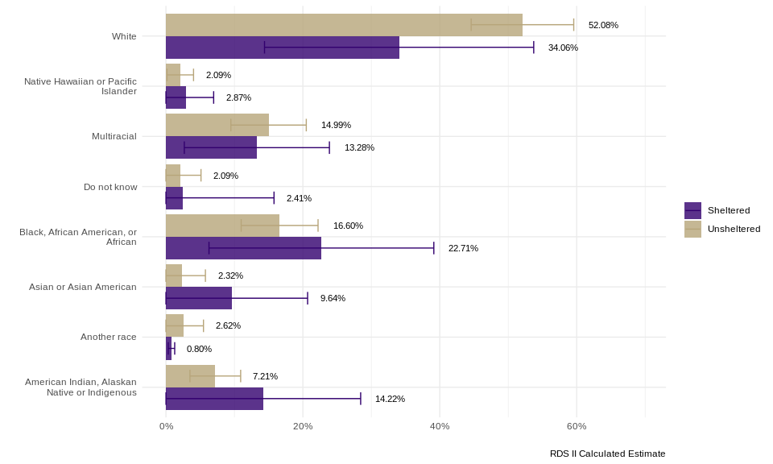

### *Race - Multiracial (Black)*

*Imputed racial category that classifies multiracial individuals as one
race with preference to Black based on ‘23. Which racial groups do you
identify with?’*

<table class="table table-striped" style="margin-left: auto; margin-right: auto;">
<caption>
Sheltered
</caption>
<thead>
<tr>
<th style="text-align:left;">
Race
</th>
<th style="text-align:right;">
Sample N
</th>
<th style="text-align:left;">
Sample Proportion
</th>
<th style="text-align:left;">
RDS II Estimate
</th>
<th style="text-align:left;">
RDS II 95% CI
</th>
</tr>
</thead>
<tbody>
<tr>
<td style="text-align:left;">
American Indian, Alaskan Native or Indigenous
</td>
<td style="text-align:right;">
14
</td>
<td style="text-align:left;">
13.86%
</td>
<td style="text-align:left;">
19.41%
</td>
<td style="text-align:left;">
[5.31%, 33.51%]
</td>
</tr>
<tr>
<td style="text-align:left;">
Another race
</td>
<td style="text-align:right;">
1
</td>
<td style="text-align:left;">
0.99%
</td>
<td style="text-align:left;">
0.80%
</td>
<td style="text-align:left;">
[0.33%, 1.28%]
</td>
</tr>
<tr>
<td style="text-align:left;">
Asian or Asian American
</td>
<td style="text-align:right;">
10
</td>
<td style="text-align:left;">
9.90%
</td>
<td style="text-align:left;">
10.85%
</td>
<td style="text-align:left;">
[-0.22%, 21.92%]
</td>
</tr>
<tr>
<td style="text-align:left;">
Black, African American, or African
</td>
<td style="text-align:right;">
26
</td>
<td style="text-align:left;">
25.74%
</td>
<td style="text-align:left;">
29.44%
</td>
<td style="text-align:left;">
[11.50%, 47.38%]
</td>
</tr>
<tr>
<td style="text-align:left;">
Do not know
</td>
<td style="text-align:right;">
1
</td>
<td style="text-align:left;">
0.99%
</td>
<td style="text-align:left;">
2.41%
</td>
<td style="text-align:left;">
[-10.96%, 15.79%]
</td>
</tr>
<tr>
<td style="text-align:left;">
Native Hawaiian or Pacific Islander
</td>
<td style="text-align:right;">
4
</td>
<td style="text-align:left;">
3.96%
</td>
<td style="text-align:left;">
3.03%
</td>
<td style="text-align:left;">
[-1.05%, 7.12%]
</td>
</tr>
<tr>
<td style="text-align:left;">
White
</td>
<td style="text-align:right;">
45
</td>
<td style="text-align:left;">
44.55%
</td>
<td style="text-align:left;">
34.06%
</td>
<td style="text-align:left;">
[14.40%, 53.72%]
</td>
</tr>
<tr>
<td style="text-align:left;">
Total
</td>
<td style="text-align:right;">
101
</td>
<td style="text-align:left;">

-   </td>
    <td style="text-align:left;">

    -   </td>
        <td style="text-align:left;">

        -   </td>
            </tr>
            </tbody>
            </table>
            <table class="table table-striped" style="margin-left: auto; margin-right: auto;">
            <caption>
            Unsheltered
            </caption>
            <thead>
            <tr>
            <th style="text-align:left;">
            Race
            </th>
            <th style="text-align:right;">
            Sample N
            </th>
            <th style="text-align:left;">
            Sample Proportion
            </th>
            <th style="text-align:left;">
            RDS II Estimate
            </th>
            <th style="text-align:left;">
            RDS II 95% CI
            </th>
            </tr>
            </thead>
            <tbody>
            <tr>
            <td style="text-align:left;">
            American Indian, Alaskan Native or Indigenous
            </td>
            <td style="text-align:right;">
            94
            </td>
            <td style="text-align:left;">
            14.01%
            </td>
            <td style="text-align:left;">
            14.51%
            </td>
            <td style="text-align:left;">
            [9.05%, 19.97%]
            </td>
            </tr>
            <tr>
            <td style="text-align:left;">
            Another race
            </td>
            <td style="text-align:right;">
            11
            </td>
            <td style="text-align:left;">
            1.64%
            </td>
            <td style="text-align:left;">
            2.62%
            </td>
            <td style="text-align:left;">
            [-0.24%, 5.48%]
            </td>
            </tr>
            <tr>
            <td style="text-align:left;">
            Asian or Asian American
            </td>
            <td style="text-align:right;">
            13
            </td>
            <td style="text-align:left;">
            1.94%
            </td>
            <td style="text-align:left;">
            2.80%
            </td>
            <td style="text-align:left;">
            [-0.72%, 6.33%]
            </td>
            </tr>
            <tr>
            <td style="text-align:left;">
            Black, African American, or African
            </td>
            <td style="text-align:right;">
            137
            </td>
            <td style="text-align:left;">
            20.42%
            </td>
            <td style="text-align:left;">
            21.57%
            </td>
            <td style="text-align:left;">
            [15.76%, 27.39%]
            </td>
            </tr>
            <tr>
            <td style="text-align:left;">
            Do not know
            </td>
            <td style="text-align:right;">
            12
            </td>
            <td style="text-align:left;">
            1.79%
            </td>
            <td style="text-align:left;">
            2.09%
            </td>
            <td style="text-align:left;">
            [-0.95%, 5.12%]
            </td>
            </tr>
            <tr>
            <td style="text-align:left;">
            Native Hawaiian or Pacific Islander
            </td>
            <td style="text-align:right;">
            21
            </td>
            <td style="text-align:left;">
            3.13%
            </td>
            <td style="text-align:left;">
            3.91%
            </td>
            <td style="text-align:left;">
            [0.17%, 7.65%]
            </td>
            </tr>
            <tr>
            <td style="text-align:left;">
            White
            </td>
            <td style="text-align:right;">
            383
            </td>
            <td style="text-align:left;">
            57.08%
            </td>
            <td style="text-align:left;">
            52.49%
            </td>
            <td style="text-align:left;">
            [44.99%, 59.99%]
            </td>
            </tr>
            <tr>
            <td style="text-align:left;">
            Total
            </td>
            <td style="text-align:right;">
            671
            </td>
            <td style="text-align:left;">

            -   </td>
                <td style="text-align:left;">

                -   </td>
                    <td style="text-align:left;">

                    -   </td>
                        </tr>
                        </tbody>
                        </table>
                        

*The difference between individual sheltered and unsheltered is not
significant, *χ*2 = 26.97, (p = 0.202). These results were
calculated based on the mean of 1000 bootstrapped tests. This value was
calculated with replacement.*

### *Race - Multiracial (Indigenous)*

*Imputed racial category that classifies multiracial individuals as one
race with preference to Indigenous based on ‘23. Which racial groups do
you identify with?’*

<table class="table table-striped" style="margin-left: auto; margin-right: auto;">
<caption>
Sheltered
</caption>
<thead>
<tr>
<th style="text-align:left;">
Race (Indigeneous)
</th>
<th style="text-align:right;">
Sample N
</th>
<th style="text-align:left;">
Sample Proportion
</th>
<th style="text-align:left;">
RDS II Estimate
</th>
<th style="text-align:left;">
RDS II 95% CI
</th>
</tr>
</thead>
<tbody>
<tr>
<td style="text-align:left;">
American Indian, Alaskan Native or Indigenous
</td>
<td style="text-align:right;">
20
</td>
<td style="text-align:left;">
19.80%
</td>
<td style="text-align:left;">
26.14%
</td>
<td style="text-align:left;">
[9.53%, 42.74%]
</td>
</tr>
<tr>
<td style="text-align:left;">
Another race
</td>
<td style="text-align:right;">
1
</td>
<td style="text-align:left;">
0.99%
</td>
<td style="text-align:left;">
0.80%
</td>
<td style="text-align:left;">
[0.33%, 1.28%]
</td>
</tr>
<tr>
<td style="text-align:left;">
Asian or Asian American
</td>
<td style="text-align:right;">
10
</td>
<td style="text-align:left;">
9.90%
</td>
<td style="text-align:left;">
10.85%
</td>
<td style="text-align:left;">
[-0.22%, 21.92%]
</td>
</tr>
<tr>
<td style="text-align:left;">
Black, African American, or African
</td>
<td style="text-align:right;">
20
</td>
<td style="text-align:left;">
19.80%
</td>
<td style="text-align:left;">
22.71%
</td>
<td style="text-align:left;">
[6.29%, 39.13%]
</td>
</tr>
<tr>
<td style="text-align:left;">
Do not know
</td>
<td style="text-align:right;">
1
</td>
<td style="text-align:left;">
0.99%
</td>
<td style="text-align:left;">
2.41%
</td>
<td style="text-align:left;">
[-10.96%, 15.79%]
</td>
</tr>
<tr>
<td style="text-align:left;">
Native Hawaiian or Pacific Islander
</td>
<td style="text-align:right;">
4
</td>
<td style="text-align:left;">
3.96%
</td>
<td style="text-align:left;">
3.03%
</td>
<td style="text-align:left;">
[-1.05%, 7.12%]
</td>
</tr>
<tr>
<td style="text-align:left;">
White
</td>
<td style="text-align:right;">
45
</td>
<td style="text-align:left;">
44.55%
</td>
<td style="text-align:left;">
34.06%
</td>
<td style="text-align:left;">
[14.40%, 53.72%]
</td>
</tr>
<tr>
<td style="text-align:left;">
Total
</td>
<td style="text-align:right;">
101
</td>
<td style="text-align:left;">

-   </td>
    <td style="text-align:left;">

    -   </td>
        <td style="text-align:left;">

        -   </td>
            </tr>
            </tbody>
            </table>
            <table class="table table-striped" style="margin-left: auto; margin-right: auto;">
            <caption>
            Unsheltered
            </caption>
            <thead>
            <tr>
            <th style="text-align:left;">
            Race (Indigeneous)
            </th>
            <th style="text-align:right;">
            Sample N
            </th>
            <th style="text-align:left;">
            Sample Proportion
            </th>
            <th style="text-align:left;">
            RDS II Estimate
            </th>
            <th style="text-align:left;">
            RDS II 95% CI
            </th>
            </tr>
            </thead>
            <tbody>
            <tr>
            <td style="text-align:left;">
            American Indian, Alaskan Native or Indigenous
            </td>
            <td style="text-align:right;">
            122
            </td>
            <td style="text-align:left;">
            18.18%
            </td>
            <td style="text-align:left;">
            18.34%
            </td>
            <td style="text-align:left;">
            [12.73%, 23.94%]
            </td>
            </tr>
            <tr>
            <td style="text-align:left;">
            Another race
            </td>
            <td style="text-align:right;">
            11
            </td>
            <td style="text-align:left;">
            1.64%
            </td>
            <td style="text-align:left;">
            2.62%
            </td>
            <td style="text-align:left;">
            [-0.24%, 5.48%]
            </td>
            </tr>
            <tr>
            <td style="text-align:left;">
            Asian or Asian American
            </td>
            <td style="text-align:right;">
            13
            </td>
            <td style="text-align:left;">
            1.94%
            </td>
            <td style="text-align:left;">
            2.80%
            </td>
            <td style="text-align:left;">
            [-0.72%, 6.33%]
            </td>
            </tr>
            <tr>
            <td style="text-align:left;">
            Black, African American, or African
            </td>
            <td style="text-align:right;">
            109
            </td>
            <td style="text-align:left;">
            16.24%
            </td>
            <td style="text-align:left;">
            17.75%
            </td>
            <td style="text-align:left;">
            [12.08%, 23.42%]
            </td>
            </tr>
            <tr>
            <td style="text-align:left;">
            Do not know
            </td>
            <td style="text-align:right;">
            12
            </td>
            <td style="text-align:left;">
            1.79%
            </td>
            <td style="text-align:left;">
            2.09%
            </td>
            <td style="text-align:left;">
            [-0.95%, 5.12%]
            </td>
            </tr>
            <tr>
            <td style="text-align:left;">
            Native Hawaiian or Pacific Islander
            </td>
            <td style="text-align:right;">
            21
            </td>
            <td style="text-align:left;">
            3.13%
            </td>
            <td style="text-align:left;">
            3.91%
            </td>
            <td style="text-align:left;">
            [0.17%, 7.65%]
            </td>
            </tr>
            <tr>
            <td style="text-align:left;">
            White
            </td>
            <td style="text-align:right;">
            383
            </td>
            <td style="text-align:left;">
            57.08%
            </td>
            <td style="text-align:left;">
            52.49%
            </td>
            <td style="text-align:left;">
            [44.99%, 59.99%]
            </td>
            </tr>
            <tr>
            <td style="text-align:left;">
            Total
            </td>
            <td style="text-align:right;">
            671
            </td>
            <td style="text-align:left;">

            -   </td>
                <td style="text-align:left;">

                -   </td>
                    <td style="text-align:left;">

                    -   </td>
                        </tr>
                        </tbody>
                        </table>
                        

*The difference between individual sheltered and unsheltered is not
significant, *χ*2 = 27.12, (p = 0.175). These results were
calculated based on the mean of 1000 bootstrapped tests. This value was
calculated with replacement.*

### *Race - Multiracial (Native Hawaiian or Pacific Islander)*

*Imputed racial category that classifies multiracial individuals as one
race with preference to Native Hawaiian or Pacific Islander based on
‘23. Which racial groups do you identify with?’*

<table class="table table-striped" style="margin-left: auto; margin-right: auto;">
<caption>
Sheltered
</caption>
<thead>
<tr>
<th style="text-align:left;">
Race (PI)
</th>
<th style="text-align:right;">
Sample N
</th>
<th style="text-align:left;">
Sample Proportion
</th>
<th style="text-align:left;">
RDS II Estimate
</th>
<th style="text-align:left;">
RDS II 95% CI
</th>
</tr>
</thead>
<tbody>
<tr>
<td style="text-align:left;">
American Indian, Alaskan Native or Indigenous
</td>
<td style="text-align:right;">
14
</td>
<td style="text-align:left;">
13.86%
</td>
<td style="text-align:left;">
19.41%
</td>
<td style="text-align:left;">
[5.310%, 33.51%]
</td>
</tr>
<tr>
<td style="text-align:left;">
Another race
</td>
<td style="text-align:right;">
1
</td>
<td style="text-align:left;">
0.99%
</td>
<td style="text-align:left;">
0.80%
</td>
<td style="text-align:left;">
[0.330%, 1.28%]
</td>
</tr>
<tr>
<td style="text-align:left;">
Asian or Asian American
</td>
<td style="text-align:right;">
10
</td>
<td style="text-align:left;">
9.90%
</td>
<td style="text-align:left;">
10.85%
</td>
<td style="text-align:left;">
[-0.220%, 21.92%]
</td>
</tr>
<tr>
<td style="text-align:left;">
Black, African American, or African
</td>
<td style="text-align:right;">
23
</td>
<td style="text-align:left;">
22.77%
</td>
<td style="text-align:left;">
25.82%
</td>
<td style="text-align:left;">
[7.730%, 43.91%]
</td>
</tr>
<tr>
<td style="text-align:left;">
Do not know
</td>
<td style="text-align:right;">
1
</td>
<td style="text-align:left;">
0.99%
</td>
<td style="text-align:left;">
2.41%
</td>
<td style="text-align:left;">
[-10.960%, 15.79%]
</td>
</tr>
<tr>
<td style="text-align:left;">
Native Hawaiian or Pacific Islander
</td>
<td style="text-align:right;">
7
</td>
<td style="text-align:left;">
6.93%
</td>
<td style="text-align:left;">
6.65%
</td>
<td style="text-align:left;">
[1.970%, 11.32%]
</td>
</tr>
<tr>
<td style="text-align:left;">
White
</td>
<td style="text-align:right;">
45
</td>
<td style="text-align:left;">
44.55%
</td>
<td style="text-align:left;">
34.06%
</td>
<td style="text-align:left;">
[14.400%, 53.72%]
</td>
</tr>
<tr>
<td style="text-align:left;">
Total
</td>
<td style="text-align:right;">
101
</td>
<td style="text-align:left;">

-   </td>
    <td style="text-align:left;">

    -   </td>
        <td style="text-align:left;">

        -   </td>
            </tr>
            </tbody>
            </table>
            <table class="table table-striped" style="margin-left: auto; margin-right: auto;">
            <caption>
            Unsheltered
            </caption>
            <thead>
            <tr>
            <th style="text-align:left;">
            Race (PI)
            </th>
            <th style="text-align:right;">
            Sample N
            </th>
            <th style="text-align:left;">
            Sample Proportion
            </th>
            <th style="text-align:left;">
            RDS II Estimate
            </th>
            <th style="text-align:left;">
            RDS II 95% CI
            </th>
            </tr>
            </thead>
            <tbody>
            <tr>
            <td style="text-align:left;">
            American Indian, Alaskan Native or Indigenous
            </td>
            <td style="text-align:right;">
            87
            </td>
            <td style="text-align:left;">
            12.97%
            </td>
            <td style="text-align:left;">
            13.01%
            </td>
            <td style="text-align:left;">
            [7.740%, 18.29%]
            </td>
            </tr>
            <tr>
            <td style="text-align:left;">
            Another race
            </td>
            <td style="text-align:right;">
            11
            </td>
            <td style="text-align:left;">
            1.64%
            </td>
            <td style="text-align:left;">
            2.62%
            </td>
            <td style="text-align:left;">
            [-0.240%, 5.48%]
            </td>
            </tr>
            <tr>
            <td style="text-align:left;">
            Asian or Asian American
            </td>
            <td style="text-align:right;">
            13
            </td>
            <td style="text-align:left;">
            1.94%
            </td>
            <td style="text-align:left;">
            2.80%
            </td>
            <td style="text-align:left;">
            [-0.720%, 6.33%]
            </td>
            </tr>
            <tr>
            <td style="text-align:left;">
            Black, African American, or African
            </td>
            <td style="text-align:right;">
            123
            </td>
            <td style="text-align:left;">
            18.33%
            </td>
            <td style="text-align:left;">
            19.29%
            </td>
            <td style="text-align:left;">
            [13.570%, 25.01%]
            </td>
            </tr>
            <tr>
            <td style="text-align:left;">
            Do not know
            </td>
            <td style="text-align:right;">
            12
            </td>
            <td style="text-align:left;">
            1.79%
            </td>
            <td style="text-align:left;">
            2.09%
            </td>
            <td style="text-align:left;">
            [-0.950%, 5.12%]
            </td>
            </tr>
            <tr>
            <td style="text-align:left;">
            Native Hawaiian or Pacific Islander
            </td>
            <td style="text-align:right;">
            42
            </td>
            <td style="text-align:left;">
            6.26%
            </td>
            <td style="text-align:left;">
            7.69%
            </td>
            <td style="text-align:left;">
            [3.500%, 11.89%]
            </td>
            </tr>
            <tr>
            <td style="text-align:left;">
            White
            </td>
            <td style="text-align:right;">
            383
            </td>
            <td style="text-align:left;">
            57.08%
            </td>
            <td style="text-align:left;">
            52.49%
            </td>
            <td style="text-align:left;">
            [44.990%, 59.99%]
            </td>
            </tr>
            <tr>
            <td style="text-align:left;">
            Total
            </td>
            <td style="text-align:right;">
            671
            </td>
            <td style="text-align:left;">

            -   </td>
                <td style="text-align:left;">

                -   </td>
                    <td style="text-align:left;">

                    -   </td>
                        </tr>
                        </tbody>
                        </table>
                        

*The difference between individual sheltered and unsheltered is not
significant, *χ*2 = 27.6, (p = 0.206). These results were
calculated based on the mean of 1000 bootstrapped tests. This value was
calculated with replacement.*

## *Ethnicity*

*Imputed based on ‘B16. Do you consider yourself Hispanic or Latinx’
[UWRDS-PSD] and ‘24. What is your ethnicity?’ [UWRDS]*

<table class="table table-striped" style="margin-left: auto; margin-right: auto;">
<caption>
Sheltered
</caption>
<thead>
<tr>
<th style="text-align:left;">
Ethnicity
</th>
<th style="text-align:right;">
Sample N
</th>
<th style="text-align:left;">
Sample Proportion
</th>
<th style="text-align:left;">
RDS II Estimate
</th>
<th style="text-align:left;">
RDS II 95% CI
</th>
</tr>
</thead>
<tbody>
<tr>
<td style="text-align:left;">
Do not know
</td>
<td style="text-align:right;">
4
</td>
<td style="text-align:left;">
3.96%
</td>
<td style="text-align:left;">
5.10%
</td>
<td style="text-align:left;">
[-6.5%, 16.7%]
</td>
</tr>
<tr>
<td style="text-align:left;">
Hispanic/Latin(a)(o)(x)
</td>
<td style="text-align:right;">
15
</td>
<td style="text-align:left;">
14.85%
</td>
<td style="text-align:left;">
15.77%
</td>
<td style="text-align:left;">
[-1.1%, 32.6%]
</td>
</tr>
<tr>
<td style="text-align:left;">
Non-Hispanic/Non-Latin(a)(o)(x)
</td>
<td style="text-align:right;">
82
</td>
<td style="text-align:left;">
81.19%
</td>
<td style="text-align:left;">
79.13%
</td>
<td style="text-align:left;">
[60.2%, 98.0%]
</td>
</tr>
<tr>
<td style="text-align:left;">
Total
</td>
<td style="text-align:right;">
101
</td>
<td style="text-align:left;">

-   </td>
    <td style="text-align:left;">

    -   </td>
        <td style="text-align:left;">

        -   </td>
            </tr>
            </tbody>
            </table>
            <table class="table table-striped" style="margin-left: auto; margin-right: auto;">
            <caption>
            Unsheltered
            </caption>
            <thead>
            <tr>
            <th style="text-align:left;">
            Ethnicity
            </th>
            <th style="text-align:right;">
            Sample N
            </th>
            <th style="text-align:left;">
            Sample Proportion
            </th>
            <th style="text-align:left;">
            RDS II Estimate
            </th>
            <th style="text-align:left;">
            RDS II 95% CI
            </th>
            </tr>
            </thead>
            <tbody>
            <tr>
            <td style="text-align:left;">
            Do not know
            </td>
            <td style="text-align:right;">
            15
            </td>
            <td style="text-align:left;">
            2.18%
            </td>
            <td style="text-align:left;">
            1.75%
            </td>
            <td style="text-align:left;">
            [1.1%, 2.4%]
            </td>
            </tr>
            <tr>
            <td style="text-align:left;">
            Hispanic/Latin(a)(o)(x)
            </td>
            <td style="text-align:right;">
            99
            </td>
            <td style="text-align:left;">
            14.41%
            </td>
            <td style="text-align:left;">
            15.64%
            </td>
            <td style="text-align:left;">
            [10.2%, 21.1%]
            </td>
            </tr>
            <tr>
            <td style="text-align:left;">
            Non-Hispanic/Non-Latin(a)(o)(x)
            </td>
            <td style="text-align:right;">
            573
            </td>
            <td style="text-align:left;">
            83.41%
            </td>
            <td style="text-align:left;">
            82.61%
            </td>
            <td style="text-align:left;">
            [77.1%, 88.1%]
            </td>
            </tr>
            <tr>
            <td style="text-align:left;">
            Total
            </td>
            <td style="text-align:right;">
            687
            </td>
            <td style="text-align:left;">

            -   </td>
                <td style="text-align:left;">

                -   </td>
                    <td style="text-align:left;">

                    -   </td>
                        </tr>
                        </tbody>
                        </table>
                        

*The difference between individual sheltered and unsheltered is not
significant, *χ*2 = 4.98, (p = 0.65). These results were
calculated based on the mean of 1000 bootstrapped tests. This value was
calculated with replacement.*

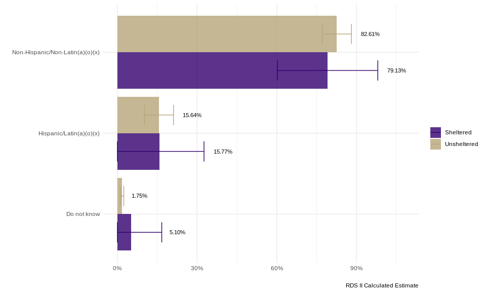

## *Age*

*Date of Birth*

### *Age (Categorical)*

*Imputed based on ‘A2. How old are you?’ [UWRDS-PSD] and ‘4. Date of
Birth’ [UWRDS]*

<table class="table table-striped" style="margin-left: auto; margin-right: auto;">
<caption>
Sheltered
</caption>
<thead>
<tr>
<th style="text-align:left;">
Age Category
</th>
<th style="text-align:right;">
Sample N
</th>
<th style="text-align:left;">
Sample Proportion
</th>
<th style="text-align:left;">
RDS II Estimate
</th>
<th style="text-align:left;">
RDS II 95% CI
</th>
</tr>
</thead>
<tbody>
<tr>
<td style="text-align:left;">
18-24
</td>
<td style="text-align:right;">
3
</td>
<td style="text-align:left;">
2.83%
</td>
<td style="text-align:left;">
4.44%
</td>
<td style="text-align:left;">
[-6.20%, 15.07%]
</td>
</tr>
<tr>
<td style="text-align:left;">
25-34
</td>
<td style="text-align:right;">
14
</td>
<td style="text-align:left;">
13.21%
</td>
<td style="text-align:left;">
15.37%
</td>
<td style="text-align:left;">
[2.46%, 28.28%]
</td>
</tr>
<tr>
<td style="text-align:left;">
35-44
</td>
<td style="text-align:right;">
34
</td>
<td style="text-align:left;">
32.08%
</td>
<td style="text-align:left;">
29.20%
</td>
<td style="text-align:left;">
[13.58%, 44.82%]
</td>
</tr>
<tr>
<td style="text-align:left;">
45-54
</td>
<td style="text-align:right;">
19
</td>
<td style="text-align:left;">
17.92%
</td>
<td style="text-align:left;">
20.63%
</td>
<td style="text-align:left;">
[3.58%, 37.68%]
</td>
</tr>
<tr>
<td style="text-align:left;">
55-64
</td>
<td style="text-align:right;">
26
</td>
<td style="text-align:left;">
24.53%
</td>
<td style="text-align:left;">
21.27%
</td>
<td style="text-align:left;">
[7.68%, 34.86%]
</td>
</tr>
<tr>
<td style="text-align:left;">
65+
</td>
<td style="text-align:right;">
10
</td>
<td style="text-align:left;">
9.43%
</td>
<td style="text-align:left;">
9.10%
</td>
<td style="text-align:left;">
[-2.15%, 20.35%]
</td>
</tr>
<tr>
<td style="text-align:left;">
Total
</td>
<td style="text-align:right;">
106
</td>
<td style="text-align:left;">

-   </td>
    <td style="text-align:left;">

    -   </td>
        <td style="text-align:left;">

        -   </td>
            </tr>
            </tbody>
            </table>
            <table class="table table-striped" style="margin-left: auto; margin-right: auto;">
            <caption>
            Unsheltered
            </caption>
            <thead>
            <tr>
            <th style="text-align:left;">
            Age Category
            </th>
            <th style="text-align:right;">
            Sample N
            </th>
            <th style="text-align:left;">
            Sample Proportion
            </th>
            <th style="text-align:left;">
            RDS II Estimate
            </th>
            <th style="text-align:left;">
            RDS II 95% CI
            </th>
            </tr>
            </thead>
            <tbody>
            <tr>
            <td style="text-align:left;">
            18-24
            </td>
            <td style="text-align:right;">
            18
            </td>
            <td style="text-align:left;">
            2.55%
            </td>
            <td style="text-align:left;">
            2.96%
            </td>
            <td style="text-align:left;">
            [0.13%, 5.79%]
            </td>
            </tr>
            <tr>
            <td style="text-align:left;">
            25-34
            </td>
            <td style="text-align:right;">
            153
            </td>
            <td style="text-align:left;">
            21.67%
            </td>
            <td style="text-align:left;">
            23.18%
            </td>
            <td style="text-align:left;">
            [16.79%, 29.58%]
            </td>
            </tr>
            <tr>
            <td style="text-align:left;">
            35-44
            </td>
            <td style="text-align:right;">
            215
            </td>
            <td style="text-align:left;">
            30.45%
            </td>
            <td style="text-align:left;">
            29.77%
            </td>
            <td style="text-align:left;">
            [23.23%, 36.30%]
            </td>
            </tr>
            <tr>
            <td style="text-align:left;">
            45-54
            </td>
            <td style="text-align:right;">
            176
            </td>
            <td style="text-align:left;">
            24.93%
            </td>
            <td style="text-align:left;">
            23.26%
            </td>
            <td style="text-align:left;">
            [17.26%, 29.26%]
            </td>
            </tr>
            <tr>
            <td style="text-align:left;">
            55-64
            </td>
            <td style="text-align:right;">
            113
            </td>
            <td style="text-align:left;">
            16.01%
            </td>
            <td style="text-align:left;">
            15.72%
            </td>
            <td style="text-align:left;">
            [11.50%, 19.93%]
            </td>
            </tr>
            <tr>
            <td style="text-align:left;">
            65+
            </td>
            <td style="text-align:right;">
            31
            </td>
            <td style="text-align:left;">
            4.39%
            </td>
            <td style="text-align:left;">
            5.12%
            </td>
            <td style="text-align:left;">
            [1.48%, 8.76%]
            </td>
            </tr>
            <tr>
            <td style="text-align:left;">
            Total
            </td>
            <td style="text-align:right;">
            706
            </td>
            <td style="text-align:left;">

            -   </td>
                <td style="text-align:left;">

                -   </td>
                    <td style="text-align:left;">

                    -   </td>
                        </tr>
                        </tbody>
                        </table>
                        

*The difference between individual sheltered and unsheltered is not
significant, *χ*2 = 8.43, (p = 0.356). These results were
calculated based on the mean of 1000 bootstrapped tests. This value was
calculated with replacement.*

### *Age (Continuous)*

*Age - Imputed from ‘4. Date of Birth’*

<table class="table table-striped" style="margin-left: auto; margin-right: auto;">
<thead>
<tr>
<th style="text-align:left;">
Sleep Status
</th>
<th style="text-align:right;">
Sample N
</th>
<th style="text-align:right;">
Sample Median
</th>
<th style="text-align:right;">
Sample Mean
</th>
<th style="text-align:right;">
Sample SE
</th>
<th style="text-align:right;">
RDS II Estimate
</th>
<th style="text-align:left;">
RDS II 95% CI
</th>
</tr>
</thead>
<tbody>
<tr>
<td style="text-align:left;">
Unsheltered
</td>
<td style="text-align:right;">
706
</td>
<td style="text-align:right;">
42
</td>
<td style="text-align:right;">
43.88
</td>
<td style="text-align:right;">
0.46
</td>
<td style="text-align:right;">
43.80
</td>
<td style="text-align:left;">
[41.83, 45.77]
</td>
</tr>
<tr>
<td style="text-align:left;">
Sheltered
</td>
<td style="text-align:right;">
106
</td>
<td style="text-align:right;">
46
</td>
<td style="text-align:right;">
46.96
</td>
<td style="text-align:right;">
1.28
</td>
<td style="text-align:right;">
45.97
</td>
<td style="text-align:left;">
[40.77, 51.18]
</td>
</tr>
</tbody>
</table>

*The difference between individual sheltered and unsheltered is not
significant, t(418.72) = 0.77, (p= 0.444).*

## *Birthplace*

### *Birth State*

*‘8. Birthplace: - State - In what city and state were you born? -
Imputed’ This variable is not included for UWRDS-PSD survey
observations.*

<table class="table table-striped" style="margin-left: auto; margin-right: auto;">
<caption>
Sheltered
</caption>
<thead>
<tr>
<th style="text-align:left;">
Birth State
</th>
<th style="text-align:right;">
Sample N
</th>
<th style="text-align:left;">
Sample Proportion
</th>
<th style="text-align:left;">
RDS II Estimate
</th>
<th style="text-align:left;">
RDS II 95% CI
</th>
</tr>
</thead>
<tbody>
<tr>
<td style="text-align:left;">
Alabama
</td>
<td style="text-align:right;">
1
</td>
<td style="text-align:left;">
1.32%
</td>
<td style="text-align:left;">
3.360%
</td>
<td style="text-align:left;">
[-4.74%, 11.47%]
</td>
</tr>
<tr>
<td style="text-align:left;">
Alaska
</td>
<td style="text-align:right;">
1
</td>
<td style="text-align:left;">
1.32%
</td>
<td style="text-align:left;">
0.220%
</td>
<td style="text-align:left;">
[0.04%, 0.41%]
</td>
</tr>
<tr>
<td style="text-align:left;">
Arizona
</td>
<td style="text-align:right;">
0
</td>
<td style="text-align:left;">
NA
</td>
<td style="text-align:left;">
NA
</td>
<td style="text-align:left;">
NA
</td>
</tr>
<tr>
<td style="text-align:left;">
Arkansas
</td>
<td style="text-align:right;">
0
</td>
<td style="text-align:left;">
NA
</td>
<td style="text-align:left;">
NA
</td>
<td style="text-align:left;">
NA
</td>
</tr>
<tr>
<td style="text-align:left;">
California
</td>
<td style="text-align:right;">
10
</td>
<td style="text-align:left;">
13.16%
</td>
<td style="text-align:left;">
12.260%
</td>
<td style="text-align:left;">
[-1.79%, 26.31%]
</td>
</tr>
<tr>
<td style="text-align:left;">
Colorado
</td>
<td style="text-align:right;">
1
</td>
<td style="text-align:left;">
1.32%
</td>
<td style="text-align:left;">
1.120%
</td>
<td style="text-align:left;">
[-0.04%, 2.28%]
</td>
</tr>
<tr>
<td style="text-align:left;">
Connecticut
</td>
<td style="text-align:right;">
0
</td>
<td style="text-align:left;">
NA
</td>
<td style="text-align:left;">
NA
</td>
<td style="text-align:left;">
NA
</td>
</tr>
<tr>
<td style="text-align:left;">
Florida
</td>
<td style="text-align:right;">
1
</td>
<td style="text-align:left;">
1.32%
</td>
<td style="text-align:left;">
3.360%
</td>
<td style="text-align:left;">
[-11.31%, 18.04%]
</td>
</tr>
<tr>
<td style="text-align:left;">
Georgia
</td>
<td style="text-align:right;">
1
</td>
<td style="text-align:left;">
1.32%
</td>
<td style="text-align:left;">
3.360%
</td>
<td style="text-align:left;">
[-3.72%, 10.45%]
</td>
</tr>
<tr>
<td style="text-align:left;">
Hawaii
</td>
<td style="text-align:right;">
0
</td>
<td style="text-align:left;">
NA
</td>
<td style="text-align:left;">
NA
</td>
<td style="text-align:left;">
NA
</td>
</tr>
<tr>
<td style="text-align:left;">
Idaho
</td>
<td style="text-align:right;">
1
</td>
<td style="text-align:left;">
1.32%
</td>
<td style="text-align:left;">
0.480%
</td>
<td style="text-align:left;">
[0.13%, 0.83%]
</td>
</tr>
<tr>
<td style="text-align:left;">
Illinois
</td>
<td style="text-align:right;">
1
</td>
<td style="text-align:left;">
1.32%
</td>
<td style="text-align:left;">
0.480%
</td>
<td style="text-align:left;">
[-0.06%, 1.02%]
</td>
</tr>
<tr>
<td style="text-align:left;">
Indiana
</td>
<td style="text-align:right;">
0
</td>
<td style="text-align:left;">
NA
</td>
<td style="text-align:left;">
NA
</td>
<td style="text-align:left;">
NA
</td>
</tr>
<tr>
<td style="text-align:left;">
Iowa
</td>
<td style="text-align:right;">
2
</td>
<td style="text-align:left;">
2.63%
</td>
<td style="text-align:left;">
5.050%
</td>
<td style="text-align:left;">
[-10.48%, 20.57%]
</td>
</tr>
<tr>
<td style="text-align:left;">
Kansas
</td>
<td style="text-align:right;">
1
</td>
<td style="text-align:left;">
1.32%
</td>
<td style="text-align:left;">
1.680%
</td>
<td style="text-align:left;">
[0.51%, 2.85%]
</td>
</tr>
<tr>
<td style="text-align:left;">
Kentucky
</td>
<td style="text-align:right;">
1
</td>
<td style="text-align:left;">
1.32%
</td>
<td style="text-align:left;">
1.120%
</td>
<td style="text-align:left;">
[-0.69%, 2.93%]
</td>
</tr>
<tr>
<td style="text-align:left;">
Louisiana
</td>
<td style="text-align:right;">
2
</td>
<td style="text-align:left;">
2.63%
</td>
<td style="text-align:left;">
5.050%
</td>
<td style="text-align:left;">
[-6.19%, 16.29%]
</td>
</tr>
<tr>
<td style="text-align:left;">
Maine
</td>
<td style="text-align:right;">
0
</td>
<td style="text-align:left;">
NA
</td>
<td style="text-align:left;">
NA
</td>
<td style="text-align:left;">
NA
</td>
</tr>
<tr>
<td style="text-align:left;">
Massachusetts
</td>
<td style="text-align:right;">
0
</td>
<td style="text-align:left;">
NA
</td>
<td style="text-align:left;">
NA
</td>
<td style="text-align:left;">
NA
</td>
</tr>
<tr>
<td style="text-align:left;">
Michigan
</td>
<td style="text-align:right;">
4
</td>
<td style="text-align:left;">
5.26%
</td>
<td style="text-align:left;">
3.030%
</td>
<td style="text-align:left;">
[1.41%, 4.65%]
</td>
</tr>
<tr>
<td style="text-align:left;">
Minnesota
</td>
<td style="text-align:right;">
1
</td>
<td style="text-align:left;">
1.32%
</td>
<td style="text-align:left;">
1.680%
</td>
<td style="text-align:left;">
[0.12%, 3.24%]
</td>
</tr>
<tr>
<td style="text-align:left;">
Missouri
</td>
<td style="text-align:right;">
2
</td>
<td style="text-align:left;">
2.63%
</td>
<td style="text-align:left;">
0.790%
</td>
<td style="text-align:left;">
[0.15%, 1.42%]
</td>
</tr>
<tr>
<td style="text-align:left;">
Montana
</td>
<td style="text-align:right;">
1
</td>
<td style="text-align:left;">
1.32%
</td>
<td style="text-align:left;">
1.120%
</td>
<td style="text-align:left;">
[-0.06%, 2.30%]
</td>
</tr>
<tr>
<td style="text-align:left;">
Nebraska
</td>
<td style="text-align:right;">
0
</td>
<td style="text-align:left;">
NA
</td>
<td style="text-align:left;">
NA
</td>
<td style="text-align:left;">
NA
</td>
</tr>
<tr>
<td style="text-align:left;">
Nevada
</td>
<td style="text-align:right;">
0
</td>
<td style="text-align:left;">
NA
</td>
<td style="text-align:left;">
NA
</td>
<td style="text-align:left;">
NA
</td>
</tr>
<tr>
<td style="text-align:left;">
New Jersey
</td>
<td style="text-align:right;">
1
</td>
<td style="text-align:left;">
1.32%
</td>
<td style="text-align:left;">
0.220%
</td>
<td style="text-align:left;">
[0.01%, 0.44%]
</td>
</tr>
<tr>
<td style="text-align:left;">
New Mexico
</td>
<td style="text-align:right;">
0
</td>
<td style="text-align:left;">
NA
</td>
<td style="text-align:left;">
NA
</td>
<td style="text-align:left;">
NA
</td>
</tr>
<tr>
<td style="text-align:left;">
New York
</td>
<td style="text-align:right;">
1
</td>
<td style="text-align:left;">
1.32%
</td>
<td style="text-align:left;">
0.840%
</td>
<td style="text-align:left;">
[0.20%, 1.48%]
</td>
</tr>
<tr>
<td style="text-align:left;">
North Carolina
</td>
<td style="text-align:right;">
1
</td>
<td style="text-align:left;">
1.32%
</td>
<td style="text-align:left;">
1.680%
</td>
<td style="text-align:left;">
[-1.05%, 4.42%]
</td>
</tr>
<tr>
<td style="text-align:left;">
North Dakota
</td>
<td style="text-align:right;">
1
</td>
<td style="text-align:left;">
1.32%
</td>
<td style="text-align:left;">
0.480%
</td>
<td style="text-align:left;">
[0.10%, 0.86%]
</td>
</tr>
<tr>
<td style="text-align:left;">
Ohio
</td>
<td style="text-align:right;">
2
</td>
<td style="text-align:left;">
2.63%
</td>
<td style="text-align:left;">
2.800%
</td>
<td style="text-align:left;">
[-2.53%, 8.13%]
</td>
</tr>
<tr>
<td style="text-align:left;">
Oklahoma
</td>
<td style="text-align:right;">
1
</td>
<td style="text-align:left;">
1.32%
</td>
<td style="text-align:left;">
0.840%
</td>
<td style="text-align:left;">
[0.34%, 1.35%]
</td>
</tr>
<tr>
<td style="text-align:left;">
Oregon
</td>
<td style="text-align:right;">
4
</td>
<td style="text-align:left;">
5.26%
</td>
<td style="text-align:left;">
4.320%
</td>
<td style="text-align:left;">
[2.26%, 6.37%]
</td>
</tr>
<tr>
<td style="text-align:left;">
Pennsylvania
</td>
<td style="text-align:right;">
3
</td>
<td style="text-align:left;">
3.95%
</td>
<td style="text-align:left;">
2.640%
</td>
<td style="text-align:left;">
[-3.18%, 8.45%]
</td>
</tr>
<tr>
<td style="text-align:left;">
South Carolina
</td>
<td style="text-align:right;">
0
</td>
<td style="text-align:left;">
NA
</td>
<td style="text-align:left;">
NA
</td>
<td style="text-align:left;">
NA
</td>
</tr>
<tr>
<td style="text-align:left;">
South Dakota
</td>
<td style="text-align:right;">
1
</td>
<td style="text-align:left;">
1.32%
</td>
<td style="text-align:left;">
0.220%
</td>
<td style="text-align:left;">
[0.04%, 0.41%]
</td>
</tr>
<tr>
<td style="text-align:left;">
Tennessee
</td>
<td style="text-align:right;">
1
</td>
<td style="text-align:left;">
1.32%
</td>
<td style="text-align:left;">
1.120%
</td>
<td style="text-align:left;">
[0.12%, 2.12%]
</td>
</tr>
<tr>
<td style="text-align:left;">
Texas
</td>
<td style="text-align:right;">
1
</td>
<td style="text-align:left;">
1.32%
</td>
<td style="text-align:left;">
0.480%
</td>
<td style="text-align:left;">
[0.11%, 0.86%]
</td>
</tr>
<tr>
<td style="text-align:left;">
Utah
</td>
<td style="text-align:right;">
0
</td>
<td style="text-align:left;">
NA
</td>
<td style="text-align:left;">
NA
</td>
<td style="text-align:left;">
NA
</td>
</tr>
<tr>
<td style="text-align:left;">
Vermont
</td>
<td style="text-align:right;">
0
</td>
<td style="text-align:left;">
NA
</td>
<td style="text-align:left;">
NA
</td>
<td style="text-align:left;">
NA
</td>
</tr>
<tr>
<td style="text-align:left;">
Virginia
</td>
<td style="text-align:right;">
0
</td>
<td style="text-align:left;">
NA
</td>
<td style="text-align:left;">
NA
</td>
<td style="text-align:left;">
NA
</td>
</tr>
<tr>
<td style="text-align:left;">
Washington
</td>
<td style="text-align:right;">
25
</td>
<td style="text-align:left;">
32.89%
</td>
<td style="text-align:left;">
34.710%
</td>
<td style="text-align:left;">
[14.24%, 55.18%]
</td>
</tr>
<tr>
<td style="text-align:left;">
West Virginia
</td>
<td style="text-align:right;">
1
</td>
<td style="text-align:left;">
1.32%
</td>
<td style="text-align:left;">
0.420%
</td>
<td style="text-align:left;">
[0.10%, 0.74%]
</td>
</tr>
<tr>
<td style="text-align:left;">
Wisconsin
</td>
<td style="text-align:right;">
1
</td>
<td style="text-align:left;">
1.32%
</td>
<td style="text-align:left;">
3.360%
</td>
<td style="text-align:left;">
[0.82%, 5.91%]
</td>
</tr>
<tr>
<td style="text-align:left;">
Wyoming
</td>
<td style="text-align:right;">
0
</td>
<td style="text-align:left;">
NA
</td>
<td style="text-align:left;">
NA
</td>
<td style="text-align:left;">
NA
</td>
</tr>
<tr>
<td style="text-align:left;">
New Hampshire
</td>
<td style="text-align:right;">
1
</td>
<td style="text-align:left;">
1.32%
</td>
<td style="text-align:left;">
1.680%
</td>
<td style="text-align:left;">
[-3.53%, 6.89%]
</td>
</tr>
<tr>
<td style="text-align:left;">
Total
</td>
<td style="text-align:right;">
76
</td>
<td style="text-align:left;">

-   </td>
    <td style="text-align:left;">

    -   </td>
        <td style="text-align:left;">

        -   </td>
            </tr>
            </tbody>
            </table>
            <table class="table table-striped" style="margin-left: auto; margin-right: auto;">
            <caption>
            Unsheltered
            </caption>
            <thead>
            <tr>
            <th style="text-align:left;">
            Birth State
            </th>
            <th style="text-align:right;">
            Sample N
            </th>
            <th style="text-align:left;">
            Sample Proportion
            </th>
            <th style="text-align:left;">
            RDS II Estimate
            </th>
            <th style="text-align:left;">
            RDS II 95% CI
            </th>
            </tr>
            </thead>
            <tbody>
            <tr>
            <td style="text-align:left;">
            Alabama
            </td>
            <td style="text-align:right;">
            5
            </td>
            <td style="text-align:left;">
            0.93%
            </td>
            <td style="text-align:left;">
            1.130%
            </td>
            <td style="text-align:left;">
            [-1.79%, 4.04%]
            </td>
            </tr>
            <tr>
            <td style="text-align:left;">
            Alaska
            </td>
            <td style="text-align:right;">
            13
            </td>
            <td style="text-align:left;">
            2.42%
            </td>
            <td style="text-align:left;">
            2.250%
            </td>
            <td style="text-align:left;">
            [1.01%, 3.50%]
            </td>
            </tr>
            <tr>
            <td style="text-align:left;">
            Arizona
            </td>
            <td style="text-align:right;">
            8
            </td>
            <td style="text-align:left;">
            1.49%
            </td>
            <td style="text-align:left;">
            2.270%
            </td>
            <td style="text-align:left;">
            [-1.41%, 5.94%]
            </td>
            </tr>
            <tr>
            <td style="text-align:left;">
            Arkansas
            </td>
            <td style="text-align:right;">
            5
            </td>
            <td style="text-align:left;">
            0.93%
            </td>
            <td style="text-align:left;">
            1.180%
            </td>
            <td style="text-align:left;">
            [0.04%, 2.33%]
            </td>
            </tr>
            <tr>
            <td style="text-align:left;">
            California
            </td>
            <td style="text-align:right;">
            50
            </td>
            <td style="text-align:left;">
            9.31%
            </td>
            <td style="text-align:left;">
            8.270%
            </td>
            <td style="text-align:left;">
            [4.65%, 11.88%]
            </td>
            </tr>
            <tr>
            <td style="text-align:left;">
            Colorado
            </td>
            <td style="text-align:right;">
            9
            </td>
            <td style="text-align:left;">
            1.68%
            </td>
            <td style="text-align:left;">
            1.130%
            </td>
            <td style="text-align:left;">
            [0.70%, 1.56%]
            </td>
            </tr>
            <tr>
            <td style="text-align:left;">
            Connecticut
            </td>
            <td style="text-align:right;">
            2
            </td>
            <td style="text-align:left;">
            0.37%
            </td>
            <td style="text-align:left;">
            0.130%
            </td>
            <td style="text-align:left;">
            [0.08%, 0.17%]
            </td>
            </tr>
            <tr>
            <td style="text-align:left;">
            Florida
            </td>
            <td style="text-align:right;">
            14
            </td>
            <td style="text-align:left;">
            2.61%
            </td>
            <td style="text-align:left;">
            2.980%
            </td>
            <td style="text-align:left;">
            [-0.11%, 6.06%]
            </td>
            </tr>
            <tr>
            <td style="text-align:left;">
            Georgia
            </td>
            <td style="text-align:right;">
            3
            </td>
            <td style="text-align:left;">
            0.56%
            </td>
            <td style="text-align:left;">
            0.720%
            </td>
            <td style="text-align:left;">
            [-0.06%, 1.50%]
            </td>
            </tr>
            <tr>
            <td style="text-align:left;">
            Hawaii
            </td>
            <td style="text-align:right;">
            2
            </td>
            <td style="text-align:left;">
            0.37%
            </td>
            <td style="text-align:left;">
            0.720%
            </td>
            <td style="text-align:left;">
            [-2.21%, 3.64%]
            </td>
            </tr>
            <tr>
            <td style="text-align:left;">
            Idaho
            </td>
            <td style="text-align:right;">
            4
            </td>
            <td style="text-align:left;">
            0.74%
            </td>
            <td style="text-align:left;">
            1.120%
            </td>
            <td style="text-align:left;">
            [-1.35%, 3.58%]
            </td>
            </tr>
            <tr>
            <td style="text-align:left;">
            Illinois
            </td>
            <td style="text-align:right;">
            15
            </td>
            <td style="text-align:left;">
            2.79%
            </td>
            <td style="text-align:left;">
            3.130%
            </td>
            <td style="text-align:left;">
            [1.23%, 5.03%]
            </td>
            </tr>
            <tr>
            <td style="text-align:left;">
            Indiana
            </td>
            <td style="text-align:right;">
            3
            </td>
            <td style="text-align:left;">
            0.56%
            </td>
            <td style="text-align:left;">
            0.630%
            </td>
            <td style="text-align:left;">
            [0.27%, 0.98%]
            </td>
            </tr>
            <tr>
            <td style="text-align:left;">
            Iowa
            </td>
            <td style="text-align:right;">
            2
            </td>
            <td style="text-align:left;">
            0.37%
            </td>
            <td style="text-align:left;">
            0.720%
            </td>
            <td style="text-align:left;">
            [-2.12%, 3.56%]
            </td>
            </tr>
            <tr>
            <td style="text-align:left;">
            Kansas
            </td>
            <td style="text-align:right;">
            8
            </td>
            <td style="text-align:left;">
            1.49%
            </td>
            <td style="text-align:left;">
            2.000%
            </td>
            <td style="text-align:left;">
            [-1.50%, 5.51%]
            </td>
            </tr>
            <tr>
            <td style="text-align:left;">
            Kentucky
            </td>
            <td style="text-align:right;">
            4
            </td>
            <td style="text-align:left;">
            0.74%
            </td>
            <td style="text-align:left;">
            0.340%
            </td>
            <td style="text-align:left;">
            [0.17%, 0.52%]
            </td>
            </tr>
            <tr>
            <td style="text-align:left;">
            Louisiana
            </td>
            <td style="text-align:right;">
            4
            </td>
            <td style="text-align:left;">
            0.74%
            </td>
            <td style="text-align:left;">
            0.340%
            </td>
            <td style="text-align:left;">
            [-0.07%, 0.75%]
            </td>
            </tr>
            <tr>
            <td style="text-align:left;">
            Maine
            </td>
            <td style="text-align:right;">
            1
            </td>
            <td style="text-align:left;">
            0.19%
            </td>
            <td style="text-align:left;">
            0.130%
            </td>
            <td style="text-align:left;">
            [0.10%, 0.17%]
            </td>
            </tr>
            <tr>
            <td style="text-align:left;">
            Massachusetts
            </td>
            <td style="text-align:right;">
            3
            </td>
            <td style="text-align:left;">
            0.56%
            </td>
            <td style="text-align:left;">
            0.780%
            </td>
            <td style="text-align:left;">
            [0.36%, 1.20%]
            </td>
            </tr>
            <tr>
            <td style="text-align:left;">
            Michigan
            </td>
            <td style="text-align:right;">
            5
            </td>
            <td style="text-align:left;">
            0.93%
            </td>
            <td style="text-align:left;">
            0.630%
            </td>
            <td style="text-align:left;">
            [-0.17%, 1.44%]
            </td>
            </tr>
            <tr>
            <td style="text-align:left;">
            Minnesota
            </td>
            <td style="text-align:right;">
            6
            </td>
            <td style="text-align:left;">
            1.12%
            </td>
            <td style="text-align:left;">
            1.980%
            </td>
            <td style="text-align:left;">
            [-0.61%, 4.57%]
            </td>
            </tr>
            <tr>
            <td style="text-align:left;">
            Missouri
            </td>
            <td style="text-align:right;">
            4
            </td>
            <td style="text-align:left;">
            0.74%
            </td>
            <td style="text-align:left;">
            0.530%
            </td>
            <td style="text-align:left;">
            [0.01%, 1.04%]
            </td>
            </tr>
            <tr>
            <td style="text-align:left;">
            Montana
            </td>
            <td style="text-align:right;">
            11
            </td>
            <td style="text-align:left;">
            2.05%
            </td>
            <td style="text-align:left;">
            1.930%
            </td>
            <td style="text-align:left;">
            [-1.23%, 5.10%]
            </td>
            </tr>
            <tr>
            <td style="text-align:left;">
            Nebraska
            </td>
            <td style="text-align:right;">
            3
            </td>
            <td style="text-align:left;">
            0.56%
            </td>
            <td style="text-align:left;">
            0.630%
            </td>
            <td style="text-align:left;">
            [-2.19%, 3.45%]
            </td>
            </tr>
            <tr>
            <td style="text-align:left;">
            Nevada
            </td>
            <td style="text-align:right;">
            1
            </td>
            <td style="text-align:left;">
            0.19%
            </td>
            <td style="text-align:left;">
            0.540%
            </td>
            <td style="text-align:left;">
            [0.24%, 0.83%]
            </td>
            </tr>
            <tr>
            <td style="text-align:left;">
            New Jersey
            </td>
            <td style="text-align:right;">
            7
            </td>
            <td style="text-align:left;">
            1.30%
            </td>
            <td style="text-align:left;">
            1.690%
            </td>
            <td style="text-align:left;">
            [-0.62%, 4.00%]
            </td>
            </tr>
            <tr>
            <td style="text-align:left;">
            New Mexico
            </td>
            <td style="text-align:right;">
            6
            </td>
            <td style="text-align:left;">
            1.12%
            </td>
            <td style="text-align:left;">
            1.480%
            </td>
            <td style="text-align:left;">
            [-1.84%, 4.79%]
            </td>
            </tr>
            <tr>
            <td style="text-align:left;">
            New York
            </td>
            <td style="text-align:right;">
            9
            </td>
            <td style="text-align:left;">
            1.68%
            </td>
            <td style="text-align:left;">
            1.760%
            </td>
            <td style="text-align:left;">
            [-0.88%, 4.40%]
            </td>
            </tr>
            <tr>
            <td style="text-align:left;">
            North Carolina
            </td>
            <td style="text-align:right;">
            1
            </td>
            <td style="text-align:left;">
            0.19%
            </td>
            <td style="text-align:left;">
            0.180%
            </td>
            <td style="text-align:left;">
            [-0.11%, 0.47%]
            </td>
            </tr>
            <tr>
            <td style="text-align:left;">
            North Dakota
            </td>
            <td style="text-align:right;">
            2
            </td>
            <td style="text-align:left;">
            0.37%
            </td>
            <td style="text-align:left;">
            0.330%
            </td>
            <td style="text-align:left;">
            [0.10%, 0.55%]
            </td>
            </tr>
            <tr>
            <td style="text-align:left;">
            Ohio
            </td>
            <td style="text-align:right;">
            6
            </td>
            <td style="text-align:left;">
            1.12%
            </td>
            <td style="text-align:left;">
            1.640%
            </td>
            <td style="text-align:left;">
            [-0.98%, 4.25%]
            </td>
            </tr>
            <tr>
            <td style="text-align:left;">
            Oklahoma
            </td>
            <td style="text-align:right;">
            4
            </td>
            <td style="text-align:left;">
            0.74%
            </td>
            <td style="text-align:left;">
            1.390%
            </td>
            <td style="text-align:left;">
            [-1.45%, 4.23%]
            </td>
            </tr>
            <tr>
            <td style="text-align:left;">
            Oregon
            </td>
            <td style="text-align:right;">
            12
            </td>
            <td style="text-align:left;">
            2.23%
            </td>
            <td style="text-align:left;">
            2.570%
            </td>
            <td style="text-align:left;">
            [0.61%, 4.54%]
            </td>
            </tr>
            <tr>
            <td style="text-align:left;">
            Pennsylvania
            </td>
            <td style="text-align:right;">
            4
            </td>
            <td style="text-align:left;">
            0.74%
            </td>
            <td style="text-align:left;">
            0.570%
            </td>
            <td style="text-align:left;">
            [0.27%, 0.86%]
            </td>
            </tr>
            <tr>
            <td style="text-align:left;">
            South Carolina
            </td>
            <td style="text-align:right;">
            1
            </td>
            <td style="text-align:left;">
            0.19%
            </td>
            <td style="text-align:left;">
            0.080%
            </td>
            <td style="text-align:left;">
            [0.05%, 0.11%]
            </td>
            </tr>
            <tr>
            <td style="text-align:left;">
            South Dakota
            </td>
            <td style="text-align:right;">
            1
            </td>
            <td style="text-align:left;">
            0.19%
            </td>
            <td style="text-align:left;">
            0.270%
            </td>
            <td style="text-align:left;">
            [-0.77%, 1.31%]
            </td>
            </tr>
            <tr>
            <td style="text-align:left;">
            Tennessee
            </td>
            <td style="text-align:right;">
            7
            </td>
            <td style="text-align:left;">
            1.30%
            </td>
            <td style="text-align:left;">
            0.660%
            </td>
            <td style="text-align:left;">
            [-0.31%, 1.64%]
            </td>
            </tr>
            <tr>
            <td style="text-align:left;">
            Texas
            </td>
            <td style="text-align:right;">
            19
            </td>
            <td style="text-align:left;">
            3.54%
            </td>
            <td style="text-align:left;">
            4.190%
            </td>
            <td style="text-align:left;">
            [1.91%, 6.46%]
            </td>
            </tr>
            <tr>
            <td style="text-align:left;">
            Utah
            </td>
            <td style="text-align:right;">
            4
            </td>
            <td style="text-align:left;">
            0.74%
            </td>
            <td style="text-align:left;">
            0.750%
            </td>
            <td style="text-align:left;">
            [-0.27%, 1.77%]
            </td>
            </tr>
            <tr>
            <td style="text-align:left;">
            Vermont
            </td>
            <td style="text-align:right;">
            1
            </td>
            <td style="text-align:left;">
            0.19%
            </td>
            <td style="text-align:left;">
            0.130%
            </td>
            <td style="text-align:left;">
            [0.00%, 0.27%]
            </td>
            </tr>
            <tr>
            <td style="text-align:left;">
            Virginia
            </td>
            <td style="text-align:right;">
            2
            </td>
            <td style="text-align:left;">
            0.37%
            </td>
            <td style="text-align:left;">
            0.640%
            </td>
            <td style="text-align:left;">
            [-2.14%, 3.43%]
            </td>
            </tr>
            <tr>
            <td style="text-align:left;">
            Washington
            </td>
            <td style="text-align:right;">
            261
            </td>
            <td style="text-align:left;">
            48.60%
            </td>
            <td style="text-align:left;">
            44.640%
            </td>
            <td style="text-align:left;">
            [36.54%, 52.74%]
            </td>
            </tr>
            <tr>
            <td style="text-align:left;">
            West Virginia
            </td>
            <td style="text-align:right;">
            1
            </td>
            <td style="text-align:left;">
            0.19%
            </td>
            <td style="text-align:left;">
            0.180%
            </td>
            <td style="text-align:left;">
            [-0.14%, 0.50%]
            </td>
            </tr>
            <tr>
            <td style="text-align:left;">
            Wisconsin
            </td>
            <td style="text-align:right;">
            3
            </td>
            <td style="text-align:left;">
            0.56%
            </td>
            <td style="text-align:left;">
            0.480%
            </td>
            <td style="text-align:left;">
            [0.29%, 0.68%]
            </td>
            </tr>
            <tr>
            <td style="text-align:left;">
            Wyoming
            </td>
            <td style="text-align:right;">
            1
            </td>
            <td style="text-align:left;">
            0.19%
            </td>
            <td style="text-align:left;">
            0.180%
            </td>
            <td style="text-align:left;">
            [0.13%, 0.23%]
            </td>
            </tr>
            <tr>
            <td style="text-align:left;">
            New Hampshire
            </td>
            <td style="text-align:right;">
            0
            </td>
            <td style="text-align:left;">
            NA
            </td>
            <td style="text-align:left;">
            NA
            </td>
            <td style="text-align:left;">
            NA
            </td>
            </tr>
            <tr>
            <td style="text-align:left;">
            Total
            </td>
            <td style="text-align:right;">
            537
            </td>
            <td style="text-align:left;">

            -   </td>
                <td style="text-align:left;">

                -   </td>
                    <td style="text-align:left;">

                    -   </td>
                        </tr>
                        </tbody>
                        </table>
                        

*The difference between individual sheltered and unsheltered is not
significant, *χ*2 = 77.79, (p = 0.976). These results were
calculated based on the mean of 1000 bootstrapped tests. *

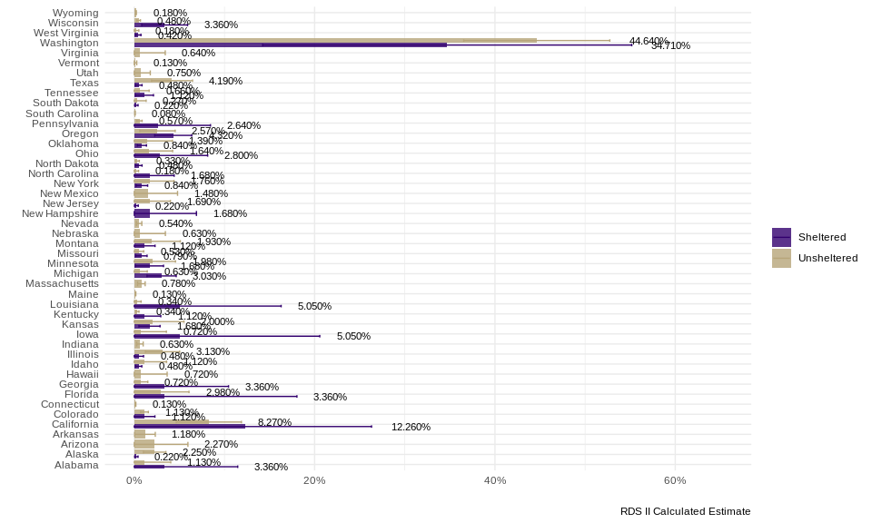

### *Birth Country*

*‘8. Birthplace: - Country - In what city and state were you born? -
Imputed’ This variable is not included for UWRDS-PSD survey
observations.*

<table class="table table-striped" style="margin-left: auto; margin-right: auto;">
<caption>
Sheltered
</caption>
<thead>
<tr>
<th style="text-align:left;">
Birth Country
</th>
<th style="text-align:right;">
Sample N
</th>
<th style="text-align:left;">
Sample Proportion
</th>
<th style="text-align:left;">
RDS II Estimate
</th>
<th style="text-align:left;">
RDS II 95% CI
</th>
</tr>
</thead>
<tbody>
<tr>
<td style="text-align:left;">
Burma
</td>
<td style="text-align:right;">
0
</td>
<td style="text-align:left;">
NA
</td>
<td style="text-align:left;">
NA
</td>
<td style="text-align:left;">
NA
</td>
</tr>
<tr>
<td style="text-align:left;">
Canada
</td>
<td style="text-align:right;">
2
</td>
<td style="text-align:left;">
2.25%
</td>
<td style="text-align:left;">
5.42%
</td>
<td style="text-align:left;">
[-6.93%, 17.78%]
</td>
</tr>
<tr>
<td style="text-align:left;">
Costa Rica
</td>
<td style="text-align:right;">
0
</td>
<td style="text-align:left;">
NA
</td>
<td style="text-align:left;">
NA
</td>
<td style="text-align:left;">
NA
</td>
</tr>
<tr>
<td style="text-align:left;">
Dominican Republic
</td>
<td style="text-align:right;">
0
</td>
<td style="text-align:left;">
NA
</td>
<td style="text-align:left;">
NA
</td>
<td style="text-align:left;">
NA
</td>
</tr>
<tr>
<td style="text-align:left;">
Ethiopia
</td>
<td style="text-align:right;">
1
</td>
<td style="text-align:left;">
1.12%
</td>
<td style="text-align:left;">
2.71%
</td>
<td style="text-align:left;">
[1.68%, 3.75%]
</td>
</tr>
<tr>
<td style="text-align:left;">
France
</td>
<td style="text-align:right;">
0
</td>
<td style="text-align:left;">
NA
</td>
<td style="text-align:left;">
NA
</td>
<td style="text-align:left;">
NA
</td>
</tr>
<tr>
<td style="text-align:left;">
Germany
</td>
<td style="text-align:right;">
0
</td>
<td style="text-align:left;">
NA
</td>
<td style="text-align:left;">
NA
</td>
<td style="text-align:left;">
NA
</td>
</tr>
<tr>
<td style="text-align:left;">
Grenada
</td>
<td style="text-align:right;">
0
</td>
<td style="text-align:left;">
NA
</td>
<td style="text-align:left;">
NA
</td>
<td style="text-align:left;">
NA
</td>
</tr>
<tr>
<td style="text-align:left;">
Guam
</td>
<td style="text-align:right;">
0
</td>
<td style="text-align:left;">
NA
</td>
<td style="text-align:left;">
NA
</td>
<td style="text-align:left;">
NA
</td>
</tr>
<tr>
<td style="text-align:left;">
Haiti
</td>
<td style="text-align:right;">
0
</td>
<td style="text-align:left;">
NA
</td>
<td style="text-align:left;">
NA
</td>
<td style="text-align:left;">
NA
</td>
</tr>
<tr>
<td style="text-align:left;">
Italy
</td>
<td style="text-align:right;">
0
</td>
<td style="text-align:left;">
NA
</td>
<td style="text-align:left;">
NA
</td>
<td style="text-align:left;">
NA
</td>
</tr>
<tr>
<td style="text-align:left;">
Jordan
</td>
<td style="text-align:right;">
0
</td>
<td style="text-align:left;">
NA
</td>
<td style="text-align:left;">
NA
</td>
<td style="text-align:left;">
NA
</td>
</tr>
<tr>
<td style="text-align:left;">
Kazakhstan
</td>
<td style="text-align:right;">
0
</td>
<td style="text-align:left;">
NA
</td>
<td style="text-align:left;">
NA
</td>
<td style="text-align:left;">
NA
</td>
</tr>
<tr>
<td style="text-align:left;">
Kenya
</td>
<td style="text-align:right;">
0
</td>
<td style="text-align:left;">
NA
</td>
<td style="text-align:left;">
NA
</td>
<td style="text-align:left;">
NA
</td>
</tr>
<tr>
<td style="text-align:left;">
Marianas islands
</td>
<td style="text-align:right;">
0
</td>
<td style="text-align:left;">
NA
</td>
<td style="text-align:left;">
NA
</td>
<td style="text-align:left;">
NA
</td>
</tr>
<tr>
<td style="text-align:left;">
Mexico
</td>
<td style="text-align:right;">
1
</td>
<td style="text-align:left;">
1.12%
</td>
<td style="text-align:left;">
1.36%
</td>
<td style="text-align:left;">
[0.30%, 2.41%]
</td>
</tr>
<tr>
<td style="text-align:left;">
Palau
</td>
<td style="text-align:right;">
0
</td>
<td style="text-align:left;">
NA
</td>
<td style="text-align:left;">
NA
</td>
<td style="text-align:left;">
NA
</td>
</tr>
<tr>
<td style="text-align:left;">
Philippines
</td>
<td style="text-align:right;">
0
</td>
<td style="text-align:left;">
NA
</td>
<td style="text-align:left;">
NA
</td>
<td style="text-align:left;">
NA
</td>
</tr>
<tr>
<td style="text-align:left;">
Romania
</td>
<td style="text-align:right;">
0
</td>
<td style="text-align:left;">
NA
</td>
<td style="text-align:left;">
NA
</td>
<td style="text-align:left;">
NA
</td>
</tr>
<tr>
<td style="text-align:left;">
Russia
</td>
<td style="text-align:right;">
0
</td>
<td style="text-align:left;">
NA
</td>
<td style="text-align:left;">
NA
</td>
<td style="text-align:left;">
NA
</td>
</tr>
<tr>
<td style="text-align:left;">
Scotland
</td>
<td style="text-align:right;">
0
</td>
<td style="text-align:left;">
NA
</td>
<td style="text-align:left;">
NA
</td>
<td style="text-align:left;">
NA
</td>
</tr>
<tr>
<td style="text-align:left;">
South korea
</td>
<td style="text-align:right;">
0
</td>
<td style="text-align:left;">
NA
</td>
<td style="text-align:left;">
NA
</td>
<td style="text-align:left;">
NA
</td>
</tr>
<tr>
<td style="text-align:left;">
UK
</td>
<td style="text-align:right;">
0
</td>
<td style="text-align:left;">
NA
</td>
<td style="text-align:left;">
NA
</td>
<td style="text-align:left;">
NA
</td>
</tr>
<tr>
<td style="text-align:left;">
Ukraine
</td>
<td style="text-align:right;">
0
</td>
<td style="text-align:left;">
NA
</td>
<td style="text-align:left;">
NA
</td>
<td style="text-align:left;">
NA
</td>
</tr>
<tr>
<td style="text-align:left;">
United States
</td>
<td style="text-align:right;">
77
</td>
<td style="text-align:left;">
86.52%
</td>
<td style="text-align:left;">
80.93%
</td>
<td style="text-align:left;">
[65.56%, 96.30%]
</td>
</tr>
<tr>
<td style="text-align:left;">
India
</td>
<td style="text-align:right;">
2
</td>
<td style="text-align:left;">
2.25%
</td>
<td style="text-align:left;">
1.36%
</td>
<td style="text-align:left;">
[0.56%, 2.15%]
</td>
</tr>
<tr>
<td style="text-align:left;">
Iran
</td>
<td style="text-align:right;">
1
</td>
<td style="text-align:left;">
1.12%
</td>
<td style="text-align:left;">
1.36%
</td>
<td style="text-align:left;">
[0.78%, 1.93%]
</td>
</tr>
<tr>
<td style="text-align:left;">
Laos
</td>
<td style="text-align:right;">
1
</td>
<td style="text-align:left;">
1.12%
</td>
<td style="text-align:left;">
1.36%
</td>
<td style="text-align:left;">
[0.68%, 2.04%]
</td>
</tr>
<tr>
<td style="text-align:left;">
Lunpranba
</td>
<td style="text-align:right;">
1
</td>
<td style="text-align:left;">
1.12%
</td>
<td style="text-align:left;">
1.36%
</td>
<td style="text-align:left;">
[0.58%, 2.13%]
</td>
</tr>
<tr>
<td style="text-align:left;">
Mumbai india
</td>
<td style="text-align:right;">
1
</td>
<td style="text-align:left;">
1.12%
</td>
<td style="text-align:left;">
2.71%
</td>
<td style="text-align:left;">
[-7.91%, 13.33%]
</td>
</tr>
<tr>
<td style="text-align:left;">
Puerto Rico
</td>
<td style="text-align:right;">
1
</td>
<td style="text-align:left;">
1.12%
</td>
<td style="text-align:left;">
0.90%
</td>
<td style="text-align:left;">
[-1.21%, 3.01%]
</td>
</tr>
<tr>
<td style="text-align:left;">
Somalia
</td>
<td style="text-align:right;">
1
</td>
<td style="text-align:left;">
1.12%
</td>
<td style="text-align:left;">
0.54%
</td>
<td style="text-align:left;">
[0.11%, 0.97%]
</td>
</tr>
<tr>
<td style="text-align:left;">
Total
</td>
<td style="text-align:right;">
89
</td>
<td style="text-align:left;">

-   </td>
    <td style="text-align:left;">

    -   </td>
        <td style="text-align:left;">

        -   </td>
            </tr>
            </tbody>
            </table>
            <table class="table table-striped" style="margin-left: auto; margin-right: auto;">
            <caption>
            Unsheltered
            </caption>
            <thead>
            <tr>
            <th style="text-align:left;">
            Birth Country
            </th>
            <th style="text-align:right;">
            Sample N
            </th>
            <th style="text-align:left;">
            Sample Proportion
            </th>
            <th style="text-align:left;">
            RDS II Estimate
            </th>
            <th style="text-align:left;">
            RDS II 95% CI
            </th>
            </tr>
            </thead>
            <tbody>
            <tr>
            <td style="text-align:left;">
            Burma
            </td>
            <td style="text-align:right;">
            1
            </td>
            <td style="text-align:left;">
            0.18%
            </td>
            <td style="text-align:left;">
            0.50%
            </td>
            <td style="text-align:left;">
            [-1.50%, 2.49%]
            </td>
            </tr>
            <tr>
            <td style="text-align:left;">
            Canada
            </td>
            <td style="text-align:right;">
            2
            </td>
            <td style="text-align:left;">
            0.35%
            </td>
            <td style="text-align:left;">
            0.20%
            </td>
            <td style="text-align:left;">
            [-0.05%, 0.46%]
            </td>
            </tr>
            <tr>
            <td style="text-align:left;">
            Costa Rica
            </td>
            <td style="text-align:right;">
            1
            </td>
            <td style="text-align:left;">
            0.18%
            </td>
            <td style="text-align:left;">
            0.50%
            </td>
            <td style="text-align:left;">
            [0.39%, 0.60%]
            </td>
            </tr>
            <tr>
            <td style="text-align:left;">
            Dominican Republic
            </td>
            <td style="text-align:right;">
            1
            </td>
            <td style="text-align:left;">
            0.18%
            </td>
            <td style="text-align:left;">
            0.05%
            </td>
            <td style="text-align:left;">
            [0.02%, 0.08%]
            </td>
            </tr>
            <tr>
            <td style="text-align:left;">
            Ethiopia
            </td>
            <td style="text-align:right;">
            2
            </td>
            <td style="text-align:left;">
            0.35%
            </td>
            <td style="text-align:left;">
            0.37%
            </td>
            <td style="text-align:left;">
            [0.02%, 0.72%]
            </td>
            </tr>
            <tr>
            <td style="text-align:left;">
            France
            </td>
            <td style="text-align:right;">
            1
            </td>
            <td style="text-align:left;">
            0.18%
            </td>
            <td style="text-align:left;">
            0.25%
            </td>
            <td style="text-align:left;">
            [-0.29%, 0.79%]
            </td>
            </tr>
            <tr>
            <td style="text-align:left;">
            Germany
            </td>
            <td style="text-align:right;">
            3
            </td>
            <td style="text-align:left;">
            0.53%
            </td>
            <td style="text-align:left;">
            0.61%
            </td>
            <td style="text-align:left;">
            [-1.64%, 2.86%]
            </td>
            </tr>
            <tr>
            <td style="text-align:left;">
            Grenada
            </td>
            <td style="text-align:right;">
            1
            </td>
            <td style="text-align:left;">
            0.18%
            </td>
            <td style="text-align:left;">
            0.25%
            </td>
            <td style="text-align:left;">
            [-0.47%, 0.97%]
            </td>
            </tr>
            <tr>
            <td style="text-align:left;">
            Guam
            </td>
            <td style="text-align:right;">
            2
            </td>
            <td style="text-align:left;">
            0.35%
            </td>
            <td style="text-align:left;">
            0.66%
            </td>
            <td style="text-align:left;">
            [-1.25%, 2.57%]
            </td>
            </tr>
            <tr>
            <td style="text-align:left;">
            Haiti
            </td>
            <td style="text-align:right;">
            1
            </td>
            <td style="text-align:left;">
            0.18%
            </td>
            <td style="text-align:left;">
            0.12%
            </td>
            <td style="text-align:left;">
            [0.08%, 0.17%]
            </td>
            </tr>
            <tr>
            <td style="text-align:left;">
            Italy
            </td>
            <td style="text-align:right;">
            1
            </td>
            <td style="text-align:left;">
            0.18%
            </td>
            <td style="text-align:left;">
            0.25%
            </td>
            <td style="text-align:left;">
            [-0.23%, 0.72%]
            </td>
            </tr>
            <tr>
            <td style="text-align:left;">
            Jordan
            </td>
            <td style="text-align:right;">
            1
            </td>
            <td style="text-align:left;">
            0.18%
            </td>
            <td style="text-align:left;">
            0.25%
            </td>
            <td style="text-align:left;">
            [-0.76%, 1.25%]
            </td>
            </tr>
            <tr>
            <td style="text-align:left;">
            Kazakhstan
            </td>
            <td style="text-align:right;">
            2
            </td>
            <td style="text-align:left;">
            0.35%
            </td>
            <td style="text-align:left;">
            0.28%
            </td>
            <td style="text-align:left;">
            [-0.11%, 0.67%]
            </td>
            </tr>
            <tr>
            <td style="text-align:left;">
            Kenya
            </td>
            <td style="text-align:right;">
            1
            </td>
            <td style="text-align:left;">
            0.18%
            </td>
            <td style="text-align:left;">
            0.03%
            </td>
            <td style="text-align:left;">
            [0.02%, 0.04%]
            </td>
            </tr>
            <tr>
            <td style="text-align:left;">
            Marianas islands
            </td>
            <td style="text-align:right;">
            1
            </td>
            <td style="text-align:left;">
            0.18%
            </td>
            <td style="text-align:left;">
            0.03%
            </td>
            <td style="text-align:left;">
            [0.02%, 0.05%]
            </td>
            </tr>
            <tr>
            <td style="text-align:left;">
            Mexico
            </td>
            <td style="text-align:right;">
            2
            </td>
            <td style="text-align:left;">
            0.35%
            </td>
            <td style="text-align:left;">
            0.74%
            </td>
            <td style="text-align:left;">
            [-0.30%, 1.79%]
            </td>
            </tr>
            <tr>
            <td style="text-align:left;">
            Palau
            </td>
            <td style="text-align:right;">
            1
            </td>
            <td style="text-align:left;">
            0.18%
            </td>
            <td style="text-align:left;">
            0.12%
            </td>
            <td style="text-align:left;">
            [-0.05%, 0.30%]
            </td>
            </tr>
            <tr>
            <td style="text-align:left;">
            Philippines
            </td>
            <td style="text-align:right;">
            3
            </td>
            <td style="text-align:left;">
            0.53%
            </td>
            <td style="text-align:left;">
            0.91%
            </td>
            <td style="text-align:left;">
            [-1.41%, 3.23%]
            </td>
            </tr>
            <tr>
            <td style="text-align:left;">
            Romania
            </td>
            <td style="text-align:right;">
            1
            </td>
            <td style="text-align:left;">
            0.18%
            </td>
            <td style="text-align:left;">
            0.17%
            </td>
            <td style="text-align:left;">
            [0.06%, 0.27%]
            </td>
            </tr>
            <tr>
            <td style="text-align:left;">
            Russia
            </td>
            <td style="text-align:right;">
            1
            </td>
            <td style="text-align:left;">
            0.18%
            </td>
            <td style="text-align:left;">
            0.25%
            </td>
            <td style="text-align:left;">
            [-0.69%, 1.18%]
            </td>
            </tr>
            <tr>
            <td style="text-align:left;">
            Scotland
            </td>
            <td style="text-align:right;">
            1
            </td>
            <td style="text-align:left;">
            0.18%
            </td>
            <td style="text-align:left;">
            0.25%
            </td>
            <td style="text-align:left;">
            [-0.55%, 1.05%]
            </td>
            </tr>
            <tr>
            <td style="text-align:left;">
            South korea
            </td>
            <td style="text-align:right;">
            1
            </td>
            <td style="text-align:left;">
            0.18%
            </td>
            <td style="text-align:left;">
            0.17%
            </td>
            <td style="text-align:left;">
            [0.11%, 0.22%]
            </td>
            </tr>
            <tr>
            <td style="text-align:left;">
            UK
            </td>
            <td style="text-align:right;">
            1
            </td>
            <td style="text-align:left;">
            0.18%
            </td>
            <td style="text-align:left;">
            0.17%
            </td>
            <td style="text-align:left;">
            [-0.21%, 0.55%]
            </td>
            </tr>
            <tr>
            <td style="text-align:left;">
            Ukraine
            </td>
            <td style="text-align:right;">
            1
            </td>
            <td style="text-align:left;">
            0.18%
            </td>
            <td style="text-align:left;">
            0.17%
            </td>
            <td style="text-align:left;">
            [-0.10%, 0.43%]
            </td>
            </tr>
            <tr>
            <td style="text-align:left;">
            United States
            </td>
            <td style="text-align:right;">
            538
            </td>
            <td style="text-align:left;">
            94.22%
            </td>
            <td style="text-align:left;">
            92.71%
            </td>
            <td style="text-align:left;">
            [88.08%, 97.34%]
            </td>
            </tr>
            <tr>
            <td style="text-align:left;">
            India
            </td>
            <td style="text-align:right;">
            0
            </td>
            <td style="text-align:left;">
            NA
            </td>
            <td style="text-align:left;">
            NA
            </td>
            <td style="text-align:left;">
            NA
            </td>
            </tr>
            <tr>
            <td style="text-align:left;">
            Iran
            </td>
            <td style="text-align:right;">
            0
            </td>
            <td style="text-align:left;">
            NA
            </td>
            <td style="text-align:left;">
            NA
            </td>
            <td style="text-align:left;">
            NA
            </td>
            </tr>
            <tr>
            <td style="text-align:left;">
            Laos
            </td>
            <td style="text-align:right;">
            0
            </td>
            <td style="text-align:left;">
            NA
            </td>
            <td style="text-align:left;">
            NA
            </td>
            <td style="text-align:left;">
            NA
            </td>
            </tr>
            <tr>
            <td style="text-align:left;">
            Lunpranba
            </td>
            <td style="text-align:right;">
            0
            </td>
            <td style="text-align:left;">
            NA
            </td>
            <td style="text-align:left;">
            NA
            </td>
            <td style="text-align:left;">
            NA
            </td>
            </tr>
            <tr>
            <td style="text-align:left;">
            Mumbai india
            </td>
            <td style="text-align:right;">
            0
            </td>
            <td style="text-align:left;">
            NA
            </td>
            <td style="text-align:left;">
            NA
            </td>
            <td style="text-align:left;">
            NA
            </td>
            </tr>
            <tr>
            <td style="text-align:left;">
            Puerto Rico
            </td>
            <td style="text-align:right;">
            0
            </td>
            <td style="text-align:left;">
            NA
            </td>
            <td style="text-align:left;">
            NA
            </td>
            <td style="text-align:left;">
            NA
            </td>
            </tr>
            <tr>
            <td style="text-align:left;">
            Somalia
            </td>
            <td style="text-align:right;">
            0
            </td>
            <td style="text-align:left;">
            NA
            </td>
            <td style="text-align:left;">
            NA
            </td>
            <td style="text-align:left;">
            NA
            </td>
            </tr>
            <tr>
            <td style="text-align:left;">
            Total
            </td>
            <td style="text-align:right;">
            571
            </td>
            <td style="text-align:left;">

            -   </td>
                <td style="text-align:left;">

                -   </td>
                    <td style="text-align:left;">

                    -   </td>
                        </tr>
                        </tbody>
                        </table>
                        

*The difference between individual sheltered and unsheltered is not
significant, *χ*2 = 85.51, (p = 0.934). These results were
calculated based on the mean of 1000 bootstrapped tests. *

## *Years Lived in King County*

*‘9. How long have you lived in King County? - Imputed’ This variable is
not included for UWRDS-PSD survey observations.*

<table class="table table-striped" style="margin-left: auto; margin-right: auto;">
<thead>
<tr>
<th style="text-align:left;">
Sleep Status
</th>
<th style="text-align:right;">
Sample N
</th>
<th style="text-align:right;">
Sample Median
</th>
<th style="text-align:right;">
Sample Mean
</th>
<th style="text-align:right;">
Sample SE
</th>
<th style="text-align:right;">
RDS II Estimate
</th>
<th style="text-align:left;">
RDS II 95% CI
</th>
</tr>
</thead>
<tbody>
<tr>
<td style="text-align:left;">
Unsheltered
</td>
<td style="text-align:right;">
585
</td>
<td style="text-align:right;">
19
</td>
<td style="text-align:right;">
21.87
</td>
<td style="text-align:right;">
0.71
</td>
<td style="text-align:right;">
20.69
</td>
<td style="text-align:left;">
[17.87, 23.5]
</td>
</tr>
<tr>
<td style="text-align:left;">
Sheltered
</td>
<td style="text-align:right;">
92
</td>
<td style="text-align:right;">
10
</td>
<td style="text-align:right;">
17.54
</td>
<td style="text-align:right;">
1.80
</td>
<td style="text-align:right;">
16.64
</td>
<td style="text-align:left;">
[10.53, 22.76]
</td>
</tr>
</tbody>
</table>

*The difference between individual sheltered and unsheltered is not
significant, t(361.47) = -1.18, (p= 0.24).*

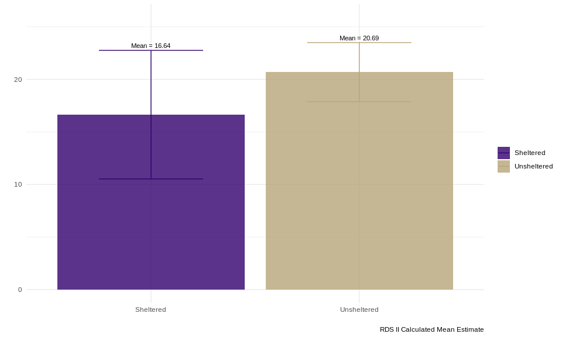

# Health

## *Health Status*

*Imputed based on ‘D1. In general, would you say your health is’
[UWRDS-PSD] and ‘16. How would you rate your health status?’
[UWRDS]*

<table class="table table-striped" style="margin-left: auto; margin-right: auto;">
<caption>
Sheltered
</caption>
<thead>
<tr>
<th style="text-align:left;">
Ego Health Status
</th>
<th style="text-align:right;">
Sample N
</th>
<th style="text-align:left;">
Sample Proportion
</th>
<th style="text-align:left;">
RDS II Estimate
</th>
<th style="text-align:left;">
RDS II 95% CI
</th>
</tr>
</thead>
<tbody>
<tr>
<td style="text-align:left;">
Excellent
</td>
<td style="text-align:right;">
12
</td>
<td style="text-align:left;">
11.43%
</td>
<td style="text-align:left;">
12.29%
</td>
<td style="text-align:left;">
[1.31%, 23.26%]
</td>
</tr>
<tr>
<td style="text-align:left;">
Fair
</td>
<td style="text-align:right;">
45
</td>
<td style="text-align:left;">
42.86%
</td>
<td style="text-align:left;">
47.11%
</td>
<td style="text-align:left;">
[28.21%, 66.00%]
</td>
</tr>
<tr>
<td style="text-align:left;">
Good
</td>
<td style="text-align:right;">
42
</td>
<td style="text-align:left;">
40.00%
</td>
<td style="text-align:left;">
34.77%
</td>
<td style="text-align:left;">
[17.85%, 51.68%]
</td>
</tr>
<tr>
<td style="text-align:left;">
Poor
</td>
<td style="text-align:right;">
6
</td>
<td style="text-align:left;">
5.71%
</td>
<td style="text-align:left;">
5.84%
</td>
<td style="text-align:left;">
[-3.64%, 15.32%]
</td>
</tr>
<tr>
<td style="text-align:left;">
Total
</td>
<td style="text-align:right;">
105
</td>
<td style="text-align:left;">

-   </td>
    <td style="text-align:left;">

    -   </td>
        <td style="text-align:left;">

        -   </td>
            </tr>
            </tbody>
            </table>
            <table class="table table-striped" style="margin-left: auto; margin-right: auto;">
            <caption>
            Unsheltered
            </caption>
            <thead>
            <tr>
            <th style="text-align:left;">
            Ego Health Status
            </th>
            <th style="text-align:right;">
            Sample N
            </th>
            <th style="text-align:left;">
            Sample Proportion
            </th>
            <th style="text-align:left;">
            RDS II Estimate
            </th>
            <th style="text-align:left;">
            RDS II 95% CI
            </th>
            </tr>
            </thead>
            <tbody>
            <tr>
            <td style="text-align:left;">
            Excellent
            </td>
            <td style="text-align:right;">
            68
            </td>
            <td style="text-align:left;">
            9.67%
            </td>
            <td style="text-align:left;">
            11.46%
            </td>
            <td style="text-align:left;">
            [7.45%, 15.47%]
            </td>
            </tr>
            <tr>
            <td style="text-align:left;">
            Fair
            </td>
            <td style="text-align:right;">
            270
            </td>
            <td style="text-align:left;">
            38.41%
            </td>
            <td style="text-align:left;">
            37.09%
            </td>
            <td style="text-align:left;">
            [30.08%, 44.10%]
            </td>
            </tr>
            <tr>
            <td style="text-align:left;">
            Good
            </td>
            <td style="text-align:right;">
            268
            </td>
            <td style="text-align:left;">
            38.12%
            </td>
            <td style="text-align:left;">
            36.30%
            </td>
            <td style="text-align:left;">
            [29.70%, 42.91%]
            </td>
            </tr>
            <tr>
            <td style="text-align:left;">
            Poor
            </td>
            <td style="text-align:right;">
            97
            </td>
            <td style="text-align:left;">
            13.80%
            </td>
            <td style="text-align:left;">
            15.15%
            </td>
            <td style="text-align:left;">
            [9.25%, 21.05%]
            </td>
            </tr>
            <tr>
            <td style="text-align:left;">
            Total
            </td>
            <td style="text-align:right;">
            703
            </td>
            <td style="text-align:left;">

            -   </td>
                <td style="text-align:left;">

                -   </td>
                    <td style="text-align:left;">

                    -   </td>
                        </tr>
                        </tbody>
                        </table>
                        

*The difference between individual sheltered and unsheltered is not
significant, *χ*2 = 8.85, (p = 0.146). These results were
calculated based on the mean of 1000 bootstrapped tests. This value was
calculated with replacement.*

## *Disability*

*‘21. Do you identify as having a disability?’ This variable is not
included for UWRDS-PSD survey observations.*

<table class="table table-striped" style="margin-left: auto; margin-right: auto;">
<caption>
Sheltered
</caption>
<thead>
<tr>
<th style="text-align:left;">
Have a Disability
</th>
<th style="text-align:right;">
Sample N
</th>
<th style="text-align:left;">
Sample Proportion
</th>
<th style="text-align:left;">
RDS II Estimate
</th>
<th style="text-align:left;">
RDS II 95% CI
</th>
</tr>
</thead>
<tbody>
<tr>
<td style="text-align:left;">
Choose not to answer
</td>
<td style="text-align:right;">
0
</td>
<td style="text-align:left;">
NA
</td>
<td style="text-align:left;">
NA
</td>
<td style="text-align:left;">
NA
</td>
</tr>
<tr>
<td style="text-align:left;">
Do not know
</td>
<td style="text-align:right;">
1
</td>
<td style="text-align:left;">
1.08%
</td>
<td style="text-align:left;">
2.55%
</td>
<td style="text-align:left;">
[-2.68%, 7.78%]
</td>
</tr>
<tr>
<td style="text-align:left;">
No
</td>
<td style="text-align:right;">
39
</td>
<td style="text-align:left;">
41.94%
</td>
<td style="text-align:left;">
45.39%
</td>
<td style="text-align:left;">
[25.78%, 64.99%]
</td>
</tr>
<tr>
<td style="text-align:left;">
Yes
</td>
<td style="text-align:right;">
53
</td>
<td style="text-align:left;">
56.99%
</td>
<td style="text-align:left;">
52.06%
</td>
<td style="text-align:left;">
[32.49%, 71.64%]
</td>
</tr>
<tr>
<td style="text-align:left;">
Total
</td>
<td style="text-align:right;">
93
</td>
<td style="text-align:left;">

-   </td>
    <td style="text-align:left;">

    -   </td>
        <td style="text-align:left;">

        -   </td>
            </tr>
            </tbody>
            </table>
            <table class="table table-striped" style="margin-left: auto; margin-right: auto;">
            <caption>
            Unsheltered
            </caption>
            <thead>
            <tr>
            <th style="text-align:left;">
            Have a Disability
            </th>
            <th style="text-align:right;">
            Sample N
            </th>
            <th style="text-align:left;">
            Sample Proportion
            </th>
            <th style="text-align:left;">
            RDS II Estimate
            </th>
            <th style="text-align:left;">
            RDS II 95% CI
            </th>
            </tr>
            </thead>
            <tbody>
            <tr>
            <td style="text-align:left;">
            Choose not to answer
            </td>
            <td style="text-align:right;">
            4
            </td>
            <td style="text-align:left;">
            0.69%
            </td>
            <td style="text-align:left;">
            1.28%
            </td>
            <td style="text-align:left;">
            [-1.28%, 3.83%]
            </td>
            </tr>
            <tr>
            <td style="text-align:left;">
            Do not know
            </td>
            <td style="text-align:right;">
            19
            </td>
            <td style="text-align:left;">
            3.26%
            </td>
            <td style="text-align:left;">
            3.94%
            </td>
            <td style="text-align:left;">
            [0.86%, 7.02%]
            </td>
            </tr>
            <tr>
            <td style="text-align:left;">
            No
            </td>
            <td style="text-align:right;">
            263
            </td>
            <td style="text-align:left;">
            45.11%
            </td>
            <td style="text-align:left;">
            47.78%
            </td>
            <td style="text-align:left;">
            [39.94%, 55.61%]
            </td>
            </tr>
            <tr>
            <td style="text-align:left;">
            Yes
            </td>
            <td style="text-align:right;">
            297
            </td>
            <td style="text-align:left;">
            50.94%
            </td>
            <td style="text-align:left;">
            47.00%
            </td>
            <td style="text-align:left;">
            [39.30%, 54.71%]
            </td>
            </tr>
            <tr>
            <td style="text-align:left;">
            Total
            </td>
            <td style="text-align:right;">
            583
            </td>
            <td style="text-align:left;">

            -   </td>
                <td style="text-align:left;">

                -   </td>
                    <td style="text-align:left;">

                    -   </td>
                        </tr>
                        </tbody>
                        </table>
                        

*The difference between individual sheltered and unsheltered is not
significant, *χ*2 = 2.31, (p = 0.87). These results were
calculated based on the mean of 1000 bootstrapped tests. This value was
calculated with replacement.*

## *Mental Illness*

*‘20. Do you identify as having a serious mental illness?’ This variable
is not included for UWRDS-PSD survey observations.*

<table class="table table-striped" style="margin-left: auto; margin-right: auto;">
<caption>
Sheltered
</caption>
<thead>
<tr>
<th style="text-align:left;">
Have a Mental Illness
</th>
<th style="text-align:right;">
Sample N
</th>
<th style="text-align:left;">
Sample Proportion
</th>
<th style="text-align:left;">
RDS II Estimate
</th>
<th style="text-align:left;">
RDS II 95% CI
</th>
</tr>
</thead>
<tbody>
<tr>
<td style="text-align:left;">
Choose not to answer
</td>
<td style="text-align:right;">
0
</td>
<td style="text-align:left;">
NA
</td>
<td style="text-align:left;">
NA
</td>
<td style="text-align:left;">
NA
</td>
</tr>
<tr>
<td style="text-align:left;">
Do not know
</td>
<td style="text-align:right;">
3
</td>
<td style="text-align:left;">
3.23%
</td>
<td style="text-align:left;">
5.74%
</td>
<td style="text-align:left;">
[-5.97%, 17.4%]
</td>
</tr>
<tr>
<td style="text-align:left;">
No
</td>
<td style="text-align:right;">
56
</td>
<td style="text-align:left;">
60.22%
</td>
<td style="text-align:left;">
67.93%
</td>
<td style="text-align:left;">
[51.00%, 84.9%]
</td>
</tr>
<tr>
<td style="text-align:left;">
Yes
</td>
<td style="text-align:right;">
34
</td>
<td style="text-align:left;">
36.56%
</td>
<td style="text-align:left;">
26.33%
</td>
<td style="text-align:left;">
[11.65%, 41.0%]
</td>
</tr>
<tr>
<td style="text-align:left;">
Total
</td>
<td style="text-align:right;">
93
</td>
<td style="text-align:left;">

-   </td>
    <td style="text-align:left;">

    -   </td>
        <td style="text-align:left;">

        -   </td>
            </tr>
            </tbody>
            </table>
            <table class="table table-striped" style="margin-left: auto; margin-right: auto;">
            <caption>
            Unsheltered
            </caption>
            <thead>
            <tr>
            <th style="text-align:left;">
            Have a Mental Illness
            </th>
            <th style="text-align:right;">
            Sample N
            </th>
            <th style="text-align:left;">
            Sample Proportion
            </th>
            <th style="text-align:left;">
            RDS II Estimate
            </th>
            <th style="text-align:left;">
            RDS II 95% CI
            </th>
            </tr>
            </thead>
            <tbody>
            <tr>
            <td style="text-align:left;">
            Choose not to answer
            </td>
            <td style="text-align:right;">
            9
            </td>
            <td style="text-align:left;">
            1.54%
            </td>
            <td style="text-align:left;">
            2.27%
            </td>
            <td style="text-align:left;">
            [-0.37%, 4.9%]
            </td>
            </tr>
            <tr>
            <td style="text-align:left;">
            Do not know
            </td>
            <td style="text-align:right;">
            16
            </td>
            <td style="text-align:left;">
            2.74%
            </td>
            <td style="text-align:left;">
            3.09%
            </td>
            <td style="text-align:left;">
            [-0.26%, 6.4%]
            </td>
            </tr>
            <tr>
            <td style="text-align:left;">
            No
            </td>
            <td style="text-align:right;">
            355
            </td>
            <td style="text-align:left;">
            60.79%
            </td>
            <td style="text-align:left;">
            62.89%
            </td>
            <td style="text-align:left;">
            [55.37%, 70.4%]
            </td>
            </tr>
            <tr>
            <td style="text-align:left;">
            Yes
            </td>
            <td style="text-align:right;">
            204
            </td>
            <td style="text-align:left;">
            34.93%
            </td>
            <td style="text-align:left;">
            31.75%
            </td>
            <td style="text-align:left;">
            [24.66%, 38.8%]
            </td>
            </tr>
            <tr>
            <td style="text-align:left;">
            Total
            </td>
            <td style="text-align:right;">
            584
            </td>
            <td style="text-align:left;">

            -   </td>
                <td style="text-align:left;">

                -   </td>
                    <td style="text-align:left;">

                    -   </td>
                        </tr>
                        </tbody>
                        </table>
                        

*The difference between individual sheltered and unsheltered is not
significant, *χ*2 = 5.18, (p = 0.577). These results were
calculated based on the mean of 1000 bootstrapped tests. This value was
calculated with replacement.*

## *Substance Use*

*‘22. Do you identify as having a substance use disorder?’ This variable
is not included for UWRDS-PSD survey observations.*

<table class="table table-striped" style="margin-left: auto; margin-right: auto;">
<caption>
Sheltered
</caption>
<thead>
<tr>
<th style="text-align:left;">
Have a Substance Use Disorder
</th>
<th style="text-align:right;">
Sample N
</th>
<th style="text-align:left;">
Sample Proportion
</th>
<th style="text-align:left;">
RDS II Estimate
</th>
<th style="text-align:left;">
RDS II 95% CI
</th>
</tr>
</thead>
<tbody>
<tr>
<td style="text-align:left;">
Choose not to answer
</td>
<td style="text-align:right;">
0
</td>
<td style="text-align:left;">
NA
</td>
<td style="text-align:left;">
NA
</td>
<td style="text-align:left;">
NA
</td>
</tr>
<tr>
<td style="text-align:left;">
Do not know
</td>
<td style="text-align:right;">
1
</td>
<td style="text-align:left;">
1.08%
</td>
<td style="text-align:left;">
2.55%
</td>
<td style="text-align:left;">
[-2.7%, 7.8%]
</td>
</tr>
<tr>
<td style="text-align:left;">
No
</td>
<td style="text-align:right;">
56
</td>
<td style="text-align:left;">
60.22%
</td>
<td style="text-align:left;">
65.16%
</td>
<td style="text-align:left;">
[47.6%, 82.7%]
</td>
</tr>
<tr>
<td style="text-align:left;">
Yes
</td>
<td style="text-align:right;">
36
</td>
<td style="text-align:left;">
38.71%
</td>
<td style="text-align:left;">
32.29%
</td>
<td style="text-align:left;">
[15.2%, 49.4%]
</td>
</tr>
<tr>
<td style="text-align:left;">
Total
</td>
<td style="text-align:right;">
93
</td>
<td style="text-align:left;">

-   </td>
    <td style="text-align:left;">

    -   </td>
        <td style="text-align:left;">

        -   </td>
            </tr>
            </tbody>
            </table>
            <table class="table table-striped" style="margin-left: auto; margin-right: auto;">
            <caption>
            Unsheltered
            </caption>
            <thead>
            <tr>
            <th style="text-align:left;">
            Have a Substance Use Disorder
            </th>
            <th style="text-align:right;">
            Sample N
            </th>
            <th style="text-align:left;">
            Sample Proportion
            </th>
            <th style="text-align:left;">
            RDS II Estimate
            </th>
            <th style="text-align:left;">
            RDS II 95% CI
            </th>
            </tr>
            </thead>
            <tbody>
            <tr>
            <td style="text-align:left;">
            Choose not to answer
            </td>
            <td style="text-align:right;">
            7
            </td>
            <td style="text-align:left;">
            1.20%
            </td>
            <td style="text-align:left;">
            1.68%
            </td>
            <td style="text-align:left;">
            [-1.5%, 4.9%]
            </td>
            </tr>
            <tr>
            <td style="text-align:left;">
            Do not know
            </td>
            <td style="text-align:right;">
            5
            </td>
            <td style="text-align:left;">
            0.86%
            </td>
            <td style="text-align:left;">
            1.07%
            </td>
            <td style="text-align:left;">
            [-0.3%, 2.5%]
            </td>
            </tr>
            <tr>
            <td style="text-align:left;">
            No
            </td>
            <td style="text-align:right;">
            280
            </td>
            <td style="text-align:left;">
            48.03%
            </td>
            <td style="text-align:left;">
            52.10%
            </td>
            <td style="text-align:left;">
            [44.3%, 59.9%]
            </td>
            </tr>
            <tr>
            <td style="text-align:left;">
            Yes
            </td>
            <td style="text-align:right;">
            291
            </td>
            <td style="text-align:left;">
            49.91%
            </td>
            <td style="text-align:left;">
            45.15%
            </td>
            <td style="text-align:left;">
            [37.4%, 52.9%]
            </td>
            </tr>
            <tr>
            <td style="text-align:left;">
            Total
            </td>
            <td style="text-align:right;">
            583
            </td>
            <td style="text-align:left;">

            -   </td>
                <td style="text-align:left;">

                -   </td>
                    <td style="text-align:left;">

                    -   </td>
                        </tr>
                        </tbody>
                        </table>
                        

*The difference between individual sheltered and unsheltered is not
significant, *χ*2 = 9.15, (p = 0.305). These results were
calculated based on the mean of 1000 bootstrapped tests. This value was
calculated with replacement.*

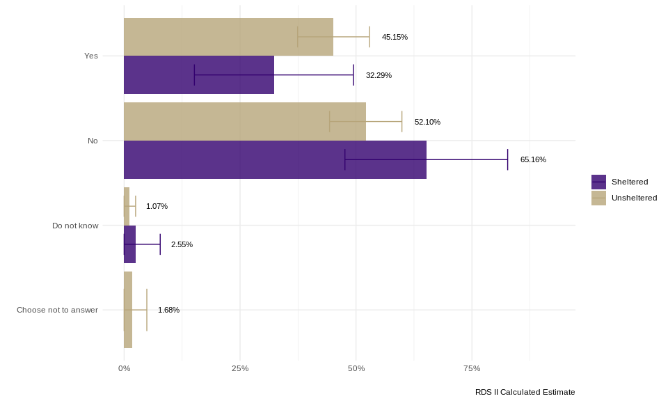

# Eviction

## *Ever Evicted*

*Imputed based on ‘15. Have you ever been evicted from a rental
property?’ [UWRDS] and ‘Now think about the last place you lived,
before you moved to your current residence. Were you forcibly evicted
from that last place you lived?’ [UWRDS-PSD]*

<table class="table table-striped" style="margin-left: auto; margin-right: auto;">
<caption>
Sheltered
</caption>
<thead>
<tr>
<th style="text-align:left;">
Ever Evicted
</th>
<th style="text-align:right;">
Sample N
</th>
<th style="text-align:left;">
Sample Proportion
</th>
<th style="text-align:left;">
RDS II Estimate
</th>
<th style="text-align:left;">
RDS II 95% CI
</th>
</tr>
</thead>
<tbody>
<tr>
<td style="text-align:left;">
No
</td>
<td style="text-align:right;">
76
</td>
<td style="text-align:left;">
74.51%
</td>
<td style="text-align:left;">
74.51%
</td>
<td style="text-align:left;">
[57.6%, 91.5%]
</td>
</tr>
<tr>
<td style="text-align:left;">
Yes
</td>
<td style="text-align:right;">
26
</td>
<td style="text-align:left;">
25.49%
</td>
<td style="text-align:left;">
25.49%
</td>
<td style="text-align:left;">
[8.5%, 42.4%]
</td>
</tr>
<tr>
<td style="text-align:left;">
Total
</td>
<td style="text-align:right;">
102
</td>
<td style="text-align:left;">

-   </td>
    <td style="text-align:left;">

    -   </td>
        <td style="text-align:left;">

        -   </td>
            </tr>
            </tbody>
            </table>
            <table class="table table-striped" style="margin-left: auto; margin-right: auto;">
            <caption>
            Unsheltered
            </caption>
            <thead>
            <tr>
            <th style="text-align:left;">
            Ever Evicted
            </th>
            <th style="text-align:right;">
            Sample N
            </th>
            <th style="text-align:left;">
            Sample Proportion
            </th>
            <th style="text-align:left;">
            RDS II Estimate
            </th>
            <th style="text-align:left;">
            RDS II 95% CI
            </th>
            </tr>
            </thead>
            <tbody>
            <tr>
            <td style="text-align:left;">
            No
            </td>
            <td style="text-align:right;">
            485
            </td>
            <td style="text-align:left;">
            75.43%
            </td>
            <td style="text-align:left;">
            75.30%
            </td>
            <td style="text-align:left;">
            [68.7%, 81.9%]
            </td>
            </tr>
            <tr>
            <td style="text-align:left;">
            Yes
            </td>
            <td style="text-align:right;">
            158
            </td>
            <td style="text-align:left;">
            24.57%
            </td>
            <td style="text-align:left;">
            24.70%
            </td>
            <td style="text-align:left;">
            [18.1%, 31.3%]
            </td>
            </tr>
            <tr>
            <td style="text-align:left;">
            Total
            </td>
            <td style="text-align:right;">
            643
            </td>
            <td style="text-align:left;">

            -   </td>
                <td style="text-align:left;">

                -   </td>
                    <td style="text-align:left;">

                    -   </td>
                        </tr>
                        </tbody>
                        </table>
                        

*The difference between individual sheltered and unsheltered is not
significant, *χ*2 = 0.03, (p = 0.946). These results were
calculated based on the mean of 1000 bootstrapped tests. This value was
calculated with replacement.*

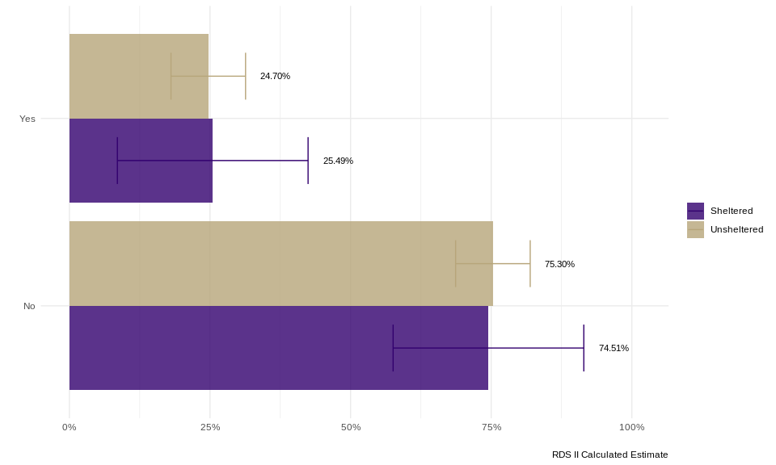

## *Age at Eviction*

*Imputed based on ‘15.1 How old were you? (please enter a number, for
example: 30) [if yes to ’15. Have you ever been evicted from a rental
property?’]’ This variable is not included for UWRDS-PSD survey
observations.*

<table class="table table-striped" style="margin-left: auto; margin-right: auto;">
<thead>
<tr>
<th style="text-align:left;">
Sleep Status
</th>
<th style="text-align:right;">
Sample N
</th>
<th style="text-align:right;">
Sample Median
</th>
<th style="text-align:right;">
Sample Mean
</th>
<th style="text-align:right;">
Sample SE
</th>
<th style="text-align:right;">
RDS II Estimate
</th>
<th style="text-align:left;">
RDS II 95% CI
</th>
</tr>
</thead>
<tbody>
<tr>
<td style="text-align:left;">
Unsheltered
</td>
<td style="text-align:right;">
136
</td>
<td style="text-align:right;">
28
</td>
<td style="text-align:right;">
30.15
</td>
<td style="text-align:right;">
1.07
</td>
<td style="text-align:right;">
31.31
</td>
<td style="text-align:left;">
[26.68, 35.94]
</td>
</tr>
<tr>
<td style="text-align:left;">
Sheltered
</td>
<td style="text-align:right;">
23
</td>
<td style="text-align:right;">
31
</td>
<td style="text-align:right;">
34.78
</td>
<td style="text-align:right;">
3.23
</td>
<td style="text-align:right;">
33.48
</td>
<td style="text-align:left;">
[28.82, 38.15]
</td>
</tr>
</tbody>
</table>

*The difference between individual sheltered and unsheltered is not
significant, t(75.99) = 0.65, (p= 0.519).*

## *If Evicted, Ever Formally Evicted*

*‘15.2 Were you formally evicted by court order?’ This variable is not
included for UWRDS-PSD survey observations.*

<table class="table table-striped" style="margin-left: auto; margin-right: auto;">
<caption>
Sheltered
</caption>
<thead>
<tr>
<th style="text-align:left;">
Ever Formally Evicted
</th>
<th style="text-align:right;">
Sample N
</th>
<th style="text-align:left;">
Sample Proportion
</th>
<th style="text-align:left;">
RDS II Estimate
</th>
<th style="text-align:left;">
RDS II 95% CI
</th>
</tr>
</thead>
<tbody>
<tr>
<td style="text-align:left;">
No
</td>
<td style="text-align:right;">
6
</td>
<td style="text-align:left;">
27%
</td>
<td style="text-align:left;">
22%
</td>
<td style="text-align:left;">
[-1.6%, 46.4%]
</td>
</tr>
<tr>
<td style="text-align:left;">
Yes
</td>
<td style="text-align:right;">
16
</td>
<td style="text-align:left;">
73%
</td>
<td style="text-align:left;">
78%
</td>
<td style="text-align:left;">
[53.6%, 101.6%]
</td>
</tr>
<tr>
<td style="text-align:left;">
Total
</td>
<td style="text-align:right;">
22
</td>
<td style="text-align:left;">

-   </td>
    <td style="text-align:left;">

    -   </td>
        <td style="text-align:left;">

        -   </td>
            </tr>
            </tbody>
            </table>
            <table class="table table-striped" style="margin-left: auto; margin-right: auto;">
            <caption>
            Unsheltered
            </caption>
            <thead>
            <tr>
            <th style="text-align:left;">
            Ever Formally Evicted
            </th>
            <th style="text-align:right;">
            Sample N
            </th>
            <th style="text-align:left;">
            Sample Proportion
            </th>
            <th style="text-align:left;">
            RDS II Estimate
            </th>
            <th style="text-align:left;">
            RDS II 95% CI
            </th>
            </tr>
            </thead>
            <tbody>
            <tr>
            <td style="text-align:left;">
            No
            </td>
            <td style="text-align:right;">
            79
            </td>
            <td style="text-align:left;">
            58%
            </td>
            <td style="text-align:left;">
            60%
            </td>
            <td style="text-align:left;">
            [44.5%, 76.4%]
            </td>
            </tr>
            <tr>
            <td style="text-align:left;">
            Yes
            </td>
            <td style="text-align:right;">
            57
            </td>
            <td style="text-align:left;">
            42%
            </td>
            <td style="text-align:left;">
            40%
            </td>
            <td style="text-align:left;">
            [23.6%, 55.5%]
            </td>
            </tr>
            <tr>
            <td style="text-align:left;">
            Total
            </td>
            <td style="text-align:right;">
            136
            </td>
            <td style="text-align:left;">

            -   </td>
                <td style="text-align:left;">

                -   </td>
                    <td style="text-align:left;">

                    -   </td>
                        </tr>
                        </tbody>
                        </table>
                        

*The difference between individual sheltered and unsheltered is
significant at the .05 level, *χ*2 = 11.91, (p = 0.013).
These results were calculated based on the mean of 1000 bootstrapped
tests. This value was calculated with replacement.*

# Sleep Status

## *Location Slept Previous Night*

### *Where did you sleep last night?*

*Respondent’s sleep location based on ‘A. Regular residence’ in
[UWRDS-PSD] and ‘7. Where did you sleep last night?’ [UWRDS]*

<table class="table table-striped" style="margin-left: auto; margin-right: auto;">
<caption>
Sheltered
</caption>
<thead>
<tr>
<th style="text-align:left;">
Sleep Location
</th>
<th style="text-align:right;">
Sample N
</th>
<th style="text-align:left;">
Sample Proportion
</th>
<th style="text-align:left;">
RDS II Estimate
</th>
<th style="text-align:left;">
RDS II 95% CI
</th>
</tr>
</thead>
<tbody>
<tr>
<td style="text-align:left;">
Car or RV
</td>
<td style="text-align:right;">
0
</td>
<td style="text-align:left;">
NA
</td>
<td style="text-align:left;">
NA
</td>
<td style="text-align:left;">
NA
</td>
</tr>
<tr>
<td style="text-align:left;">
Mobile home or trailer
</td>
<td style="text-align:right;">
0
</td>
<td style="text-align:left;">
NA
</td>
<td style="text-align:left;">
NA
</td>
<td style="text-align:left;">
NA
</td>
</tr>
<tr>
<td style="text-align:left;">
No residence, I sleep outdoors
</td>
<td style="text-align:right;">
0
</td>
<td style="text-align:left;">
NA
</td>
<td style="text-align:left;">
NA
</td>
<td style="text-align:left;">
NA
</td>
</tr>
<tr>
<td style="text-align:left;">
Something else
</td>
<td style="text-align:right;">
7
</td>
<td style="text-align:left;">
6.31%
</td>
<td style="text-align:left;">
6.4%
</td>
<td style="text-align:left;">
[-7.51%, 20.3%]
</td>
</tr>
<tr>
<td style="text-align:left;">
Tent or homemade structure
</td>
<td style="text-align:right;">
0
</td>
<td style="text-align:left;">
NA
</td>
<td style="text-align:left;">
NA
</td>
<td style="text-align:left;">
NA
</td>
</tr>
<tr>
<td style="text-align:left;">
“Tiny home”
</td>
<td style="text-align:right;">
4
</td>
<td style="text-align:left;">
3.60%
</td>
<td style="text-align:left;">
2.6%
</td>
<td style="text-align:left;">
[0.32%, 4.9%]
</td>
</tr>
<tr>
<td style="text-align:left;">
Homeless shelter or hotel
</td>
<td style="text-align:right;">
100
</td>
<td style="text-align:left;">
90.09%
</td>
<td style="text-align:left;">
91.0%
</td>
<td style="text-align:left;">
[77.18%, 104.8%]
</td>
</tr>
<tr>
<td style="text-align:left;">
Total
</td>
<td style="text-align:right;">
111
</td>
<td style="text-align:left;">

-   </td>
    <td style="text-align:left;">

    -   </td>
        <td style="text-align:left;">

        -   </td>
            </tr>
            </tbody>
            </table>
            <table class="table table-striped" style="margin-left: auto; margin-right: auto;">
            <caption>
            Unsheltered
            </caption>
            <thead>
            <tr>
            <th style="text-align:left;">
            Sleep Location
            </th>
            <th style="text-align:right;">
            Sample N
            </th>
            <th style="text-align:left;">
            Sample Proportion
            </th>
            <th style="text-align:left;">
            RDS II Estimate
            </th>
            <th style="text-align:left;">
            RDS II 95% CI
            </th>
            </tr>
            </thead>
            <tbody>
            <tr>
            <td style="text-align:left;">
            Car or RV
            </td>
            <td style="text-align:right;">
            159
            </td>
            <td style="text-align:left;">
            21.26%
            </td>
            <td style="text-align:left;">
            19.3%
            </td>
            <td style="text-align:left;">
            [14.09%, 24.4%]
            </td>
            </tr>
            <tr>
            <td style="text-align:left;">
            Mobile home or trailer
            </td>
            <td style="text-align:right;">
            2
            </td>
            <td style="text-align:left;">
            0.27%
            </td>
            <td style="text-align:left;">
            0.4%
            </td>
            <td style="text-align:left;">
            [-0.18%, 0.9%]
            </td>
            </tr>
            <tr>
            <td style="text-align:left;">
            No residence, I sleep outdoors
            </td>
            <td style="text-align:right;">
            252
            </td>
            <td style="text-align:left;">
            33.69%
            </td>
            <td style="text-align:left;">
            38.3%
            </td>
            <td style="text-align:left;">
            [31.13%, 45.4%]
            </td>
            </tr>
            <tr>
            <td style="text-align:left;">
            Something else
            </td>
            <td style="text-align:right;">
            80
            </td>
            <td style="text-align:left;">
            10.70%
            </td>
            <td style="text-align:left;">
            10.8%
            </td>
            <td style="text-align:left;">
            [6.78%, 14.8%]
            </td>
            </tr>
            <tr>
            <td style="text-align:left;">
            Tent or homemade structure
            </td>
            <td style="text-align:right;">
            255
            </td>
            <td style="text-align:left;">
            34.09%
            </td>
            <td style="text-align:left;">
            31.3%
            </td>
            <td style="text-align:left;">
            [25.33%, 37.3%]
            </td>
            </tr>
            <tr>
            <td style="text-align:left;">
            “Tiny home”
            </td>
            <td style="text-align:right;">
            0
            </td>
            <td style="text-align:left;">
            NA
            </td>
            <td style="text-align:left;">
            NA
            </td>
            <td style="text-align:left;">
            NA
            </td>
            </tr>
            <tr>
            <td style="text-align:left;">
            Homeless shelter or hotel
            </td>
            <td style="text-align:right;">
            0
            </td>
            <td style="text-align:left;">
            NA
            </td>
            <td style="text-align:left;">
            NA
            </td>
            <td style="text-align:left;">
            NA
            </td>
            </tr>
            <tr>
            <td style="text-align:left;">
            Total
            </td>
            <td style="text-align:right;">
            748
            </td>
            <td style="text-align:left;">

            -   </td>
                <td style="text-align:left;">

                -   </td>
                    <td style="text-align:left;">

                    -   </td>
                        </tr>
                        </tbody>
                        </table>
                        

*The difference between individual sheltered and unsheltered is
significant at the .05 level, *χ*2 = 795.47, (p = 0). These
results were calculated based on the mean of 1000 bootstrapped tests.
This value was calculated with replacement.*

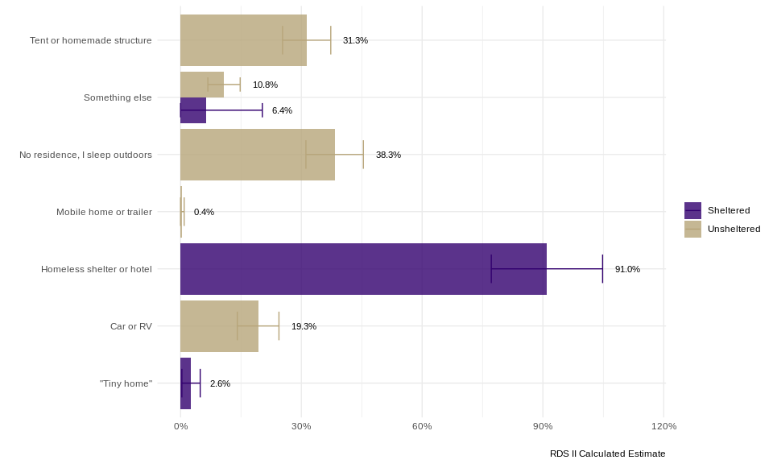

### *Re-coded: Where did you sleep last night?*

*7. Where did you sleep last night? - Imputed*

<table class="table table-striped" style="margin-left: auto; margin-right: auto;">
<caption>
Sheltered
</caption>
<thead>
<tr>
<th style="text-align:left;">
Sleep Location
</th>
<th style="text-align:right;">
Sample N
</th>
<th style="text-align:left;">
Sample Proportion
</th>
<th style="text-align:left;">
RDS II Estimate
</th>
<th style="text-align:left;">
RDS II 95% CI
</th>
</tr>
</thead>
<tbody>
<tr>
<td style="text-align:left;">
Commercial property (e.g. shops)
</td>
<td style="text-align:right;">
0
</td>
<td style="text-align:left;">
NA
</td>
<td style="text-align:left;">
NA
</td>
<td style="text-align:left;">
NA
</td>
</tr>
<tr>
<td style="text-align:left;">
Did not sleep
</td>
<td style="text-align:right;">
0
</td>
<td style="text-align:left;">
NA
</td>
<td style="text-align:left;">
NA
</td>
<td style="text-align:left;">
NA
</td>
</tr>
<tr>
<td style="text-align:left;">
In a car, truck, or van (smaller vehicle)
</td>
<td style="text-align:right;">
0
</td>
<td style="text-align:left;">
NA
</td>
<td style="text-align:left;">
NA
</td>
<td style="text-align:left;">
NA
</td>
</tr>
<tr>
<td style="text-align:left;">
In a park (uncovered, like on a bench)
</td>
<td style="text-align:right;">
0
</td>
<td style="text-align:left;">
NA
</td>
<td style="text-align:left;">
NA
</td>
<td style="text-align:left;">
NA
</td>
</tr>
<tr>
<td style="text-align:left;">
In a public facility or transit (bus/train station, transit center,
hospital waiting room)
</td>
<td style="text-align:right;">
0
</td>
<td style="text-align:left;">
NA
</td>
<td style="text-align:left;">
NA
</td>
<td style="text-align:left;">
NA
</td>
</tr>
<tr>
<td style="text-align:left;">
In an RV, trailer, or bus (larger vehicle)
</td>
<td style="text-align:right;">
0
</td>
<td style="text-align:left;">
NA
</td>
<td style="text-align:left;">
NA
</td>
<td style="text-align:left;">
NA
</td>
</tr>
<tr>
<td style="text-align:left;">
In an abandoned building/backyard or storage structure
</td>
<td style="text-align:right;">
0
</td>
<td style="text-align:left;">
NA
</td>
<td style="text-align:left;">
NA
</td>
<td style="text-align:left;">
NA
</td>
</tr>
<tr>
<td style="text-align:left;">
Maritime accommodation (e.g. boats, cargo)
</td>
<td style="text-align:right;">
0
</td>
<td style="text-align:left;">
NA
</td>
<td style="text-align:left;">
NA
</td>
<td style="text-align:left;">
NA
</td>
</tr>
<tr>
<td style="text-align:left;">
Outside in a tent (or tent-like structure)
</td>
<td style="text-align:right;">
0
</td>
<td style="text-align:left;">
NA
</td>
<td style="text-align:left;">
NA
</td>
<td style="text-align:left;">
NA
</td>
</tr>
<tr>
<td style="text-align:left;">
Outside, not in a tent
</td>
<td style="text-align:right;">
0
</td>
<td style="text-align:left;">
NA
</td>
<td style="text-align:left;">
NA
</td>
<td style="text-align:left;">
NA
</td>
</tr>
<tr>
<td style="text-align:left;">
Workplace
</td>
<td style="text-align:right;">
0
</td>
<td style="text-align:left;">
NA
</td>
<td style="text-align:left;">
NA
</td>
<td style="text-align:left;">
NA
</td>
</tr>
<tr>
<td style="text-align:left;">
In a hotel or motel
</td>
<td style="text-align:right;">
20
</td>
<td style="text-align:left;">
21.510%
</td>
<td style="text-align:left;">
22.58%
</td>
<td style="text-align:left;">
[8.81%, 36.36%]
</td>
</tr>
<tr>
<td style="text-align:left;">
In an overnight shelter (e.g. mission, church, resource shelter, etc.)
</td>
<td style="text-align:right;">
63
</td>
<td style="text-align:left;">
67.740%
</td>
<td style="text-align:left;">
68.02%
</td>
<td style="text-align:left;">
[49.69%, 86.35%]
</td>
</tr>
<tr>
<td style="text-align:left;">
Subsidized housing, housing vouchers
</td>
<td style="text-align:right;">
4
</td>
<td style="text-align:left;">
4.300%
</td>
<td style="text-align:left;">
4.51%
</td>
<td style="text-align:left;">
[-5.56%, 14.57%]
</td>
</tr>
<tr>
<td style="text-align:left;">
Tiny homes (not self-constructed)
</td>
<td style="text-align:right;">
3
</td>
<td style="text-align:left;">
3.230%
</td>
<td style="text-align:left;">
1.81%
</td>
<td style="text-align:left;">
[0.32%, 3.30%]
</td>
</tr>
<tr>
<td style="text-align:left;">
Transitional, supportive, or halfway housing
</td>
<td style="text-align:right;">
3
</td>
<td style="text-align:left;">
3.230%
</td>
<td style="text-align:left;">
3.08%
</td>
<td style="text-align:left;">
[-9.15%, 15.32%]
</td>
</tr>
<tr>
<td style="text-align:left;">
Total
</td>
<td style="text-align:right;">
93
</td>
<td style="text-align:left;">

-   </td>
    <td style="text-align:left;">

    -   </td>
        <td style="text-align:left;">

        -   </td>
            </tr>
            </tbody>
            </table>
            <table class="table table-striped" style="margin-left: auto; margin-right: auto;">
            <caption>
            Unsheltered
            </caption>
            <thead>
            <tr>
            <th style="text-align:left;">
            Sleep Location
            </th>
            <th style="text-align:right;">
            Sample N
            </th>
            <th style="text-align:left;">
            Sample Proportion
            </th>
            <th style="text-align:left;">
            RDS II Estimate
            </th>
            <th style="text-align:left;">
            RDS II 95% CI
            </th>
            </tr>
            </thead>
            <tbody>
            <tr>
            <td style="text-align:left;">
            Commercial property (e.g. shops)
            </td>
            <td style="text-align:right;">
            1
            </td>
            <td style="text-align:left;">
            0.170%
            </td>
            <td style="text-align:left;">
            0.24%
            </td>
            <td style="text-align:left;">
            [-0.52%, 1.01%]
            </td>
            </tr>
            <tr>
            <td style="text-align:left;">
            Did not sleep
            </td>
            <td style="text-align:right;">
            18
            </td>
            <td style="text-align:left;">
            3.070%
            </td>
            <td style="text-align:left;">
            2.41%
            </td>
            <td style="text-align:left;">
            [1.08%, 3.74%]
            </td>
            </tr>
            <tr>
            <td style="text-align:left;">
            In a car, truck, or van (smaller vehicle)
            </td>
            <td style="text-align:right;">
            81
            </td>
            <td style="text-align:left;">
            13.820%
            </td>
            <td style="text-align:left;">
            13.46%
            </td>
            <td style="text-align:left;">
            [7.83%, 19.09%]
            </td>
            </tr>
            <tr>
            <td style="text-align:left;">
            In a park (uncovered, like on a bench)
            </td>
            <td style="text-align:right;">
            19
            </td>
            <td style="text-align:left;">
            3.240%
            </td>
            <td style="text-align:left;">
            3.46%
            </td>
            <td style="text-align:left;">
            [2.03%, 4.88%]
            </td>
            </tr>
            <tr>
            <td style="text-align:left;">
            In a public facility or transit (bus/train station, transit
            center, hospital waiting room)
            </td>
            <td style="text-align:right;">
            41
            </td>
            <td style="text-align:left;">
            7.000%
            </td>
            <td style="text-align:left;">
            8.49%
            </td>
            <td style="text-align:left;">
            [4.18%, 12.79%]
            </td>
            </tr>
            <tr>
            <td style="text-align:left;">
            In an RV, trailer, or bus (larger vehicle)
            </td>
            <td style="text-align:right;">
            46
            </td>
            <td style="text-align:left;">
            7.850%
            </td>
            <td style="text-align:left;">
            6.25%
            </td>
            <td style="text-align:left;">
            [3.55%, 8.94%]
            </td>
            </tr>
            <tr>
            <td style="text-align:left;">
            In an abandoned building/backyard or storage structure
            </td>
            <td style="text-align:right;">
            16
            </td>
            <td style="text-align:left;">
            2.730%
            </td>
            <td style="text-align:left;">
            2.63%
            </td>
            <td style="text-align:left;">
            [0.03%, 5.23%]
            </td>
            </tr>
            <tr>
            <td style="text-align:left;">
            Maritime accommodation (e.g. boats, cargo)
            </td>
            <td style="text-align:right;">
            3
            </td>
            <td style="text-align:left;">
            0.510%
            </td>
            <td style="text-align:left;">
            0.68%
            </td>
            <td style="text-align:left;">
            [0.09%, 1.27%]
            </td>
            </tr>
            <tr>
            <td style="text-align:left;">
            Outside in a tent (or tent-like structure)
            </td>
            <td style="text-align:right;">
            194
            </td>
            <td style="text-align:left;">
            33.110%
            </td>
            <td style="text-align:left;">
            29.92%
            </td>
            <td style="text-align:left;">
            [23.16%, 36.67%]
            </td>
            </tr>
            <tr>
            <td style="text-align:left;">
            Outside, not in a tent
            </td>
            <td style="text-align:right;">
            166
            </td>
            <td style="text-align:left;">
            28.330%
            </td>
            <td style="text-align:left;">
            32.32%
            </td>
            <td style="text-align:left;">
            [24.12%, 40.51%]
            </td>
            </tr>
            <tr>
            <td style="text-align:left;">
            Workplace
            </td>
            <td style="text-align:right;">
            1
            </td>
            <td style="text-align:left;">
            0.170%
            </td>
            <td style="text-align:left;">
            0.16%
            </td>
            <td style="text-align:left;">
            [0.12%, 0.20%]
            </td>
            </tr>
            <tr>
            <td style="text-align:left;">
            In a hotel or motel
            </td>
            <td style="text-align:right;">
            0
            </td>
            <td style="text-align:left;">
            NA
            </td>
            <td style="text-align:left;">
            NA
            </td>
            <td style="text-align:left;">
            NA
            </td>
            </tr>
            <tr>
            <td style="text-align:left;">
            In an overnight shelter (e.g. mission, church, resource
            shelter, etc.)
            </td>
            <td style="text-align:right;">
            0
            </td>
            <td style="text-align:left;">
            NA
            </td>
            <td style="text-align:left;">
            NA
            </td>
            <td style="text-align:left;">
            NA
            </td>
            </tr>
            <tr>
            <td style="text-align:left;">
            Subsidized housing, housing vouchers
            </td>
            <td style="text-align:right;">
            0
            </td>
            <td style="text-align:left;">
            NA
            </td>
            <td style="text-align:left;">
            NA
            </td>
            <td style="text-align:left;">
            NA
            </td>
            </tr>
            <tr>
            <td style="text-align:left;">
            Tiny homes (not self-constructed)
            </td>
            <td style="text-align:right;">
            0
            </td>
            <td style="text-align:left;">
            NA
            </td>
            <td style="text-align:left;">
            NA
            </td>
            <td style="text-align:left;">
            NA
            </td>
            </tr>
            <tr>
            <td style="text-align:left;">
            Transitional, supportive, or halfway housing
            </td>
            <td style="text-align:right;">
            0
            </td>
            <td style="text-align:left;">
            NA
            </td>
            <td style="text-align:left;">
            NA
            </td>
            <td style="text-align:left;">
            NA
            </td>
            </tr>
            <tr>
            <td style="text-align:left;">
            Total
            </td>
            <td style="text-align:right;">
            586
            </td>
            <td style="text-align:left;">

            -   </td>
                <td style="text-align:left;">

                -   </td>
                    <td style="text-align:left;">

                    -   </td>
                        </tr>
                        </tbody>
                        </table>
                        

*The difference between individual sheltered and unsheltered is
significant at the .05 level, *χ*2 = 643.36, (p = 0). These
results were calculated based on the mean of 1000 bootstrapped tests.
This value was calculated with replacement.*

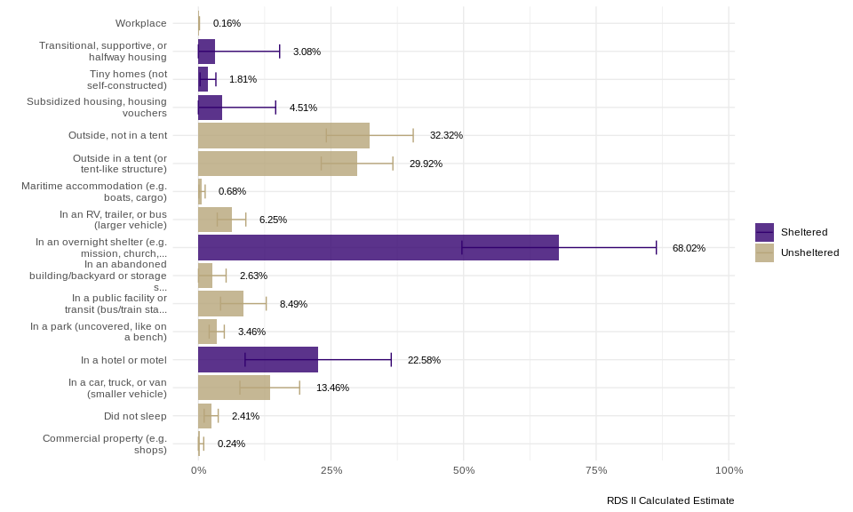

# Experience of Homelessness

## *First Year Experiencing Homelessness*

*‘10. What year was your first experience of homelessness?’ This
variable is not included for UWRDS-PSD survey observations.*

<table class="table table-striped" style="margin-left: auto; margin-right: auto;">
<thead>
<tr>
<th style="text-align:left;">
Sleep Status
</th>
<th style="text-align:right;">
Sample N
</th>
<th style="text-align:right;">
Sample Median
</th>
<th style="text-align:right;">
Sample Mean
</th>
<th style="text-align:right;">
Sample SE
</th>
<th style="text-align:right;">
RDS II Estimate
</th>
<th style="text-align:left;">
RDS II 95% CI
</th>
</tr>
</thead>
<tbody>
<tr>
<td style="text-align:left;">
Unsheltered
</td>
<td style="text-align:right;">
583
</td>
<td style="text-align:right;">
2013
</td>
<td style="text-align:right;">
2009.49
</td>
<td style="text-align:right;">
0.50
</td>
<td style="text-align:right;">
2009.48
</td>
<td style="text-align:left;">
[2007.02, 2011.93]
</td>
</tr>
<tr>
<td style="text-align:left;">
Sheltered
</td>
<td style="text-align:right;">
91
</td>
<td style="text-align:right;">
2016
</td>
<td style="text-align:right;">
2011.80
</td>
<td style="text-align:right;">
1.35
</td>
<td style="text-align:right;">
2011.36
</td>
<td style="text-align:left;">
[2006.36, 2016.37]
</td>
</tr>
</tbody>
</table>

*The difference between individual sheltered and unsheltered is not
significant, t(356.8) = 0.66, (p= 0.508).*

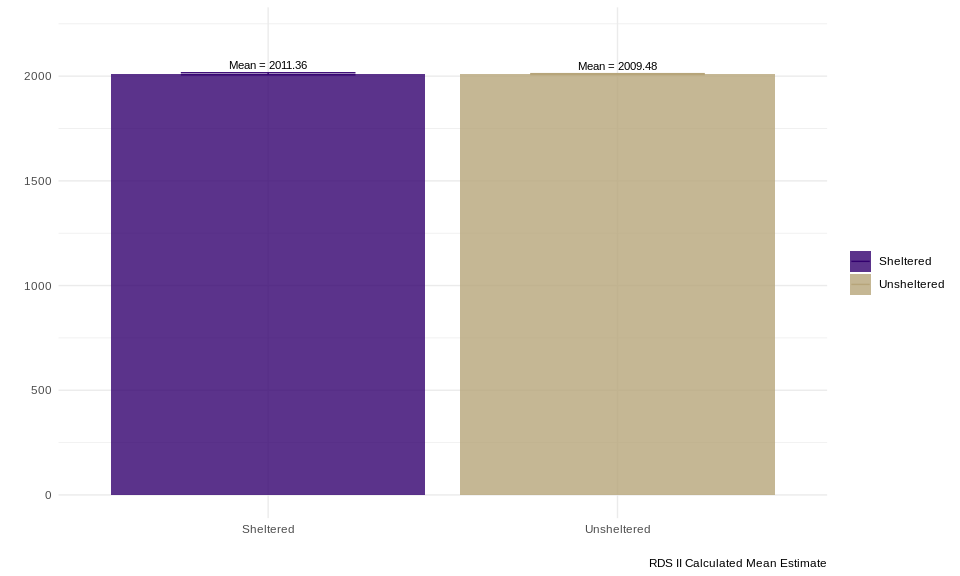

## *Time Experiencing Homelessness*

*Imputed based on ‘About how long have you been homeless’ [UWRDS-PSD]
and ‘17. How long have you been homeless this time?’ [UWRDS-PSD]*

<table class="table table-striped" style="margin-left: auto; margin-right: auto;">
<caption>
Sheltered
</caption>
<thead>
<tr>
<th style="text-align:left;">
Duration Homeless
</th>
<th style="text-align:right;">
Sample N
</th>
<th style="text-align:left;">
Sample Proportion
</th>
<th style="text-align:left;">
RDS II Estimate
</th>
<th style="text-align:left;">
RDS II 95% CI
</th>
</tr>
</thead>
<tbody>
<tr>
<td style="text-align:left;">
Above one year
</td>
<td style="text-align:right;">
64
</td>
<td style="text-align:left;">
61.54%
</td>
<td style="text-align:left;">
57.16%
</td>
<td style="text-align:left;">
[38.35%, 75.97%]
</td>
</tr>
<tr>
<td style="text-align:left;">
Choose not to answer
</td>
<td style="text-align:right;">
3
</td>
<td style="text-align:left;">
2.88%
</td>
<td style="text-align:left;">
3.34%
</td>
<td style="text-align:left;">
[-6.07%, 12.75%]
</td>
</tr>
<tr>
<td style="text-align:left;">
Do not know
</td>
<td style="text-align:right;">
0
</td>
<td style="text-align:left;">
NA
</td>
<td style="text-align:left;">
NA
</td>
<td style="text-align:left;">
NA
</td>
</tr>
<tr>
<td style="text-align:left;">
Less than a month
</td>
<td style="text-align:right;">
3
</td>
<td style="text-align:left;">
2.88%
</td>
<td style="text-align:left;">
4.14%
</td>
<td style="text-align:left;">
[-7.80%, 16.08%]
</td>
</tr>
<tr>
<td style="text-align:left;">
More than a month but Less than a year
</td>
<td style="text-align:right;">
34
</td>
<td style="text-align:left;">
32.69%
</td>
<td style="text-align:left;">
35.36%
</td>
<td style="text-align:left;">
[18.03%, 52.69%]
</td>
</tr>
<tr>
<td style="text-align:left;">
Total
</td>
<td style="text-align:right;">
104
</td>
<td style="text-align:left;">

-   </td>
    <td style="text-align:left;">

    -   </td>
        <td style="text-align:left;">

        -   </td>
            </tr>
            </tbody>
            </table>
            <table class="table table-striped" style="margin-left: auto; margin-right: auto;">
            <caption>
            Unsheltered
            </caption>
            <thead>
            <tr>
            <th style="text-align:left;">
            Duration Homeless
            </th>
            <th style="text-align:right;">
            Sample N
            </th>
            <th style="text-align:left;">
            Sample Proportion
            </th>
            <th style="text-align:left;">
            RDS II Estimate
            </th>
            <th style="text-align:left;">
            RDS II 95% CI
            </th>
            </tr>
            </thead>
            <tbody>
            <tr>
            <td style="text-align:left;">
            Above one year
            </td>
            <td style="text-align:right;">
            540
            </td>
            <td style="text-align:left;">
            77.25%
            </td>
            <td style="text-align:left;">
            75.37%
            </td>
            <td style="text-align:left;">
            [69.00%, 81.73%]
            </td>
            </tr>
            <tr>
            <td style="text-align:left;">
            Choose not to answer
            </td>
            <td style="text-align:right;">
            2
            </td>
            <td style="text-align:left;">
            0.29%
            </td>
            <td style="text-align:left;">
            0.23%
            </td>
            <td style="text-align:left;">
            [-0.37%, 0.83%]
            </td>
            </tr>
            <tr>
            <td style="text-align:left;">
            Do not know
            </td>
            <td style="text-align:right;">
            6
            </td>
            <td style="text-align:left;">
            0.86%
            </td>
            <td style="text-align:left;">
            0.76%
            </td>
            <td style="text-align:left;">
            [-0.03%, 1.56%]
            </td>
            </tr>
            <tr>
            <td style="text-align:left;">
            Less than a month
            </td>
            <td style="text-align:right;">
            29
            </td>
            <td style="text-align:left;">
            4.15%
            </td>
            <td style="text-align:left;">
            5.26%
            </td>
            <td style="text-align:left;">
            [1.64%, 8.88%]
            </td>
            </tr>
            <tr>
            <td style="text-align:left;">
            More than a month but Less than a year
            </td>
            <td style="text-align:right;">
            122
            </td>
            <td style="text-align:left;">
            17.45%
            </td>
            <td style="text-align:left;">
            18.38%
            </td>
            <td style="text-align:left;">
            [12.69%, 24.07%]
            </td>
            </tr>
            <tr>
            <td style="text-align:left;">
            Total
            </td>
            <td style="text-align:right;">
            699
            </td>
            <td style="text-align:left;">

            -   </td>
                <td style="text-align:left;">

                -   </td>
                    <td style="text-align:left;">

                    -   </td>
                        </tr>
                        </tbody>
                        </table>
                        

*The difference between individual sheltered and unsheltered is
significant at the .05 level, *χ*2 = 33.12, (p = 0.034).
These results were calculated based on the mean of 1000 bootstrapped
tests. This value was calculated with replacement.*

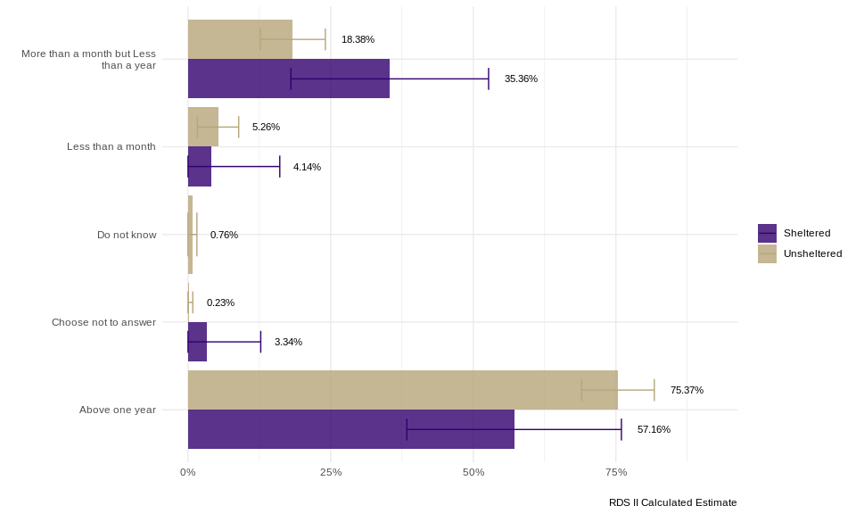

## *Days Homeless in Past Three Years*

*‘If you added up all the times you have been homeless in the last 3
years, about how long have you been homeless? - Imputed Total Days’ This
variable is not included for UWRDS-PSD survey observations.*

<table class="table table-striped" style="margin-left: auto; margin-right: auto;">
<thead>
<tr>
<th style="text-align:left;">
Sleep Status
</th>
<th style="text-align:right;">
Sample N
</th>
<th style="text-align:right;">
Sample Median
</th>
<th style="text-align:right;">
Sample Mean
</th>
<th style="text-align:right;">
Sample SE
</th>
<th style="text-align:right;">
RDS II Estimate
</th>
<th style="text-align:left;">
RDS II 95% CI
</th>
</tr>
</thead>
<tbody>
<tr>
<td style="text-align:left;">
Unsheltered
</td>
<td style="text-align:right;">
586
</td>
<td style="text-align:right;">
1095.0
</td>
<td style="text-align:right;">
862.15
</td>
<td style="text-align:right;">
14.23
</td>
<td style="text-align:right;">
843.09
</td>
<td style="text-align:left;">
[779.91, 906.28]
</td>
</tr>
<tr>
<td style="text-align:left;">
Sheltered
</td>
<td style="text-align:right;">
93
</td>
<td style="text-align:right;">
730.5
</td>
<td style="text-align:right;">
671.18
</td>
<td style="text-align:right;">
44.46
</td>
<td style="text-align:right;">
660.19
</td>
<td style="text-align:left;">
[495.66, 824.71]
</td>
</tr>
</tbody>
</table>

*The difference between individual sheltered and unsheltered is
significant at the .05 level, t(366.75) = -2.03, (p= 0.043).*

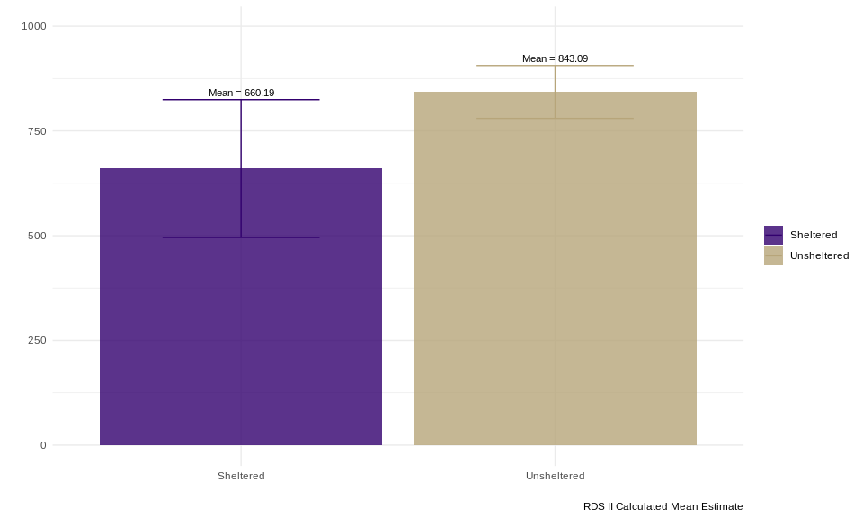

## *Number of Times Homeless in Past Three Years*

*‘18. Including this time, how many different times have you been
homeless in the past 3 years, that is since April 2020?’ This variable
is not included for UWRDS-PSD survey observations.*

<table class="table table-striped" style="margin-left: auto; margin-right: auto;">
<caption>
Sheltered
</caption>
<thead>
<tr>
<th style="text-align:left;">
Times Homeless
</th>
<th style="text-align:right;">
Sample N
</th>
<th style="text-align:left;">
Sample Proportion
</th>
<th style="text-align:left;">
RDS II Estimate
</th>
<th style="text-align:left;">
RDS II 95% CI
</th>
</tr>
</thead>
<tbody>
<tr>
<td style="text-align:left;">
1 time
</td>
<td style="text-align:right;">
67
</td>
<td style="text-align:left;">
72.04%
</td>
<td style="text-align:left;">
65.80%
</td>
<td style="text-align:left;">
[42.76%, 88.84%]
</td>
</tr>
<tr>
<td style="text-align:left;">
2 times
</td>
<td style="text-align:right;">
11
</td>
<td style="text-align:left;">
11.83%
</td>
<td style="text-align:left;">
14.94%
</td>
<td style="text-align:left;">
[-7.34%, 37.22%]
</td>
</tr>
<tr>
<td style="text-align:left;">
3 times
</td>
<td style="text-align:right;">
1
</td>
<td style="text-align:left;">
1.08%
</td>
<td style="text-align:left;">
2.55%
</td>
<td style="text-align:left;">
[-0.78%, 5.88%]
</td>
</tr>
<tr>
<td style="text-align:left;">
4 or more times
</td>
<td style="text-align:right;">
9
</td>
<td style="text-align:left;">
9.68%
</td>
<td style="text-align:left;">
9.88%
</td>
<td style="text-align:left;">
[-2.88%, 22.65%]
</td>
</tr>
<tr>
<td style="text-align:left;">
Choose not to answer
</td>
<td style="text-align:right;">
2
</td>
<td style="text-align:left;">
2.15%
</td>
<td style="text-align:left;">
1.21%
</td>
<td style="text-align:left;">
[0.23%, 2.20%]
</td>
</tr>
<tr>
<td style="text-align:left;">
Do not know
</td>
<td style="text-align:right;">
3
</td>
<td style="text-align:left;">
3.23%
</td>
<td style="text-align:left;">
5.61%
</td>
<td style="text-align:left;">
[-6.31%, 17.53%]
</td>
</tr>
<tr>
<td style="text-align:left;">
Total
</td>
<td style="text-align:right;">
93
</td>
<td style="text-align:left;">

-   </td>
    <td style="text-align:left;">

    -   </td>
        <td style="text-align:left;">

        -   </td>
            </tr>
            </tbody>
            </table>
            <table class="table table-striped" style="margin-left: auto; margin-right: auto;">
            <caption>
            Unsheltered
            </caption>
            <thead>
            <tr>
            <th style="text-align:left;">
            Times Homeless
            </th>
            <th style="text-align:right;">
            Sample N
            </th>
            <th style="text-align:left;">
            Sample Proportion
            </th>
            <th style="text-align:left;">
            RDS II Estimate
            </th>
            <th style="text-align:left;">
            RDS II 95% CI
            </th>
            </tr>
            </thead>
            <tbody>
            <tr>
            <td style="text-align:left;">
            1 time
            </td>
            <td style="text-align:right;">
            396
            </td>
            <td style="text-align:left;">
            67.69%
            </td>
            <td style="text-align:left;">
            67.68%
            </td>
            <td style="text-align:left;">
            [60.61%, 74.76%]
            </td>
            </tr>
            <tr>
            <td style="text-align:left;">
            2 times
            </td>
            <td style="text-align:right;">
            80
            </td>
            <td style="text-align:left;">
            13.68%
            </td>
            <td style="text-align:left;">
            14.19%
            </td>
            <td style="text-align:left;">
            [8.27%, 20.11%]
            </td>
            </tr>
            <tr>
            <td style="text-align:left;">
            3 times
            </td>
            <td style="text-align:right;">
            38
            </td>
            <td style="text-align:left;">
            6.50%
            </td>
            <td style="text-align:left;">
            7.26%
            </td>
            <td style="text-align:left;">
            [4.05%, 10.47%]
            </td>
            </tr>
            <tr>
            <td style="text-align:left;">
            4 or more times
            </td>
            <td style="text-align:right;">
            58
            </td>
            <td style="text-align:left;">
            9.91%
            </td>
            <td style="text-align:left;">
            8.41%
            </td>
            <td style="text-align:left;">
            [4.78%, 12.03%]
            </td>
            </tr>
            <tr>
            <td style="text-align:left;">
            Choose not to answer
            </td>
            <td style="text-align:right;">
            3
            </td>
            <td style="text-align:left;">
            0.51%
            </td>
            <td style="text-align:left;">
            0.97%
            </td>
            <td style="text-align:left;">
            [0.07%, 1.86%]
            </td>
            </tr>
            <tr>
            <td style="text-align:left;">
            Do not know
            </td>
            <td style="text-align:right;">
            10
            </td>
            <td style="text-align:left;">
            1.71%
            </td>
            <td style="text-align:left;">
            1.50%
            </td>
            <td style="text-align:left;">
            [0.32%, 2.67%]
            </td>
            </tr>
            <tr>
            <td style="text-align:left;">
            Total
            </td>
            <td style="text-align:right;">
            585
            </td>
            <td style="text-align:left;">

            -   </td>
                <td style="text-align:left;">

                -   </td>
                    <td style="text-align:left;">

                    -   </td>
                        </tr>
                        </tbody>
                        </table>
                        

*The difference between individual sheltered and unsheltered is not
significant, *χ*2 = 10.01, (p = 0.565). These results were
calculated based on the mean of 1000 bootstrapped tests. This value was
calculated with replacement.*

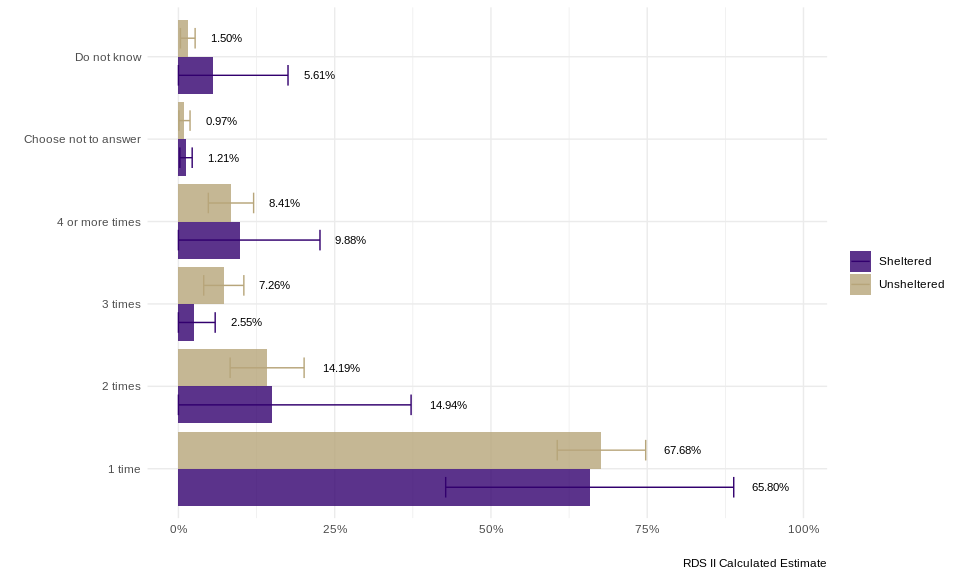

## *Experiencing Chronic Homelessness*

*Binary imputed variable for HUD’s chronic homelessness designation*

<table class="table table-striped" style="margin-left: auto; margin-right: auto;">
<caption>
Sheltered
</caption>
<thead>
<tr>
<th style="text-align:left;">
Experiencing Chronic Homelessness
</th>
<th style="text-align:right;">
Sample N
</th>
<th style="text-align:left;">
Sample Proportion
</th>
<th style="text-align:left;">
RDS II Estimate
</th>
<th style="text-align:left;">
RDS II 95% CI
</th>
</tr>
</thead>
<tbody>
<tr>
<td style="text-align:left;">
No
</td>
<td style="text-align:right;">
48
</td>
<td style="text-align:left;">
51.6%
</td>
<td style="text-align:left;">
62.4%
</td>
<td style="text-align:left;">
[44.0%, 80.8%]
</td>
</tr>
<tr>
<td style="text-align:left;">
Yes
</td>
<td style="text-align:right;">
45
</td>
<td style="text-align:left;">
48.4%
</td>
<td style="text-align:left;">
37.6%
</td>
<td style="text-align:left;">
[19.2%, 56.0%]
</td>
</tr>
<tr>
<td style="text-align:left;">
Total
</td>
<td style="text-align:right;">
93
</td>
<td style="text-align:left;">

-   </td>
    <td style="text-align:left;">

    -   </td>
        <td style="text-align:left;">

        -   </td>
            </tr>
            </tbody>
            </table>
            <table class="table table-striped" style="margin-left: auto; margin-right: auto;">
            <caption>
            Unsheltered
            </caption>
            <thead>
            <tr>
            <th style="text-align:left;">
            Experiencing Chronic Homelessness
            </th>
            <th style="text-align:right;">
            Sample N
            </th>
            <th style="text-align:left;">
            Sample Proportion
            </th>
            <th style="text-align:left;">
            RDS II Estimate
            </th>
            <th style="text-align:left;">
            RDS II 95% CI
            </th>
            </tr>
            </thead>
            <tbody>
            <tr>
            <td style="text-align:left;">
            No
            </td>
            <td style="text-align:right;">
            203
            </td>
            <td style="text-align:left;">
            34.6%
            </td>
            <td style="text-align:left;">
            39.6%
            </td>
            <td style="text-align:left;">
            [31.6%, 47.7%]
            </td>
            </tr>
            <tr>
            <td style="text-align:left;">
            Yes
            </td>
            <td style="text-align:right;">
            383
            </td>
            <td style="text-align:left;">
            65.4%
            </td>
            <td style="text-align:left;">
            60.4%
            </td>
            <td style="text-align:left;">
            [52.3%, 68.4%]
            </td>
            </tr>
            <tr>
            <td style="text-align:left;">
            Total
            </td>
            <td style="text-align:right;">
            586
            </td>
            <td style="text-align:left;">

            -   </td>
                <td style="text-align:left;">

                -   </td>
                    <td style="text-align:left;">

                    -   </td>
                        </tr>
                        </tbody>
                        </table>
                        

*The difference between individual sheltered and unsheltered is
significant at the .05 level, *χ*2 = 18.17, (p = 0). These
results were calculated based on the mean of 1000 bootstrapped tests.
This value was calculated with replacement.*

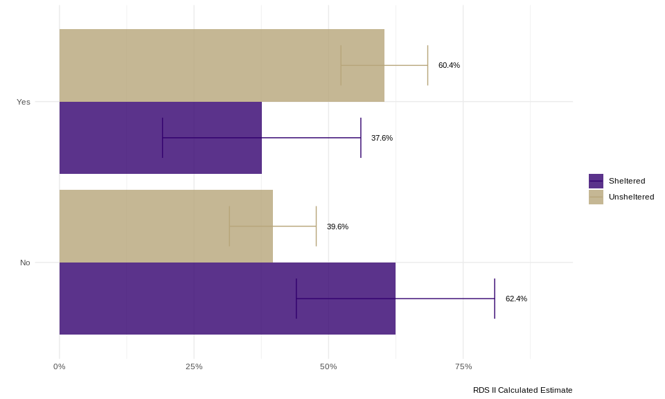

# Connections

## *Number of Estimated Homeless People Known*

*Outside of your family living with you, how many people do you
personally know who are unhoused or experiencing homelessness? -
Imputed*

<table class="table table-striped" style="margin-left: auto; margin-right: auto;">
<thead>
<tr>
<th style="text-align:left;">
Sleep Status
</th>
<th style="text-align:right;">
Sample N
</th>
<th style="text-align:right;">
Sample Median
</th>
<th style="text-align:right;">
Sample Mean
</th>
<th style="text-align:right;">
Sample SE
</th>
<th style="text-align:right;">
RDS II Estimate
</th>
<th style="text-align:left;">
RDS II 95% CI
</th>
</tr>
</thead>
<tbody>
<tr>
<td style="text-align:left;">
Unsheltered
</td>
<td style="text-align:right;">
727
</td>
<td style="text-align:right;">
12
</td>
<td style="text-align:right;">
78.52
</td>
<td style="text-align:right;">
28.68
</td>
<td style="text-align:right;">
84.77
</td>
<td style="text-align:left;">
[-50.14, 219.69]
</td>
</tr>
<tr>
<td style="text-align:left;">
Sheltered
</td>
<td style="text-align:right;">
107
</td>
<td style="text-align:right;">
5
</td>
<td style="text-align:right;">
33.23
</td>
<td style="text-align:right;">
11.37
</td>
<td style="text-align:right;">
20.65
</td>
<td style="text-align:left;">
[7.59, 33.71]
</td>
</tr>
</tbody>
</table>

*The difference between individual sheltered and unsheltered is not
significant, t(0.26) = -0.93, (p= 0.72).*

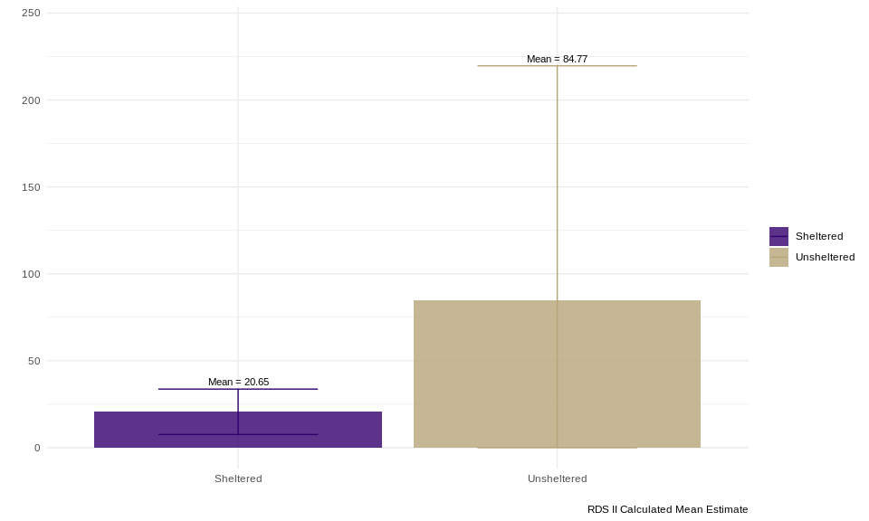

## *Number of Named Homeless People Known*

*Number of named non-household contacts*

<table class="table table-striped" style="margin-left: auto; margin-right: auto;">
<thead>
<tr>
<th style="text-align:left;">
Sleep Status
</th>
<th style="text-align:right;">
Sample N
</th>
<th style="text-align:right;">
Sample Median
</th>
<th style="text-align:right;">
Sample Mean
</th>
<th style="text-align:right;">
Sample SE
</th>
<th style="text-align:right;">
RDS II Estimate
</th>
<th style="text-align:left;">
RDS II 95% CI
</th>
</tr>
</thead>
<tbody>
<tr>
<td style="text-align:left;">
Unsheltered
</td>
<td style="text-align:right;">
748
</td>
<td style="text-align:right;">
3
</td>
<td style="text-align:right;">
4.18
</td>
<td style="text-align:right;">
0.16
</td>
<td style="text-align:right;">
1.87
</td>
<td style="text-align:left;">
[1.57, 2.18]
</td>
</tr>
<tr>
<td style="text-align:left;">
Sheltered
</td>
<td style="text-align:right;">
111
</td>
<td style="text-align:right;">
3
</td>
<td style="text-align:right;">
4.13
</td>
<td style="text-align:right;">
0.44
</td>
<td style="text-align:right;">
1.77
</td>
<td style="text-align:left;">
[1.06, 2.48]
</td>
</tr>
</tbody>
</table>

*The difference between individual sheltered and unsheltered is not
significant, t(437.75) = -0.93, (p= 0.354).*

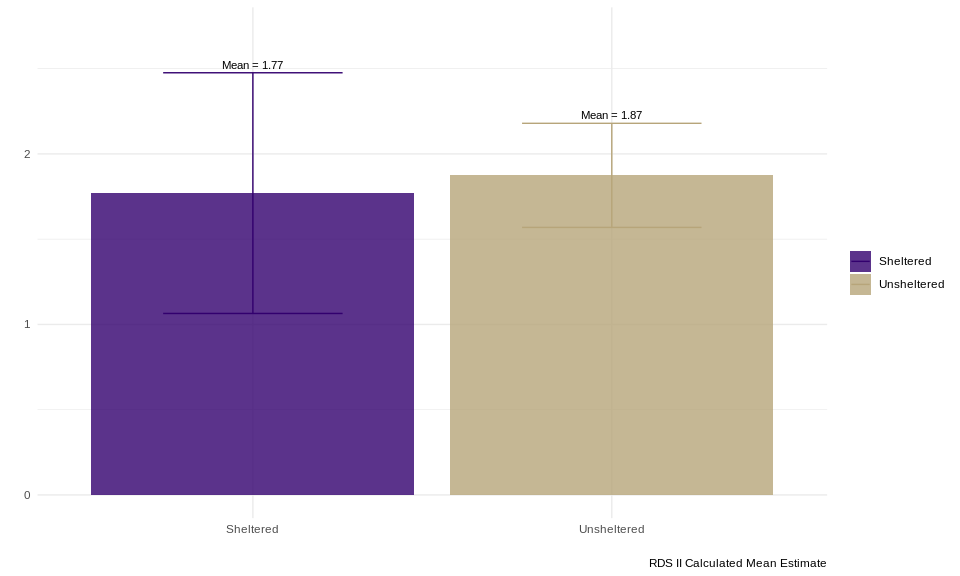

## *Number of Household Members*

*Imputed count of household members based on ‘27. Please list the
initials of all the people in your household.’*

<table class="table table-striped" style="margin-left: auto; margin-right: auto;">
<thead>
<tr>
<th style="text-align:left;">
Sleep Status
</th>
<th style="text-align:right;">
Sample N
</th>
<th style="text-align:right;">
Sample Median
</th>
<th style="text-align:right;">
Sample Mean
</th>
<th style="text-align:right;">
Sample SE
</th>
<th style="text-align:right;">
RDS II Estimate
</th>
<th style="text-align:left;">
RDS II 95% CI
</th>
</tr>
</thead>
<tbody>
<tr>
<td style="text-align:left;">
Unsheltered
</td>
<td style="text-align:right;">
588
</td>
<td style="text-align:right;">
0
</td>
<td style="text-align:right;">
0.53
</td>
<td style="text-align:right;">
0.04
</td>
<td style="text-align:right;">
0.48
</td>
<td style="text-align:left;">
[0.36, 0.61]
</td>
</tr>
<tr>
<td style="text-align:left;">
Sheltered
</td>
<td style="text-align:right;">
93
</td>
<td style="text-align:right;">
0
</td>
<td style="text-align:right;">
0.96
</td>
<td style="text-align:right;">
0.20
</td>
<td style="text-align:right;">
0.57
</td>
<td style="text-align:left;">
[0.28, 0.86]
</td>
</tr>
</tbody>
</table>

*The difference between individual sheltered and unsheltered is not
significant, t(366.07) = 0.53, (p= 0.599).*

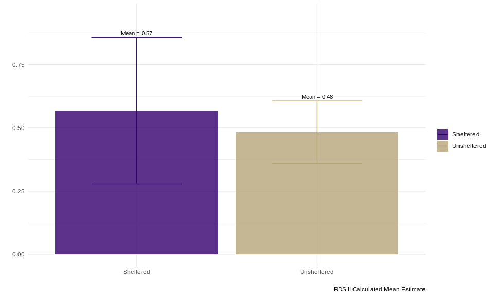

## *Number of Coupons Distributed*

*Total number of individuals the respondent referred who took the
survey*

<table class="table table-striped" style="margin-left: auto; margin-right: auto;">
<thead>
<tr>
<th style="text-align:left;">
Sleep Status
</th>
<th style="text-align:right;">
Sample N
</th>
<th style="text-align:right;">
Sample Median
</th>
<th style="text-align:right;">
Sample Mean
</th>
<th style="text-align:right;">
Sample SE
</th>
<th style="text-align:right;">
RDS II Estimate
</th>
<th style="text-align:left;">
RDS II 95% CI
</th>
</tr>
</thead>
<tbody>
<tr>
<td style="text-align:left;">
Unsheltered
</td>
<td style="text-align:right;">
746
</td>
<td style="text-align:right;">
3
</td>
<td style="text-align:right;">
2.88
</td>
<td style="text-align:right;">
0.02
</td>
<td style="text-align:right;">
2.86
</td>
<td style="text-align:left;">
[2.76, 2.96]
</td>
</tr>
<tr>
<td style="text-align:left;">
Sheltered
</td>
<td style="text-align:right;">
111
</td>
<td style="text-align:right;">
3
</td>
<td style="text-align:right;">
2.91
</td>
<td style="text-align:right;">
0.04
</td>
<td style="text-align:right;">
2.89
</td>
<td style="text-align:left;">
[2.58, 3.2]
</td>
</tr>
</tbody>
</table>

*The difference between individual sheltered and unsheltered is not
significant, t(439.32) = 0.17, (p= 0.863).*

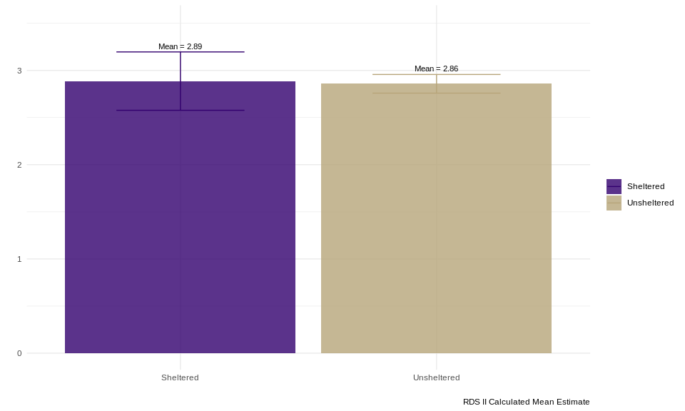

# Benefits

## *Veteran Affairs Benefits*

*‘13. Are you receiving any of the following benefits? (Select all that
apply) - Selected Choice Veteran’s Administration (VA)’ This variable is
not included for UWRDS-PSD survey observations.*

<table class="table table-striped" style="margin-left: auto; margin-right: auto;">
<caption>
Sheltered
</caption>
<thead>
<tr>
<th style="text-align:left;">
Receiving VA Benefits
</th>
<th style="text-align:right;">
Sample N
</th>
<th style="text-align:left;">
Sample Proportion
</th>
<th style="text-align:left;">
RDS II Estimate
</th>
<th style="text-align:left;">
RDS II 95% CI
</th>
</tr>
</thead>
<tbody>
<tr>
<td style="text-align:left;">
No or Chose Not to Answer
</td>
<td style="text-align:right;">
85
</td>
<td style="text-align:left;">
91.4%
</td>
<td style="text-align:left;">
92.6%
</td>
<td style="text-align:left;">
[89.1%, 96.2%]
</td>
</tr>
<tr>
<td style="text-align:left;">
Yes
</td>
<td style="text-align:right;">
8
</td>
<td style="text-align:left;">
8.6%
</td>
<td style="text-align:left;">
7.4%
</td>
<td style="text-align:left;">
[3.8%, 10.9%]
</td>
</tr>
<tr>
<td style="text-align:left;">
Total
</td>
<td style="text-align:right;">
93
</td>
<td style="text-align:left;">

-   </td>
    <td style="text-align:left;">

    -   </td>
        <td style="text-align:left;">

        -   </td>
            </tr>
            </tbody>
            </table>
            <table class="table table-striped" style="margin-left: auto; margin-right: auto;">
            <caption>
            Unsheltered
            </caption>
            <thead>
            <tr>
            <th style="text-align:left;">
            Receiving VA Benefits
            </th>
            <th style="text-align:right;">
            Sample N
            </th>
            <th style="text-align:left;">
            Sample Proportion
            </th>
            <th style="text-align:left;">
            RDS II Estimate
            </th>
            <th style="text-align:left;">
            RDS II 95% CI
            </th>
            </tr>
            </thead>
            <tbody>
            <tr>
            <td style="text-align:left;">
            No or Chose Not to Answer
            </td>
            <td style="text-align:right;">
            575
            </td>
            <td style="text-align:left;">
            98.1%
            </td>
            <td style="text-align:left;">
            98.7%
            </td>
            <td style="text-align:left;">
            [98.0%, 99.4%]
            </td>
            </tr>
            <tr>
            <td style="text-align:left;">
            Yes
            </td>
            <td style="text-align:right;">
            11
            </td>
            <td style="text-align:left;">
            1.9%
            </td>
            <td style="text-align:left;">
            1.3%
            </td>
            <td style="text-align:left;">
            [0.6%, 2.0%]
            </td>
            </tr>
            <tr>
            <td style="text-align:left;">
            Total
            </td>
            <td style="text-align:right;">
            586
            </td>
            <td style="text-align:left;">

            -   </td>
                <td style="text-align:left;">

                -   </td>
                    <td style="text-align:left;">

                    -   </td>
                        </tr>
                        </tbody>
                        </table>
                        

*The difference between individual sheltered and unsheltered is not
significant, *χ*2 = 14.43, (p = 0.201). These results were
calculated based on the mean of 1000 bootstrapped tests. This value was
calculated with replacement.*

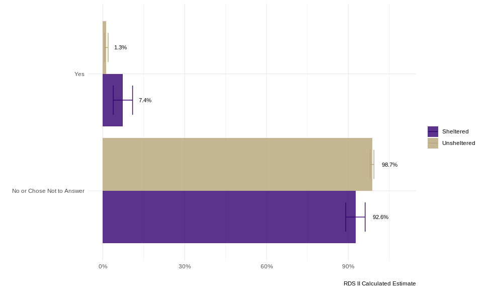

## *Disability Benefits*

*‘13. Are you receiving any of the following benefits? (Select all that
apply) - Selected Choice WA Aged, Blind, or Disabled cash assistance’
This variable is not included for UWRDS-PSD survey observations.*

<table class="table table-striped" style="margin-left: auto; margin-right: auto;">
<caption>
Sheltered
</caption>
<thead>
<tr>
<th style="text-align:left;">
Receiving Disability Benefits
</th>
<th style="text-align:right;">
Sample N
</th>
<th style="text-align:left;">
Sample Proportion
</th>
<th style="text-align:left;">
RDS II Estimate
</th>
<th style="text-align:left;">
RDS II 95% CI
</th>
</tr>
</thead>
<tbody>
<tr>
<td style="text-align:left;">
No or Chose Not to Answer
</td>
<td style="text-align:right;">
84
</td>
<td style="text-align:left;">
90.3%
</td>
<td style="text-align:left;">
95.4%
</td>
<td style="text-align:left;">
[91.4%, 99.4%]
</td>
</tr>
<tr>
<td style="text-align:left;">
Yes
</td>
<td style="text-align:right;">
9
</td>
<td style="text-align:left;">
9.7%
</td>
<td style="text-align:left;">
4.6%
</td>
<td style="text-align:left;">
[0.6%, 8.6%]
</td>
</tr>
<tr>
<td style="text-align:left;">
Total
</td>
<td style="text-align:right;">
93
</td>
<td style="text-align:left;">

-   </td>
    <td style="text-align:left;">

    -   </td>
        <td style="text-align:left;">

        -   </td>
            </tr>
            </tbody>
            </table>
            <table class="table table-striped" style="margin-left: auto; margin-right: auto;">
            <caption>
            Unsheltered
            </caption>
            <thead>
            <tr>
            <th style="text-align:left;">
            Receiving Disability Benefits
            </th>
            <th style="text-align:right;">
            Sample N
            </th>
            <th style="text-align:left;">
            Sample Proportion
            </th>
            <th style="text-align:left;">
            RDS II Estimate
            </th>
            <th style="text-align:left;">
            RDS II 95% CI
            </th>
            </tr>
            </thead>
            <tbody>
            <tr>
            <td style="text-align:left;">
            No or Chose Not to Answer
            </td>
            <td style="text-align:right;">
            540
            </td>
            <td style="text-align:left;">
            92.2%
            </td>
            <td style="text-align:left;">
            91.8%
            </td>
            <td style="text-align:left;">
            [87.8%, 95.8%]
            </td>
            </tr>
            <tr>
            <td style="text-align:left;">
            Yes
            </td>
            <td style="text-align:right;">
            46
            </td>
            <td style="text-align:left;">
            7.8%
            </td>
            <td style="text-align:left;">
            8.2%
            </td>
            <td style="text-align:left;">
            [4.2%, 12.2%]
            </td>
            </tr>
            <tr>
            <td style="text-align:left;">
            Total
            </td>
            <td style="text-align:right;">
            586
            </td>
            <td style="text-align:left;">

            -   </td>
                <td style="text-align:left;">

                -   </td>
                    <td style="text-align:left;">

                    -   </td>
                        </tr>
                        </tbody>
                        </table>
                        

*The difference between individual sheltered and unsheltered is not
significant, *χ*2 = 1.6, (p = 0.417). These results were
calculated based on the mean of 1000 bootstrapped tests. This value was
calculated with replacement.*

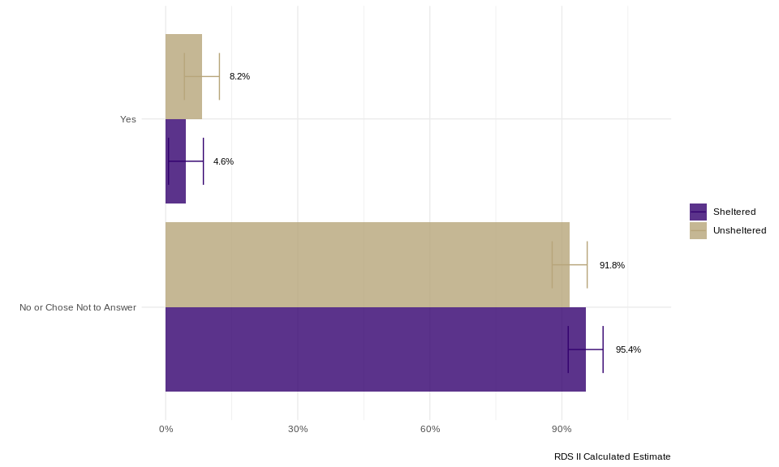

## *Housing Benefits*

*‘13. Are you receiving any of the following benefits? (Select all that
apply) - Selected Choice: ’WA Housing and Essential Needs program’ -
Imputed with text response.’ This variable is not included for UWRDS-PSD
survey observations.*

<table class="table table-striped" style="margin-left: auto; margin-right: auto;">
<caption>
Sheltered
</caption>
<thead>
<tr>
<th style="text-align:left;">
Receiving Housing Benefits
</th>
<th style="text-align:right;">
Sample N
</th>
<th style="text-align:left;">
Sample Proportion
</th>
<th style="text-align:left;">
RDS II Estimate
</th>
<th style="text-align:left;">
RDS II 95% CI
</th>
</tr>
</thead>
<tbody>
<tr>
<td style="text-align:left;">
No or Chose Not to Answer
</td>
<td style="text-align:right;">
89
</td>
<td style="text-align:left;">
95.70%
</td>
<td style="text-align:left;">
98.4%
</td>
<td style="text-align:left;">
[97.3%, 99.6%]
</td>
</tr>
<tr>
<td style="text-align:left;">
Yes
</td>
<td style="text-align:right;">
4
</td>
<td style="text-align:left;">
4.30%
</td>
<td style="text-align:left;">
1.6%
</td>
<td style="text-align:left;">
[0.4%, 2.7%]
</td>
</tr>
<tr>
<td style="text-align:left;">
Total
</td>
<td style="text-align:right;">
93
</td>
<td style="text-align:left;">

-   </td>
    <td style="text-align:left;">

    -   </td>
        <td style="text-align:left;">

        -   </td>
            </tr>
            </tbody>
            </table>
            <table class="table table-striped" style="margin-left: auto; margin-right: auto;">
            <caption>
            Unsheltered
            </caption>
            <thead>
            <tr>
            <th style="text-align:left;">
            Receiving Housing Benefits
            </th>
            <th style="text-align:right;">
            Sample N
            </th>
            <th style="text-align:left;">
            Sample Proportion
            </th>
            <th style="text-align:left;">
            RDS II Estimate
            </th>
            <th style="text-align:left;">
            RDS II 95% CI
            </th>
            </tr>
            </thead>
            <tbody>
            <tr>
            <td style="text-align:left;">
            No or Chose Not to Answer
            </td>
            <td style="text-align:right;">
            565
            </td>
            <td style="text-align:left;">
            96.42%
            </td>
            <td style="text-align:left;">
            97.1%
            </td>
            <td style="text-align:left;">
            [95.9%, 98.4%]
            </td>
            </tr>
            <tr>
            <td style="text-align:left;">
            Yes
            </td>
            <td style="text-align:right;">
            21
            </td>
            <td style="text-align:left;">
            3.58%
            </td>
            <td style="text-align:left;">
            2.9%
            </td>
            <td style="text-align:left;">
            [1.6%, 4.1%]
            </td>
            </tr>
            <tr>
            <td style="text-align:left;">
            Total
            </td>
            <td style="text-align:right;">
            586
            </td>
            <td style="text-align:left;">

            -   </td>
                <td style="text-align:left;">

                -   </td>
                    <td style="text-align:left;">

                    -   </td>
                        </tr>
                        </tbody>
                        </table>
                        

*The difference between individual sheltered and unsheltered is not
significant, *χ*2 = 0.57, (p = 0.781). These results were
calculated based on the mean of 1000 bootstrapped tests. This value was
calculated with replacement.*

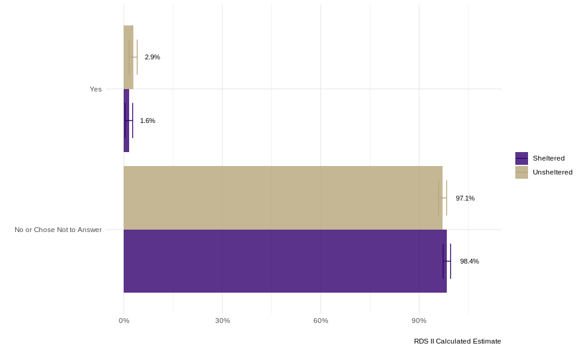

## *SSI Benefits*

*‘13. Are you receiving any of the following benefits? (Select all that
apply) - Selected Choice: ’Federal Supplemental Security Income (SSI),
Social Security Disability Insurance (SSDI), or other social security
benefit’ - Imputed with text response.’ This variable is not included
for UWRDS-PSD survey observations.*

<table class="table table-striped" style="margin-left: auto; margin-right: auto;">
<caption>
Sheltered
</caption>
<thead>
<tr>
<th style="text-align:left;">
Receiving SSI Benefits
</th>
<th style="text-align:right;">
Sample N
</th>
<th style="text-align:left;">
Sample Proportion
</th>
<th style="text-align:left;">
RDS II Estimate
</th>
<th style="text-align:left;">
RDS II 95% CI
</th>
</tr>
</thead>
<tbody>
<tr>
<td style="text-align:left;">
No or Chose Not to Answer
</td>
<td style="text-align:right;">
71
</td>
<td style="text-align:left;">
76.3%
</td>
<td style="text-align:left;">
81.8%
</td>
<td style="text-align:left;">
[67.4%, 96.1%]
</td>
</tr>
<tr>
<td style="text-align:left;">
Yes
</td>
<td style="text-align:right;">
22
</td>
<td style="text-align:left;">
23.7%
</td>
<td style="text-align:left;">
18.2%
</td>
<td style="text-align:left;">
[3.9%, 32.6%]
</td>
</tr>
<tr>
<td style="text-align:left;">
Total
</td>
<td style="text-align:right;">
93
</td>
<td style="text-align:left;">

-   </td>
    <td style="text-align:left;">

    -   </td>
        <td style="text-align:left;">

        -   </td>
            </tr>
            </tbody>
            </table>
            <table class="table table-striped" style="margin-left: auto; margin-right: auto;">
            <caption>
            Unsheltered
            </caption>
            <thead>
            <tr>
            <th style="text-align:left;">
            Receiving SSI Benefits
            </th>
            <th style="text-align:right;">
            Sample N
            </th>
            <th style="text-align:left;">
            Sample Proportion
            </th>
            <th style="text-align:left;">
            RDS II Estimate
            </th>
            <th style="text-align:left;">
            RDS II 95% CI
            </th>
            </tr>
            </thead>
            <tbody>
            <tr>
            <td style="text-align:left;">
            No or Chose Not to Answer
            </td>
            <td style="text-align:right;">
            491
            </td>
            <td style="text-align:left;">
            83.8%
            </td>
            <td style="text-align:left;">
            84.1%
            </td>
            <td style="text-align:left;">
            [78.8%, 89.3%]
            </td>
            </tr>
            <tr>
            <td style="text-align:left;">
            Yes
            </td>
            <td style="text-align:right;">
            95
            </td>
            <td style="text-align:left;">
            16.2%
            </td>
            <td style="text-align:left;">
            15.9%
            </td>
            <td style="text-align:left;">
            [10.6%, 21.2%]
            </td>
            </tr>
            <tr>
            <td style="text-align:left;">
            Total
            </td>
            <td style="text-align:right;">
            586
            </td>
            <td style="text-align:left;">

            -   </td>
                <td style="text-align:left;">

                -   </td>
                    <td style="text-align:left;">

                    -   </td>
                        </tr>
                        </tbody>
                        </table>
                        

*The difference between individual sheltered and unsheltered is not
significant, *χ*2 = 0.34, (p = 0.548). These results were
calculated based on the mean of 1000 bootstrapped tests. This value was
calculated with replacement.*

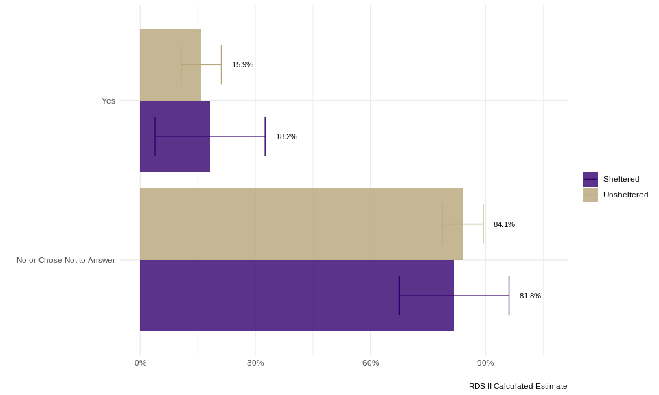

## *Medicaid Benefits*

*‘13. Are you receiving any of the following benefits? (Select all that
apply) - Selected Choice: ’Medicaid (in Washington state, this is Apple
Health)’ - Imputed with text response.’ This variable is not included
for UWRDS-PSD survey observations.*

<table class="table table-striped" style="margin-left: auto; margin-right: auto;">
<caption>
Sheltered
</caption>
<thead>
<tr>
<th style="text-align:left;">
Receiving Medicaid Benefits
</th>
<th style="text-align:right;">
Sample N
</th>
<th style="text-align:left;">
Sample Proportion
</th>
<th style="text-align:left;">
RDS II Estimate
</th>
<th style="text-align:left;">
RDS II 95% CI
</th>
</tr>
</thead>
<tbody>
<tr>
<td style="text-align:left;">
No or Chose Not to Answer
</td>
<td style="text-align:right;">
44
</td>
<td style="text-align:left;">
47.3%
</td>
<td style="text-align:left;">
48.2%
</td>
<td style="text-align:left;">
[28.6%, 67.9%]
</td>
</tr>
<tr>
<td style="text-align:left;">
Yes
</td>
<td style="text-align:right;">
49
</td>
<td style="text-align:left;">
52.7%
</td>
<td style="text-align:left;">
51.8%
</td>
<td style="text-align:left;">
[32.1%, 71.4%]
</td>
</tr>
<tr>
<td style="text-align:left;">
Total
</td>
<td style="text-align:right;">
93
</td>
<td style="text-align:left;">

-   </td>
    <td style="text-align:left;">

    -   </td>
        <td style="text-align:left;">

        -   </td>
            </tr>
            </tbody>
            </table>
            <table class="table table-striped" style="margin-left: auto; margin-right: auto;">
            <caption>
            Unsheltered
            </caption>
            <thead>
            <tr>
            <th style="text-align:left;">
            Receiving Medicaid Benefits
            </th>
            <th style="text-align:right;">
            Sample N
            </th>
            <th style="text-align:left;">
            Sample Proportion
            </th>
            <th style="text-align:left;">
            RDS II Estimate
            </th>
            <th style="text-align:left;">
            RDS II 95% CI
            </th>
            </tr>
            </thead>
            <tbody>
            <tr>
            <td style="text-align:left;">
            No or Chose Not to Answer
            </td>
            <td style="text-align:right;">
            269
            </td>
            <td style="text-align:left;">
            45.9%
            </td>
            <td style="text-align:left;">
            50.6%
            </td>
            <td style="text-align:left;">
            [42.7%, 58.5%]
            </td>
            </tr>
            <tr>
            <td style="text-align:left;">
            Yes
            </td>
            <td style="text-align:right;">
            317
            </td>
            <td style="text-align:left;">
            54.1%
            </td>
            <td style="text-align:left;">
            49.4%
            </td>
            <td style="text-align:left;">
            [41.5%, 57.3%]
            </td>
            </tr>
            <tr>
            <td style="text-align:left;">
            Total
            </td>
            <td style="text-align:right;">
            586
            </td>
            <td style="text-align:left;">

            -   </td>
                <td style="text-align:left;">

                -   </td>
                    <td style="text-align:left;">

                    -   </td>
                        </tr>
                        </tbody>
                        </table>
                        

*The difference between individual sheltered and unsheltered is not
significant, *χ*2 = 0.19, (p = 0.684). These results were
calculated based on the mean of 1000 bootstrapped tests. This value was
calculated with replacement.*

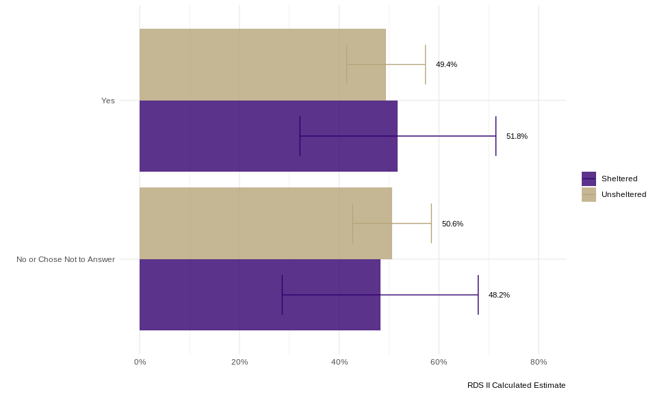

## *Medicare Benefits*

*‘13. Are you receiving any of the following benefits? (Select all that
apply) - Selected Choice Medicare’ This variable is not included for
UWRDS-PSD survey observations.*

<table class="table table-striped" style="margin-left: auto; margin-right: auto;">
<caption>
Sheltered
</caption>
<thead>
<tr>
<th style="text-align:left;">
Receiving Medicare Benefits
</th>
<th style="text-align:right;">
Sample N
</th>
<th style="text-align:left;">
Sample Proportion
</th>
<th style="text-align:left;">
RDS II Estimate
</th>
<th style="text-align:left;">
RDS II 95% CI
</th>
</tr>
</thead>
<tbody>
<tr>
<td style="text-align:left;">
No or Chose Not to Answer
</td>
<td style="text-align:right;">
81
</td>
<td style="text-align:left;">
87.1%
</td>
<td style="text-align:left;">
92%
</td>
<td style="text-align:left;">
[86.9%, 97.2%]
</td>
</tr>
<tr>
<td style="text-align:left;">
Yes
</td>
<td style="text-align:right;">
12
</td>
<td style="text-align:left;">
12.9%
</td>
<td style="text-align:left;">
8%
</td>
<td style="text-align:left;">
[2.8%, 13.1%]
</td>
</tr>
<tr>
<td style="text-align:left;">
Total
</td>
<td style="text-align:right;">
93
</td>
<td style="text-align:left;">

-   </td>
    <td style="text-align:left;">

    -   </td>
        <td style="text-align:left;">

        -   </td>
            </tr>
            </tbody>
            </table>
            <table class="table table-striped" style="margin-left: auto; margin-right: auto;">
            <caption>
            Unsheltered
            </caption>
            <thead>
            <tr>
            <th style="text-align:left;">
            Receiving Medicare Benefits
            </th>
            <th style="text-align:right;">
            Sample N
            </th>
            <th style="text-align:left;">
            Sample Proportion
            </th>
            <th style="text-align:left;">
            RDS II Estimate
            </th>
            <th style="text-align:left;">
            RDS II 95% CI
            </th>
            </tr>
            </thead>
            <tbody>
            <tr>
            <td style="text-align:left;">
            No or Chose Not to Answer
            </td>
            <td style="text-align:right;">
            519
            </td>
            <td style="text-align:left;">
            88.6%
            </td>
            <td style="text-align:left;">
            88%
            </td>
            <td style="text-align:left;">
            [84.4%, 91.6%]
            </td>
            </tr>
            <tr>
            <td style="text-align:left;">
            Yes
            </td>
            <td style="text-align:right;">
            67
            </td>
            <td style="text-align:left;">
            11.4%
            </td>
            <td style="text-align:left;">
            12%
            </td>
            <td style="text-align:left;">
            [8.4%, 15.6%]
            </td>
            </tr>
            <tr>
            <td style="text-align:left;">
            Total
            </td>
            <td style="text-align:right;">
            586
            </td>
            <td style="text-align:left;">

            -   </td>
                <td style="text-align:left;">

                -   </td>
                    <td style="text-align:left;">

                    -   </td>
                        </tr>
                        </tbody>
                        </table>
                        

*The difference between individual sheltered and unsheltered is not
significant, *χ*2 = 1.38, (p = 0.516). These results were
calculated based on the mean of 1000 bootstrapped tests. This value was
calculated with replacement.*

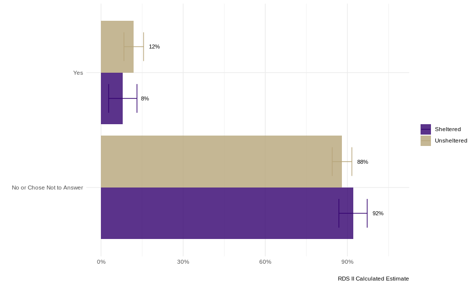

## *Indian Health Service Benefits*

*‘13. Are you receiving any of the following benefits? (Select all that
apply) - Selected Choice: ’Indian Health Services’ - Imputed with text
response.’ This variable is not included for UWRDS-PSD survey
observations.*

<table class="table table-striped" style="margin-left: auto; margin-right: auto;">
<caption>
Sheltered
</caption>
<thead>
<tr>
<th style="text-align:left;">
Receiving IHS Benefits
</th>
<th style="text-align:right;">
Sample N
</th>
<th style="text-align:left;">
Sample Proportion
</th>
<th style="text-align:left;">
RDS II Estimate
</th>
<th style="text-align:left;">
RDS II 95% CI
</th>
</tr>
</thead>
<tbody>
<tr>
<td style="text-align:left;">
No or Chose Not to Answer
</td>
<td style="text-align:right;">
91
</td>
<td style="text-align:left;">
97.85%
</td>
<td style="text-align:left;">
98.55%
</td>
<td style="text-align:left;">
[97.20%, 99.91%]
</td>
</tr>
<tr>
<td style="text-align:left;">
Yes
</td>
<td style="text-align:right;">
2
</td>
<td style="text-align:left;">
2.15%
</td>
<td style="text-align:left;">
1.45%
</td>
<td style="text-align:left;">
[0.09%, 2.80%]
</td>
</tr>
<tr>
<td style="text-align:left;">
Total
</td>
<td style="text-align:right;">
93
</td>
<td style="text-align:left;">

-   </td>
    <td style="text-align:left;">

    -   </td>
        <td style="text-align:left;">

        -   </td>
            </tr>
            </tbody>
            </table>
            <table class="table table-striped" style="margin-left: auto; margin-right: auto;">
            <caption>
            Unsheltered
            </caption>
            <thead>
            <tr>
            <th style="text-align:left;">
            Receiving IHS Benefits
            </th>
            <th style="text-align:right;">
            Sample N
            </th>
            <th style="text-align:left;">
            Sample Proportion
            </th>
            <th style="text-align:left;">
            RDS II Estimate
            </th>
            <th style="text-align:left;">
            RDS II 95% CI
            </th>
            </tr>
            </thead>
            <tbody>
            <tr>
            <td style="text-align:left;">
            No or Chose Not to Answer
            </td>
            <td style="text-align:right;">
            574
            </td>
            <td style="text-align:left;">
            97.95%
            </td>
            <td style="text-align:left;">
            98.87%
            </td>
            <td style="text-align:left;">
            [98.17%, 99.58%]
            </td>
            </tr>
            <tr>
            <td style="text-align:left;">
            Yes
            </td>
            <td style="text-align:right;">
            12
            </td>
            <td style="text-align:left;">
            2.05%
            </td>
            <td style="text-align:left;">
            1.13%
            </td>
            <td style="text-align:left;">
            [0.42%, 1.83%]
            </td>
            </tr>
            <tr>
            <td style="text-align:left;">
            Total
            </td>
            <td style="text-align:right;">
            586
            </td>
            <td style="text-align:left;">

            -   </td>
                <td style="text-align:left;">

                -   </td>
                    <td style="text-align:left;">

                    -   </td>
                        </tr>
                        </tbody>
                        </table>
                        

*The difference between individual sheltered and unsheltered is not
significant, *χ*2 = 0.07, (p = 0.84). These results were
calculated based on the mean of 1000 bootstrapped tests. This value was
calculated with replacement.*

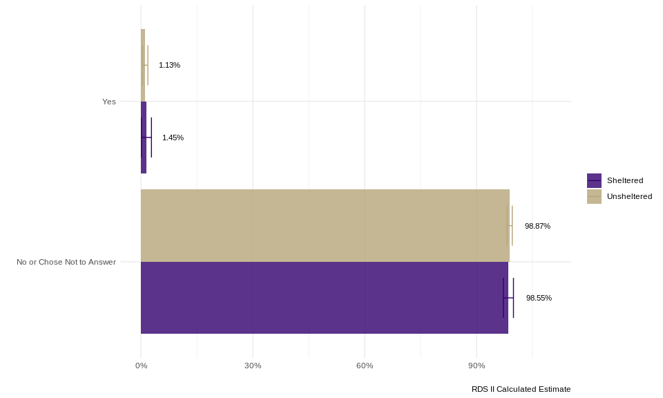

## *Other Benefits*

*‘13. Are you receiving any of the following benefits? - Other -
Imputed’ This variable is not included for UWRDS-PSD survey
observations.*

<table class="table table-striped" style="margin-left: auto; margin-right: auto;">
<caption>
Sheltered
</caption>
<thead>
<tr>
<th style="text-align:left;">
Receiving Other Benefits
</th>
<th style="text-align:right;">
Sample N
</th>
<th style="text-align:left;">
Sample Proportion
</th>
<th style="text-align:left;">
RDS II Estimate
</th>
<th style="text-align:left;">
RDS II 95% CI
</th>
</tr>
</thead>
<tbody>
<tr>
<td style="text-align:left;">
No or Chose Not to Answer
</td>
<td style="text-align:right;">
58
</td>
<td style="text-align:left;">
62.4%
</td>
<td style="text-align:left;">
65.8%
</td>
<td style="text-align:left;">
[44.9%, 86.7%]
</td>
</tr>
<tr>
<td style="text-align:left;">
Yes
</td>
<td style="text-align:right;">
35
</td>
<td style="text-align:left;">
37.6%
</td>
<td style="text-align:left;">
34.2%
</td>
<td style="text-align:left;">
[13.3%, 55.1%]
</td>
</tr>
<tr>
<td style="text-align:left;">
Total
</td>
<td style="text-align:right;">
93
</td>
<td style="text-align:left;">

-   </td>
    <td style="text-align:left;">

    -   </td>
        <td style="text-align:left;">

        -   </td>
            </tr>
            </tbody>
            </table>
            <table class="table table-striped" style="margin-left: auto; margin-right: auto;">
            <caption>
            Unsheltered
            </caption>
            <thead>
            <tr>
            <th style="text-align:left;">
            Receiving Other Benefits
            </th>
            <th style="text-align:right;">
            Sample N
            </th>
            <th style="text-align:left;">
            Sample Proportion
            </th>
            <th style="text-align:left;">
            RDS II Estimate
            </th>
            <th style="text-align:left;">
            RDS II 95% CI
            </th>
            </tr>
            </thead>
            <tbody>
            <tr>
            <td style="text-align:left;">
            No or Chose Not to Answer
            </td>
            <td style="text-align:right;">
            262
            </td>
            <td style="text-align:left;">
            44.7%
            </td>
            <td style="text-align:left;">
            45.1%
            </td>
            <td style="text-align:left;">
            [37.4%, 52.8%]
            </td>
            </tr>
            <tr>
            <td style="text-align:left;">
            Yes
            </td>
            <td style="text-align:right;">
            324
            </td>
            <td style="text-align:left;">
            55.3%
            </td>
            <td style="text-align:left;">
            54.9%
            </td>
            <td style="text-align:left;">
            [47.2%, 62.6%]
            </td>
            </tr>
            <tr>
            <td style="text-align:left;">
            Total
            </td>
            <td style="text-align:right;">
            586
            </td>
            <td style="text-align:left;">

            -   </td>
                <td style="text-align:left;">

                -   </td>
                    <td style="text-align:left;">

                    -   </td>
                        </tr>
                        </tbody>
                        </table>
                        

*The difference between individual sheltered and unsheltered is not
significant, *χ*2 = 14.73, (p = 0.283). These results were
calculated based on the mean of 1000 bootstrapped tests. This value was
calculated with replacement.*

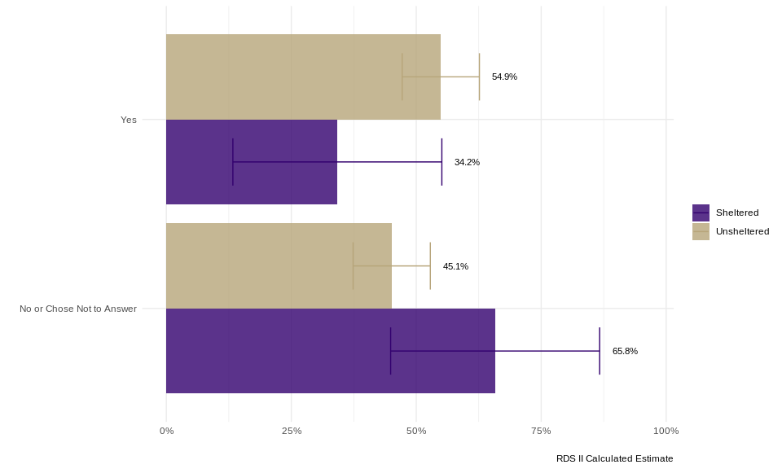
