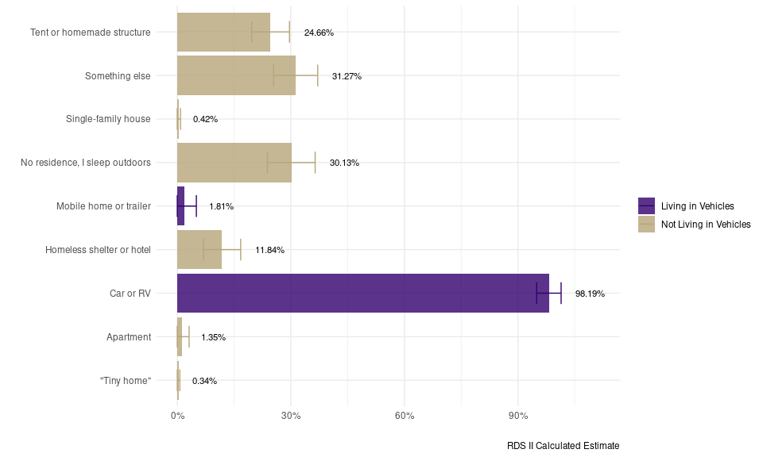

# Overview

This codebook summarizes findings and data about Vehicle-Living Status
for Living in Vehicles and Not Living in Vehicles based on data from the
University of Washington (UW) 2023 Seattle area homeless count project.
The count was led by Zack W. Almquist (*Lead - PI*), Paul Hebert
(*Co-PI*), Nathalie Williams (*Puget Sound Data Oversample PI*), Amy
Hagopian (*Co-PI*), June (Junhe) Yang (*Data Scientist Lead DSSG PhD*).

The data were collected using two different surveys, referred to as
**UWRDS** and **UWRDS-PSD** in the codebook. Data from both surveys were
harmonized for this codebook. We note where question phrasing differed
across surveys and when a variable was collected in only one survey.

An HTML version of this anaylsis may be downloaded [here](assets/vehicles_codebook_html.html). 

This codebook and corresponding links were compiled by Data Science for
Social Good (DSSG) summer fellows, in alphabetical order:  
- Felix Junior Appiah Kubi,  
- Brooke Kaye,  
- Jess Robinson, and  
- Rebecca Schachtman,  
with the support of Data Scientist, June (Junhe) Yang, and Project Lead,
Zack Almquist.

We employ RDS methods for the population level statistics (details,
[here](https://uwescience.github.io/DSSG2024_understanding_homelessness/method1/)).
For information on funding and a full list of contributors, see
[Acknowledgements](https://uwescience.github.io/DSSG2024_understanding_homelessness/acknowledgements/).

# Summary

<table class="table table-striped" style="color: black; margin-left: auto; margin-right: auto;">
<thead>
<tr>
<th style="text-align:left;">
Vehicle-Living Status
</th>
<th style="text-align:right;">
Sample N
</th>
<th style="text-align:left;">
Sample Proportion
</th>
<th style="text-align:left;">
RDS II Estimate
</th>
<th style="text-align:left;">
RDS II 95% CI
</th>
</tr>
</thead>
<tbody>
<tr>
<td style="text-align:left;">
Living in Vehicles
</td>
<td style="text-align:right;">
161
</td>
<td style="text-align:left;">
15%
</td>
<td style="text-align:left;">
13%
</td>
<td style="text-align:left;">
[10%, 17%]
</td>
</tr>
<tr>
<td style="text-align:left;">
Not Living in Vehicles
</td>
<td style="text-align:right;">
936
</td>
<td style="text-align:left;">
85%
</td>
<td style="text-align:left;">
87%
</td>
<td style="text-align:left;">
[83%, 90%]
</td>
</tr>
<tr>
<td style="text-align:left;">
Total
</td>
<td style="text-align:right;">
1097
</td>
<td style="text-align:left;">
100%
</td>
<td style="text-align:left;">
100%
</td>
<td style="text-align:left;">

-   </td>
    </tr>
    </tbody>
    </table>
    

The proportion of the population experiencing homeless who are Living in
Vehicles is 13%. The proportion of the population experiencing homeless
who are Not Living in Vehicles is 87%.

# Demographics

## *Gender*

*Imputed based on ‘B4. How would you describe your gender?’
[UWRDS-PSD] and ‘25. Which of the following best describes your
gender?’ [UWRDS]*

<table class="table table-striped" style="color: black; margin-left: auto; margin-right: auto;">
<caption>
Living in Vehicles
</caption>
<thead>
<tr>
<th style="text-align:left;">
Gender
</th>
<th style="text-align:right;">
Sample N
</th>
<th style="text-align:left;">
Sample Proportion
</th>
<th style="text-align:left;">
RDS II Estimate
</th>
<th style="text-align:left;">
RDS II 95% CI
</th>
</tr>
</thead>
<tbody>
<tr>
<td style="text-align:left;">
A gender other than singularly female or male (e.g., nonbinary,
genderfluid, agender, culturally specific gender)
</td>
<td style="text-align:right;">
2
</td>
<td style="text-align:left;">
1.33%
</td>
<td style="text-align:left;">
1.62%
</td>
<td style="text-align:left;">
[0.91%, 2.32%]
</td>
</tr>
<tr>
<td style="text-align:left;">
Do not know
</td>
<td style="text-align:right;">
0
</td>
<td style="text-align:left;">
NA
</td>
<td style="text-align:left;">
NA
</td>
<td style="text-align:left;">
NA
</td>
</tr>
<tr>
<td style="text-align:left;">
Female
</td>
<td style="text-align:right;">
59
</td>
<td style="text-align:left;">
39.33%
</td>
<td style="text-align:left;">
39.21%
</td>
<td style="text-align:left;">
[24.10%, 54.32%]
</td>
</tr>
<tr>
<td style="text-align:left;">
Male
</td>
<td style="text-align:right;">
89
</td>
<td style="text-align:left;">
59.33%
</td>
<td style="text-align:left;">
59.18%
</td>
<td style="text-align:left;">
[43.97%, 74.38%]
</td>
</tr>
<tr>
<td style="text-align:left;">
Questioning
</td>
<td style="text-align:right;">
0
</td>
<td style="text-align:left;">
NA
</td>
<td style="text-align:left;">
NA
</td>
<td style="text-align:left;">
NA
</td>
</tr>
<tr>
<td style="text-align:left;">
Transgender
</td>
<td style="text-align:right;">
0
</td>
<td style="text-align:left;">
NA
</td>
<td style="text-align:left;">
NA
</td>
<td style="text-align:left;">
NA
</td>
</tr>
<tr>
<td style="text-align:left;">
Total
</td>
<td style="text-align:right;">
150
</td>
<td style="text-align:left;">

-   </td>
    <td style="text-align:left;">

    -   </td>
        <td style="text-align:left;">

        -   </td>
            </tr>
            </tbody>
            </table>
            <table class="table table-striped" style="color: black; margin-left: auto; margin-right: auto;">
            <caption>
            Not Living in Vehicles
            </caption>
            <thead>
            <tr>
            <th style="text-align:left;">
            Gender
            </th>
            <th style="text-align:right;">
            Sample N
            </th>
            <th style="text-align:left;">
            Sample Proportion
            </th>
            <th style="text-align:left;">
            RDS II Estimate
            </th>
            <th style="text-align:left;">
            RDS II 95% CI
            </th>
            </tr>
            </thead>
            <tbody>
            <tr>
            <td style="text-align:left;">
            A gender other than singularly female or male (e.g.,
            nonbinary, genderfluid, agender, culturally specific gender)
            </td>
            <td style="text-align:right;">
            8
            </td>
            <td style="text-align:left;">
            0.93%
            </td>
            <td style="text-align:left;">
            1.22%
            </td>
            <td style="text-align:left;">
            [0.29%, 2.14%]
            </td>
            </tr>
            <tr>
            <td style="text-align:left;">
            Do not know
            </td>
            <td style="text-align:right;">
            1
            </td>
            <td style="text-align:left;">
            0.12%
            </td>
            <td style="text-align:left;">
            0.15%
            </td>
            <td style="text-align:left;">
            [-0.08%, 0.38%]
            </td>
            </tr>
            <tr>
            <td style="text-align:left;">
            Female
            </td>
            <td style="text-align:right;">
            218
            </td>
            <td style="text-align:left;">
            25.26%
            </td>
            <td style="text-align:left;">
            24.55%
            </td>
            <td style="text-align:left;">
            [18.31%, 30.80%]
            </td>
            </tr>
            <tr>
            <td style="text-align:left;">
            Male
            </td>
            <td style="text-align:right;">
            628
            </td>
            <td style="text-align:left;">
            72.77%
            </td>
            <td style="text-align:left;">
            73.21%
            </td>
            <td style="text-align:left;">
            [66.97%, 79.44%]
            </td>
            </tr>
            <tr>
            <td style="text-align:left;">
            Questioning
            </td>
            <td style="text-align:right;">
            5
            </td>
            <td style="text-align:left;">
            0.58%
            </td>
            <td style="text-align:left;">
            0.47%
            </td>
            <td style="text-align:left;">
            [0.34%, 0.60%]
            </td>
            </tr>
            <tr>
            <td style="text-align:left;">
            Transgender
            </td>
            <td style="text-align:right;">
            3
            </td>
            <td style="text-align:left;">
            0.35%
            </td>
            <td style="text-align:left;">
            0.40%
            </td>
            <td style="text-align:left;">
            [-0.10%, 0.91%]
            </td>
            </tr>
            <tr>
            <td style="text-align:left;">
            Total
            </td>
            <td style="text-align:right;">
            863
            </td>
            <td style="text-align:left;">

            -   </td>
                <td style="text-align:left;">

                -   </td>
                    <td style="text-align:left;">

                    -   </td>
                        </tr>
                        </tbody>
                        </table>
                        

*The difference between individual living in vehicles and not living in
vehicles is not significant, *χ*2 = 14.13, (p = 0.224). These
results were calculated based on the mean of 1000 bootstrapped tests. *

## *Race*

*Imputed based on ‘B18. Which one or more of the following would you say
best describes your race, heritage, or ancestry?’ [UWRDS-PSD] and ‘23.
Which racial groups do you identify with?’ [UWRDS]*

### *Race (Overall)*

<table class="table table-striped" style="color: black; margin-left: auto; margin-right: auto;">
<caption>
Living in Vehicles
</caption>
<thead>
<tr>
<th style="text-align:left;">
Race
</th>
<th style="text-align:right;">
Sample N
</th>
<th style="text-align:left;">
Sample Proportion
</th>
<th style="text-align:left;">
RDS II Estimate
</th>
<th style="text-align:left;">
RDS II 95% CI
</th>
</tr>
</thead>
<tbody>
<tr>
<td style="text-align:left;">
American Indian, Alaskan Native or Indigenous
</td>
<td style="text-align:right;">
6
</td>
<td style="text-align:left;">
4.32%
</td>
<td style="text-align:left;">
6.80%
</td>
<td style="text-align:left;">
[-6.07%, 19.670%]
</td>
</tr>
<tr>
<td style="text-align:left;">
Another race
</td>
<td style="text-align:right;">
2
</td>
<td style="text-align:left;">
1.44%
</td>
<td style="text-align:left;">
1.49%
</td>
<td style="text-align:left;">
[0.41%, 2.560%]
</td>
</tr>
<tr>
<td style="text-align:left;">
Asian or Asian American
</td>
<td style="text-align:right;">
3
</td>
<td style="text-align:left;">
2.16%
</td>
<td style="text-align:left;">
3.90%
</td>
<td style="text-align:left;">
[-7.92%, 15.710%]
</td>
</tr>
<tr>
<td style="text-align:left;">
Black, African American, or African
</td>
<td style="text-align:right;">
17
</td>
<td style="text-align:left;">
12.23%
</td>
<td style="text-align:left;">
8.98%
</td>
<td style="text-align:left;">
[2.70%, 15.270%]
</td>
</tr>
<tr>
<td style="text-align:left;">
Do not know
</td>
<td style="text-align:right;">
2
</td>
<td style="text-align:left;">
1.44%
</td>
<td style="text-align:left;">
1.01%
</td>
<td style="text-align:left;">
[0.44%, 1.580%]
</td>
</tr>
<tr>
<td style="text-align:left;">
Multiracial
</td>
<td style="text-align:right;">
25
</td>
<td style="text-align:left;">
17.99%
</td>
<td style="text-align:left;">
17.99%
</td>
<td style="text-align:left;">
[7.83%, 28.140%]
</td>
</tr>
<tr>
<td style="text-align:left;">
Native Hawaiian or Pacific Islander
</td>
<td style="text-align:right;">
0
</td>
<td style="text-align:left;">
NA
</td>
<td style="text-align:left;">
NA
</td>
<td style="text-align:left;">
NA
</td>
</tr>
<tr>
<td style="text-align:left;">
White
</td>
<td style="text-align:right;">
84
</td>
<td style="text-align:left;">
60.43%
</td>
<td style="text-align:left;">
59.83%
</td>
<td style="text-align:left;">
[43.23%, 76.440%]
</td>
</tr>
<tr>
<td style="text-align:left;">
Total
</td>
<td style="text-align:right;">
139
</td>
<td style="text-align:left;">

-   </td>
    <td style="text-align:left;">

    -   </td>
        <td style="text-align:left;">

        -   </td>
            </tr>
            </tbody>
            </table>
            <table class="table table-striped" style="color: black; margin-left: auto; margin-right: auto;">
            <caption>
            Not Living in Vehicles
            </caption>
            <thead>
            <tr>
            <th style="text-align:left;">
            Race
            </th>
            <th style="text-align:right;">
            Sample N
            </th>
            <th style="text-align:left;">
            Sample Proportion
            </th>
            <th style="text-align:left;">
            RDS II Estimate
            </th>
            <th style="text-align:left;">
            RDS II 95% CI
            </th>
            </tr>
            </thead>
            <tbody>
            <tr>
            <td style="text-align:left;">
            American Indian, Alaskan Native or Indigenous
            </td>
            <td style="text-align:right;">
            71
            </td>
            <td style="text-align:left;">
            8.57%
            </td>
            <td style="text-align:left;">
            9.23%
            </td>
            <td style="text-align:left;">
            [5.41%, 13.040%]
            </td>
            </tr>
            <tr>
            <td style="text-align:left;">
            Another race
            </td>
            <td style="text-align:right;">
            12
            </td>
            <td style="text-align:left;">
            1.45%
            </td>
            <td style="text-align:left;">
            2.28%
            </td>
            <td style="text-align:left;">
            [-0.03%, 4.590%]
            </td>
            </tr>
            <tr>
            <td style="text-align:left;">
            Asian or Asian American
            </td>
            <td style="text-align:right;">
            17
            </td>
            <td style="text-align:left;">
            2.05%
            </td>
            <td style="text-align:left;">
            2.57%
            </td>
            <td style="text-align:left;">
            [-0.11%, 5.240%]
            </td>
            </tr>
            <tr>
            <td style="text-align:left;">
            Black, African American, or African
            </td>
            <td style="text-align:right;">
            146
            </td>
            <td style="text-align:left;">
            17.63%
            </td>
            <td style="text-align:left;">
            20.07%
            </td>
            <td style="text-align:left;">
            [14.41%, 25.730%]
            </td>
            </tr>
            <tr>
            <td style="text-align:left;">
            Do not know
            </td>
            <td style="text-align:right;">
            15
            </td>
            <td style="text-align:left;">
            1.81%
            </td>
            <td style="text-align:left;">
            2.32%
            </td>
            <td style="text-align:left;">
            [-0.60%, 5.250%]
            </td>
            </tr>
            <tr>
            <td style="text-align:left;">
            Multiracial
            </td>
            <td style="text-align:right;">
            104
            </td>
            <td style="text-align:left;">
            12.56%
            </td>
            <td style="text-align:left;">
            12.74%
            </td>
            <td style="text-align:left;">
            [8.30%, 17.180%]
            </td>
            </tr>
            <tr>
            <td style="text-align:left;">
            Native Hawaiian or Pacific Islander
            </td>
            <td style="text-align:right;">
            24
            </td>
            <td style="text-align:left;">
            2.90%
            </td>
            <td style="text-align:left;">
            2.62%
            </td>
            <td style="text-align:left;">
            [0.87%, 4.380%]
            </td>
            </tr>
            <tr>
            <td style="text-align:left;">
            White
            </td>
            <td style="text-align:right;">
            439
            </td>
            <td style="text-align:left;">
            53.02%
            </td>
            <td style="text-align:left;">
            48.17%
            </td>
            <td style="text-align:left;">
            [41.58%, 54.760%]
            </td>
            </tr>
            <tr>
            <td style="text-align:left;">
            Total
            </td>
            <td style="text-align:right;">
            828
            </td>
            <td style="text-align:left;">

            -   </td>
                <td style="text-align:left;">

                -   </td>
                    <td style="text-align:left;">

                    -   </td>
                        </tr>
                        </tbody>
                        </table>
                        

*The difference between individual living in vehicles and not living in
vehicles is not significant, *χ*2 = 17.89, (p = 0.671). These
results were calculated based on the mean of 1000 bootstrapped tests.
This value was calculated with replacement.*

### *Race - Multiracial (Black)*

*Imputed racial category that classifies multiracial individuals as one
race with preference to Black based on ‘23. Which racial groups do you
identify with?’*

<table class="table table-striped" style="color: black; margin-left: auto; margin-right: auto;">
<caption>
Living in Vehicles
</caption>
<thead>
<tr>
<th style="text-align:left;">
Race
</th>
<th style="text-align:right;">
Sample N
</th>
<th style="text-align:left;">
Sample Proportion
</th>
<th style="text-align:left;">
RDS II Estimate
</th>
<th style="text-align:left;">
RDS II 95% CI
</th>
</tr>
</thead>
<tbody>
<tr>
<td style="text-align:left;">
American Indian, Alaskan Native or Indigenous
</td>
<td style="text-align:right;">
14
</td>
<td style="text-align:left;">
10.07%
</td>
<td style="text-align:left;">
13.13%
</td>
<td style="text-align:left;">
[-1.16%, 27.41%]
</td>
</tr>
<tr>
<td style="text-align:left;">
Another race
</td>
<td style="text-align:right;">
2
</td>
<td style="text-align:left;">
1.44%
</td>
<td style="text-align:left;">
1.49%
</td>
<td style="text-align:left;">
[0.41%, 2.56%]
</td>
</tr>
<tr>
<td style="text-align:left;">
Asian or Asian American
</td>
<td style="text-align:right;">
4
</td>
<td style="text-align:left;">
2.88%
</td>
<td style="text-align:left;">
4.32%
</td>
<td style="text-align:left;">
[-7.44%, 16.09%]
</td>
</tr>
<tr>
<td style="text-align:left;">
Black, African American, or African
</td>
<td style="text-align:right;">
31
</td>
<td style="text-align:left;">
22.30%
</td>
<td style="text-align:left;">
17.67%
</td>
<td style="text-align:left;">
[8.95%, 26.39%]
</td>
</tr>
<tr>
<td style="text-align:left;">
Do not know
</td>
<td style="text-align:right;">
2
</td>
<td style="text-align:left;">
1.44%
</td>
<td style="text-align:left;">
1.01%
</td>
<td style="text-align:left;">
[0.44%, 1.58%]
</td>
</tr>
<tr>
<td style="text-align:left;">
Native Hawaiian or Pacific Islander
</td>
<td style="text-align:right;">
1
</td>
<td style="text-align:left;">
0.72%
</td>
<td style="text-align:left;">
2.13%
</td>
<td style="text-align:left;">
[-2.44%, 6.69%]
</td>
</tr>
<tr>
<td style="text-align:left;">
White
</td>
<td style="text-align:right;">
85
</td>
<td style="text-align:left;">
61.15%
</td>
<td style="text-align:left;">
60.26%
</td>
<td style="text-align:left;">
[43.65%, 76.87%]
</td>
</tr>
<tr>
<td style="text-align:left;">
Total
</td>
<td style="text-align:right;">
139
</td>
<td style="text-align:left;">

-   </td>
    <td style="text-align:left;">

    -   </td>
        <td style="text-align:left;">

        -   </td>
            </tr>
            </tbody>
            </table>
            <table class="table table-striped" style="color: black; margin-left: auto; margin-right: auto;">
            <caption>
            Not Living in Vehicles
            </caption>
            <thead>
            <tr>
            <th style="text-align:left;">
            Race
            </th>
            <th style="text-align:right;">
            Sample N
            </th>
            <th style="text-align:left;">
            Sample Proportion
            </th>
            <th style="text-align:left;">
            RDS II Estimate
            </th>
            <th style="text-align:left;">
            RDS II 95% CI
            </th>
            </tr>
            </thead>
            <tbody>
            <tr>
            <td style="text-align:left;">
            American Indian, Alaskan Native or Indigenous
            </td>
            <td style="text-align:right;">
            122
            </td>
            <td style="text-align:left;">
            14.73%
            </td>
            <td style="text-align:left;">
            15.57%
            </td>
            <td style="text-align:left;">
            [10.76%, 20.38%]
            </td>
            </tr>
            <tr>
            <td style="text-align:left;">
            Another race
            </td>
            <td style="text-align:right;">
            12
            </td>
            <td style="text-align:left;">
            1.45%
            </td>
            <td style="text-align:left;">
            2.28%
            </td>
            <td style="text-align:left;">
            [-0.03%, 4.59%]
            </td>
            </tr>
            <tr>
            <td style="text-align:left;">
            Asian or Asian American
            </td>
            <td style="text-align:right;">
            21
            </td>
            <td style="text-align:left;">
            2.54%
            </td>
            <td style="text-align:left;">
            3.10%
            </td>
            <td style="text-align:left;">
            [0.36%, 5.84%]
            </td>
            </tr>
            <tr>
            <td style="text-align:left;">
            Black, African American, or African
            </td>
            <td style="text-align:right;">
            186
            </td>
            <td style="text-align:left;">
            22.46%
            </td>
            <td style="text-align:left;">
            24.53%
            </td>
            <td style="text-align:left;">
            [18.69%, 30.37%]
            </td>
            </tr>
            <tr>
            <td style="text-align:left;">
            Do not know
            </td>
            <td style="text-align:right;">
            15
            </td>
            <td style="text-align:left;">
            1.81%
            </td>
            <td style="text-align:left;">
            2.32%
            </td>
            <td style="text-align:left;">
            [-0.60%, 5.25%]
            </td>
            </tr>
            <tr>
            <td style="text-align:left;">
            Native Hawaiian or Pacific Islander
            </td>
            <td style="text-align:right;">
            31
            </td>
            <td style="text-align:left;">
            3.74%
            </td>
            <td style="text-align:left;">
            3.77%
            </td>
            <td style="text-align:left;">
            [0.85%, 6.69%]
            </td>
            </tr>
            <tr>
            <td style="text-align:left;">
            White
            </td>
            <td style="text-align:right;">
            441
            </td>
            <td style="text-align:left;">
            53.26%
            </td>
            <td style="text-align:left;">
            48.43%
            </td>
            <td style="text-align:left;">
            [41.83%, 55.03%]
            </td>
            </tr>
            <tr>
            <td style="text-align:left;">
            Total
            </td>
            <td style="text-align:right;">
            828
            </td>
            <td style="text-align:left;">

            -   </td>
                <td style="text-align:left;">

                -   </td>
                    <td style="text-align:left;">

                    -   </td>
                        </tr>
                        </tbody>
                        </table>
                        

*The difference between individual living in vehicles and not living in
vehicles is not significant, *χ*2 = 7.98, (p = 0.965). These
results were calculated based on the mean of 1000 bootstrapped tests.
This value was calculated with replacement.*

### *Race - Multiracial (Indigenous)*

*Imputed racial category that classifies multiracial individuals as one
race with preference to Indigenous based on ‘23. Which racial groups do
you identify with?’*

<table class="table table-striped" style="color: black; margin-left: auto; margin-right: auto;">
<caption>
Living in Vehicles
</caption>
<thead>
<tr>
<th style="text-align:left;">
Race (Indigeneous)
</th>
<th style="text-align:right;">
Sample N
</th>
<th style="text-align:left;">
Sample Proportion
</th>
<th style="text-align:left;">
RDS II Estimate
</th>
<th style="text-align:left;">
RDS II 95% CI
</th>
</tr>
</thead>
<tbody>
<tr>
<td style="text-align:left;">
American Indian, Alaskan Native or Indigenous
</td>
<td style="text-align:right;">
24
</td>
<td style="text-align:left;">
17.27%
</td>
<td style="text-align:left;">
18.45%
</td>
<td style="text-align:left;">
[4.37%, 32.53%]
</td>
</tr>
<tr>
<td style="text-align:left;">
Another race
</td>
<td style="text-align:right;">
2
</td>
<td style="text-align:left;">
1.44%
</td>
<td style="text-align:left;">
1.49%
</td>
<td style="text-align:left;">
[0.41%, 2.56%]
</td>
</tr>
<tr>
<td style="text-align:left;">
Asian or Asian American
</td>
<td style="text-align:right;">
4
</td>
<td style="text-align:left;">
2.88%
</td>
<td style="text-align:left;">
4.32%
</td>
<td style="text-align:left;">
[-7.44%, 16.09%]
</td>
</tr>
<tr>
<td style="text-align:left;">
Black, African American, or African
</td>
<td style="text-align:right;">
21
</td>
<td style="text-align:left;">
15.11%
</td>
<td style="text-align:left;">
12.35%
</td>
<td style="text-align:left;">
[4.94%, 19.76%]
</td>
</tr>
<tr>
<td style="text-align:left;">
Do not know
</td>
<td style="text-align:right;">
2
</td>
<td style="text-align:left;">
1.44%
</td>
<td style="text-align:left;">
1.01%
</td>
<td style="text-align:left;">
[0.44%, 1.58%]
</td>
</tr>
<tr>
<td style="text-align:left;">
Native Hawaiian or Pacific Islander
</td>
<td style="text-align:right;">
1
</td>
<td style="text-align:left;">
0.72%
</td>
<td style="text-align:left;">
2.13%
</td>
<td style="text-align:left;">
[-2.44%, 6.69%]
</td>
</tr>
<tr>
<td style="text-align:left;">
White
</td>
<td style="text-align:right;">
85
</td>
<td style="text-align:left;">
61.15%
</td>
<td style="text-align:left;">
60.26%
</td>
<td style="text-align:left;">
[43.65%, 76.87%]
</td>
</tr>
<tr>
<td style="text-align:left;">
Total
</td>
<td style="text-align:right;">
139
</td>
<td style="text-align:left;">

-   </td>
    <td style="text-align:left;">

    -   </td>
        <td style="text-align:left;">

        -   </td>
            </tr>
            </tbody>
            </table>
            <table class="table table-striped" style="color: black; margin-left: auto; margin-right: auto;">
            <caption>
            Not Living in Vehicles
            </caption>
            <thead>
            <tr>
            <th style="text-align:left;">
            Race (Indigeneous)
            </th>
            <th style="text-align:right;">
            Sample N
            </th>
            <th style="text-align:left;">
            Sample Proportion
            </th>
            <th style="text-align:left;">
            RDS II Estimate
            </th>
            <th style="text-align:left;">
            RDS II 95% CI
            </th>
            </tr>
            </thead>
            <tbody>
            <tr>
            <td style="text-align:left;">
            American Indian, Alaskan Native or Indigenous
            </td>
            <td style="text-align:right;">
            153
            </td>
            <td style="text-align:left;">
            18.48%
            </td>
            <td style="text-align:left;">
            19.10%
            </td>
            <td style="text-align:left;">
            [14.02%, 24.17%]
            </td>
            </tr>
            <tr>
            <td style="text-align:left;">
            Another race
            </td>
            <td style="text-align:right;">
            12
            </td>
            <td style="text-align:left;">
            1.45%
            </td>
            <td style="text-align:left;">
            2.28%
            </td>
            <td style="text-align:left;">
            [-0.03%, 4.59%]
            </td>
            </tr>
            <tr>
            <td style="text-align:left;">
            Asian or Asian American
            </td>
            <td style="text-align:right;">
            21
            </td>
            <td style="text-align:left;">
            2.54%
            </td>
            <td style="text-align:left;">
            3.10%
            </td>
            <td style="text-align:left;">
            [0.36%, 5.84%]
            </td>
            </tr>
            <tr>
            <td style="text-align:left;">
            Black, African American, or African
            </td>
            <td style="text-align:right;">
            155
            </td>
            <td style="text-align:left;">
            18.72%
            </td>
            <td style="text-align:left;">
            21.00%
            </td>
            <td style="text-align:left;">
            [15.31%, 26.69%]
            </td>
            </tr>
            <tr>
            <td style="text-align:left;">
            Do not know
            </td>
            <td style="text-align:right;">
            15
            </td>
            <td style="text-align:left;">
            1.81%
            </td>
            <td style="text-align:left;">
            2.32%
            </td>
            <td style="text-align:left;">
            [-0.60%, 5.25%]
            </td>
            </tr>
            <tr>
            <td style="text-align:left;">
            Native Hawaiian or Pacific Islander
            </td>
            <td style="text-align:right;">
            31
            </td>
            <td style="text-align:left;">
            3.74%
            </td>
            <td style="text-align:left;">
            3.77%
            </td>
            <td style="text-align:left;">
            [0.85%, 6.69%]
            </td>
            </tr>
            <tr>
            <td style="text-align:left;">
            White
            </td>
            <td style="text-align:right;">
            441
            </td>
            <td style="text-align:left;">
            53.26%
            </td>
            <td style="text-align:left;">
            48.43%
            </td>
            <td style="text-align:left;">
            [41.83%, 55.03%]
            </td>
            </tr>
            <tr>
            <td style="text-align:left;">
            Total
            </td>
            <td style="text-align:right;">
            828
            </td>
            <td style="text-align:left;">

            -   </td>
                <td style="text-align:left;">

                -   </td>
                    <td style="text-align:left;">

                    -   </td>
                        </tr>
                        </tbody>
                        </table>
                        

*The difference between individual living in vehicles and not living in
vehicles is not significant, *χ*2 = 9.47, (p = 0.927). These
results were calculated based on the mean of 1000 bootstrapped tests.
This value was calculated with replacement.*

### *Race - Multiracial (Native Hawaiian or Pacific Islander)*

*Imputed racial category that classifies multiracial individuals as one
race with preference to Native Hawaiian or Pacific Islander based on
‘23. Which racial groups do you identify with?’*

<table class="table table-striped" style="color: black; margin-left: auto; margin-right: auto;">
<caption>
Living in Vehicles
</caption>
<thead>
<tr>
<th style="text-align:left;">
Race (PI)
</th>
<th style="text-align:right;">
Sample N
</th>
<th style="text-align:left;">
Sample Proportion
</th>
<th style="text-align:left;">
RDS II Estimate
</th>
<th style="text-align:left;">
RDS II 95% CI
</th>
</tr>
</thead>
<tbody>
<tr>
<td style="text-align:left;">
American Indian, Alaskan Native or Indigenous
</td>
<td style="text-align:right;">
12
</td>
<td style="text-align:left;">
8.63%
</td>
<td style="text-align:left;">
10.86%
</td>
<td style="text-align:left;">
[-1.75%, 23.47%]
</td>
</tr>
<tr>
<td style="text-align:left;">
Another race
</td>
<td style="text-align:right;">
2
</td>
<td style="text-align:left;">
1.44%
</td>
<td style="text-align:left;">
1.49%
</td>
<td style="text-align:left;">
[0.41%, 2.56%]
</td>
</tr>
<tr>
<td style="text-align:left;">
Asian or Asian American
</td>
<td style="text-align:right;">
4
</td>
<td style="text-align:left;">
2.88%
</td>
<td style="text-align:left;">
4.32%
</td>
<td style="text-align:left;">
[-7.44%, 16.09%]
</td>
</tr>
<tr>
<td style="text-align:left;">
Black, African American, or African
</td>
<td style="text-align:right;">
26
</td>
<td style="text-align:left;">
18.71%
</td>
<td style="text-align:left;">
14.24%
</td>
<td style="text-align:left;">
[6.96%, 21.53%]
</td>
</tr>
<tr>
<td style="text-align:left;">
Do not know
</td>
<td style="text-align:right;">
2
</td>
<td style="text-align:left;">
1.44%
</td>
<td style="text-align:left;">
1.01%
</td>
<td style="text-align:left;">
[0.44%, 1.58%]
</td>
</tr>
<tr>
<td style="text-align:left;">
Native Hawaiian or Pacific Islander
</td>
<td style="text-align:right;">
8
</td>
<td style="text-align:left;">
5.76%
</td>
<td style="text-align:left;">
7.82%
</td>
<td style="text-align:left;">
[-1.61%, 17.24%]
</td>
</tr>
<tr>
<td style="text-align:left;">
White
</td>
<td style="text-align:right;">
85
</td>
<td style="text-align:left;">
61.15%
</td>
<td style="text-align:left;">
60.26%
</td>
<td style="text-align:left;">
[43.65%, 76.87%]
</td>
</tr>
<tr>
<td style="text-align:left;">
Total
</td>
<td style="text-align:right;">
139
</td>
<td style="text-align:left;">

-   </td>
    <td style="text-align:left;">

    -   </td>
        <td style="text-align:left;">

        -   </td>
            </tr>
            </tbody>
            </table>
            <table class="table table-striped" style="color: black; margin-left: auto; margin-right: auto;">
            <caption>
            Not Living in Vehicles
            </caption>
            <thead>
            <tr>
            <th style="text-align:left;">
            Race (PI)
            </th>
            <th style="text-align:right;">
            Sample N
            </th>
            <th style="text-align:left;">
            Sample Proportion
            </th>
            <th style="text-align:left;">
            RDS II Estimate
            </th>
            <th style="text-align:left;">
            RDS II 95% CI
            </th>
            </tr>
            </thead>
            <tbody>
            <tr>
            <td style="text-align:left;">
            American Indian, Alaskan Native or Indigenous
            </td>
            <td style="text-align:right;">
            117
            </td>
            <td style="text-align:left;">
            14.13%
            </td>
            <td style="text-align:left;">
            14.72%
            </td>
            <td style="text-align:left;">
            [9.95%, 19.49%]
            </td>
            </tr>
            <tr>
            <td style="text-align:left;">
            Another race
            </td>
            <td style="text-align:right;">
            12
            </td>
            <td style="text-align:left;">
            1.45%
            </td>
            <td style="text-align:left;">
            2.28%
            </td>
            <td style="text-align:left;">
            [-0.03%, 4.59%]
            </td>
            </tr>
            <tr>
            <td style="text-align:left;">
            Asian or Asian American
            </td>
            <td style="text-align:right;">
            21
            </td>
            <td style="text-align:left;">
            2.54%
            </td>
            <td style="text-align:left;">
            3.10%
            </td>
            <td style="text-align:left;">
            [0.36%, 5.84%]
            </td>
            </tr>
            <tr>
            <td style="text-align:left;">
            Black, African American, or African
            </td>
            <td style="text-align:right;">
            171
            </td>
            <td style="text-align:left;">
            20.65%
            </td>
            <td style="text-align:left;">
            22.67%
            </td>
            <td style="text-align:left;">
            [16.85%, 28.50%]
            </td>
            </tr>
            <tr>
            <td style="text-align:left;">
            Do not know
            </td>
            <td style="text-align:right;">
            15
            </td>
            <td style="text-align:left;">
            1.81%
            </td>
            <td style="text-align:left;">
            2.32%
            </td>
            <td style="text-align:left;">
            [-0.60%, 5.25%]
            </td>
            </tr>
            <tr>
            <td style="text-align:left;">
            Native Hawaiian or Pacific Islander
            </td>
            <td style="text-align:right;">
            51
            </td>
            <td style="text-align:left;">
            6.16%
            </td>
            <td style="text-align:left;">
            6.47%
            </td>
            <td style="text-align:left;">
            [3.37%, 9.57%]
            </td>
            </tr>
            <tr>
            <td style="text-align:left;">
            White
            </td>
            <td style="text-align:right;">
            441
            </td>
            <td style="text-align:left;">
            53.26%
            </td>
            <td style="text-align:left;">
            48.43%
            </td>
            <td style="text-align:left;">
            [41.83%, 55.03%]
            </td>
            </tr>
            <tr>
            <td style="text-align:left;">
            Total
            </td>
            <td style="text-align:right;">
            828
            </td>
            <td style="text-align:left;">

            -   </td>
                <td style="text-align:left;">

                -   </td>
                    <td style="text-align:left;">

                    -   </td>
                        </tr>
                        </tbody>
                        </table>
                        

*The difference between individual living in vehicles and not living in
vehicles is not significant, *χ*2 = 9.54, (p = 0.874). These
results were calculated based on the mean of 1000 bootstrapped tests.
This value was calculated with replacement.*

## *Ethnicity*

*Imputed based on ‘B16. Do you consider yourself Hispanic or Latinx’
[UWRDS-PSD] and ‘24. What is your ethnicity?’ [UWRDS]*

<table class="table table-striped" style="color: black; margin-left: auto; margin-right: auto;">
<caption>
Living in Vehicles
</caption>
<thead>
<tr>
<th style="text-align:left;">
Ethnicity
</th>
<th style="text-align:right;">
Sample N
</th>
<th style="text-align:left;">
Sample Proportion
</th>
<th style="text-align:left;">
RDS II Estimate
</th>
<th style="text-align:left;">
RDS II 95% CI
</th>
</tr>
</thead>
<tbody>
<tr>
<td style="text-align:left;">
Do not know
</td>
<td style="text-align:right;">
5
</td>
<td style="text-align:left;">
3.4%
</td>
<td style="text-align:left;">
1.98%
</td>
<td style="text-align:left;">
[0.47%, 3.49%]
</td>
</tr>
<tr>
<td style="text-align:left;">
Hispanic/Latin(a)(o)(x)
</td>
<td style="text-align:right;">
25
</td>
<td style="text-align:left;">
17.2%
</td>
<td style="text-align:left;">
17.56%
</td>
<td style="text-align:left;">
[7.53%, 27.60%]
</td>
</tr>
<tr>
<td style="text-align:left;">
Non-Hispanic/Non-Latin(a)(o)(x)
</td>
<td style="text-align:right;">
115
</td>
<td style="text-align:left;">
79.3%
</td>
<td style="text-align:left;">
80.46%
</td>
<td style="text-align:left;">
[70.22%, 90.69%]
</td>
</tr>
<tr>
<td style="text-align:left;">
Total
</td>
<td style="text-align:right;">
145
</td>
<td style="text-align:left;">

-   </td>
    <td style="text-align:left;">

    -   </td>
        <td style="text-align:left;">

        -   </td>
            </tr>
            </tbody>
            </table>
            <table class="table table-striped" style="color: black; margin-left: auto; margin-right: auto;">
            <caption>
            Not Living in Vehicles
            </caption>
            <thead>
            <tr>
            <th style="text-align:left;">
            Ethnicity
            </th>
            <th style="text-align:right;">
            Sample N
            </th>
            <th style="text-align:left;">
            Sample Proportion
            </th>
            <th style="text-align:left;">
            RDS II Estimate
            </th>
            <th style="text-align:left;">
            RDS II 95% CI
            </th>
            </tr>
            </thead>
            <tbody>
            <tr>
            <td style="text-align:left;">
            Do not know
            </td>
            <td style="text-align:right;">
            16
            </td>
            <td style="text-align:left;">
            1.9%
            </td>
            <td style="text-align:left;">
            2.15%
            </td>
            <td style="text-align:left;">
            [0.26%, 4.04%]
            </td>
            </tr>
            <tr>
            <td style="text-align:left;">
            Hispanic/Latin(a)(o)(x)
            </td>
            <td style="text-align:right;">
            121
            </td>
            <td style="text-align:left;">
            14.4%
            </td>
            <td style="text-align:left;">
            14.99%
            </td>
            <td style="text-align:left;">
            [9.76%, 20.22%]
            </td>
            </tr>
            <tr>
            <td style="text-align:left;">
            Non-Hispanic/Non-Latin(a)(o)(x)
            </td>
            <td style="text-align:right;">
            705
            </td>
            <td style="text-align:left;">
            83.7%
            </td>
            <td style="text-align:left;">
            82.86%
            </td>
            <td style="text-align:left;">
            [77.43%, 88.29%]
            </td>
            </tr>
            <tr>
            <td style="text-align:left;">
            Total
            </td>
            <td style="text-align:right;">
            842
            </td>
            <td style="text-align:left;">

            -   </td>
                <td style="text-align:left;">

                -   </td>
                    <td style="text-align:left;">

                    -   </td>
                        </tr>
                        </tbody>
                        </table>
                        

*The difference between individual living in vehicles and not living in
vehicles is not significant, *χ*2 = 0.58, (p = 0.921). These
results were calculated based on the mean of 1000 bootstrapped tests.
This value was calculated with replacement.*

## *Age*

*Date of Birth*

### *Age (Categorical)*

*Imputed based on ‘A2. How old are you?’ [UWRDS-PSD] and ‘4. Date of
Birth’ [UWRDS]*

<table class="table table-striped" style="color: black; margin-left: auto; margin-right: auto;">
<caption>
Living in Vehicles
</caption>
<thead>
<tr>
<th style="text-align:left;">
Age Category
</th>
<th style="text-align:right;">
Sample N
</th>
<th style="text-align:left;">
Sample Proportion
</th>
<th style="text-align:left;">
RDS II Estimate
</th>
<th style="text-align:left;">
RDS II 95% CI
</th>
</tr>
</thead>
<tbody>
<tr>
<td style="text-align:left;">
18-24
</td>
<td style="text-align:right;">
5
</td>
<td style="text-align:left;">
3.33%
</td>
<td style="text-align:left;">
4.85%
</td>
<td style="text-align:left;">
[-1.87%, 11.56%]
</td>
</tr>
<tr>
<td style="text-align:left;">
25-34
</td>
<td style="text-align:right;">
32
</td>
<td style="text-align:left;">
21.33%
</td>
<td style="text-align:left;">
20.00%
</td>
<td style="text-align:left;">
[8.31%, 31.69%]
</td>
</tr>
<tr>
<td style="text-align:left;">
35-44
</td>
<td style="text-align:right;">
37
</td>
<td style="text-align:left;">
24.67%
</td>
<td style="text-align:left;">
23.82%
</td>
<td style="text-align:left;">
[9.62%, 38.02%]
</td>
</tr>
<tr>
<td style="text-align:left;">
45-54
</td>
<td style="text-align:right;">
33
</td>
<td style="text-align:left;">
22.00%
</td>
<td style="text-align:left;">
18.93%
</td>
<td style="text-align:left;">
[6.92%, 30.94%]
</td>
</tr>
<tr>
<td style="text-align:left;">
55-64
</td>
<td style="text-align:right;">
32
</td>
<td style="text-align:left;">
21.33%
</td>
<td style="text-align:left;">
22.65%
</td>
<td style="text-align:left;">
[8.15%, 37.15%]
</td>
</tr>
<tr>
<td style="text-align:left;">
65+
</td>
<td style="text-align:right;">
11
</td>
<td style="text-align:left;">
7.33%
</td>
<td style="text-align:left;">
9.75%
</td>
<td style="text-align:left;">
[1.34%, 18.17%]
</td>
</tr>
<tr>
<td style="text-align:left;">
Total
</td>
<td style="text-align:right;">
150
</td>
<td style="text-align:left;">

-   </td>
    <td style="text-align:left;">

    -   </td>
        <td style="text-align:left;">

        -   </td>
            </tr>
            </tbody>
            </table>
            <table class="table table-striped" style="color: black; margin-left: auto; margin-right: auto;">
            <caption>
            Not Living in Vehicles
            </caption>
            <thead>
            <tr>
            <th style="text-align:left;">
            Age Category
            </th>
            <th style="text-align:right;">
            Sample N
            </th>
            <th style="text-align:left;">
            Sample Proportion
            </th>
            <th style="text-align:left;">
            RDS II Estimate
            </th>
            <th style="text-align:left;">
            RDS II 95% CI
            </th>
            </tr>
            </thead>
            <tbody>
            <tr>
            <td style="text-align:left;">
            18-24
            </td>
            <td style="text-align:right;">
            21
            </td>
            <td style="text-align:left;">
            2.42%
            </td>
            <td style="text-align:left;">
            3.12%
            </td>
            <td style="text-align:left;">
            [0.05%, 6.19%]
            </td>
            </tr>
            <tr>
            <td style="text-align:left;">
            25-34
            </td>
            <td style="text-align:right;">
            176
            </td>
            <td style="text-align:left;">
            20.28%
            </td>
            <td style="text-align:left;">
            21.32%
            </td>
            <td style="text-align:left;">
            [15.70%, 26.95%]
            </td>
            </tr>
            <tr>
            <td style="text-align:left;">
            35-44
            </td>
            <td style="text-align:right;">
            265
            </td>
            <td style="text-align:left;">
            30.53%
            </td>
            <td style="text-align:left;">
            29.39%
            </td>
            <td style="text-align:left;">
            [23.64%, 35.13%]
            </td>
            </tr>
            <tr>
            <td style="text-align:left;">
            45-54
            </td>
            <td style="text-align:right;">
            207
            </td>
            <td style="text-align:left;">
            23.85%
            </td>
            <td style="text-align:left;">
            23.43%
            </td>
            <td style="text-align:left;">
            [17.97%, 28.89%]
            </td>
            </tr>
            <tr>
            <td style="text-align:left;">
            55-64
            </td>
            <td style="text-align:right;">
            148
            </td>
            <td style="text-align:left;">
            17.05%
            </td>
            <td style="text-align:left;">
            16.06%
            </td>
            <td style="text-align:left;">
            [12.47%, 19.65%]
            </td>
            </tr>
            <tr>
            <td style="text-align:left;">
            65+
            </td>
            <td style="text-align:right;">
            51
            </td>
            <td style="text-align:left;">
            5.88%
            </td>
            <td style="text-align:left;">
            6.68%
            </td>
            <td style="text-align:left;">
            [3.05%, 10.32%]
            </td>
            </tr>
            <tr>
            <td style="text-align:left;">
            Total
            </td>
            <td style="text-align:right;">
            868
            </td>
            <td style="text-align:left;">

            -   </td>
                <td style="text-align:left;">

                -   </td>
                    <td style="text-align:left;">

                    -   </td>
                        </tr>
                        </tbody>
                        </table>
                        

*The difference between individual living in vehicles and not living in
vehicles is not significant, *χ*2 = 7.95, (p = 0.758). These
results were calculated based on the mean of 1000 bootstrapped tests. *

### *Age (Continuous)*

*Age - Imputed from ‘4. Date of Birth’*

<table class="table table-striped" style="color: black; margin-left: auto; margin-right: auto;">
<thead>
<tr>
<th style="text-align:left;">
Vehicle-Living Status
</th>
<th style="text-align:right;">
Sample N
</th>
<th style="text-align:right;">
Sample Median
</th>
<th style="text-align:right;">
Sample Mean
</th>
<th style="text-align:right;">
Sample SE
</th>
<th style="text-align:right;">
RDS II Estimate
</th>
<th style="text-align:left;">
RDS II 95% CI
</th>
</tr>
</thead>
<tbody>
<tr>
<td style="text-align:left;">
Not Living in Vehicles
</td>
<td style="text-align:right;">
868
</td>
<td style="text-align:right;">
43
</td>
<td style="text-align:right;">
44.65
</td>
<td style="text-align:right;">
0.42
</td>
<td style="text-align:right;">
44.43
</td>
<td style="text-align:left;">
[42.61, 46.25]
</td>
</tr>
<tr>
<td style="text-align:left;">
Living in Vehicles
</td>
<td style="text-align:right;">
150
</td>
<td style="text-align:right;">
45
</td>
<td style="text-align:right;">
45.20
</td>
<td style="text-align:right;">
1.13
</td>
<td style="text-align:right;">
45.91
</td>
<td style="text-align:left;">
[41.73, 50.09]
</td>
</tr>
</tbody>
</table>

*The difference between individual living in vehicles and not living in
vehicles is not significant, t(592.36) = 0.64, (p= 0.525).*

## *Birthplace*

### *Birth State*

*‘8. Birthplace: - State - In what city and state were you born? -
Imputed’ This variable is not included for UWRDS-PSD survey
observations.*

<table class="table table-striped" style="color: black; margin-left: auto; margin-right: auto;">
<caption>
Living in Vehicles
</caption>
<thead>
<tr>
<th style="text-align:left;">
Birth State
</th>
<th style="text-align:right;">
Sample N
</th>
<th style="text-align:left;">
Sample Proportion
</th>
<th style="text-align:left;">
RDS II Estimate
</th>
<th style="text-align:left;">
RDS II 95% CI
</th>
</tr>
</thead>
<tbody>
<tr>
<td style="text-align:left;">
Alabama
</td>
<td style="text-align:right;">
1
</td>
<td style="text-align:left;">
0.890%
</td>
<td style="text-align:left;">
0.200%
</td>
<td style="text-align:left;">
[0.050%, 0.360%]
</td>
</tr>
<tr>
<td style="text-align:left;">
Alaska
</td>
<td style="text-align:right;">
5
</td>
<td style="text-align:left;">
4.460%
</td>
<td style="text-align:left;">
4.120%
</td>
<td style="text-align:left;">
[2.330%, 5.910%]
</td>
</tr>
<tr>
<td style="text-align:left;">
Arizona
</td>
<td style="text-align:right;">
2
</td>
<td style="text-align:left;">
1.790%
</td>
<td style="text-align:left;">
3.390%
</td>
<td style="text-align:left;">
[-7.900%, 14.680%]
</td>
</tr>
<tr>
<td style="text-align:left;">
Arkansas
</td>
<td style="text-align:right;">
0
</td>
<td style="text-align:left;">
NA
</td>
<td style="text-align:left;">
NA
</td>
<td style="text-align:left;">
NA
</td>
</tr>
<tr>
<td style="text-align:left;">
California
</td>
<td style="text-align:right;">
13
</td>
<td style="text-align:left;">
11.610%
</td>
<td style="text-align:left;">
10.710%
</td>
<td style="text-align:left;">
[-5.360%, 26.770%]
</td>
</tr>
<tr>
<td style="text-align:left;">
Colorado
</td>
<td style="text-align:right;">
0
</td>
<td style="text-align:left;">
NA
</td>
<td style="text-align:left;">
NA
</td>
<td style="text-align:left;">
NA
</td>
</tr>
<tr>
<td style="text-align:left;">
Connecticut
</td>
<td style="text-align:right;">
0
</td>
<td style="text-align:left;">
NA
</td>
<td style="text-align:left;">
NA
</td>
<td style="text-align:left;">
NA
</td>
</tr>
<tr>
<td style="text-align:left;">
Florida
</td>
<td style="text-align:right;">
2
</td>
<td style="text-align:left;">
1.790%
</td>
<td style="text-align:left;">
1.630%
</td>
<td style="text-align:left;">
[-0.290%, 3.550%]
</td>
</tr>
<tr>
<td style="text-align:left;">
Georgia
</td>
<td style="text-align:right;">
1
</td>
<td style="text-align:left;">
0.890%
</td>
<td style="text-align:left;">
1.530%
</td>
<td style="text-align:left;">
[-3.020%, 6.070%]
</td>
</tr>
<tr>
<td style="text-align:left;">
Hawaii
</td>
<td style="text-align:right;">
0
</td>
<td style="text-align:left;">
NA
</td>
<td style="text-align:left;">
NA
</td>
<td style="text-align:left;">
NA
</td>
</tr>
<tr>
<td style="text-align:left;">
Idaho
</td>
<td style="text-align:right;">
3
</td>
<td style="text-align:left;">
2.680%
</td>
<td style="text-align:left;">
4.830%
</td>
<td style="text-align:left;">
[-10.570%, 20.230%]
</td>
</tr>
<tr>
<td style="text-align:left;">
Illinois
</td>
<td style="text-align:right;">
3
</td>
<td style="text-align:left;">
2.680%
</td>
<td style="text-align:left;">
4.040%
</td>
<td style="text-align:left;">
[-4.890%, 12.980%]
</td>
</tr>
<tr>
<td style="text-align:left;">
Indiana
</td>
<td style="text-align:right;">
0
</td>
<td style="text-align:left;">
NA
</td>
<td style="text-align:left;">
NA
</td>
<td style="text-align:left;">
NA
</td>
</tr>
<tr>
<td style="text-align:left;">
Iowa
</td>
<td style="text-align:right;">
1
</td>
<td style="text-align:left;">
0.890%
</td>
<td style="text-align:left;">
1.020%
</td>
<td style="text-align:left;">
[0.110%, 1.920%]
</td>
</tr>
<tr>
<td style="text-align:left;">
Kansas
</td>
<td style="text-align:right;">
1
</td>
<td style="text-align:left;">
0.890%
</td>
<td style="text-align:left;">
0.760%
</td>
<td style="text-align:left;">
[-1.080%, 2.600%]
</td>
</tr>
<tr>
<td style="text-align:left;">
Kentucky
</td>
<td style="text-align:right;">
0
</td>
<td style="text-align:left;">
NA
</td>
<td style="text-align:left;">
NA
</td>
<td style="text-align:left;">
NA
</td>
</tr>
<tr>
<td style="text-align:left;">
Louisiana
</td>
<td style="text-align:right;">
1
</td>
<td style="text-align:left;">
0.890%
</td>
<td style="text-align:left;">
0.310%
</td>
<td style="text-align:left;">
[0.040%, 0.580%]
</td>
</tr>
<tr>
<td style="text-align:left;">
Massachusetts
</td>
<td style="text-align:right;">
2
</td>
<td style="text-align:left;">
1.790%
</td>
<td style="text-align:left;">
1.400%
</td>
<td style="text-align:left;">
[-1.270%, 4.070%]
</td>
</tr>
<tr>
<td style="text-align:left;">
Michigan
</td>
<td style="text-align:right;">
2
</td>
<td style="text-align:left;">
1.790%
</td>
<td style="text-align:left;">
1.730%
</td>
<td style="text-align:left;">
[-3.880%, 7.340%]
</td>
</tr>
<tr>
<td style="text-align:left;">
Minnesota
</td>
<td style="text-align:right;">
0
</td>
<td style="text-align:left;">
NA
</td>
<td style="text-align:left;">
NA
</td>
<td style="text-align:left;">
NA
</td>
</tr>
<tr>
<td style="text-align:left;">
Mississippi
</td>
<td style="text-align:right;">
0
</td>
<td style="text-align:left;">
NA
</td>
<td style="text-align:left;">
NA
</td>
<td style="text-align:left;">
NA
</td>
</tr>
<tr>
<td style="text-align:left;">
Missouri
</td>
<td style="text-align:right;">
1
</td>
<td style="text-align:left;">
0.890%
</td>
<td style="text-align:left;">
0.610%
</td>
<td style="text-align:left;">
[0.190%, 1.030%]
</td>
</tr>
<tr>
<td style="text-align:left;">
Montana
</td>
<td style="text-align:right;">
2
</td>
<td style="text-align:left;">
1.790%
</td>
<td style="text-align:left;">
1.220%
</td>
<td style="text-align:left;">
[-0.510%, 2.950%]
</td>
</tr>
<tr>
<td style="text-align:left;">
Nebraska
</td>
<td style="text-align:right;">
0
</td>
<td style="text-align:left;">
NA
</td>
<td style="text-align:left;">
NA
</td>
<td style="text-align:left;">
NA
</td>
</tr>
<tr>
<td style="text-align:left;">
Nevada
</td>
<td style="text-align:right;">
0
</td>
<td style="text-align:left;">
NA
</td>
<td style="text-align:left;">
NA
</td>
<td style="text-align:left;">
NA
</td>
</tr>
<tr>
<td style="text-align:left;">
New Hampshire
</td>
<td style="text-align:right;">
0
</td>
<td style="text-align:left;">
NA
</td>
<td style="text-align:left;">
NA
</td>
<td style="text-align:left;">
NA
</td>
</tr>
<tr>
<td style="text-align:left;">
New Jersey
</td>
<td style="text-align:right;">
0
</td>
<td style="text-align:left;">
NA
</td>
<td style="text-align:left;">
NA
</td>
<td style="text-align:left;">
NA
</td>
</tr>
<tr>
<td style="text-align:left;">
New Mexico
</td>
<td style="text-align:right;">
1
</td>
<td style="text-align:left;">
0.890%
</td>
<td style="text-align:left;">
1.530%
</td>
<td style="text-align:left;">
[-0.440%, 3.490%]
</td>
</tr>
<tr>
<td style="text-align:left;">
New York
</td>
<td style="text-align:right;">
4
</td>
<td style="text-align:left;">
3.570%
</td>
<td style="text-align:left;">
3.080%
</td>
<td style="text-align:left;">
[0.900%, 5.250%]
</td>
</tr>
<tr>
<td style="text-align:left;">
North Carolina
</td>
<td style="text-align:right;">
0
</td>
<td style="text-align:left;">
NA
</td>
<td style="text-align:left;">
NA
</td>
<td style="text-align:left;">
NA
</td>
</tr>
<tr>
<td style="text-align:left;">
North Dakota
</td>
<td style="text-align:right;">
1
</td>
<td style="text-align:left;">
0.890%
</td>
<td style="text-align:left;">
0.340%
</td>
<td style="text-align:left;">
[-0.040%, 0.720%]
</td>
</tr>
<tr>
<td style="text-align:left;">
Ohio
</td>
<td style="text-align:right;">
3
</td>
<td style="text-align:left;">
2.680%
</td>
<td style="text-align:left;">
5.600%
</td>
<td style="text-align:left;">
[-11.610%, 22.800%]
</td>
</tr>
<tr>
<td style="text-align:left;">
Oklahoma
</td>
<td style="text-align:right;">
1
</td>
<td style="text-align:left;">
0.890%
</td>
<td style="text-align:left;">
0.280%
</td>
<td style="text-align:left;">
[0.080%, 0.470%]
</td>
</tr>
<tr>
<td style="text-align:left;">
Oregon
</td>
<td style="text-align:right;">
1
</td>
<td style="text-align:left;">
0.890%
</td>
<td style="text-align:left;">
0.230%
</td>
<td style="text-align:left;">
[0.060%, 0.410%]
</td>
</tr>
<tr>
<td style="text-align:left;">
Pennsylvania
</td>
<td style="text-align:right;">
1
</td>
<td style="text-align:left;">
0.890%
</td>
<td style="text-align:left;">
1.530%
</td>
<td style="text-align:left;">
[0.900%, 2.160%]
</td>
</tr>
<tr>
<td style="text-align:left;">
South Carolina
</td>
<td style="text-align:right;">
1
</td>
<td style="text-align:left;">
0.890%
</td>
<td style="text-align:left;">
0.440%
</td>
<td style="text-align:left;">
[0.160%, 0.720%]
</td>
</tr>
<tr>
<td style="text-align:left;">
South Dakota
</td>
<td style="text-align:right;">
0
</td>
<td style="text-align:left;">
NA
</td>
<td style="text-align:left;">
NA
</td>
<td style="text-align:left;">
NA
</td>
</tr>
<tr>
<td style="text-align:left;">
Tennessee
</td>
<td style="text-align:right;">
2
</td>
<td style="text-align:left;">
1.790%
</td>
<td style="text-align:left;">
2.290%
</td>
<td style="text-align:left;">
[-5.240%, 9.820%]
</td>
</tr>
<tr>
<td style="text-align:left;">
Texas
</td>
<td style="text-align:right;">
2
</td>
<td style="text-align:left;">
1.790%
</td>
<td style="text-align:left;">
1.220%
</td>
<td style="text-align:left;">
[0.550%, 1.890%]
</td>
</tr>
<tr>
<td style="text-align:left;">
Utah
</td>
<td style="text-align:right;">
1
</td>
<td style="text-align:left;">
0.890%
</td>
<td style="text-align:left;">
1.530%
</td>
<td style="text-align:left;">
[-0.830%, 3.880%]
</td>
</tr>
<tr>
<td style="text-align:left;">
Vermont
</td>
<td style="text-align:right;">
0
</td>
<td style="text-align:left;">
NA
</td>
<td style="text-align:left;">
NA
</td>
<td style="text-align:left;">
NA
</td>
</tr>
<tr>
<td style="text-align:left;">
Virginia
</td>
<td style="text-align:right;">
0
</td>
<td style="text-align:left;">
NA
</td>
<td style="text-align:left;">
NA
</td>
<td style="text-align:left;">
NA
</td>
</tr>
<tr>
<td style="text-align:left;">
Washington
</td>
<td style="text-align:right;">
53
</td>
<td style="text-align:left;">
47.320%
</td>
<td style="text-align:left;">
43.700%
</td>
<td style="text-align:left;">
[24.510%, 62.880%]
</td>
</tr>
<tr>
<td style="text-align:left;">
West Virginia
</td>
<td style="text-align:right;">
0
</td>
<td style="text-align:left;">
NA
</td>
<td style="text-align:left;">
NA
</td>
<td style="text-align:left;">
NA
</td>
</tr>
<tr>
<td style="text-align:left;">
Wisconsin
</td>
<td style="text-align:right;">
0
</td>
<td style="text-align:left;">
NA
</td>
<td style="text-align:left;">
NA
</td>
<td style="text-align:left;">
NA
</td>
</tr>
<tr>
<td style="text-align:left;">
Wyoming
</td>
<td style="text-align:right;">
0
</td>
<td style="text-align:left;">
NA
</td>
<td style="text-align:left;">
NA
</td>
<td style="text-align:left;">
NA
</td>
</tr>
<tr>
<td style="text-align:left;">
Maine
</td>
<td style="text-align:right;">
1
</td>
<td style="text-align:left;">
0.890%
</td>
<td style="text-align:left;">
0.760%
</td>
<td style="text-align:left;">
[0.380%, 1.140%]
</td>
</tr>
<tr>
<td style="text-align:left;">
Total
</td>
<td style="text-align:right;">
112
</td>
<td style="text-align:left;">

-   </td>
    <td style="text-align:left;">

    -   </td>
        <td style="text-align:left;">

        -   </td>
            </tr>
            </tbody>
            </table>
            <table class="table table-striped" style="color: black; margin-left: auto; margin-right: auto;">
            <caption>
            Not Living in Vehicles
            </caption>
            <thead>
            <tr>
            <th style="text-align:left;">
            Birth State
            </th>
            <th style="text-align:right;">
            Sample N
            </th>
            <th style="text-align:left;">
            Sample Proportion
            </th>
            <th style="text-align:left;">
            RDS II Estimate
            </th>
            <th style="text-align:left;">
            RDS II 95% CI
            </th>
            </tr>
            </thead>
            <tbody>
            <tr>
            <td style="text-align:left;">
            Alabama
            </td>
            <td style="text-align:right;">
            5
            </td>
            <td style="text-align:left;">
            0.750%
            </td>
            <td style="text-align:left;">
            1.260%
            </td>
            <td style="text-align:left;">
            [-1.450%, 3.980%]
            </td>
            </tr>
            <tr>
            <td style="text-align:left;">
            Alaska
            </td>
            <td style="text-align:right;">
            12
            </td>
            <td style="text-align:left;">
            1.800%
            </td>
            <td style="text-align:left;">
            1.560%
            </td>
            <td style="text-align:left;">
            [0.680%, 2.440%]
            </td>
            </tr>
            <tr>
            <td style="text-align:left;">
            Arizona
            </td>
            <td style="text-align:right;">
            6
            </td>
            <td style="text-align:left;">
            0.900%
            </td>
            <td style="text-align:left;">
            1.300%
            </td>
            <td style="text-align:left;">
            [-1.130%, 3.730%]
            </td>
            </tr>
            <tr>
            <td style="text-align:left;">
            Arkansas
            </td>
            <td style="text-align:right;">
            5
            </td>
            <td style="text-align:left;">
            0.750%
            </td>
            <td style="text-align:left;">
            0.920%
            </td>
            <td style="text-align:left;">
            [0.060%, 1.770%]
            </td>
            </tr>
            <tr>
            <td style="text-align:left;">
            California
            </td>
            <td style="text-align:right;">
            72
            </td>
            <td style="text-align:left;">
            10.830%
            </td>
            <td style="text-align:left;">
            9.630%
            </td>
            <td style="text-align:left;">
            [6.040%, 13.220%]
            </td>
            </tr>
            <tr>
            <td style="text-align:left;">
            Colorado
            </td>
            <td style="text-align:right;">
            12
            </td>
            <td style="text-align:left;">
            1.800%
            </td>
            <td style="text-align:left;">
            1.290%
            </td>
            <td style="text-align:left;">
            [0.820%, 1.760%]
            </td>
            </tr>
            <tr>
            <td style="text-align:left;">
            Connecticut
            </td>
            <td style="text-align:right;">
            2
            </td>
            <td style="text-align:left;">
            0.300%
            </td>
            <td style="text-align:left;">
            0.100%
            </td>
            <td style="text-align:left;">
            [0.070%, 0.130%]
            </td>
            </tr>
            <tr>
            <td style="text-align:left;">
            Florida
            </td>
            <td style="text-align:right;">
            23
            </td>
            <td style="text-align:left;">
            3.460%
            </td>
            <td style="text-align:left;">
            5.170%
            </td>
            <td style="text-align:left;">
            [0.960%, 9.370%]
            </td>
            </tr>
            <tr>
            <td style="text-align:left;">
            Georgia
            </td>
            <td style="text-align:right;">
            4
            </td>
            <td style="text-align:left;">
            0.600%
            </td>
            <td style="text-align:left;">
            0.850%
            </td>
            <td style="text-align:left;">
            [-0.630%, 2.320%]
            </td>
            </tr>
            <tr>
            <td style="text-align:left;">
            Hawaii
            </td>
            <td style="text-align:right;">
            5
            </td>
            <td style="text-align:left;">
            0.750%
            </td>
            <td style="text-align:left;">
            0.950%
            </td>
            <td style="text-align:left;">
            [-1.420%, 3.320%]
            </td>
            </tr>
            <tr>
            <td style="text-align:left;">
            Idaho
            </td>
            <td style="text-align:right;">
            3
            </td>
            <td style="text-align:left;">
            0.450%
            </td>
            <td style="text-align:left;">
            0.480%
            </td>
            <td style="text-align:left;">
            [0.090%, 0.860%]
            </td>
            </tr>
            <tr>
            <td style="text-align:left;">
            Illinois
            </td>
            <td style="text-align:right;">
            13
            </td>
            <td style="text-align:left;">
            1.950%
            </td>
            <td style="text-align:left;">
            1.940%
            </td>
            <td style="text-align:left;">
            [1.190%, 2.700%]
            </td>
            </tr>
            <tr>
            <td style="text-align:left;">
            Indiana
            </td>
            <td style="text-align:right;">
            4
            </td>
            <td style="text-align:left;">
            0.600%
            </td>
            <td style="text-align:left;">
            0.690%
            </td>
            <td style="text-align:left;">
            [0.450%, 0.940%]
            </td>
            </tr>
            <tr>
            <td style="text-align:left;">
            Iowa
            </td>
            <td style="text-align:right;">
            4
            </td>
            <td style="text-align:left;">
            0.600%
            </td>
            <td style="text-align:left;">
            1.070%
            </td>
            <td style="text-align:left;">
            [-2.090%, 4.230%]
            </td>
            </tr>
            <tr>
            <td style="text-align:left;">
            Kansas
            </td>
            <td style="text-align:right;">
            9
            </td>
            <td style="text-align:left;">
            1.350%
            </td>
            <td style="text-align:left;">
            1.710%
            </td>
            <td style="text-align:left;">
            [-0.950%, 4.370%]
            </td>
            </tr>
            <tr>
            <td style="text-align:left;">
            Kentucky
            </td>
            <td style="text-align:right;">
            6
            </td>
            <td style="text-align:left;">
            0.900%
            </td>
            <td style="text-align:left;">
            0.620%
            </td>
            <td style="text-align:left;">
            [-0.120%, 1.350%]
            </td>
            </tr>
            <tr>
            <td style="text-align:left;">
            Louisiana
            </td>
            <td style="text-align:right;">
            7
            </td>
            <td style="text-align:left;">
            1.050%
            </td>
            <td style="text-align:left;">
            1.200%
            </td>
            <td style="text-align:left;">
            [-0.770%, 3.160%]
            </td>
            </tr>
            <tr>
            <td style="text-align:left;">
            Massachusetts
            </td>
            <td style="text-align:right;">
            2
            </td>
            <td style="text-align:left;">
            0.300%
            </td>
            <td style="text-align:left;">
            0.480%
            </td>
            <td style="text-align:left;">
            [0.350%, 0.600%]
            </td>
            </tr>
            <tr>
            <td style="text-align:left;">
            Michigan
            </td>
            <td style="text-align:right;">
            11
            </td>
            <td style="text-align:left;">
            1.650%
            </td>
            <td style="text-align:left;">
            1.410%
            </td>
            <td style="text-align:left;">
            [0.930%, 1.890%]
            </td>
            </tr>
            <tr>
            <td style="text-align:left;">
            Minnesota
            </td>
            <td style="text-align:right;">
            10
            </td>
            <td style="text-align:left;">
            1.500%
            </td>
            <td style="text-align:left;">
            2.480%
            </td>
            <td style="text-align:left;">
            [0.040%, 4.910%]
            </td>
            </tr>
            <tr>
            <td style="text-align:left;">
            Mississippi
            </td>
            <td style="text-align:right;">
            2
            </td>
            <td style="text-align:left;">
            0.300%
            </td>
            <td style="text-align:left;">
            0.190%
            </td>
            <td style="text-align:left;">
            [0.000%, 0.390%]
            </td>
            </tr>
            <tr>
            <td style="text-align:left;">
            Missouri
            </td>
            <td style="text-align:right;">
            7
            </td>
            <td style="text-align:left;">
            1.050%
            </td>
            <td style="text-align:left;">
            0.740%
            </td>
            <td style="text-align:left;">
            [0.030%, 1.450%]
            </td>
            </tr>
            <tr>
            <td style="text-align:left;">
            Montana
            </td>
            <td style="text-align:right;">
            15
            </td>
            <td style="text-align:left;">
            2.260%
            </td>
            <td style="text-align:left;">
            1.880%
            </td>
            <td style="text-align:left;">
            [-0.580%, 4.330%]
            </td>
            </tr>
            <tr>
            <td style="text-align:left;">
            Nebraska
            </td>
            <td style="text-align:right;">
            4
            </td>
            <td style="text-align:left;">
            0.600%
            </td>
            <td style="text-align:left;">
            0.630%
            </td>
            <td style="text-align:left;">
            [-1.520%, 2.770%]
            </td>
            </tr>
            <tr>
            <td style="text-align:left;">
            Nevada
            </td>
            <td style="text-align:right;">
            1
            </td>
            <td style="text-align:left;">
            0.150%
            </td>
            <td style="text-align:left;">
            0.420%
            </td>
            <td style="text-align:left;">
            [0.210%, 0.620%]
            </td>
            </tr>
            <tr>
            <td style="text-align:left;">
            New Hampshire
            </td>
            <td style="text-align:right;">
            1
            </td>
            <td style="text-align:left;">
            0.150%
            </td>
            <td style="text-align:left;">
            0.210%
            </td>
            <td style="text-align:left;">
            [-0.490%, 0.910%]
            </td>
            </tr>
            <tr>
            <td style="text-align:left;">
            New Jersey
            </td>
            <td style="text-align:right;">
            8
            </td>
            <td style="text-align:left;">
            1.200%
            </td>
            <td style="text-align:left;">
            1.340%
            </td>
            <td style="text-align:left;">
            [-0.390%, 3.070%]
            </td>
            </tr>
            <tr>
            <td style="text-align:left;">
            New Mexico
            </td>
            <td style="text-align:right;">
            6
            </td>
            <td style="text-align:left;">
            0.900%
            </td>
            <td style="text-align:left;">
            1.000%
            </td>
            <td style="text-align:left;">
            [-1.530%, 3.520%]
            </td>
            </tr>
            <tr>
            <td style="text-align:left;">
            New York
            </td>
            <td style="text-align:right;">
            7
            </td>
            <td style="text-align:left;">
            1.050%
            </td>
            <td style="text-align:left;">
            1.260%
            </td>
            <td style="text-align:left;">
            [-0.740%, 3.260%]
            </td>
            </tr>
            <tr>
            <td style="text-align:left;">
            North Carolina
            </td>
            <td style="text-align:right;">
            4
            </td>
            <td style="text-align:left;">
            0.600%
            </td>
            <td style="text-align:left;">
            0.660%
            </td>
            <td style="text-align:left;">
            [-0.050%, 1.370%]
            </td>
            </tr>
            <tr>
            <td style="text-align:left;">
            North Dakota
            </td>
            <td style="text-align:right;">
            4
            </td>
            <td style="text-align:left;">
            0.600%
            </td>
            <td style="text-align:left;">
            0.550%
            </td>
            <td style="text-align:left;">
            [0.320%, 0.770%]
            </td>
            </tr>
            <tr>
            <td style="text-align:left;">
            Ohio
            </td>
            <td style="text-align:right;">
            7
            </td>
            <td style="text-align:left;">
            1.050%
            </td>
            <td style="text-align:left;">
            1.410%
            </td>
            <td style="text-align:left;">
            [-0.100%, 2.920%]
            </td>
            </tr>
            <tr>
            <td style="text-align:left;">
            Oklahoma
            </td>
            <td style="text-align:right;">
            6
            </td>
            <td style="text-align:left;">
            0.900%
            </td>
            <td style="text-align:left;">
            1.280%
            </td>
            <td style="text-align:left;">
            [-0.850%, 3.400%]
            </td>
            </tr>
            <tr>
            <td style="text-align:left;">
            Oregon
            </td>
            <td style="text-align:right;">
            19
            </td>
            <td style="text-align:left;">
            2.860%
            </td>
            <td style="text-align:left;">
            3.040%
            </td>
            <td style="text-align:left;">
            [1.550%, 4.530%]
            </td>
            </tr>
            <tr>
            <td style="text-align:left;">
            Pennsylvania
            </td>
            <td style="text-align:right;">
            7
            </td>
            <td style="text-align:left;">
            1.050%
            </td>
            <td style="text-align:left;">
            0.980%
            </td>
            <td style="text-align:left;">
            [-1.350%, 3.300%]
            </td>
            </tr>
            <tr>
            <td style="text-align:left;">
            South Carolina
            </td>
            <td style="text-align:right;">
            3
            </td>
            <td style="text-align:left;">
            0.450%
            </td>
            <td style="text-align:left;">
            0.230%
            </td>
            <td style="text-align:left;">
            [0.070%, 0.380%]
            </td>
            </tr>
            <tr>
            <td style="text-align:left;">
            South Dakota
            </td>
            <td style="text-align:right;">
            2
            </td>
            <td style="text-align:left;">
            0.300%
            </td>
            <td style="text-align:left;">
            0.240%
            </td>
            <td style="text-align:left;">
            [-0.530%, 1.000%]
            </td>
            </tr>
            <tr>
            <td style="text-align:left;">
            Tennessee
            </td>
            <td style="text-align:right;">
            7
            </td>
            <td style="text-align:left;">
            1.050%
            </td>
            <td style="text-align:left;">
            0.450%
            </td>
            <td style="text-align:left;">
            [0.200%, 0.690%]
            </td>
            </tr>
            <tr>
            <td style="text-align:left;">
            Texas
            </td>
            <td style="text-align:right;">
            19
            </td>
            <td style="text-align:left;">
            2.860%
            </td>
            <td style="text-align:left;">
            3.350%
            </td>
            <td style="text-align:left;">
            [1.680%, 5.030%]
            </td>
            </tr>
            <tr>
            <td style="text-align:left;">
            Utah
            </td>
            <td style="text-align:right;">
            3
            </td>
            <td style="text-align:left;">
            0.450%
            </td>
            <td style="text-align:left;">
            0.380%
            </td>
            <td style="text-align:left;">
            [-0.290%, 1.040%]
            </td>
            </tr>
            <tr>
            <td style="text-align:left;">
            Vermont
            </td>
            <td style="text-align:right;">
            1
            </td>
            <td style="text-align:left;">
            0.150%
            </td>
            <td style="text-align:left;">
            0.100%
            </td>
            <td style="text-align:left;">
            [0.010%, 0.200%]
            </td>
            </tr>
            <tr>
            <td style="text-align:left;">
            Virginia
            </td>
            <td style="text-align:right;">
            3
            </td>
            <td style="text-align:left;">
            0.450%
            </td>
            <td style="text-align:left;">
            0.640%
            </td>
            <td style="text-align:left;">
            [-1.480%, 2.760%]
            </td>
            </tr>
            <tr>
            <td style="text-align:left;">
            Washington
            </td>
            <td style="text-align:right;">
            304
            </td>
            <td style="text-align:left;">
            45.710%
            </td>
            <td style="text-align:left;">
            42.380%
            </td>
            <td style="text-align:left;">
            [35.170%, 49.590%]
            </td>
            </tr>
            <tr>
            <td style="text-align:left;">
            West Virginia
            </td>
            <td style="text-align:right;">
            4
            </td>
            <td style="text-align:left;">
            0.600%
            </td>
            <td style="text-align:left;">
            0.540%
            </td>
            <td style="text-align:left;">
            [-0.160%, 1.240%]
            </td>
            </tr>
            <tr>
            <td style="text-align:left;">
            Wisconsin
            </td>
            <td style="text-align:right;">
            5
            </td>
            <td style="text-align:left;">
            0.750%
            </td>
            <td style="text-align:left;">
            0.900%
            </td>
            <td style="text-align:left;">
            [0.170%, 1.630%]
            </td>
            </tr>
            <tr>
            <td style="text-align:left;">
            Wyoming
            </td>
            <td style="text-align:right;">
            1
            </td>
            <td style="text-align:left;">
            0.150%
            </td>
            <td style="text-align:left;">
            0.140%
            </td>
            <td style="text-align:left;">
            [0.110%, 0.170%]
            </td>
            </tr>
            <tr>
            <td style="text-align:left;">
            Maine
            </td>
            <td style="text-align:right;">
            0
            </td>
            <td style="text-align:left;">
            NA
            </td>
            <td style="text-align:left;">
            NA
            </td>
            <td style="text-align:left;">
            NA
            </td>
            </tr>
            <tr>
            <td style="text-align:left;">
            Total
            </td>
            <td style="text-align:right;">
            665
            </td>
            <td style="text-align:left;">

            -   </td>
                <td style="text-align:left;">

                -   </td>
                    <td style="text-align:left;">

                    -   </td>
                        </tr>
                        </tbody>
                        </table>
                        

*The difference between individual living in vehicles and not living in
vehicles is not significant, *χ*2 = 60.72, (p = 0.995). These
results were calculated based on the mean of 1000 bootstrapped tests. *

### *Birth Country*

*‘8. Birthplace: - Country - In what city and state were you born? -
Imputed’ This variable is not included for UWRDS-PSD survey
observations.*

<table class="table table-striped" style="color: black; margin-left: auto; margin-right: auto;">
<caption>
Living in Vehicles
</caption>
<thead>
<tr>
<th style="text-align:left;">
Birth Country
</th>
<th style="text-align:right;">
Sample N
</th>
<th style="text-align:left;">
Sample Proportion
</th>
<th style="text-align:left;">
RDS II Estimate
</th>
<th style="text-align:left;">
RDS II 95% CI
</th>
</tr>
</thead>
<tbody>
<tr>
<td style="text-align:left;">
Burma
</td>
<td style="text-align:right;">
0
</td>
<td style="text-align:left;">
NA
</td>
<td style="text-align:left;">
NA
</td>
<td style="text-align:left;">
NA
</td>
</tr>
<tr>
<td style="text-align:left;">
Canada
</td>
<td style="text-align:right;">
0
</td>
<td style="text-align:left;">
NA
</td>
<td style="text-align:left;">
NA
</td>
<td style="text-align:left;">
NA
</td>
</tr>
<tr>
<td style="text-align:left;">
Dominican Republic
</td>
<td style="text-align:right;">
0
</td>
<td style="text-align:left;">
NA
</td>
<td style="text-align:left;">
NA
</td>
<td style="text-align:left;">
NA
</td>
</tr>
<tr>
<td style="text-align:left;">
Ethiopia
</td>
<td style="text-align:right;">
0
</td>
<td style="text-align:left;">
NA
</td>
<td style="text-align:left;">
NA
</td>
<td style="text-align:left;">
NA
</td>
</tr>
<tr>
<td style="text-align:left;">
Germany
</td>
<td style="text-align:right;">
2
</td>
<td style="text-align:left;">
1.61%
</td>
<td style="text-align:left;">
2.960%
</td>
<td style="text-align:left;">
[-9.72%, 15.640%]
</td>
</tr>
<tr>
<td style="text-align:left;">
Grenada
</td>
<td style="text-align:right;">
0
</td>
<td style="text-align:left;">
NA
</td>
<td style="text-align:left;">
NA
</td>
<td style="text-align:left;">
NA
</td>
</tr>
<tr>
<td style="text-align:left;">
Guam
</td>
<td style="text-align:right;">
0
</td>
<td style="text-align:left;">
NA
</td>
<td style="text-align:left;">
NA
</td>
<td style="text-align:left;">
NA
</td>
</tr>
<tr>
<td style="text-align:left;">
Honduras
</td>
<td style="text-align:right;">
0
</td>
<td style="text-align:left;">
NA
</td>
<td style="text-align:left;">
NA
</td>
<td style="text-align:left;">
NA
</td>
</tr>
<tr>
<td style="text-align:left;">
India
</td>
<td style="text-align:right;">
0
</td>
<td style="text-align:left;">
NA
</td>
<td style="text-align:left;">
NA
</td>
<td style="text-align:left;">
NA
</td>
</tr>
<tr>
<td style="text-align:left;">
Iran
</td>
<td style="text-align:right;">
0
</td>
<td style="text-align:left;">
NA
</td>
<td style="text-align:left;">
NA
</td>
<td style="text-align:left;">
NA
</td>
</tr>
<tr>
<td style="text-align:left;">
Japan
</td>
<td style="text-align:right;">
0
</td>
<td style="text-align:left;">
NA
</td>
<td style="text-align:left;">
NA
</td>
<td style="text-align:left;">
NA
</td>
</tr>
<tr>
<td style="text-align:left;">
Jordan
</td>
<td style="text-align:right;">
0
</td>
<td style="text-align:left;">
NA
</td>
<td style="text-align:left;">
NA
</td>
<td style="text-align:left;">
NA
</td>
</tr>
<tr>
<td style="text-align:left;">
Kazakhstan
</td>
<td style="text-align:right;">
1
</td>
<td style="text-align:left;">
0.81%
</td>
<td style="text-align:left;">
0.170%
</td>
<td style="text-align:left;">
[0.03%, 0.310%]
</td>
</tr>
<tr>
<td style="text-align:left;">
Kenya
</td>
<td style="text-align:right;">
0
</td>
<td style="text-align:left;">
NA
</td>
<td style="text-align:left;">
NA
</td>
<td style="text-align:left;">
NA
</td>
</tr>
<tr>
<td style="text-align:left;">
Korea
</td>
<td style="text-align:right;">
0
</td>
<td style="text-align:left;">
NA
</td>
<td style="text-align:left;">
NA
</td>
<td style="text-align:left;">
NA
</td>
</tr>
<tr>
<td style="text-align:left;">
Laos
</td>
<td style="text-align:right;">
0
</td>
<td style="text-align:left;">
NA
</td>
<td style="text-align:left;">
NA
</td>
<td style="text-align:left;">
NA
</td>
</tr>
<tr>
<td style="text-align:left;">
Lebanon
</td>
<td style="text-align:right;">
0
</td>
<td style="text-align:left;">
NA
</td>
<td style="text-align:left;">
NA
</td>
<td style="text-align:left;">
NA
</td>
</tr>
<tr>
<td style="text-align:left;">
Lunpranba
</td>
<td style="text-align:right;">
0
</td>
<td style="text-align:left;">
NA
</td>
<td style="text-align:left;">
NA
</td>
<td style="text-align:left;">
NA
</td>
</tr>
<tr>
<td style="text-align:left;">
Marianas islands
</td>
<td style="text-align:right;">
0
</td>
<td style="text-align:left;">
NA
</td>
<td style="text-align:left;">
NA
</td>
<td style="text-align:left;">
NA
</td>
</tr>
<tr>
<td style="text-align:left;">
Mexico
</td>
<td style="text-align:right;">
1
</td>
<td style="text-align:left;">
0.81%
</td>
<td style="text-align:left;">
2.540%
</td>
<td style="text-align:left;">
[-1.12%, 6.200%]
</td>
</tr>
<tr>
<td style="text-align:left;">
Mumbai india
</td>
<td style="text-align:right;">
0
</td>
<td style="text-align:left;">
NA
</td>
<td style="text-align:left;">
NA
</td>
<td style="text-align:left;">
NA
</td>
</tr>
<tr>
<td style="text-align:left;">
Palau
</td>
<td style="text-align:right;">
0
</td>
<td style="text-align:left;">
NA
</td>
<td style="text-align:left;">
NA
</td>
<td style="text-align:left;">
NA
</td>
</tr>
<tr>
<td style="text-align:left;">
Philippines
</td>
<td style="text-align:right;">
3
</td>
<td style="text-align:left;">
2.42%
</td>
<td style="text-align:left;">
4.650%
</td>
<td style="text-align:left;">
[-8.47%, 17.770%]
</td>
</tr>
<tr>
<td style="text-align:left;">
Puerto Rico
</td>
<td style="text-align:right;">
0
</td>
<td style="text-align:left;">
NA
</td>
<td style="text-align:left;">
NA
</td>
<td style="text-align:left;">
NA
</td>
</tr>
<tr>
<td style="text-align:left;">
Romania
</td>
<td style="text-align:right;">
0
</td>
<td style="text-align:left;">
NA
</td>
<td style="text-align:left;">
NA
</td>
<td style="text-align:left;">
NA
</td>
</tr>
<tr>
<td style="text-align:left;">
Russia
</td>
<td style="text-align:right;">
0
</td>
<td style="text-align:left;">
NA
</td>
<td style="text-align:left;">
NA
</td>
<td style="text-align:left;">
NA
</td>
</tr>
<tr>
<td style="text-align:left;">
Scotland
</td>
<td style="text-align:right;">
0
</td>
<td style="text-align:left;">
NA
</td>
<td style="text-align:left;">
NA
</td>
<td style="text-align:left;">
NA
</td>
</tr>
<tr>
<td style="text-align:left;">
Somalia
</td>
<td style="text-align:right;">
0
</td>
<td style="text-align:left;">
NA
</td>
<td style="text-align:left;">
NA
</td>
<td style="text-align:left;">
NA
</td>
</tr>
<tr>
<td style="text-align:left;">
South korea
</td>
<td style="text-align:right;">
0
</td>
<td style="text-align:left;">
NA
</td>
<td style="text-align:left;">
NA
</td>
<td style="text-align:left;">
NA
</td>
</tr>
<tr>
<td style="text-align:left;">
UK
</td>
<td style="text-align:right;">
0
</td>
<td style="text-align:left;">
NA
</td>
<td style="text-align:left;">
NA
</td>
<td style="text-align:left;">
NA
</td>
</tr>
<tr>
<td style="text-align:left;">
United States
</td>
<td style="text-align:right;">
112
</td>
<td style="text-align:left;">
90.32%
</td>
<td style="text-align:left;">
83.130%
</td>
<td style="text-align:left;">
[65.66%, 100.600%]
</td>
</tr>
<tr>
<td style="text-align:left;">
Costa Rica
</td>
<td style="text-align:right;">
1
</td>
<td style="text-align:left;">
0.81%
</td>
<td style="text-align:left;">
2.540%
</td>
<td style="text-align:left;">
[1.26%, 3.810%]
</td>
</tr>
<tr>
<td style="text-align:left;">
France
</td>
<td style="text-align:right;">
1
</td>
<td style="text-align:left;">
0.81%
</td>
<td style="text-align:left;">
1.270%
</td>
<td style="text-align:left;">
[-1.85%, 4.390%]
</td>
</tr>
<tr>
<td style="text-align:left;">
Haiti
</td>
<td style="text-align:right;">
1
</td>
<td style="text-align:left;">
0.81%
</td>
<td style="text-align:left;">
0.630%
</td>
<td style="text-align:left;">
[0.27%, 1.000%]
</td>
</tr>
<tr>
<td style="text-align:left;">
Italy
</td>
<td style="text-align:right;">
1
</td>
<td style="text-align:left;">
0.81%
</td>
<td style="text-align:left;">
1.270%
</td>
<td style="text-align:left;">
[-1.24%, 3.770%]
</td>
</tr>
<tr>
<td style="text-align:left;">
Ukraine
</td>
<td style="text-align:right;">
1
</td>
<td style="text-align:left;">
0.81%
</td>
<td style="text-align:left;">
0.850%
</td>
<td style="text-align:left;">
[-0.83%, 2.530%]
</td>
</tr>
<tr>
<td style="text-align:left;">
Total
</td>
<td style="text-align:right;">
124
</td>
<td style="text-align:left;">

-   </td>
    <td style="text-align:left;">

    -   </td>
        <td style="text-align:left;">

        -   </td>
            </tr>
            </tbody>
            </table>
            <table class="table table-striped" style="color: black; margin-left: auto; margin-right: auto;">
            <caption>
            Not Living in Vehicles
            </caption>
            <thead>
            <tr>
            <th style="text-align:left;">
            Birth Country
            </th>
            <th style="text-align:right;">
            Sample N
            </th>
            <th style="text-align:left;">
            Sample Proportion
            </th>
            <th style="text-align:left;">
            RDS II Estimate
            </th>
            <th style="text-align:left;">
            RDS II 95% CI
            </th>
            </tr>
            </thead>
            <tbody>
            <tr>
            <td style="text-align:left;">
            Burma
            </td>
            <td style="text-align:right;">
            1
            </td>
            <td style="text-align:left;">
            0.14%
            </td>
            <td style="text-align:left;">
            0.390%
            </td>
            <td style="text-align:left;">
            [-1.15%, 1.920%]
            </td>
            </tr>
            <tr>
            <td style="text-align:left;">
            Canada
            </td>
            <td style="text-align:right;">
            4
            </td>
            <td style="text-align:left;">
            0.56%
            </td>
            <td style="text-align:left;">
            0.940%
            </td>
            <td style="text-align:left;">
            [-1.22%, 3.100%]
            </td>
            </tr>
            <tr>
            <td style="text-align:left;">
            Dominican Republic
            </td>
            <td style="text-align:right;">
            1
            </td>
            <td style="text-align:left;">
            0.14%
            </td>
            <td style="text-align:left;">
            0.040%
            </td>
            <td style="text-align:left;">
            [0.02%, 0.060%]
            </td>
            </tr>
            <tr>
            <td style="text-align:left;">
            Ethiopia
            </td>
            <td style="text-align:right;">
            3
            </td>
            <td style="text-align:left;">
            0.42%
            </td>
            <td style="text-align:left;">
            0.680%
            </td>
            <td style="text-align:left;">
            [0.41%, 0.950%]
            </td>
            </tr>
            <tr>
            <td style="text-align:left;">
            Germany
            </td>
            <td style="text-align:right;">
            1
            </td>
            <td style="text-align:left;">
            0.14%
            </td>
            <td style="text-align:left;">
            0.030%
            </td>
            <td style="text-align:left;">
            [0.02%, 0.030%]
            </td>
            </tr>
            <tr>
            <td style="text-align:left;">
            Grenada
            </td>
            <td style="text-align:right;">
            1
            </td>
            <td style="text-align:left;">
            0.14%
            </td>
            <td style="text-align:left;">
            0.190%
            </td>
            <td style="text-align:left;">
            [-0.33%, 0.720%]
            </td>
            </tr>
            <tr>
            <td style="text-align:left;">
            Guam
            </td>
            <td style="text-align:right;">
            2
            </td>
            <td style="text-align:left;">
            0.28%
            </td>
            <td style="text-align:left;">
            0.520%
            </td>
            <td style="text-align:left;">
            [-0.95%, 1.990%]
            </td>
            </tr>
            <tr>
            <td style="text-align:left;">
            Honduras
            </td>
            <td style="text-align:right;">
            1
            </td>
            <td style="text-align:left;">
            0.14%
            </td>
            <td style="text-align:left;">
            0.130%
            </td>
            <td style="text-align:left;">
            [-0.03%, 0.290%]
            </td>
            </tr>
            <tr>
            <td style="text-align:left;">
            India
            </td>
            <td style="text-align:right;">
            2
            </td>
            <td style="text-align:left;">
            0.28%
            </td>
            <td style="text-align:left;">
            0.190%
            </td>
            <td style="text-align:left;">
            [0.14%, 0.250%]
            </td>
            </tr>
            <tr>
            <td style="text-align:left;">
            Iran
            </td>
            <td style="text-align:right;">
            1
            </td>
            <td style="text-align:left;">
            0.14%
            </td>
            <td style="text-align:left;">
            0.190%
            </td>
            <td style="text-align:left;">
            [0.15%, 0.230%]
            </td>
            </tr>
            <tr>
            <td style="text-align:left;">
            Japan
            </td>
            <td style="text-align:right;">
            1
            </td>
            <td style="text-align:left;">
            0.14%
            </td>
            <td style="text-align:left;">
            0.060%
            </td>
            <td style="text-align:left;">
            [0.04%, 0.090%]
            </td>
            </tr>
            <tr>
            <td style="text-align:left;">
            Jordan
            </td>
            <td style="text-align:right;">
            1
            </td>
            <td style="text-align:left;">
            0.14%
            </td>
            <td style="text-align:left;">
            0.190%
            </td>
            <td style="text-align:left;">
            [-0.56%, 0.950%]
            </td>
            </tr>
            <tr>
            <td style="text-align:left;">
            Kazakhstan
            </td>
            <td style="text-align:right;">
            1
            </td>
            <td style="text-align:left;">
            0.14%
            </td>
            <td style="text-align:left;">
            0.190%
            </td>
            <td style="text-align:left;">
            [-0.08%, 0.470%]
            </td>
            </tr>
            <tr>
            <td style="text-align:left;">
            Kenya
            </td>
            <td style="text-align:right;">
            2
            </td>
            <td style="text-align:left;">
            0.28%
            </td>
            <td style="text-align:left;">
            0.090%
            </td>
            <td style="text-align:left;">
            [0.02%, 0.160%]
            </td>
            </tr>
            <tr>
            <td style="text-align:left;">
            Korea
            </td>
            <td style="text-align:right;">
            1
            </td>
            <td style="text-align:left;">
            0.14%
            </td>
            <td style="text-align:left;">
            0.040%
            </td>
            <td style="text-align:left;">
            [0.01%, 0.070%]
            </td>
            </tr>
            <tr>
            <td style="text-align:left;">
            Laos
            </td>
            <td style="text-align:right;">
            1
            </td>
            <td style="text-align:left;">
            0.14%
            </td>
            <td style="text-align:left;">
            0.190%
            </td>
            <td style="text-align:left;">
            [0.08%, 0.310%]
            </td>
            </tr>
            <tr>
            <td style="text-align:left;">
            Lebanon
            </td>
            <td style="text-align:right;">
            1
            </td>
            <td style="text-align:left;">
            0.14%
            </td>
            <td style="text-align:left;">
            0.130%
            </td>
            <td style="text-align:left;">
            [0.02%, 0.240%]
            </td>
            </tr>
            <tr>
            <td style="text-align:left;">
            Lunpranba
            </td>
            <td style="text-align:right;">
            1
            </td>
            <td style="text-align:left;">
            0.14%
            </td>
            <td style="text-align:left;">
            0.190%
            </td>
            <td style="text-align:left;">
            [0.02%, 0.370%]
            </td>
            </tr>
            <tr>
            <td style="text-align:left;">
            Marianas islands
            </td>
            <td style="text-align:right;">
            1
            </td>
            <td style="text-align:left;">
            0.14%
            </td>
            <td style="text-align:left;">
            0.030%
            </td>
            <td style="text-align:left;">
            [0.01%, 0.040%]
            </td>
            </tr>
            <tr>
            <td style="text-align:left;">
            Mexico
            </td>
            <td style="text-align:right;">
            4
            </td>
            <td style="text-align:left;">
            0.56%
            </td>
            <td style="text-align:left;">
            0.600%
            </td>
            <td style="text-align:left;">
            [-0.04%, 1.230%]
            </td>
            </tr>
            <tr>
            <td style="text-align:left;">
            Mumbai india
            </td>
            <td style="text-align:right;">
            1
            </td>
            <td style="text-align:left;">
            0.14%
            </td>
            <td style="text-align:left;">
            0.390%
            </td>
            <td style="text-align:left;">
            [-1.42%, 2.200%]
            </td>
            </tr>
            <tr>
            <td style="text-align:left;">
            Palau
            </td>
            <td style="text-align:right;">
            1
            </td>
            <td style="text-align:left;">
            0.14%
            </td>
            <td style="text-align:left;">
            0.100%
            </td>
            <td style="text-align:left;">
            [-0.03%, 0.230%]
            </td>
            </tr>
            <tr>
            <td style="text-align:left;">
            Philippines
            </td>
            <td style="text-align:right;">
            1
            </td>
            <td style="text-align:left;">
            0.14%
            </td>
            <td style="text-align:left;">
            0.050%
            </td>
            <td style="text-align:left;">
            [0.03%, 0.070%]
            </td>
            </tr>
            <tr>
            <td style="text-align:left;">
            Puerto Rico
            </td>
            <td style="text-align:right;">
            1
            </td>
            <td style="text-align:left;">
            0.14%
            </td>
            <td style="text-align:left;">
            0.130%
            </td>
            <td style="text-align:left;">
            [-0.21%, 0.460%]
            </td>
            </tr>
            <tr>
            <td style="text-align:left;">
            Romania
            </td>
            <td style="text-align:right;">
            1
            </td>
            <td style="text-align:left;">
            0.14%
            </td>
            <td style="text-align:left;">
            0.130%
            </td>
            <td style="text-align:left;">
            [0.06%, 0.200%]
            </td>
            </tr>
            <tr>
            <td style="text-align:left;">
            Russia
            </td>
            <td style="text-align:right;">
            1
            </td>
            <td style="text-align:left;">
            0.14%
            </td>
            <td style="text-align:left;">
            0.190%
            </td>
            <td style="text-align:left;">
            [-0.50%, 0.880%]
            </td>
            </tr>
            <tr>
            <td style="text-align:left;">
            Scotland
            </td>
            <td style="text-align:right;">
            1
            </td>
            <td style="text-align:left;">
            0.14%
            </td>
            <td style="text-align:left;">
            0.190%
            </td>
            <td style="text-align:left;">
            [-0.38%, 0.770%]
            </td>
            </tr>
            <tr>
            <td style="text-align:left;">
            Somalia
            </td>
            <td style="text-align:right;">
            2
            </td>
            <td style="text-align:left;">
            0.28%
            </td>
            <td style="text-align:left;">
            0.160%
            </td>
            <td style="text-align:left;">
            [0.03%, 0.280%]
            </td>
            </tr>
            <tr>
            <td style="text-align:left;">
            South korea
            </td>
            <td style="text-align:right;">
            1
            </td>
            <td style="text-align:left;">
            0.14%
            </td>
            <td style="text-align:left;">
            0.130%
            </td>
            <td style="text-align:left;">
            [0.09%, 0.170%]
            </td>
            </tr>
            <tr>
            <td style="text-align:left;">
            UK
            </td>
            <td style="text-align:right;">
            1
            </td>
            <td style="text-align:left;">
            0.14%
            </td>
            <td style="text-align:left;">
            0.130%
            </td>
            <td style="text-align:left;">
            [-0.15%, 0.410%]
            </td>
            </tr>
            <tr>
            <td style="text-align:left;">
            United States
            </td>
            <td style="text-align:right;">
            667
            </td>
            <td style="text-align:left;">
            94.08%
            </td>
            <td style="text-align:left;">
            93.380%
            </td>
            <td style="text-align:left;">
            [89.65%, 97.110%]
            </td>
            </tr>
            <tr>
            <td style="text-align:left;">
            Costa Rica
            </td>
            <td style="text-align:right;">
            0
            </td>
            <td style="text-align:left;">
            NA
            </td>
            <td style="text-align:left;">
            NA
            </td>
            <td style="text-align:left;">
            NA
            </td>
            </tr>
            <tr>
            <td style="text-align:left;">
            France
            </td>
            <td style="text-align:right;">
            0
            </td>
            <td style="text-align:left;">
            NA
            </td>
            <td style="text-align:left;">
            NA
            </td>
            <td style="text-align:left;">
            NA
            </td>
            </tr>
            <tr>
            <td style="text-align:left;">
            Haiti
            </td>
            <td style="text-align:right;">
            0
            </td>
            <td style="text-align:left;">
            NA
            </td>
            <td style="text-align:left;">
            NA
            </td>
            <td style="text-align:left;">
            NA
            </td>
            </tr>
            <tr>
            <td style="text-align:left;">
            Italy
            </td>
            <td style="text-align:right;">
            0
            </td>
            <td style="text-align:left;">
            NA
            </td>
            <td style="text-align:left;">
            NA
            </td>
            <td style="text-align:left;">
            NA
            </td>
            </tr>
            <tr>
            <td style="text-align:left;">
            Ukraine
            </td>
            <td style="text-align:right;">
            0
            </td>
            <td style="text-align:left;">
            NA
            </td>
            <td style="text-align:left;">
            NA
            </td>
            <td style="text-align:left;">
            NA
            </td>
            </tr>
            <tr>
            <td style="text-align:left;">
            Total
            </td>
            <td style="text-align:right;">
            709
            </td>
            <td style="text-align:left;">

            -   </td>
                <td style="text-align:left;">

                -   </td>
                    <td style="text-align:left;">

                    -   </td>
                        </tr>
                        </tbody>
                        </table>
                        

*The difference between individual living in vehicles and not living in
vehicles is not significant, *χ*2 = 101.79, (p = 0.997).
These results were calculated based on the mean of 1000 bootstrapped
tests. *

## *Years Lived in King County*

*‘9. How long have you lived in King County? - Imputed’ This variable is
not included for UWRDS-PSD survey observations.*

<table class="table table-striped" style="color: black; margin-left: auto; margin-right: auto;">
<thead>
<tr>
<th style="text-align:left;">
Vehicle-Living Status
</th>
<th style="text-align:right;">
Sample N
</th>
<th style="text-align:right;">
Sample Median
</th>
<th style="text-align:right;">
Sample Mean
</th>
<th style="text-align:right;">
Sample SE
</th>
<th style="text-align:right;">
RDS II Estimate
</th>
<th style="text-align:left;">
RDS II 95% CI
</th>
</tr>
</thead>
<tbody>
<tr>
<td style="text-align:left;">
Not Living in Vehicles
</td>
<td style="text-align:right;">
729
</td>
<td style="text-align:right;">
18
</td>
<td style="text-align:right;">
21.19
</td>
<td style="text-align:right;">
0.65
</td>
<td style="text-align:right;">
19.88
</td>
<td style="text-align:left;">
[17.39, 22.37]
</td>
</tr>
<tr>
<td style="text-align:left;">
Living in Vehicles
</td>
<td style="text-align:right;">
127
</td>
<td style="text-align:right;">
20
</td>
<td style="text-align:right;">
23.61
</td>
<td style="text-align:right;">
1.56
</td>
<td style="text-align:right;">
23.39
</td>
<td style="text-align:left;">
[16.18, 30.59]
</td>
</tr>
</tbody>
</table>

*The difference between individual living in vehicles and not living in
vehicles is not significant, t(502.76) = 0.9, (p= 0.368).*

# Health

## *Health Status*

*Imputed based on ‘D1. In general, would you say your health is’
[UWRDS-PSD] and ‘16. How would you rate your health status?’
[UWRDS]*

<table class="table table-striped" style="color: black; margin-left: auto; margin-right: auto;">
<caption>
Living in Vehicles
</caption>
<thead>
<tr>
<th style="text-align:left;">
Ego Health Status
</th>
<th style="text-align:right;">
Sample N
</th>
<th style="text-align:left;">
Sample Proportion
</th>
<th style="text-align:left;">
RDS II Estimate
</th>
<th style="text-align:left;">
RDS II 95% CI
</th>
</tr>
</thead>
<tbody>
<tr>
<td style="text-align:left;">
Excellent
</td>
<td style="text-align:right;">
16
</td>
<td style="text-align:left;">
10.74%
</td>
<td style="text-align:left;">
11.23%
</td>
<td style="text-align:left;">
[3.05%, 19.42%]
</td>
</tr>
<tr>
<td style="text-align:left;">
Fair
</td>
<td style="text-align:right;">
62
</td>
<td style="text-align:left;">
41.61%
</td>
<td style="text-align:left;">
42.72%
</td>
<td style="text-align:left;">
[26.41%, 59.03%]
</td>
</tr>
<tr>
<td style="text-align:left;">
Good
</td>
<td style="text-align:right;">
54
</td>
<td style="text-align:left;">
36.24%
</td>
<td style="text-align:left;">
34.22%
</td>
<td style="text-align:left;">
[19.92%, 48.52%]
</td>
</tr>
<tr>
<td style="text-align:left;">
Poor
</td>
<td style="text-align:right;">
17
</td>
<td style="text-align:left;">
11.41%
</td>
<td style="text-align:left;">
11.82%
</td>
<td style="text-align:left;">
[3.66%, 19.99%]
</td>
</tr>
<tr>
<td style="text-align:left;">
Total
</td>
<td style="text-align:right;">
149
</td>
<td style="text-align:left;">

-   </td>
    <td style="text-align:left;">

    -   </td>
        <td style="text-align:left;">

        -   </td>
            </tr>
            </tbody>
            </table>
            <table class="table table-striped" style="color: black; margin-left: auto; margin-right: auto;">
            <caption>
            Not Living in Vehicles
            </caption>
            <thead>
            <tr>
            <th style="text-align:left;">
            Ego Health Status
            </th>
            <th style="text-align:right;">
            Sample N
            </th>
            <th style="text-align:left;">
            Sample Proportion
            </th>
            <th style="text-align:left;">
            RDS II Estimate
            </th>
            <th style="text-align:left;">
            RDS II 95% CI
            </th>
            </tr>
            </thead>
            <tbody>
            <tr>
            <td style="text-align:left;">
            Excellent
            </td>
            <td style="text-align:right;">
            85
            </td>
            <td style="text-align:left;">
            9.83%
            </td>
            <td style="text-align:left;">
            10.88%
            </td>
            <td style="text-align:left;">
            [7.32%, 14.45%]
            </td>
            </tr>
            <tr>
            <td style="text-align:left;">
            Fair
            </td>
            <td style="text-align:right;">
            327
            </td>
            <td style="text-align:left;">
            37.80%
            </td>
            <td style="text-align:left;">
            36.96%
            </td>
            <td style="text-align:left;">
            [30.74%, 43.18%]
            </td>
            </tr>
            <tr>
            <td style="text-align:left;">
            Good
            </td>
            <td style="text-align:right;">
            342
            </td>
            <td style="text-align:left;">
            39.54%
            </td>
            <td style="text-align:left;">
            37.84%
            </td>
            <td style="text-align:left;">
            [31.73%, 43.95%]
            </td>
            </tr>
            <tr>
            <td style="text-align:left;">
            Poor
            </td>
            <td style="text-align:right;">
            111
            </td>
            <td style="text-align:left;">
            12.83%
            </td>
            <td style="text-align:left;">
            14.32%
            </td>
            <td style="text-align:left;">
            [9.31%, 19.32%]
            </td>
            </tr>
            <tr>
            <td style="text-align:left;">
            Total
            </td>
            <td style="text-align:right;">
            865
            </td>
            <td style="text-align:left;">

            -   </td>
                <td style="text-align:left;">

                -   </td>
                    <td style="text-align:left;">

                    -   </td>
                        </tr>
                        </tbody>
                        </table>
                        

*The difference between individual living in vehicles and not living in
vehicles is not significant, *χ*2 = 1.95, (p = 0.744). These
results were calculated based on the mean of 1000 bootstrapped tests.
This value was calculated with replacement.*

## *Disability*

*‘21. Do you identify as having a disability?’ This variable is not
included for UWRDS-PSD survey observations.*

<table class="table table-striped" style="color: black; margin-left: auto; margin-right: auto;">
<caption>
Living in Vehicles
</caption>
<thead>
<tr>
<th style="text-align:left;">
Have a Disability
</th>
<th style="text-align:right;">
Sample N
</th>
<th style="text-align:left;">
Sample Proportion
</th>
<th style="text-align:left;">
RDS II Estimate
</th>
<th style="text-align:left;">
RDS II 95% CI
</th>
</tr>
</thead>
<tbody>
<tr>
<td style="text-align:left;">
Choose not to answer
</td>
<td style="text-align:right;">
1
</td>
<td style="text-align:left;">
0.79%
</td>
<td style="text-align:left;">
2.44%
</td>
<td style="text-align:left;">
[-9.32%, 14.20%]
</td>
</tr>
<tr>
<td style="text-align:left;">
Do not know
</td>
<td style="text-align:right;">
3
</td>
<td style="text-align:left;">
2.36%
</td>
<td style="text-align:left;">
4.47%
</td>
<td style="text-align:left;">
[-2.85%, 11.80%]
</td>
</tr>
<tr>
<td style="text-align:left;">
No
</td>
<td style="text-align:right;">
54
</td>
<td style="text-align:left;">
42.52%
</td>
<td style="text-align:left;">
39.74%
</td>
<td style="text-align:left;">
[21.29%, 58.19%]
</td>
</tr>
<tr>
<td style="text-align:left;">
Yes
</td>
<td style="text-align:right;">
69
</td>
<td style="text-align:left;">
54.33%
</td>
<td style="text-align:left;">
53.35%
</td>
<td style="text-align:left;">
[35.35%, 71.35%]
</td>
</tr>
<tr>
<td style="text-align:left;">
Total
</td>
<td style="text-align:right;">
127
</td>
<td style="text-align:left;">

-   </td>
    <td style="text-align:left;">

    -   </td>
        <td style="text-align:left;">

        -   </td>
            </tr>
            </tbody>
            </table>
            <table class="table table-striped" style="color: black; margin-left: auto; margin-right: auto;">
            <caption>
            Not Living in Vehicles
            </caption>
            <thead>
            <tr>
            <th style="text-align:left;">
            Have a Disability
            </th>
            <th style="text-align:right;">
            Sample N
            </th>
            <th style="text-align:left;">
            Sample Proportion
            </th>
            <th style="text-align:left;">
            RDS II Estimate
            </th>
            <th style="text-align:left;">
            RDS II 95% CI
            </th>
            </tr>
            </thead>
            <tbody>
            <tr>
            <td style="text-align:left;">
            Choose not to answer
            </td>
            <td style="text-align:right;">
            7
            </td>
            <td style="text-align:left;">
            0.96%
            </td>
            <td style="text-align:left;">
            1.09%
            </td>
            <td style="text-align:left;">
            [-0.08%, 2.26%]
            </td>
            </tr>
            <tr>
            <td style="text-align:left;">
            Do not know
            </td>
            <td style="text-align:right;">
            20
            </td>
            <td style="text-align:left;">
            2.75%
            </td>
            <td style="text-align:left;">
            3.08%
            </td>
            <td style="text-align:left;">
            [0.62%, 5.55%]
            </td>
            </tr>
            <tr>
            <td style="text-align:left;">
            No
            </td>
            <td style="text-align:right;">
            325
            </td>
            <td style="text-align:left;">
            44.70%
            </td>
            <td style="text-align:left;">
            47.63%
            </td>
            <td style="text-align:left;">
            [40.48%, 54.78%]
            </td>
            </tr>
            <tr>
            <td style="text-align:left;">
            Yes
            </td>
            <td style="text-align:right;">
            375
            </td>
            <td style="text-align:left;">
            51.58%
            </td>
            <td style="text-align:left;">
            48.20%
            </td>
            <td style="text-align:left;">
            [41.11%, 55.30%]
            </td>
            </tr>
            <tr>
            <td style="text-align:left;">
            Total
            </td>
            <td style="text-align:right;">
            727
            </td>
            <td style="text-align:left;">

            -   </td>
                <td style="text-align:left;">

                -   </td>
                    <td style="text-align:left;">

                    -   </td>
                        </tr>
                        </tbody>
                        </table>
                        

*The difference between individual living in vehicles and not living in
vehicles is not significant, *χ*2 = 3.61, (p = 0.883). These
results were calculated based on the mean of 1000 bootstrapped tests.
This value was calculated with replacement.*

## *Mental Illness*

*‘20. Do you identify as having a serious mental illness?’ This variable
is not included for UWRDS-PSD survey observations.*

<table class="table table-striped" style="color: black; margin-left: auto; margin-right: auto;">
<caption>
Living in Vehicles
</caption>
<thead>
<tr>
<th style="text-align:left;">
Have a Mental Illness
</th>
<th style="text-align:right;">
Sample N
</th>
<th style="text-align:left;">
Sample Proportion
</th>
<th style="text-align:left;">
RDS II Estimate
</th>
<th style="text-align:left;">
RDS II 95% CI
</th>
</tr>
</thead>
<tbody>
<tr>
<td style="text-align:left;">
Choose not to answer
</td>
<td style="text-align:right;">
2
</td>
<td style="text-align:left;">
1.57%
</td>
<td style="text-align:left;">
3.25%
</td>
<td style="text-align:left;">
[-8.44%, 14.9%]
</td>
</tr>
<tr>
<td style="text-align:left;">
Do not know
</td>
<td style="text-align:right;">
2
</td>
<td style="text-align:left;">
1.57%
</td>
<td style="text-align:left;">
3.66%
</td>
<td style="text-align:left;">
[-5.03%, 12.4%]
</td>
</tr>
<tr>
<td style="text-align:left;">
No
</td>
<td style="text-align:right;">
75
</td>
<td style="text-align:left;">
59.06%
</td>
<td style="text-align:left;">
59.87%
</td>
<td style="text-align:left;">
[41.58%, 78.2%]
</td>
</tr>
<tr>
<td style="text-align:left;">
Yes
</td>
<td style="text-align:right;">
48
</td>
<td style="text-align:left;">
37.80%
</td>
<td style="text-align:left;">
33.22%
</td>
<td style="text-align:left;">
[16.10%, 50.3%]
</td>
</tr>
<tr>
<td style="text-align:left;">
Total
</td>
<td style="text-align:right;">
127
</td>
<td style="text-align:left;">

-   </td>
    <td style="text-align:left;">

    -   </td>
        <td style="text-align:left;">

        -   </td>
            </tr>
            </tbody>
            </table>
            <table class="table table-striped" style="color: black; margin-left: auto; margin-right: auto;">
            <caption>
            Not Living in Vehicles
            </caption>
            <thead>
            <tr>
            <th style="text-align:left;">
            Have a Mental Illness
            </th>
            <th style="text-align:right;">
            Sample N
            </th>
            <th style="text-align:left;">
            Sample Proportion
            </th>
            <th style="text-align:left;">
            RDS II Estimate
            </th>
            <th style="text-align:left;">
            RDS II 95% CI
            </th>
            </tr>
            </thead>
            <tbody>
            <tr>
            <td style="text-align:left;">
            Choose not to answer
            </td>
            <td style="text-align:right;">
            10
            </td>
            <td style="text-align:left;">
            1.37%
            </td>
            <td style="text-align:left;">
            1.85%
            </td>
            <td style="text-align:left;">
            [0.14%, 3.6%]
            </td>
            </tr>
            <tr>
            <td style="text-align:left;">
            Do not know
            </td>
            <td style="text-align:right;">
            21
            </td>
            <td style="text-align:left;">
            2.88%
            </td>
            <td style="text-align:left;">
            3.05%
            </td>
            <td style="text-align:left;">
            [-0.18%, 6.3%]
            </td>
            </tr>
            <tr>
            <td style="text-align:left;">
            No
            </td>
            <td style="text-align:right;">
            433
            </td>
            <td style="text-align:left;">
            59.48%
            </td>
            <td style="text-align:left;">
            62.34%
            </td>
            <td style="text-align:left;">
            [55.66%, 69.0%]
            </td>
            </tr>
            <tr>
            <td style="text-align:left;">
            Yes
            </td>
            <td style="text-align:right;">
            264
            </td>
            <td style="text-align:left;">
            36.26%
            </td>
            <td style="text-align:left;">
            32.76%
            </td>
            <td style="text-align:left;">
            [26.50%, 39.0%]
            </td>
            </tr>
            <tr>
            <td style="text-align:left;">
            Total
            </td>
            <td style="text-align:right;">
            728
            </td>
            <td style="text-align:left;">

            -   </td>
                <td style="text-align:left;">

                -   </td>
                    <td style="text-align:left;">

                    -   </td>
                        </tr>
                        </tbody>
                        </table>
                        

*The difference between individual living in vehicles and not living in
vehicles is not significant, *χ*2 = 1.1, (p = 0.899). These
results were calculated based on the mean of 1000 bootstrapped tests.
This value was calculated with replacement.*

## *Substance Use*

*‘22. Do you identify as having a substance use disorder?’ This variable
is not included for UWRDS-PSD survey observations.*

<table class="table table-striped" style="color: black; margin-left: auto; margin-right: auto;">
<caption>
Living in Vehicles
</caption>
<thead>
<tr>
<th style="text-align:left;">
Have a Substance Use Disorder
</th>
<th style="text-align:right;">
Sample N
</th>
<th style="text-align:left;">
Sample Proportion
</th>
<th style="text-align:left;">
RDS II Estimate
</th>
<th style="text-align:left;">
RDS II 95% CI
</th>
</tr>
</thead>
<tbody>
<tr>
<td style="text-align:left;">
Choose not to answer
</td>
<td style="text-align:right;">
0
</td>
<td style="text-align:left;">
NA
</td>
<td style="text-align:left;">
NA
</td>
<td style="text-align:left;">
NA
</td>
</tr>
<tr>
<td style="text-align:left;">
Do not know
</td>
<td style="text-align:right;">
3
</td>
<td style="text-align:left;">
2.36%
</td>
<td style="text-align:left;">
3.8%
</td>
<td style="text-align:left;">
[-2.93%, 10.6%]
</td>
</tr>
<tr>
<td style="text-align:left;">
No
</td>
<td style="text-align:right;">
63
</td>
<td style="text-align:left;">
49.61%
</td>
<td style="text-align:left;">
55.0%
</td>
<td style="text-align:left;">
[37.30%, 72.7%]
</td>
</tr>
<tr>
<td style="text-align:left;">
Yes
</td>
<td style="text-align:right;">
61
</td>
<td style="text-align:left;">
48.03%
</td>
<td style="text-align:left;">
41.2%
</td>
<td style="text-align:left;">
[23.77%, 58.6%]
</td>
</tr>
<tr>
<td style="text-align:left;">
Total
</td>
<td style="text-align:right;">
127
</td>
<td style="text-align:left;">

-   </td>
    <td style="text-align:left;">

    -   </td>
        <td style="text-align:left;">

        -   </td>
            </tr>
            </tbody>
            </table>
            <table class="table table-striped" style="color: black; margin-left: auto; margin-right: auto;">
            <caption>
            Not Living in Vehicles
            </caption>
            <thead>
            <tr>
            <th style="text-align:left;">
            Have a Substance Use Disorder
            </th>
            <th style="text-align:right;">
            Sample N
            </th>
            <th style="text-align:left;">
            Sample Proportion
            </th>
            <th style="text-align:left;">
            RDS II Estimate
            </th>
            <th style="text-align:left;">
            RDS II 95% CI
            </th>
            </tr>
            </thead>
            <tbody>
            <tr>
            <td style="text-align:left;">
            Choose not to answer
            </td>
            <td style="text-align:right;">
            12
            </td>
            <td style="text-align:left;">
            1.65%
            </td>
            <td style="text-align:left;">
            2.4%
            </td>
            <td style="text-align:left;">
            [-0.55%, 5.2%]
            </td>
            </tr>
            <tr>
            <td style="text-align:left;">
            Do not know
            </td>
            <td style="text-align:right;">
            4
            </td>
            <td style="text-align:left;">
            0.55%
            </td>
            <td style="text-align:left;">
            1.0%
            </td>
            <td style="text-align:left;">
            [-1.51%, 3.5%]
            </td>
            </tr>
            <tr>
            <td style="text-align:left;">
            No
            </td>
            <td style="text-align:right;">
            365
            </td>
            <td style="text-align:left;">
            50.21%
            </td>
            <td style="text-align:left;">
            53.6%
            </td>
            <td style="text-align:left;">
            [46.51%, 60.7%]
            </td>
            </tr>
            <tr>
            <td style="text-align:left;">
            Yes
            </td>
            <td style="text-align:right;">
            346
            </td>
            <td style="text-align:left;">
            47.59%
            </td>
            <td style="text-align:left;">
            43.1%
            </td>
            <td style="text-align:left;">
            [36.14%, 50.0%]
            </td>
            </tr>
            <tr>
            <td style="text-align:left;">
            Total
            </td>
            <td style="text-align:right;">
            727
            </td>
            <td style="text-align:left;">

            -   </td>
                <td style="text-align:left;">

                -   </td>
                    <td style="text-align:left;">

                    -   </td>
                        </tr>
                        </tbody>
                        </table>
                        

*The difference between individual living in vehicles and not living in
vehicles is not significant, *χ*2 = 8.01, (p = 0.319). These
results were calculated based on the mean of 1000 bootstrapped tests.
This value was calculated with replacement.*

# Eviction

## *Ever Evicted*

*Imputed based on ‘15. Have you ever been evicted from a rental
property?’ [UWRDS] and ‘Now think about the last place you lived,
before you moved to your current residence. Were you forcibly evicted
from that last place you lived?’ [UWRDS-PSD]*

<table class="table table-striped" style="color: black; margin-left: auto; margin-right: auto;">
<caption>
Living in Vehicles
</caption>
<thead>
<tr>
<th style="text-align:left;">
Ever Evicted
</th>
<th style="text-align:right;">
Sample N
</th>
<th style="text-align:left;">
Sample Proportion
</th>
<th style="text-align:left;">
RDS II Estimate
</th>
<th style="text-align:left;">
RDS II 95% CI
</th>
</tr>
</thead>
<tbody>
<tr>
<td style="text-align:left;">
No
</td>
<td style="text-align:right;">
95
</td>
<td style="text-align:left;">
70.4%
</td>
<td style="text-align:left;">
70.2%
</td>
<td style="text-align:left;">
[53.3%, 87.0%]
</td>
</tr>
<tr>
<td style="text-align:left;">
Yes
</td>
<td style="text-align:right;">
40
</td>
<td style="text-align:left;">
29.6%
</td>
<td style="text-align:left;">
29.8%
</td>
<td style="text-align:left;">
[13.0%, 46.7%]
</td>
</tr>
<tr>
<td style="text-align:left;">
Total
</td>
<td style="text-align:right;">
135
</td>
<td style="text-align:left;">

-   </td>
    <td style="text-align:left;">

    -   </td>
        <td style="text-align:left;">

        -   </td>
            </tr>
            </tbody>
            </table>
            <table class="table table-striped" style="color: black; margin-left: auto; margin-right: auto;">
            <caption>
            Not Living in Vehicles
            </caption>
            <thead>
            <tr>
            <th style="text-align:left;">
            Ever Evicted
            </th>
            <th style="text-align:right;">
            Sample N
            </th>
            <th style="text-align:left;">
            Sample Proportion
            </th>
            <th style="text-align:left;">
            RDS II Estimate
            </th>
            <th style="text-align:left;">
            RDS II 95% CI
            </th>
            </tr>
            </thead>
            <tbody>
            <tr>
            <td style="text-align:left;">
            No
            </td>
            <td style="text-align:right;">
            601
            </td>
            <td style="text-align:left;">
            75.6%
            </td>
            <td style="text-align:left;">
            76.7%
            </td>
            <td style="text-align:left;">
            [71.0%, 82.3%]
            </td>
            </tr>
            <tr>
            <td style="text-align:left;">
            Yes
            </td>
            <td style="text-align:right;">
            194
            </td>
            <td style="text-align:left;">
            24.4%
            </td>
            <td style="text-align:left;">
            23.3%
            </td>
            <td style="text-align:left;">
            [17.7%, 29.0%]
            </td>
            </tr>
            <tr>
            <td style="text-align:left;">
            Total
            </td>
            <td style="text-align:right;">
            795
            </td>
            <td style="text-align:left;">

            -   </td>
                <td style="text-align:left;">

                -   </td>
                    <td style="text-align:left;">

                    -   </td>
                        </tr>
                        </tbody>
                        </table>
                        

*The difference between individual living in vehicles and not living in
vehicles is not significant, *χ*2 = 2.32, (p = 0.343). These
results were calculated based on the mean of 1000 bootstrapped tests.
This value was calculated with replacement.*

## *Age at Eviction*

*Imputed based on ‘15.1 How old were you? (please enter a number, for
example: 30) [if yes to ’15. Have you ever been evicted from a rental
property?’]’ This variable is not included for UWRDS-PSD survey
observations.*

<table class="table table-striped" style="color: black; margin-left: auto; margin-right: auto;">
<thead>
<tr>
<th style="text-align:left;">
Vehicle-Living Status
</th>
<th style="text-align:right;">
Sample N
</th>
<th style="text-align:right;">
Sample Median
</th>
<th style="text-align:right;">
Sample Mean
</th>
<th style="text-align:right;">
Sample SE
</th>
<th style="text-align:right;">
RDS II Estimate
</th>
<th style="text-align:left;">
RDS II 95% CI
</th>
</tr>
</thead>
<tbody>
<tr>
<td style="text-align:left;">
Not Living in Vehicles
</td>
<td style="text-align:right;">
168
</td>
<td style="text-align:right;">
28
</td>
<td style="text-align:right;">
31.33
</td>
<td style="text-align:right;">
0.97
</td>
<td style="text-align:right;">
31.32
</td>
<td style="text-align:left;">
[28.33, 34.3]
</td>
</tr>
<tr>
<td style="text-align:left;">
Living in Vehicles
</td>
<td style="text-align:right;">
39
</td>
<td style="text-align:right;">
28
</td>
<td style="text-align:right;">
30.97
</td>
<td style="text-align:right;">
2.23
</td>
<td style="text-align:right;">
34.65
</td>
<td style="text-align:left;">
[23, 46.31]
</td>
</tr>
</tbody>
</table>

*The difference between individual living in vehicles and not living in
vehicles is not significant, t(151.85) = 0.54, (p= 0.588).*

## *If Evicted, Ever Formally Evicted*

*‘15.2 Were you formally evicted by court order?’ This variable is not
included for UWRDS-PSD survey observations.*

<table class="table table-striped" style="color: black; margin-left: auto; margin-right: auto;">
<caption>
Living in Vehicles
</caption>
<thead>
<tr>
<th style="text-align:left;">
Ever Formally Evicted
</th>
<th style="text-align:right;">
Sample N
</th>
<th style="text-align:left;">
Sample Proportion
</th>
<th style="text-align:left;">
RDS II Estimate
</th>
<th style="text-align:left;">
RDS II 95% CI
</th>
</tr>
</thead>
<tbody>
<tr>
<td style="text-align:left;">
No
</td>
<td style="text-align:right;">
22
</td>
<td style="text-align:left;">
56.4%
</td>
<td style="text-align:left;">
59.0%
</td>
<td style="text-align:left;">
[30.6%, 87.3%]
</td>
</tr>
<tr>
<td style="text-align:left;">
Yes
</td>
<td style="text-align:right;">
17
</td>
<td style="text-align:left;">
43.6%
</td>
<td style="text-align:left;">
41.0%
</td>
<td style="text-align:left;">
[12.7%, 69.4%]
</td>
</tr>
<tr>
<td style="text-align:left;">
Total
</td>
<td style="text-align:right;">
39
</td>
<td style="text-align:left;">

-   </td>
    <td style="text-align:left;">

    -   </td>
        <td style="text-align:left;">

        -   </td>
            </tr>
            </tbody>
            </table>
            <table class="table table-striped" style="color: black; margin-left: auto; margin-right: auto;">
            <caption>
            Not Living in Vehicles
            </caption>
            <thead>
            <tr>
            <th style="text-align:left;">
            Ever Formally Evicted
            </th>
            <th style="text-align:right;">
            Sample N
            </th>
            <th style="text-align:left;">
            Sample Proportion
            </th>
            <th style="text-align:left;">
            RDS II Estimate
            </th>
            <th style="text-align:left;">
            RDS II 95% CI
            </th>
            </tr>
            </thead>
            <tbody>
            <tr>
            <td style="text-align:left;">
            No
            </td>
            <td style="text-align:right;">
            86
            </td>
            <td style="text-align:left;">
            51.5%
            </td>
            <td style="text-align:left;">
            51.6%
            </td>
            <td style="text-align:left;">
            [36.3%, 66.8%]
            </td>
            </tr>
            <tr>
            <td style="text-align:left;">
            Yes
            </td>
            <td style="text-align:right;">
            81
            </td>
            <td style="text-align:left;">
            48.5%
            </td>
            <td style="text-align:left;">
            48.4%
            </td>
            <td style="text-align:left;">
            [33.2%, 63.7%]
            </td>
            </tr>
            <tr>
            <td style="text-align:left;">
            Total
            </td>
            <td style="text-align:right;">
            167
            </td>
            <td style="text-align:left;">

            -   </td>
                <td style="text-align:left;">

                -   </td>
                    <td style="text-align:left;">

                    -   </td>
                        </tr>
                        </tbody>
                        </table>
                        

*The difference between individual living in vehicles and not living in
vehicles is not significant, *χ*2 = 0.59, (p = 0.571). These
results were calculated based on the mean of 1000 bootstrapped tests.
This value was calculated with replacement.*

# Sleep Status

## *Location Slept Previous Night*

### *Where did you sleep last night?*

*Respondent’s sleep location based on ‘A. Regular residence’ in
[UWRDS-PSD] and ‘7. Where did you sleep last night?’ [UWRDS]*

<table class="table table-striped" style="color: black; margin-left: auto; margin-right: auto;">
<caption>
Living in Vehicles
</caption>
<thead>
<tr>
<th style="text-align:left;">
Sleep Location
</th>
<th style="text-align:right;">
Sample N
</th>
<th style="text-align:left;">
Sample Proportion
</th>
<th style="text-align:left;">
RDS II Estimate
</th>
<th style="text-align:left;">
RDS II 95% CI
</th>
</tr>
</thead>
<tbody>
<tr>
<td style="text-align:left;">
“Tiny home”
</td>
<td style="text-align:right;">
0
</td>
<td style="text-align:left;">
NA
</td>
<td style="text-align:left;">
NA
</td>
<td style="text-align:left;">
NA
</td>
</tr>
<tr>
<td style="text-align:left;">
Apartment
</td>
<td style="text-align:right;">
0
</td>
<td style="text-align:left;">
NA
</td>
<td style="text-align:left;">
NA
</td>
<td style="text-align:left;">
NA
</td>
</tr>
<tr>
<td style="text-align:left;">
Homeless shelter or hotel
</td>
<td style="text-align:right;">
0
</td>
<td style="text-align:left;">
NA
</td>
<td style="text-align:left;">
NA
</td>
<td style="text-align:left;">
NA
</td>
</tr>
<tr>
<td style="text-align:left;">
No residence, I sleep outdoors
</td>
<td style="text-align:right;">
0
</td>
<td style="text-align:left;">
NA
</td>
<td style="text-align:left;">
NA
</td>
<td style="text-align:left;">
NA
</td>
</tr>
<tr>
<td style="text-align:left;">
Single-family house
</td>
<td style="text-align:right;">
0
</td>
<td style="text-align:left;">
NA
</td>
<td style="text-align:left;">
NA
</td>
<td style="text-align:left;">
NA
</td>
</tr>
<tr>
<td style="text-align:left;">
Something else
</td>
<td style="text-align:right;">
0
</td>
<td style="text-align:left;">
NA
</td>
<td style="text-align:left;">
NA
</td>
<td style="text-align:left;">
NA
</td>
</tr>
<tr>
<td style="text-align:left;">
Tent or homemade structure
</td>
<td style="text-align:right;">
0
</td>
<td style="text-align:left;">
NA
</td>
<td style="text-align:left;">
NA
</td>
<td style="text-align:left;">
NA
</td>
</tr>
<tr>
<td style="text-align:left;">
Car or RV
</td>
<td style="text-align:right;">
159
</td>
<td style="text-align:left;">
98.76%
</td>
<td style="text-align:left;">
98.19%
</td>
<td style="text-align:left;">
[94.96%, 101.42%]
</td>
</tr>
<tr>
<td style="text-align:left;">
Mobile home or trailer
</td>
<td style="text-align:right;">
2
</td>
<td style="text-align:left;">
1.24%
</td>
<td style="text-align:left;">
1.81%
</td>
<td style="text-align:left;">
[-1.42%, 5.04%]
</td>
</tr>
<tr>
<td style="text-align:left;">
Total
</td>
<td style="text-align:right;">
161
</td>
<td style="text-align:left;">

-   </td>
    <td style="text-align:left;">

    -   </td>
        <td style="text-align:left;">

        -   </td>
            </tr>
            </tbody>
            </table>
            <table class="table table-striped" style="color: black; margin-left: auto; margin-right: auto;">
            <caption>
            Not Living in Vehicles
            </caption>
            <thead>
            <tr>
            <th style="text-align:left;">
            Sleep Location
            </th>
            <th style="text-align:right;">
            Sample N
            </th>
            <th style="text-align:left;">
            Sample Proportion
            </th>
            <th style="text-align:left;">
            RDS II Estimate
            </th>
            <th style="text-align:left;">
            RDS II 95% CI
            </th>
            </tr>
            </thead>
            <tbody>
            <tr>
            <td style="text-align:left;">
            “Tiny home”
            </td>
            <td style="text-align:right;">
            4
            </td>
            <td style="text-align:left;">
            0.43%
            </td>
            <td style="text-align:left;">
            0.34%
            </td>
            <td style="text-align:left;">
            [0.01%, 0.66%]
            </td>
            </tr>
            <tr>
            <td style="text-align:left;">
            Apartment
            </td>
            <td style="text-align:right;">
            8
            </td>
            <td style="text-align:left;">
            0.87%
            </td>
            <td style="text-align:left;">
            1.35%
            </td>
            <td style="text-align:left;">
            [-0.43%, 3.13%]
            </td>
            </tr>
            <tr>
            <td style="text-align:left;">
            Homeless shelter or hotel
            </td>
            <td style="text-align:right;">
            100
            </td>
            <td style="text-align:left;">
            10.87%
            </td>
            <td style="text-align:left;">
            11.84%
            </td>
            <td style="text-align:left;">
            [6.93%, 16.76%]
            </td>
            </tr>
            <tr>
            <td style="text-align:left;">
            No residence, I sleep outdoors
            </td>
            <td style="text-align:right;">
            252
            </td>
            <td style="text-align:left;">
            27.39%
            </td>
            <td style="text-align:left;">
            30.13%
            </td>
            <td style="text-align:left;">
            [23.82%, 36.43%]
            </td>
            </tr>
            <tr>
            <td style="text-align:left;">
            Single-family house
            </td>
            <td style="text-align:right;">
            3
            </td>
            <td style="text-align:left;">
            0.33%
            </td>
            <td style="text-align:left;">
            0.42%
            </td>
            <td style="text-align:left;">
            [-0.01%, 0.85%]
            </td>
            </tr>
            <tr>
            <td style="text-align:left;">
            Something else
            </td>
            <td style="text-align:right;">
            298
            </td>
            <td style="text-align:left;">
            32.39%
            </td>
            <td style="text-align:left;">
            31.27%
            </td>
            <td style="text-align:left;">
            [25.43%, 37.10%]
            </td>
            </tr>
            <tr>
            <td style="text-align:left;">
            Tent or homemade structure
            </td>
            <td style="text-align:right;">
            255
            </td>
            <td style="text-align:left;">
            27.72%
            </td>
            <td style="text-align:left;">
            24.66%
            </td>
            <td style="text-align:left;">
            [19.67%, 29.65%]
            </td>
            </tr>
            <tr>
            <td style="text-align:left;">
            Car or RV
            </td>
            <td style="text-align:right;">
            0
            </td>
            <td style="text-align:left;">
            NA
            </td>
            <td style="text-align:left;">
            NA
            </td>
            <td style="text-align:left;">
            NA
            </td>
            </tr>
            <tr>
            <td style="text-align:left;">
            Mobile home or trailer
            </td>
            <td style="text-align:right;">
            0
            </td>
            <td style="text-align:left;">
            NA
            </td>
            <td style="text-align:left;">
            NA
            </td>
            <td style="text-align:left;">
            NA
            </td>
            </tr>
            <tr>
            <td style="text-align:left;">
            Total
            </td>
            <td style="text-align:right;">
            920
            </td>
            <td style="text-align:left;">

            -   </td>
                <td style="text-align:left;">

                -   </td>
                    <td style="text-align:left;">

                    -   </td>
                        </tr>
                        </tbody>
                        </table>
                        

*The difference between individual living in vehicles and not living in
vehicles is significant at the .05 level, *χ*2 = 1073.99, (p
= 0). These results were calculated based on the mean of 1000
bootstrapped tests. *

### *Re-coded: Where did you sleep last night?*

*7. Where did you sleep last night? - Imputed*

<table class="table table-striped" style="color: black; margin-left: auto; margin-right: auto;">
<caption>
Living in Vehicles
</caption>
<thead>
<tr>
<th style="text-align:left;">
Sleep Location
</th>
<th style="text-align:right;">
Sample N
</th>
<th style="text-align:left;">
Sample Proportion
</th>
<th style="text-align:left;">
RDS II Estimate
</th>
<th style="text-align:left;">
RDS II 95% CI
</th>
</tr>
</thead>
<tbody>
<tr>
<td style="text-align:left;">
Chose not to answer
</td>
<td style="text-align:right;">
0
</td>
<td style="text-align:left;">
NA
</td>
<td style="text-align:left;">
NA
</td>
<td style="text-align:left;">
NA
</td>
</tr>
<tr>
<td style="text-align:left;">
Commercial property (e.g. shops)
</td>
<td style="text-align:right;">
0
</td>
<td style="text-align:left;">
NA
</td>
<td style="text-align:left;">
NA
</td>
<td style="text-align:left;">
NA
</td>
</tr>
<tr>
<td style="text-align:left;">
Did not sleep
</td>
<td style="text-align:right;">
0
</td>
<td style="text-align:left;">
NA
</td>
<td style="text-align:left;">
NA
</td>
<td style="text-align:left;">
NA
</td>
</tr>
<tr>
<td style="text-align:left;">
Doubled-up: couchsurfing, staying with friend or family
</td>
<td style="text-align:right;">
0
</td>
<td style="text-align:left;">
NA
</td>
<td style="text-align:left;">
NA
</td>
<td style="text-align:left;">
NA
</td>
</tr>
<tr>
<td style="text-align:left;">
Housed, other (e.g. in apartment, house)
</td>
<td style="text-align:right;">
0
</td>
<td style="text-align:left;">
NA
</td>
<td style="text-align:left;">
NA
</td>
<td style="text-align:left;">
NA
</td>
</tr>
<tr>
<td style="text-align:left;">
In a hotel or motel
</td>
<td style="text-align:right;">
0
</td>
<td style="text-align:left;">
NA
</td>
<td style="text-align:left;">
NA
</td>
<td style="text-align:left;">
NA
</td>
</tr>
<tr>
<td style="text-align:left;">
In a park (uncovered, like on a bench)
</td>
<td style="text-align:right;">
0
</td>
<td style="text-align:left;">
NA
</td>
<td style="text-align:left;">
NA
</td>
<td style="text-align:left;">
NA
</td>
</tr>
<tr>
<td style="text-align:left;">
In a public facility or transit (bus/train station, transit center,
hospital waiting room)
</td>
<td style="text-align:right;">
0
</td>
<td style="text-align:left;">
NA
</td>
<td style="text-align:left;">
NA
</td>
<td style="text-align:left;">
NA
</td>
</tr>
<tr>
<td style="text-align:left;">
In an abandoned building/backyard or storage structure
</td>
<td style="text-align:right;">
0
</td>
<td style="text-align:left;">
NA
</td>
<td style="text-align:left;">
NA
</td>
<td style="text-align:left;">
NA
</td>
</tr>
<tr>
<td style="text-align:left;">
In an overnight shelter (e.g. mission, church, resource shelter, etc.)
</td>
<td style="text-align:right;">
0
</td>
<td style="text-align:left;">
NA
</td>
<td style="text-align:left;">
NA
</td>
<td style="text-align:left;">
NA
</td>
</tr>
<tr>
<td style="text-align:left;">
Institutions such as jails, hospitals, or nursing facilities
</td>
<td style="text-align:right;">
0
</td>
<td style="text-align:left;">
NA
</td>
<td style="text-align:left;">
NA
</td>
<td style="text-align:left;">
NA
</td>
</tr>
<tr>
<td style="text-align:left;">
Maritime accommodation (e.g. boats, cargo)
</td>
<td style="text-align:right;">
0
</td>
<td style="text-align:left;">
NA
</td>
<td style="text-align:left;">
NA
</td>
<td style="text-align:left;">
NA
</td>
</tr>
<tr>
<td style="text-align:left;">
Outside in a tent (or tent-like structure)
</td>
<td style="text-align:right;">
0
</td>
<td style="text-align:left;">
NA
</td>
<td style="text-align:left;">
NA
</td>
<td style="text-align:left;">
NA
</td>
</tr>
<tr>
<td style="text-align:left;">
Outside, not in a tent
</td>
<td style="text-align:right;">
0
</td>
<td style="text-align:left;">
NA
</td>
<td style="text-align:left;">
NA
</td>
<td style="text-align:left;">
NA
</td>
</tr>
<tr>
<td style="text-align:left;">
Subsidized housing, housing vouchers
</td>
<td style="text-align:right;">
0
</td>
<td style="text-align:left;">
NA
</td>
<td style="text-align:left;">
NA
</td>
<td style="text-align:left;">
NA
</td>
</tr>
<tr>
<td style="text-align:left;">
Tiny homes (not self-constructed)
</td>
<td style="text-align:right;">
0
</td>
<td style="text-align:left;">
NA
</td>
<td style="text-align:left;">
NA
</td>
<td style="text-align:left;">
NA
</td>
</tr>
<tr>
<td style="text-align:left;">
Transitional, supportive, or halfway housing
</td>
<td style="text-align:right;">
0
</td>
<td style="text-align:left;">
NA
</td>
<td style="text-align:left;">
NA
</td>
<td style="text-align:left;">
NA
</td>
</tr>
<tr>
<td style="text-align:left;">
Unsure, unknown, ambiguous
</td>
<td style="text-align:right;">
0
</td>
<td style="text-align:left;">
NA
</td>
<td style="text-align:left;">
NA
</td>
<td style="text-align:left;">
NA
</td>
</tr>
<tr>
<td style="text-align:left;">
Workplace
</td>
<td style="text-align:right;">
0
</td>
<td style="text-align:left;">
NA
</td>
<td style="text-align:left;">
NA
</td>
<td style="text-align:left;">
NA
</td>
</tr>
<tr>
<td style="text-align:left;">
In a car, truck, or van (smaller vehicle)
</td>
<td style="text-align:right;">
81
</td>
<td style="text-align:left;">
63.78%
</td>
<td style="text-align:left;">
68.30%
</td>
<td style="text-align:left;">
[53.59%, 83.01%]
</td>
</tr>
<tr>
<td style="text-align:left;">
In an RV, trailer, or bus (larger vehicle)
</td>
<td style="text-align:right;">
46
</td>
<td style="text-align:left;">
36.22%
</td>
<td style="text-align:left;">
31.70%
</td>
<td style="text-align:left;">
[16.99%, 46.41%]
</td>
</tr>
<tr>
<td style="text-align:left;">
Total
</td>
<td style="text-align:right;">
127
</td>
<td style="text-align:left;">

-   </td>
    <td style="text-align:left;">

    -   </td>
        <td style="text-align:left;">

        -   </td>
            </tr>
            </tbody>
            </table>
            <table class="table table-striped" style="color: black; margin-left: auto; margin-right: auto;">
            <caption>
            Not Living in Vehicles
            </caption>
            <thead>
            <tr>
            <th style="text-align:left;">
            Sleep Location
            </th>
            <th style="text-align:right;">
            Sample N
            </th>
            <th style="text-align:left;">
            Sample Proportion
            </th>
            <th style="text-align:left;">
            RDS II Estimate
            </th>
            <th style="text-align:left;">
            RDS II 95% CI
            </th>
            </tr>
            </thead>
            <tbody>
            <tr>
            <td style="text-align:left;">
            Chose not to answer
            </td>
            <td style="text-align:right;">
            2
            </td>
            <td style="text-align:left;">
            0.27%
            </td>
            <td style="text-align:left;">
            0.23%
            </td>
            <td style="text-align:left;">
            [-0.20%, 0.67%]
            </td>
            </tr>
            <tr>
            <td style="text-align:left;">
            Commercial property (e.g. shops)
            </td>
            <td style="text-align:right;">
            1
            </td>
            <td style="text-align:left;">
            0.14%
            </td>
            <td style="text-align:left;">
            0.19%
            </td>
            <td style="text-align:left;">
            [-0.33%, 0.71%]
            </td>
            </tr>
            <tr>
            <td style="text-align:left;">
            Did not sleep
            </td>
            <td style="text-align:right;">
            18
            </td>
            <td style="text-align:left;">
            2.47%
            </td>
            <td style="text-align:left;">
            1.88%
            </td>
            <td style="text-align:left;">
            [0.93%, 2.82%]
            </td>
            </tr>
            <tr>
            <td style="text-align:left;">
            Doubled-up: couchsurfing, staying with friend or family
            </td>
            <td style="text-align:right;">
            113
            </td>
            <td style="text-align:left;">
            15.50%
            </td>
            <td style="text-align:left;">
            14.10%
            </td>
            <td style="text-align:left;">
            [9.27%, 18.93%]
            </td>
            </tr>
            <tr>
            <td style="text-align:left;">
            Housed, other (e.g. in apartment, house)
            </td>
            <td style="text-align:right;">
            49
            </td>
            <td style="text-align:left;">
            6.72%
            </td>
            <td style="text-align:left;">
            6.38%
            </td>
            <td style="text-align:left;">
            [3.74%, 9.01%]
            </td>
            </tr>
            <tr>
            <td style="text-align:left;">
            In a hotel or motel
            </td>
            <td style="text-align:right;">
            20
            </td>
            <td style="text-align:left;">
            2.74%
            </td>
            <td style="text-align:left;">
            3.32%
            </td>
            <td style="text-align:left;">
            [0.23%, 6.41%]
            </td>
            </tr>
            <tr>
            <td style="text-align:left;">
            In a park (uncovered, like on a bench)
            </td>
            <td style="text-align:right;">
            19
            </td>
            <td style="text-align:left;">
            2.61%
            </td>
            <td style="text-align:left;">
            2.70%
            </td>
            <td style="text-align:left;">
            [1.68%, 3.71%]
            </td>
            </tr>
            <tr>
            <td style="text-align:left;">
            In a public facility or transit (bus/train station, transit
            center, hospital waiting room)
            </td>
            <td style="text-align:right;">
            41
            </td>
            <td style="text-align:left;">
            5.62%
            </td>
            <td style="text-align:left;">
            6.61%
            </td>
            <td style="text-align:left;">
            [3.30%, 9.92%]
            </td>
            </tr>
            <tr>
            <td style="text-align:left;">
            In an abandoned building/backyard or storage structure
            </td>
            <td style="text-align:right;">
            16
            </td>
            <td style="text-align:left;">
            2.19%
            </td>
            <td style="text-align:left;">
            2.05%
            </td>
            <td style="text-align:left;">
            [-0.02%, 4.11%]
            </td>
            </tr>
            <tr>
            <td style="text-align:left;">
            In an overnight shelter (e.g. mission, church, resource
            shelter, etc.)
            </td>
            <td style="text-align:right;">
            63
            </td>
            <td style="text-align:left;">
            8.64%
            </td>
            <td style="text-align:left;">
            9.99%
            </td>
            <td style="text-align:left;">
            [4.68%, 15.30%]
            </td>
            </tr>
            <tr>
            <td style="text-align:left;">
            Institutions such as jails, hospitals, or nursing facilities
            </td>
            <td style="text-align:right;">
            2
            </td>
            <td style="text-align:left;">
            0.27%
            </td>
            <td style="text-align:left;">
            0.31%
            </td>
            <td style="text-align:left;">
            [-0.05%, 0.67%]
            </td>
            </tr>
            <tr>
            <td style="text-align:left;">
            Maritime accommodation (e.g. boats, cargo)
            </td>
            <td style="text-align:right;">
            3
            </td>
            <td style="text-align:left;">
            0.41%
            </td>
            <td style="text-align:left;">
            0.53%
            </td>
            <td style="text-align:left;">
            [0.10%, 0.96%]
            </td>
            </tr>
            <tr>
            <td style="text-align:left;">
            Outside in a tent (or tent-like structure)
            </td>
            <td style="text-align:right;">
            194
            </td>
            <td style="text-align:left;">
            26.61%
            </td>
            <td style="text-align:left;">
            23.31%
            </td>
            <td style="text-align:left;">
            [17.87%, 28.75%]
            </td>
            </tr>
            <tr>
            <td style="text-align:left;">
            Outside, not in a tent
            </td>
            <td style="text-align:right;">
            166
            </td>
            <td style="text-align:left;">
            22.77%
            </td>
            <td style="text-align:left;">
            25.18%
            </td>
            <td style="text-align:left;">
            [18.24%, 32.12%]
            </td>
            </tr>
            <tr>
            <td style="text-align:left;">
            Subsidized housing, housing vouchers
            </td>
            <td style="text-align:right;">
            4
            </td>
            <td style="text-align:left;">
            0.55%
            </td>
            <td style="text-align:left;">
            0.66%
            </td>
            <td style="text-align:left;">
            [-1.19%, 2.52%]
            </td>
            </tr>
            <tr>
            <td style="text-align:left;">
            Tiny homes (not self-constructed)
            </td>
            <td style="text-align:right;">
            3
            </td>
            <td style="text-align:left;">
            0.41%
            </td>
            <td style="text-align:left;">
            0.27%
            </td>
            <td style="text-align:left;">
            [-0.07%, 0.60%]
            </td>
            </tr>
            <tr>
            <td style="text-align:left;">
            Transitional, supportive, or halfway housing
            </td>
            <td style="text-align:right;">
            3
            </td>
            <td style="text-align:left;">
            0.41%
            </td>
            <td style="text-align:left;">
            0.45%
            </td>
            <td style="text-align:left;">
            [-1.56%, 2.47%]
            </td>
            </tr>
            <tr>
            <td style="text-align:left;">
            Unsure, unknown, ambiguous
            </td>
            <td style="text-align:right;">
            11
            </td>
            <td style="text-align:left;">
            1.51%
            </td>
            <td style="text-align:left;">
            1.72%
            </td>
            <td style="text-align:left;">
            [0.07%, 3.38%]
            </td>
            </tr>
            <tr>
            <td style="text-align:left;">
            Workplace
            </td>
            <td style="text-align:right;">
            1
            </td>
            <td style="text-align:left;">
            0.14%
            </td>
            <td style="text-align:left;">
            0.12%
            </td>
            <td style="text-align:left;">
            [0.10%, 0.15%]
            </td>
            </tr>
            <tr>
            <td style="text-align:left;">
            In a car, truck, or van (smaller vehicle)
            </td>
            <td style="text-align:right;">
            0
            </td>
            <td style="text-align:left;">
            NA
            </td>
            <td style="text-align:left;">
            NA
            </td>
            <td style="text-align:left;">
            NA
            </td>
            </tr>
            <tr>
            <td style="text-align:left;">
            In an RV, trailer, or bus (larger vehicle)
            </td>
            <td style="text-align:right;">
            0
            </td>
            <td style="text-align:left;">
            NA
            </td>
            <td style="text-align:left;">
            NA
            </td>
            <td style="text-align:left;">
            NA
            </td>
            </tr>
            <tr>
            <td style="text-align:left;">
            Total
            </td>
            <td style="text-align:right;">
            729
            </td>
            <td style="text-align:left;">

            -   </td>
                <td style="text-align:left;">

                -   </td>
                    <td style="text-align:left;">

                    -   </td>
                        </tr>
                        </tbody>
                        </table>
                        

*The difference between individual living in vehicles and not living in
vehicles is significant at the .05 level, *χ*2 = 801.35, (p =
0). These results were calculated based on the mean of 1000 bootstrapped
tests. *

## *Sheltered vs. Unsheltered*

*Binary variable representing sheltered status based on previous sleep
location for respondent*

<table class="table table-striped" style="color: black; margin-left: auto; margin-right: auto;">
<caption>
Living in Vehicles
</caption>
<thead>
<tr>
<th style="text-align:left;">
Sheltered vs. Unsheltered
</th>
<th style="text-align:right;">
Sample N
</th>
<th style="text-align:left;">
Sample Proportion
</th>
<th style="text-align:left;">
RDS II Estimate
</th>
<th style="text-align:left;">
RDS II 95% CI
</th>
</tr>
</thead>
<tbody>
<tr>
<td style="text-align:left;">
Sheltered
</td>
<td style="text-align:right;">
0
</td>
<td style="text-align:left;">
NA
</td>
<td style="text-align:left;">
NA
</td>
<td style="text-align:left;">
NA
</td>
</tr>
<tr>
<td style="text-align:left;">
Unsheltered
</td>
<td style="text-align:right;">
161
</td>
<td style="text-align:left;">
100%
</td>
<td style="text-align:left;">
100%
</td>
<td style="text-align:left;">
[100%, 100%]
</td>
</tr>
<tr>
<td style="text-align:left;">
Total
</td>
<td style="text-align:right;">
161
</td>
<td style="text-align:left;">

-   </td>
    <td style="text-align:left;">

    -   </td>
        <td style="text-align:left;">

        -   </td>
            </tr>
            </tbody>
            </table>
            <table class="table table-striped" style="color: black; margin-left: auto; margin-right: auto;">
            <caption>
            Not Living in Vehicles
            </caption>
            <thead>
            <tr>
            <th style="text-align:left;">
            Sheltered vs. Unsheltered
            </th>
            <th style="text-align:right;">
            Sample N
            </th>
            <th style="text-align:left;">
            Sample Proportion
            </th>
            <th style="text-align:left;">
            RDS II Estimate
            </th>
            <th style="text-align:left;">
            RDS II 95% CI
            </th>
            </tr>
            </thead>
            <tbody>
            <tr>
            <td style="text-align:left;">
            Sheltered
            </td>
            <td style="text-align:right;">
            111
            </td>
            <td style="text-align:left;">
            16%
            </td>
            <td style="text-align:left;">
            17%
            </td>
            <td style="text-align:left;">
            [10%, 24%]
            </td>
            </tr>
            <tr>
            <td style="text-align:left;">
            Unsheltered
            </td>
            <td style="text-align:right;">
            587
            </td>
            <td style="text-align:left;">
            84%
            </td>
            <td style="text-align:left;">
            83%
            </td>
            <td style="text-align:left;">
            [76%, 90%]
            </td>
            </tr>
            <tr>
            <td style="text-align:left;">
            Total
            </td>
            <td style="text-align:right;">
            698
            </td>
            <td style="text-align:left;">

            -   </td>
                <td style="text-align:left;">

                -   </td>
                    <td style="text-align:left;">

                    -   </td>
                        </tr>
                        </tbody>
                        </table>
                        

*The difference between individual living in vehicles and not living in
vehicles is significant at the .05 level, *χ*2 = 28.56, (p =
0). These results were calculated based on the mean of 1000 bootstrapped
tests. This value was calculated with replacement.*

## *Would Accept Shelter*

*‘12. If you were offered a space in an emergency shelter this week,
would you accept?’ This variable is not included for UWRDS-PSD survey
observations.*

<table class="table table-striped" style="color: black; margin-left: auto; margin-right: auto;">
<caption>
Living in Vehicles
</caption>
<thead>
<tr>
<th style="text-align:left;">
Would Accept Shelter
</th>
<th style="text-align:right;">
Sample N
</th>
<th style="text-align:left;">
Sample Proportion
</th>
<th style="text-align:left;">
RDS II Estimate
</th>
<th style="text-align:left;">
RDS II 95% CI
</th>
</tr>
</thead>
<tbody>
<tr>
<td style="text-align:left;">
No
</td>
<td style="text-align:right;">
61
</td>
<td style="text-align:left;">
48.03%
</td>
<td style="text-align:left;">
45.8%
</td>
<td style="text-align:left;">
[28.52%, 63.06%]
</td>
</tr>
<tr>
<td style="text-align:left;">
Prefer not to answer
</td>
<td style="text-align:right;">
6
</td>
<td style="text-align:left;">
4.72%
</td>
<td style="text-align:left;">
2.5%
</td>
<td style="text-align:left;">
[1.01%, 3.91%]
</td>
</tr>
<tr>
<td style="text-align:left;">
Yes
</td>
<td style="text-align:right;">
60
</td>
<td style="text-align:left;">
47.24%
</td>
<td style="text-align:left;">
51.8%
</td>
<td style="text-align:left;">
[34.08%, 69.42%]
</td>
</tr>
<tr>
<td style="text-align:left;">
Total
</td>
<td style="text-align:right;">
127
</td>
<td style="text-align:left;">

-   </td>
    <td style="text-align:left;">

    -   </td>
        <td style="text-align:left;">

        -   </td>
            </tr>
            </tbody>
            </table>
            <table class="table table-striped" style="color: black; margin-left: auto; margin-right: auto;">
            <caption>
            Not Living in Vehicles
            </caption>
            <thead>
            <tr>
            <th style="text-align:left;">
            Would Accept Shelter
            </th>
            <th style="text-align:right;">
            Sample N
            </th>
            <th style="text-align:left;">
            Sample Proportion
            </th>
            <th style="text-align:left;">
            RDS II Estimate
            </th>
            <th style="text-align:left;">
            RDS II 95% CI
            </th>
            </tr>
            </thead>
            <tbody>
            <tr>
            <td style="text-align:left;">
            No
            </td>
            <td style="text-align:right;">
            286
            </td>
            <td style="text-align:left;">
            39.23%
            </td>
            <td style="text-align:left;">
            40.7%
            </td>
            <td style="text-align:left;">
            [33.73%, 47.73%]
            </td>
            </tr>
            <tr>
            <td style="text-align:left;">
            Prefer not to answer
            </td>
            <td style="text-align:right;">
            28
            </td>
            <td style="text-align:left;">
            3.84%
            </td>
            <td style="text-align:left;">
            4.2%
            </td>
            <td style="text-align:left;">
            [0.68%, 7.67%]
            </td>
            </tr>
            <tr>
            <td style="text-align:left;">
            Yes
            </td>
            <td style="text-align:right;">
            415
            </td>
            <td style="text-align:left;">
            56.93%
            </td>
            <td style="text-align:left;">
            55.1%
            </td>
            <td style="text-align:left;">
            [47.89%, 62.29%]
            </td>
            </tr>
            <tr>
            <td style="text-align:left;">
            Total
            </td>
            <td style="text-align:right;">
            729
            </td>
            <td style="text-align:left;">

            -   </td>
                <td style="text-align:left;">

                -   </td>
                    <td style="text-align:left;">

                    -   </td>
                        </tr>
                        </tbody>
                        </table>
                        

*The difference between individual living in vehicles and not living in
vehicles is not significant, *χ*2 = 1.45, (p = 0.809). These
results were calculated based on the mean of 1000 bootstrapped tests.
This value was calculated with replacement.*

## *If Accepting, Shelter Preference*

*Variable based on Which of the following would you prefer for an
emergency shelter? - Imputed. This variable is not included for
UWRDS-PSD survey observations.*

<table class="table table-striped" style="color: black; margin-left: auto; margin-right: auto;">
<caption>
Living in Vehicles
</caption>
<thead>
<tr>
<th style="text-align:left;">
Shelter Preference
</th>
<th style="text-align:right;">
Sample N
</th>
<th style="text-align:left;">
Sample Proportion
</th>
<th style="text-align:left;">
RDS II Estimate
</th>
<th style="text-align:left;">
RDS II 95% CI
</th>
</tr>
</thead>
<tbody>
<tr>
<td style="text-align:left;">
Prefers Hotel or Motel
</td>
<td style="text-align:right;">
11
</td>
<td style="text-align:left;">
73.3%
</td>
<td style="text-align:left;">
72.7%
</td>
<td style="text-align:left;">
[23.1%, 122.3%]
</td>
</tr>
<tr>
<td style="text-align:left;">
Prefers Indoor Overnight Shelter
</td>
<td style="text-align:right;">
0
</td>
<td style="text-align:left;">
NA
</td>
<td style="text-align:left;">
NA
</td>
<td style="text-align:left;">
NA
</td>
</tr>
<tr>
<td style="text-align:left;">
Prefers Safe Parking Space to Live in Vehicle
</td>
<td style="text-align:right;">
0
</td>
<td style="text-align:left;">
NA
</td>
<td style="text-align:left;">
NA
</td>
<td style="text-align:left;">
NA
</td>
</tr>
<tr>
<td style="text-align:left;">
Prefers Tiny House Village
</td>
<td style="text-align:right;">
4
</td>
<td style="text-align:left;">
26.7%
</td>
<td style="text-align:left;">
27.3%
</td>
<td style="text-align:left;">
[-22.3%, 76.9%]
</td>
</tr>
<tr>
<td style="text-align:left;">
Total
</td>
<td style="text-align:right;">
15
</td>
<td style="text-align:left;">

-   </td>
    <td style="text-align:left;">

    -   </td>
        <td style="text-align:left;">

        -   </td>
            </tr>
            </tbody>
            </table>
            <table class="table table-striped" style="color: black; margin-left: auto; margin-right: auto;">
            <caption>
            Not Living in Vehicles
            </caption>
            <thead>
            <tr>
            <th style="text-align:left;">
            Shelter Preference
            </th>
            <th style="text-align:right;">
            Sample N
            </th>
            <th style="text-align:left;">
            Sample Proportion
            </th>
            <th style="text-align:left;">
            RDS II Estimate
            </th>
            <th style="text-align:left;">
            RDS II 95% CI
            </th>
            </tr>
            </thead>
            <tbody>
            <tr>
            <td style="text-align:left;">
            Prefers Hotel or Motel
            </td>
            <td style="text-align:right;">
            72
            </td>
            <td style="text-align:left;">
            59.5%
            </td>
            <td style="text-align:left;">
            54.1%
            </td>
            <td style="text-align:left;">
            [36.0%, 72.2%]
            </td>
            </tr>
            <tr>
            <td style="text-align:left;">
            Prefers Indoor Overnight Shelter
            </td>
            <td style="text-align:right;">
            19
            </td>
            <td style="text-align:left;">
            15.7%
            </td>
            <td style="text-align:left;">
            14.1%
            </td>
            <td style="text-align:left;">
            [7.1%, 21.1%]
            </td>
            </tr>
            <tr>
            <td style="text-align:left;">
            Prefers Safe Parking Space to Live in Vehicle
            </td>
            <td style="text-align:right;">
            5
            </td>
            <td style="text-align:left;">
            4.1%
            </td>
            <td style="text-align:left;">
            5.6%
            </td>
            <td style="text-align:left;">
            [-2.2%, 13.3%]
            </td>
            </tr>
            <tr>
            <td style="text-align:left;">
            Prefers Tiny House Village
            </td>
            <td style="text-align:right;">
            25
            </td>
            <td style="text-align:left;">
            20.7%
            </td>
            <td style="text-align:left;">
            26.2%
            </td>
            <td style="text-align:left;">
            [8.3%, 44.1%]
            </td>
            </tr>
            <tr>
            <td style="text-align:left;">
            Total
            </td>
            <td style="text-align:right;">
            121
            </td>
            <td style="text-align:left;">

            -   </td>
                <td style="text-align:left;">

                -   </td>
                    <td style="text-align:left;">

                    -   </td>
                        </tr>
                        </tbody>
                        </table>
                        

*The difference between individual living in vehicles and not living in
vehicles is not significant, *χ*2 = 4.28, (p = 0.684). These
results were calculated based on the mean of 1000 bootstrapped tests.
This value was calculated with replacement.*

# Experience of Homelessness

## *First Year Experiencing Homelessness*

*‘10. What year was your first experience of homelessness?’ This
variable is not included for UWRDS-PSD survey observations.*

<table class="table table-striped" style="color: black; margin-left: auto; margin-right: auto;">
<thead>
<tr>
<th style="text-align:left;">
Vehicle-Living Status
</th>
<th style="text-align:right;">
Sample N
</th>
<th style="text-align:right;">
Sample Median
</th>
<th style="text-align:right;">
Sample Mean
</th>
<th style="text-align:right;">
Sample SE
</th>
<th style="text-align:right;">
RDS II Estimate
</th>
<th style="text-align:left;">
RDS II 95% CI
</th>
</tr>
</thead>
<tbody>
<tr>
<td style="text-align:left;">
Not Living in Vehicles
</td>
<td style="text-align:right;">
723
</td>
<td style="text-align:right;">
2014
</td>
<td style="text-align:right;">
2009.65
</td>
<td style="text-align:right;">
0.47
</td>
<td style="text-align:right;">
2009.70
</td>
<td style="text-align:left;">
[2007.55, 2011.85]
</td>
</tr>
<tr>
<td style="text-align:left;">
Living in Vehicles
</td>
<td style="text-align:right;">
127
</td>
<td style="text-align:right;">
2013
</td>
<td style="text-align:right;">
2010.97
</td>
<td style="text-align:right;">
0.90
</td>
<td style="text-align:right;">
2011.45
</td>
<td style="text-align:left;">
[2009.02, 2013.88]
</td>
</tr>
</tbody>
</table>

*The difference between individual living in vehicles and not living in
vehicles is not significant, t(455.34) = 1.06, (p= 0.29).*

## *Time Experiencing Homelessness*

*Imputed based on ‘About how long have you been homeless’ [UWRDS-PSD]
and ‘17. How long have you been homeless this time?’ [UWRDS-PSD]*

<table class="table table-striped" style="color: black; margin-left: auto; margin-right: auto;">
<caption>
Living in Vehicles
</caption>
<thead>
<tr>
<th style="text-align:left;">
Duration Homeless
</th>
<th style="text-align:right;">
Sample N
</th>
<th style="text-align:left;">
Sample Proportion
</th>
<th style="text-align:left;">
RDS II Estimate
</th>
<th style="text-align:left;">
RDS II 95% CI
</th>
</tr>
</thead>
<tbody>
<tr>
<td style="text-align:left;">
Above one year
</td>
<td style="text-align:right;">
110
</td>
<td style="text-align:left;">
74.32%
</td>
<td style="text-align:left;">
69.46%
</td>
<td style="text-align:left;">
[53.67%, 85.3%]
</td>
</tr>
<tr>
<td style="text-align:left;">
Choose not to answer
</td>
<td style="text-align:right;">
0
</td>
<td style="text-align:left;">
NA
</td>
<td style="text-align:left;">
NA
</td>
<td style="text-align:left;">
NA
</td>
</tr>
<tr>
<td style="text-align:left;">
Do not know
</td>
<td style="text-align:right;">
0
</td>
<td style="text-align:left;">
NA
</td>
<td style="text-align:left;">
NA
</td>
<td style="text-align:left;">
NA
</td>
</tr>
<tr>
<td style="text-align:left;">
Less than a month
</td>
<td style="text-align:right;">
10
</td>
<td style="text-align:left;">
6.76%
</td>
<td style="text-align:left;">
8.49%
</td>
<td style="text-align:left;">
[3.90%, 13.1%]
</td>
</tr>
<tr>
<td style="text-align:left;">
More than a month but Less than a year
</td>
<td style="text-align:right;">
28
</td>
<td style="text-align:left;">
18.92%
</td>
<td style="text-align:left;">
22.05%
</td>
<td style="text-align:left;">
[6.09%, 38.0%]
</td>
</tr>
<tr>
<td style="text-align:left;">
Total
</td>
<td style="text-align:right;">
148
</td>
<td style="text-align:left;">

-   </td>
    <td style="text-align:left;">

    -   </td>
        <td style="text-align:left;">

        -   </td>
            </tr>
            </tbody>
            </table>
            <table class="table table-striped" style="color: black; margin-left: auto; margin-right: auto;">
            <caption>
            Not Living in Vehicles
            </caption>
            <thead>
            <tr>
            <th style="text-align:left;">
            Duration Homeless
            </th>
            <th style="text-align:right;">
            Sample N
            </th>
            <th style="text-align:left;">
            Sample Proportion
            </th>
            <th style="text-align:left;">
            RDS II Estimate
            </th>
            <th style="text-align:left;">
            RDS II 95% CI
            </th>
            </tr>
            </thead>
            <tbody>
            <tr>
            <td style="text-align:left;">
            Above one year
            </td>
            <td style="text-align:right;">
            612
            </td>
            <td style="text-align:left;">
            72.60%
            </td>
            <td style="text-align:left;">
            69.58%
            </td>
            <td style="text-align:left;">
            [63.25%, 75.9%]
            </td>
            </tr>
            <tr>
            <td style="text-align:left;">
            Choose not to answer
            </td>
            <td style="text-align:right;">
            15
            </td>
            <td style="text-align:left;">
            1.78%
            </td>
            <td style="text-align:left;">
            1.98%
            </td>
            <td style="text-align:left;">
            [-0.36%, 4.3%]
            </td>
            </tr>
            <tr>
            <td style="text-align:left;">
            Do not know
            </td>
            <td style="text-align:right;">
            10
            </td>
            <td style="text-align:left;">
            1.19%
            </td>
            <td style="text-align:left;">
            0.85%
            </td>
            <td style="text-align:left;">
            [0.21%, 1.5%]
            </td>
            </tr>
            <tr>
            <td style="text-align:left;">
            Less than a month
            </td>
            <td style="text-align:right;">
            38
            </td>
            <td style="text-align:left;">
            4.51%
            </td>
            <td style="text-align:left;">
            5.62%
            </td>
            <td style="text-align:left;">
            [1.90%, 9.3%]
            </td>
            </tr>
            <tr>
            <td style="text-align:left;">
            More than a month but Less than a year
            </td>
            <td style="text-align:right;">
            168
            </td>
            <td style="text-align:left;">
            19.93%
            </td>
            <td style="text-align:left;">
            21.97%
            </td>
            <td style="text-align:left;">
            [16.39%, 27.6%]
            </td>
            </tr>
            <tr>
            <td style="text-align:left;">
            Total
            </td>
            <td style="text-align:right;">
            843
            </td>
            <td style="text-align:left;">

            -   </td>
                <td style="text-align:left;">

                -   </td>
                    <td style="text-align:left;">

                    -   </td>
                        </tr>
                        </tbody>
                        </table>
                        

*The difference between individual living in vehicles and not living in
vehicles is not significant, *χ*2 = 5.27, (p = 0.468). These
results were calculated based on the mean of 1000 bootstrapped tests. *

## *Days Homeless in Past Three Years*

*‘If you added up all the times you have been homeless in the last 3
years, about how long have you been homeless? - Imputed Total Days’ This
variable is not included for UWRDS-PSD survey observations.*

<table class="table table-striped" style="color: black; margin-left: auto; margin-right: auto;">
<thead>
<tr>
<th style="text-align:left;">
Vehicle-Living Status
</th>
<th style="text-align:right;">
Sample N
</th>
<th style="text-align:right;">
Sample Median
</th>
<th style="text-align:right;">
Sample Mean
</th>
<th style="text-align:right;">
Sample SE
</th>
<th style="text-align:right;">
RDS II Estimate
</th>
<th style="text-align:left;">
RDS II 95% CI
</th>
</tr>
</thead>
<tbody>
<tr>
<td style="text-align:left;">
Not Living in Vehicles
</td>
<td style="text-align:right;">
733
</td>
<td style="text-align:right;">
1095
</td>
<td style="text-align:right;">
792.21
</td>
<td style="text-align:right;">
14.42
</td>
<td style="text-align:right;">
771.83
</td>
<td style="text-align:left;">
[709.03, 834.63]
</td>
</tr>
<tr>
<td style="text-align:left;">
Living in Vehicles
</td>
<td style="text-align:right;">
127
</td>
<td style="text-align:right;">
1095
</td>
<td style="text-align:right;">
849.92
</td>
<td style="text-align:right;">
32.40
</td>
<td style="text-align:right;">
852.26
</td>
<td style="text-align:left;">
[732.49, 972.03]
</td>
</tr>
</tbody>
</table>

*The difference between individual living in vehicles and not living in
vehicles is not significant, t(497.53) = 1.17, (p= 0.244).*

## *Number of Times Homeless in Past Three Years*

*‘18. Including this time, how many different times have you been
homeless in the past 3 years, that is since April 2020?’ This variable
is not included for UWRDS-PSD survey observations.*

<table class="table table-striped" style="color: black; margin-left: auto; margin-right: auto;">
<caption>
Living in Vehicles
</caption>
<thead>
<tr>
<th style="text-align:left;">
Times Homeless
</th>
<th style="text-align:right;">
Sample N
</th>
<th style="text-align:left;">
Sample Proportion
</th>
<th style="text-align:left;">
RDS II Estimate
</th>
<th style="text-align:left;">
RDS II 95% CI
</th>
</tr>
</thead>
<tbody>
<tr>
<td style="text-align:left;">
1 time
</td>
<td style="text-align:right;">
86
</td>
<td style="text-align:left;">
67.72%
</td>
<td style="text-align:left;">
61.15%
</td>
<td style="text-align:left;">
[42.90%, 79.41%]
</td>
</tr>
<tr>
<td style="text-align:left;">
2 times
</td>
<td style="text-align:right;">
18
</td>
<td style="text-align:left;">
14.17%
</td>
<td style="text-align:left;">
16.62%
</td>
<td style="text-align:left;">
[-0.08%, 33.32%]
</td>
</tr>
<tr>
<td style="text-align:left;">
3 times
</td>
<td style="text-align:right;">
12
</td>
<td style="text-align:left;">
9.45%
</td>
<td style="text-align:left;">
13.14%
</td>
<td style="text-align:left;">
[0.27%, 26.00%]
</td>
</tr>
<tr>
<td style="text-align:left;">
4 or more times
</td>
<td style="text-align:right;">
9
</td>
<td style="text-align:left;">
7.09%
</td>
<td style="text-align:left;">
8.08%
</td>
<td style="text-align:left;">
[0.97%, 15.18%]
</td>
</tr>
<tr>
<td style="text-align:left;">
Choose not to answer
</td>
<td style="text-align:right;">
0
</td>
<td style="text-align:left;">
NA
</td>
<td style="text-align:left;">
NA
</td>
<td style="text-align:left;">
NA
</td>
</tr>
<tr>
<td style="text-align:left;">
Do not know
</td>
<td style="text-align:right;">
2
</td>
<td style="text-align:left;">
1.57%
</td>
<td style="text-align:left;">
1.02%
</td>
<td style="text-align:left;">
[-0.87%, 2.91%]
</td>
</tr>
<tr>
<td style="text-align:left;">
Total
</td>
<td style="text-align:right;">
127
</td>
<td style="text-align:left;">

-   </td>
    <td style="text-align:left;">

    -   </td>
        <td style="text-align:left;">

        -   </td>
            </tr>
            </tbody>
            </table>
            <table class="table table-striped" style="color: black; margin-left: auto; margin-right: auto;">
            <caption>
            Not Living in Vehicles
            </caption>
            <thead>
            <tr>
            <th style="text-align:left;">
            Times Homeless
            </th>
            <th style="text-align:right;">
            Sample N
            </th>
            <th style="text-align:left;">
            Sample Proportion
            </th>
            <th style="text-align:left;">
            RDS II Estimate
            </th>
            <th style="text-align:left;">
            RDS II 95% CI
            </th>
            </tr>
            </thead>
            <tbody>
            <tr>
            <td style="text-align:left;">
            1 time
            </td>
            <td style="text-align:right;">
            483
            </td>
            <td style="text-align:left;">
            66.35%
            </td>
            <td style="text-align:left;">
            66.40%
            </td>
            <td style="text-align:left;">
            [59.57%, 73.23%]
            </td>
            </tr>
            <tr>
            <td style="text-align:left;">
            2 times
            </td>
            <td style="text-align:right;">
            96
            </td>
            <td style="text-align:left;">
            13.19%
            </td>
            <td style="text-align:left;">
            14.08%
            </td>
            <td style="text-align:left;">
            [8.28%, 19.88%]
            </td>
            </tr>
            <tr>
            <td style="text-align:left;">
            3 times
            </td>
            <td style="text-align:right;">
            38
            </td>
            <td style="text-align:left;">
            5.22%
            </td>
            <td style="text-align:left;">
            5.14%
            </td>
            <td style="text-align:left;">
            [3.28%, 7.01%]
            </td>
            </tr>
            <tr>
            <td style="text-align:left;">
            4 or more times
            </td>
            <td style="text-align:right;">
            80
            </td>
            <td style="text-align:left;">
            10.99%
            </td>
            <td style="text-align:left;">
            9.65%
            </td>
            <td style="text-align:left;">
            [5.59%, 13.71%]
            </td>
            </tr>
            <tr>
            <td style="text-align:left;">
            Choose not to answer
            </td>
            <td style="text-align:right;">
            15
            </td>
            <td style="text-align:left;">
            2.06%
            </td>
            <td style="text-align:left;">
            2.23%
            </td>
            <td style="text-align:left;">
            [0.20%, 4.25%]
            </td>
            </tr>
            <tr>
            <td style="text-align:left;">
            Do not know
            </td>
            <td style="text-align:right;">
            16
            </td>
            <td style="text-align:left;">
            2.20%
            </td>
            <td style="text-align:left;">
            2.50%
            </td>
            <td style="text-align:left;">
            [-0.11%, 5.11%]
            </td>
            </tr>
            <tr>
            <td style="text-align:left;">
            Total
            </td>
            <td style="text-align:right;">
            728
            </td>
            <td style="text-align:left;">

            -   </td>
                <td style="text-align:left;">

                -   </td>
                    <td style="text-align:left;">

                    -   </td>
                        </tr>
                        </tbody>
                        </table>
                        

*The difference between individual living in vehicles and not living in
vehicles is not significant, *χ*2 = 13.81, (p = 0.389). These
results were calculated based on the mean of 1000 bootstrapped tests.
This value was calculated with replacement.*

## *Experiencing Chronic Homelessness*

*Binary imputed variable for HUD’s chronic homelessness designation*

<table class="table table-striped" style="color: black; margin-left: auto; margin-right: auto;">
<caption>
Living in Vehicles
</caption>
<thead>
<tr>
<th style="text-align:left;">
Experiencing Chronic Homelessness
</th>
<th style="text-align:right;">
Sample N
</th>
<th style="text-align:left;">
Sample Proportion
</th>
<th style="text-align:left;">
RDS II Estimate
</th>
<th style="text-align:left;">
RDS II 95% CI
</th>
</tr>
</thead>
<tbody>
<tr>
<td style="text-align:left;">
No
</td>
<td style="text-align:right;">
41
</td>
<td style="text-align:left;">
32%
</td>
<td style="text-align:left;">
39.0%
</td>
<td style="text-align:left;">
[19.72%, 58.25%]
</td>
</tr>
<tr>
<td style="text-align:left;">
Yes
</td>
<td style="text-align:right;">
86
</td>
<td style="text-align:left;">
68%
</td>
<td style="text-align:left;">
61.0%
</td>
<td style="text-align:left;">
[41.75%, 80.28%]
</td>
</tr>
<tr>
<td style="text-align:left;">
Total
</td>
<td style="text-align:right;">
127
</td>
<td style="text-align:left;">

-   </td>
    <td style="text-align:left;">

    -   </td>
        <td style="text-align:left;">

        -   </td>
            </tr>
            </tbody>
            </table>
            <table class="table table-striped" style="color: black; margin-left: auto; margin-right: auto;">
            <caption>
            Not Living in Vehicles
            </caption>
            <thead>
            <tr>
            <th style="text-align:left;">
            Experiencing Chronic Homelessness
            </th>
            <th style="text-align:right;">
            Sample N
            </th>
            <th style="text-align:left;">
            Sample Proportion
            </th>
            <th style="text-align:left;">
            RDS II Estimate
            </th>
            <th style="text-align:left;">
            RDS II 95% CI
            </th>
            </tr>
            </thead>
            <tbody>
            <tr>
            <td style="text-align:left;">
            No
            </td>
            <td style="text-align:right;">
            314
            </td>
            <td style="text-align:left;">
            43%
            </td>
            <td style="text-align:left;">
            48.3%
            </td>
            <td style="text-align:left;">
            [41.02%, 55.61%]
            </td>
            </tr>
            <tr>
            <td style="text-align:left;">
            Yes
            </td>
            <td style="text-align:right;">
            419
            </td>
            <td style="text-align:left;">
            57%
            </td>
            <td style="text-align:left;">
            51.7%
            </td>
            <td style="text-align:left;">
            [44.39%, 58.98%]
            </td>
            </tr>
            <tr>
            <td style="text-align:left;">
            Total
            </td>
            <td style="text-align:right;">
            733
            </td>
            <td style="text-align:left;">

            -   </td>
                <td style="text-align:left;">

                -   </td>
                    <td style="text-align:left;">

                    -   </td>
                        </tr>
                        </tbody>
                        </table>
                        

*The difference between individual living in vehicles and not living in
vehicles is not significant, *χ*2 = 3.23, (p = 0.083). These
results were calculated based on the mean of 1000 bootstrapped tests.
This value was calculated with replacement.*

# Connections

## *Number of Estimated Homeless People Known*

*Outside of your family living with you, how many people do you
personally know who are unhoused or experiencing homelessness? -
Imputed*

<table class="table table-striped" style="color: black; margin-left: auto; margin-right: auto;">
<thead>
<tr>
<th style="text-align:left;">
Vehicle-Living Status
</th>
<th style="text-align:right;">
Sample N
</th>
<th style="text-align:right;">
Sample Median
</th>
<th style="text-align:right;">
Sample Mean
</th>
<th style="text-align:right;">
Sample SE
</th>
<th style="text-align:right;">
RDS II Estimate
</th>
<th style="text-align:left;">
RDS II 95% CI
</th>
</tr>
</thead>
<tbody>
<tr>
<td style="text-align:left;">
Not Living in Vehicles
</td>
<td style="text-align:right;">
886
</td>
<td style="text-align:right;">
10
</td>
<td style="text-align:right;">
81.86
</td>
<td style="text-align:right;">
26.19
</td>
<td style="text-align:right;">
89.7
</td>
<td style="text-align:left;">
[-30.01, 209.4]
</td>
</tr>
<tr>
<td style="text-align:left;">
Living in Vehicles
</td>
<td style="text-align:right;">
157
</td>
<td style="text-align:right;">
15
</td>
<td style="text-align:right;">
52.89
</td>
<td style="text-align:right;">
11.29
</td>
<td style="text-align:right;">
39.5
</td>
<td style="text-align:left;">
[27.88, 51.12]
</td>
</tr>
</tbody>
</table>

*The difference between individual living in vehicles and not living in
vehicles is not significant, t(0.31) = -0.82, (p= 0.712).*

## *Number of Named Homeless People Known*

*Number of named non-household contacts*

<table class="table table-striped" style="color: black; margin-left: auto; margin-right: auto;">
<thead>
<tr>
<th style="text-align:left;">
Vehicle-Living Status
</th>
<th style="text-align:right;">
Sample N
</th>
<th style="text-align:right;">
Sample Median
</th>
<th style="text-align:right;">
Sample Mean
</th>
<th style="text-align:right;">
Sample SE
</th>
<th style="text-align:right;">
RDS II Estimate
</th>
<th style="text-align:left;">
RDS II 95% CI
</th>
</tr>
</thead>
<tbody>
<tr>
<td style="text-align:left;">
Not Living in Vehicles
</td>
<td style="text-align:right;">
924
</td>
<td style="text-align:right;">
3
</td>
<td style="text-align:right;">
4.02
</td>
<td style="text-align:right;">
0.14
</td>
<td style="text-align:right;">
1.79
</td>
<td style="text-align:left;">
[1.51, 2.07]
</td>
</tr>
<tr>
<td style="text-align:left;">
Living in Vehicles
</td>
<td style="text-align:right;">
161
</td>
<td style="text-align:right;">
4
</td>
<td style="text-align:right;">
4.58
</td>
<td style="text-align:right;">
0.35
</td>
<td style="text-align:right;">
2.22
</td>
<td style="text-align:left;">
[1.48, 2.96]
</td>
</tr>
</tbody>
</table>

*The difference between individual living in vehicles and not living in
vehicles is not significant, t(637.75) = -0.82, (p= 0.414).*

## *Number of Household Members*

*Imputed count of household members based on ‘27. Please list the
initials of all the people in your household.’*

<table class="table table-striped" style="color: black; margin-left: auto; margin-right: auto;">
<thead>
<tr>
<th style="text-align:left;">
Vehicle-Living Status
</th>
<th style="text-align:right;">
Sample N
</th>
<th style="text-align:right;">
Sample Median
</th>
<th style="text-align:right;">
Sample Mean
</th>
<th style="text-align:right;">
Sample SE
</th>
<th style="text-align:right;">
RDS II Estimate
</th>
<th style="text-align:left;">
RDS II 95% CI
</th>
</tr>
</thead>
<tbody>
<tr>
<td style="text-align:left;">
Not Living in Vehicles
</td>
<td style="text-align:right;">
744
</td>
<td style="text-align:right;">
0
</td>
<td style="text-align:right;">
0.68
</td>
<td style="text-align:right;">
0.05
</td>
<td style="text-align:right;">
0.60
</td>
<td style="text-align:left;">
[0.48, 0.72]
</td>
</tr>
<tr>
<td style="text-align:left;">
Living in Vehicles
</td>
<td style="text-align:right;">
129
</td>
<td style="text-align:right;">
0
</td>
<td style="text-align:right;">
0.57
</td>
<td style="text-align:right;">
0.08
</td>
<td style="text-align:right;">
0.56
</td>
<td style="text-align:left;">
[0.31, 0.81]
</td>
</tr>
</tbody>
</table>

*The difference between individual living in vehicles and not living in
vehicles is not significant, t(506.85) = -0.31, (p= 0.76).*

## *Number of Coupons Distributed*

*Total number of individuals the respondent referred who took the
survey*

<table class="table table-striped" style="color: black; margin-left: auto; margin-right: auto;">
<thead>
<tr>
<th style="text-align:left;">
Vehicle-Living Status
</th>
<th style="text-align:right;">
Sample N
</th>
<th style="text-align:right;">
Sample Median
</th>
<th style="text-align:right;">
Sample Mean
</th>
<th style="text-align:right;">
Sample SE
</th>
<th style="text-align:right;">
RDS II Estimate
</th>
<th style="text-align:left;">
RDS II 95% CI
</th>
</tr>
</thead>
<tbody>
<tr>
<td style="text-align:left;">
Not Living in Vehicles
</td>
<td style="text-align:right;">
934
</td>
<td style="text-align:right;">
3
</td>
<td style="text-align:right;">
2.88
</td>
<td style="text-align:right;">
0.02
</td>
<td style="text-align:right;">
2.88
</td>
<td style="text-align:left;">
[2.79, 2.97]
</td>
</tr>
<tr>
<td style="text-align:left;">
Living in Vehicles
</td>
<td style="text-align:right;">
161
</td>
<td style="text-align:right;">
3
</td>
<td style="text-align:right;">
2.88
</td>
<td style="text-align:right;">
0.05
</td>
<td style="text-align:right;">
2.80
</td>
<td style="text-align:left;">
[2.52, 3.08]
</td>
</tr>
</tbody>
</table>

*The difference between individual living in vehicles and not living in
vehicles is not significant, t(638.96) = -0.52, (p= 0.606).*

# Benefits

## *Veteran Affairs Benefits*

*‘13. Are you receiving any of the following benefits? (Select all that
apply) - Selected Choice Veteran’s Administration (VA)’ This variable is
not included for UWRDS-PSD survey observations.*

<table class="table table-striped" style="color: black; margin-left: auto; margin-right: auto;">
<caption>
Living in Vehicles
</caption>
<thead>
<tr>
<th style="text-align:left;">
Receiving VA Benefits
</th>
<th style="text-align:right;">
Sample N
</th>
<th style="text-align:left;">
Sample Proportion
</th>
<th style="text-align:left;">
RDS II Estimate
</th>
<th style="text-align:left;">
RDS II 95% CI
</th>
</tr>
</thead>
<tbody>
<tr>
<td style="text-align:left;">
No or Chose Not to Answer
</td>
<td style="text-align:right;">
122
</td>
<td style="text-align:left;">
96.06%
</td>
<td style="text-align:left;">
97.7%
</td>
<td style="text-align:left;">
[96.27%, 99.10%]
</td>
</tr>
<tr>
<td style="text-align:left;">
Yes
</td>
<td style="text-align:right;">
5
</td>
<td style="text-align:left;">
3.94%
</td>
<td style="text-align:left;">
2.3%
</td>
<td style="text-align:left;">
[0.90%, 3.73%]
</td>
</tr>
<tr>
<td style="text-align:left;">
Total
</td>
<td style="text-align:right;">
127
</td>
<td style="text-align:left;">

-   </td>
    <td style="text-align:left;">

    -   </td>
        <td style="text-align:left;">

        -   </td>
            </tr>
            </tbody>
            </table>
            <table class="table table-striped" style="color: black; margin-left: auto; margin-right: auto;">
            <caption>
            Not Living in Vehicles
            </caption>
            <thead>
            <tr>
            <th style="text-align:left;">
            Receiving VA Benefits
            </th>
            <th style="text-align:right;">
            Sample N
            </th>
            <th style="text-align:left;">
            Sample Proportion
            </th>
            <th style="text-align:left;">
            RDS II Estimate
            </th>
            <th style="text-align:left;">
            RDS II 95% CI
            </th>
            </tr>
            </thead>
            <tbody>
            <tr>
            <td style="text-align:left;">
            No or Chose Not to Answer
            </td>
            <td style="text-align:right;">
            709
            </td>
            <td style="text-align:left;">
            96.73%
            </td>
            <td style="text-align:left;">
            96.7%
            </td>
            <td style="text-align:left;">
            [94.95%, 98.38%]
            </td>
            </tr>
            <tr>
            <td style="text-align:left;">
            Yes
            </td>
            <td style="text-align:right;">
            24
            </td>
            <td style="text-align:left;">
            3.27%
            </td>
            <td style="text-align:left;">
            3.3%
            </td>
            <td style="text-align:left;">
            [1.62%, 5.05%]
            </td>
            </tr>
            <tr>
            <td style="text-align:left;">
            Total
            </td>
            <td style="text-align:right;">
            733
            </td>
            <td style="text-align:left;">

            -   </td>
                <td style="text-align:left;">

                -   </td>
                    <td style="text-align:left;">

                    -   </td>
                        </tr>
                        </tbody>
                        </table>
                        

*The difference between individual living in vehicles and not living in
vehicles is not significant, *χ*2 = 0.31, (p = 0.833). These
results were calculated based on the mean of 1000 bootstrapped tests.
This value was calculated with replacement.*

## *Disability Benefits*

*‘13. Are you receiving any of the following benefits? (Select all that
apply) - Selected Choice WA Aged, Blind, or Disabled cash assistance’
This variable is not included for UWRDS-PSD survey observations.*

<table class="table table-striped" style="color: black; margin-left: auto; margin-right: auto;">
<caption>
Living in Vehicles
</caption>
<thead>
<tr>
<th style="text-align:left;">
Receiving Disability Benefits
</th>
<th style="text-align:right;">
Sample N
</th>
<th style="text-align:left;">
Sample Proportion
</th>
<th style="text-align:left;">
RDS II Estimate
</th>
<th style="text-align:left;">
RDS II 95% CI
</th>
</tr>
</thead>
<tbody>
<tr>
<td style="text-align:left;">
No or Chose Not to Answer
</td>
<td style="text-align:right;">
119
</td>
<td style="text-align:left;">
93.7%
</td>
<td style="text-align:left;">
93.3%
</td>
<td style="text-align:left;">
[88.64%, 97.94%]
</td>
</tr>
<tr>
<td style="text-align:left;">
Yes
</td>
<td style="text-align:right;">
8
</td>
<td style="text-align:left;">
6.3%
</td>
<td style="text-align:left;">
6.7%
</td>
<td style="text-align:left;">
[2.06%, 11.36%]
</td>
</tr>
<tr>
<td style="text-align:left;">
Total
</td>
<td style="text-align:right;">
127
</td>
<td style="text-align:left;">

-   </td>
    <td style="text-align:left;">

    -   </td>
        <td style="text-align:left;">

        -   </td>
            </tr>
            </tbody>
            </table>
            <table class="table table-striped" style="color: black; margin-left: auto; margin-right: auto;">
            <caption>
            Not Living in Vehicles
            </caption>
            <thead>
            <tr>
            <th style="text-align:left;">
            Receiving Disability Benefits
            </th>
            <th style="text-align:right;">
            Sample N
            </th>
            <th style="text-align:left;">
            Sample Proportion
            </th>
            <th style="text-align:left;">
            RDS II Estimate
            </th>
            <th style="text-align:left;">
            RDS II 95% CI
            </th>
            </tr>
            </thead>
            <tbody>
            <tr>
            <td style="text-align:left;">
            No or Chose Not to Answer
            </td>
            <td style="text-align:right;">
            666
            </td>
            <td style="text-align:left;">
            90.9%
            </td>
            <td style="text-align:left;">
            92.1%
            </td>
            <td style="text-align:left;">
            [88.85%, 95.29%]
            </td>
            </tr>
            <tr>
            <td style="text-align:left;">
            Yes
            </td>
            <td style="text-align:right;">
            67
            </td>
            <td style="text-align:left;">
            9.1%
            </td>
            <td style="text-align:left;">
            7.9%
            </td>
            <td style="text-align:left;">
            [4.71%, 11.15%]
            </td>
            </tr>
            <tr>
            <td style="text-align:left;">
            Total
            </td>
            <td style="text-align:right;">
            733
            </td>
            <td style="text-align:left;">

            -   </td>
                <td style="text-align:left;">

                -   </td>
                    <td style="text-align:left;">

                    -   </td>
                        </tr>
                        </tbody>
                        </table>
                        

*The difference between individual living in vehicles and not living in
vehicles is not significant, *χ*2 = 0.19, (p = 0.715). These
results were calculated based on the mean of 1000 bootstrapped tests.
This value was calculated with replacement.*

## *Housing Benefits*

*‘13. Are you receiving any of the following benefits? (Select all that
apply) - Selected Choice: ’WA Housing and Essential Needs program’ -
Imputed with text response.’ This variable is not included for UWRDS-PSD
survey observations.*

<table class="table table-striped" style="color: black; margin-left: auto; margin-right: auto;">
<caption>
Living in Vehicles
</caption>
<thead>
<tr>
<th style="text-align:left;">
Receiving Housing Benefits
</th>
<th style="text-align:right;">
Sample N
</th>
<th style="text-align:left;">
Sample Proportion
</th>
<th style="text-align:left;">
RDS II Estimate
</th>
<th style="text-align:left;">
RDS II 95% CI
</th>
</tr>
</thead>
<tbody>
<tr>
<td style="text-align:left;">
No or Chose Not to Answer
</td>
<td style="text-align:right;">
122
</td>
<td style="text-align:left;">
96.06%
</td>
<td style="text-align:left;">
96.10%
</td>
<td style="text-align:left;">
[91.5%, 100.7%]
</td>
</tr>
<tr>
<td style="text-align:left;">
Yes
</td>
<td style="text-align:right;">
5
</td>
<td style="text-align:left;">
3.94%
</td>
<td style="text-align:left;">
3.90%
</td>
<td style="text-align:left;">
[-0.7%, 8.5%]
</td>
</tr>
<tr>
<td style="text-align:left;">
Total
</td>
<td style="text-align:right;">
127
</td>
<td style="text-align:left;">

-   </td>
    <td style="text-align:left;">

    -   </td>
        <td style="text-align:left;">

        -   </td>
            </tr>
            </tbody>
            </table>
            <table class="table table-striped" style="color: black; margin-left: auto; margin-right: auto;">
            <caption>
            Not Living in Vehicles
            </caption>
            <thead>
            <tr>
            <th style="text-align:left;">
            Receiving Housing Benefits
            </th>
            <th style="text-align:right;">
            Sample N
            </th>
            <th style="text-align:left;">
            Sample Proportion
            </th>
            <th style="text-align:left;">
            RDS II Estimate
            </th>
            <th style="text-align:left;">
            RDS II 95% CI
            </th>
            </tr>
            </thead>
            <tbody>
            <tr>
            <td style="text-align:left;">
            No or Chose Not to Answer
            </td>
            <td style="text-align:right;">
            700
            </td>
            <td style="text-align:left;">
            95.50%
            </td>
            <td style="text-align:left;">
            97.09%
            </td>
            <td style="text-align:left;">
            [96.0%, 98.2%]
            </td>
            </tr>
            <tr>
            <td style="text-align:left;">
            Yes
            </td>
            <td style="text-align:right;">
            33
            </td>
            <td style="text-align:left;">
            4.50%
            </td>
            <td style="text-align:left;">
            2.91%
            </td>
            <td style="text-align:left;">
            [1.8%, 4.0%]
            </td>
            </tr>
            <tr>
            <td style="text-align:left;">
            Total
            </td>
            <td style="text-align:right;">
            733
            </td>
            <td style="text-align:left;">

            -   </td>
                <td style="text-align:left;">

                -   </td>
                    <td style="text-align:left;">

                    -   </td>
                        </tr>
                        </tbody>
                        </table>
                        

*The difference between individual living in vehicles and not living in
vehicles is not significant, *χ*2 = 0.31, (p = 0.634). These
results were calculated based on the mean of 1000 bootstrapped tests.
This value was calculated with replacement.*

## *SSI Benefits*

*‘13. Are you receiving any of the following benefits? (Select all that
apply) - Selected Choice: ’Federal Supplemental Security Income (SSI),
Social Security Disability Insurance (SSDI), or other social security
benefit’ - Imputed with text response.’ This variable is not included
for UWRDS-PSD survey observations.*

<table class="table table-striped" style="color: black; margin-left: auto; margin-right: auto;">
<caption>
Living in Vehicles
</caption>
<thead>
<tr>
<th style="text-align:left;">
Receiving SSI Benefits
</th>
<th style="text-align:right;">
Sample N
</th>
<th style="text-align:left;">
Sample Proportion
</th>
<th style="text-align:left;">
RDS II Estimate
</th>
<th style="text-align:left;">
RDS II 95% CI
</th>
</tr>
</thead>
<tbody>
<tr>
<td style="text-align:left;">
No or Chose Not to Answer
</td>
<td style="text-align:right;">
103
</td>
<td style="text-align:left;">
81.1%
</td>
<td style="text-align:left;">
78.1%
</td>
<td style="text-align:left;">
[63.9%, 92.4%]
</td>
</tr>
<tr>
<td style="text-align:left;">
Yes
</td>
<td style="text-align:right;">
24
</td>
<td style="text-align:left;">
18.9%
</td>
<td style="text-align:left;">
21.9%
</td>
<td style="text-align:left;">
[7.6%, 36.1%]
</td>
</tr>
<tr>
<td style="text-align:left;">
Total
</td>
<td style="text-align:right;">
127
</td>
<td style="text-align:left;">

-   </td>
    <td style="text-align:left;">

    -   </td>
        <td style="text-align:left;">

        -   </td>
            </tr>
            </tbody>
            </table>
            <table class="table table-striped" style="color: black; margin-left: auto; margin-right: auto;">
            <caption>
            Not Living in Vehicles
            </caption>
            <thead>
            <tr>
            <th style="text-align:left;">
            Receiving SSI Benefits
            </th>
            <th style="text-align:right;">
            Sample N
            </th>
            <th style="text-align:left;">
            Sample Proportion
            </th>
            <th style="text-align:left;">
            RDS II Estimate
            </th>
            <th style="text-align:left;">
            RDS II 95% CI
            </th>
            </tr>
            </thead>
            <tbody>
            <tr>
            <td style="text-align:left;">
            No or Chose Not to Answer
            </td>
            <td style="text-align:right;">
            606
            </td>
            <td style="text-align:left;">
            82.7%
            </td>
            <td style="text-align:left;">
            83.4%
            </td>
            <td style="text-align:left;">
            [78.8%, 88.0%]
            </td>
            </tr>
            <tr>
            <td style="text-align:left;">
            Yes
            </td>
            <td style="text-align:right;">
            127
            </td>
            <td style="text-align:left;">
            17.3%
            </td>
            <td style="text-align:left;">
            16.6%
            </td>
            <td style="text-align:left;">
            [12.0%, 21.2%]
            </td>
            </tr>
            <tr>
            <td style="text-align:left;">
            Total
            </td>
            <td style="text-align:right;">
            733
            </td>
            <td style="text-align:left;">

            -   </td>
                <td style="text-align:left;">

                -   </td>
                    <td style="text-align:left;">

                    -   </td>
                        </tr>
                        </tbody>
                        </table>
                        

*The difference between individual living in vehicles and not living in
vehicles is not significant, *χ*2 = 1.8, (p = 0.707). These
results were calculated based on the mean of 1000 bootstrapped tests.
This value was calculated with replacement.*

## *Medicaid Benefits*

*‘13. Are you receiving any of the following benefits? (Select all that
apply) - Selected Choice: ’Medicaid (in Washington state, this is Apple
Health)’ - Imputed with text response.’ This variable is not included
for UWRDS-PSD survey observations.*

<table class="table table-striped" style="color: black; margin-left: auto; margin-right: auto;">
<caption>
Living in Vehicles
</caption>
<thead>
<tr>
<th style="text-align:left;">
Receiving Medicaid Benefits
</th>
<th style="text-align:right;">
Sample N
</th>
<th style="text-align:left;">
Sample Proportion
</th>
<th style="text-align:left;">
RDS II Estimate
</th>
<th style="text-align:left;">
RDS II 95% CI
</th>
</tr>
</thead>
<tbody>
<tr>
<td style="text-align:left;">
No or Chose Not to Answer
</td>
<td style="text-align:right;">
53
</td>
<td style="text-align:left;">
41.7%
</td>
<td style="text-align:left;">
43.5%
</td>
<td style="text-align:left;">
[25.9%, 61.0%]
</td>
</tr>
<tr>
<td style="text-align:left;">
Yes
</td>
<td style="text-align:right;">
74
</td>
<td style="text-align:left;">
58.3%
</td>
<td style="text-align:left;">
56.5%
</td>
<td style="text-align:left;">
[39.0%, 74.1%]
</td>
</tr>
<tr>
<td style="text-align:left;">
Total
</td>
<td style="text-align:right;">
127
</td>
<td style="text-align:left;">

-   </td>
    <td style="text-align:left;">

    -   </td>
        <td style="text-align:left;">

        -   </td>
            </tr>
            </tbody>
            </table>
            <table class="table table-striped" style="color: black; margin-left: auto; margin-right: auto;">
            <caption>
            Not Living in Vehicles
            </caption>
            <thead>
            <tr>
            <th style="text-align:left;">
            Receiving Medicaid Benefits
            </th>
            <th style="text-align:right;">
            Sample N
            </th>
            <th style="text-align:left;">
            Sample Proportion
            </th>
            <th style="text-align:left;">
            RDS II Estimate
            </th>
            <th style="text-align:left;">
            RDS II 95% CI
            </th>
            </tr>
            </thead>
            <tbody>
            <tr>
            <td style="text-align:left;">
            No or Chose Not to Answer
            </td>
            <td style="text-align:right;">
            348
            </td>
            <td style="text-align:left;">
            47.5%
            </td>
            <td style="text-align:left;">
            52.2%
            </td>
            <td style="text-align:left;">
            [45.0%, 59.4%]
            </td>
            </tr>
            <tr>
            <td style="text-align:left;">
            Yes
            </td>
            <td style="text-align:right;">
            385
            </td>
            <td style="text-align:left;">
            52.5%
            </td>
            <td style="text-align:left;">
            47.8%
            </td>
            <td style="text-align:left;">
            [40.6%, 55.0%]
            </td>
            </tr>
            <tr>
            <td style="text-align:left;">
            Total
            </td>
            <td style="text-align:right;">
            733
            </td>
            <td style="text-align:left;">

            -   </td>
                <td style="text-align:left;">

                -   </td>
                    <td style="text-align:left;">

                    -   </td>
                        </tr>
                        </tbody>
                        </table>
                        

*The difference between individual living in vehicles and not living in
vehicles is not significant, *χ*2 = 2.83, (p = 0.246). These
results were calculated based on the mean of 1000 bootstrapped tests.
This value was calculated with replacement.*

## *Medicare Benefits*

*‘13. Are you receiving any of the following benefits? (Select all that
apply) - Selected Choice Medicare’ This variable is not included for
UWRDS-PSD survey observations.*

<table class="table table-striped" style="color: black; margin-left: auto; margin-right: auto;">
<caption>
Living in Vehicles
</caption>
<thead>
<tr>
<th style="text-align:left;">
Receiving Medicare Benefits
</th>
<th style="text-align:right;">
Sample N
</th>
<th style="text-align:left;">
Sample Proportion
</th>
<th style="text-align:left;">
RDS II Estimate
</th>
<th style="text-align:left;">
RDS II 95% CI
</th>
</tr>
</thead>
<tbody>
<tr>
<td style="text-align:left;">
No or Chose Not to Answer
</td>
<td style="text-align:right;">
110
</td>
<td style="text-align:left;">
86.61%
</td>
<td style="text-align:left;">
87.82%
</td>
<td style="text-align:left;">
[81.2%, 94.4%]
</td>
</tr>
<tr>
<td style="text-align:left;">
Yes
</td>
<td style="text-align:right;">
17
</td>
<td style="text-align:left;">
13.39%
</td>
<td style="text-align:left;">
12.18%
</td>
<td style="text-align:left;">
[5.6%, 18.8%]
</td>
</tr>
<tr>
<td style="text-align:left;">
Total
</td>
<td style="text-align:right;">
127
</td>
<td style="text-align:left;">

-   </td>
    <td style="text-align:left;">

    -   </td>
        <td style="text-align:left;">

        -   </td>
            </tr>
            </tbody>
            </table>
            <table class="table table-striped" style="color: black; margin-left: auto; margin-right: auto;">
            <caption>
            Not Living in Vehicles
            </caption>
            <thead>
            <tr>
            <th style="text-align:left;">
            Receiving Medicare Benefits
            </th>
            <th style="text-align:right;">
            Sample N
            </th>
            <th style="text-align:left;">
            Sample Proportion
            </th>
            <th style="text-align:left;">
            RDS II Estimate
            </th>
            <th style="text-align:left;">
            RDS II 95% CI
            </th>
            </tr>
            </thead>
            <tbody>
            <tr>
            <td style="text-align:left;">
            No or Chose Not to Answer
            </td>
            <td style="text-align:right;">
            642
            </td>
            <td style="text-align:left;">
            87.59%
            </td>
            <td style="text-align:left;">
            87.13%
            </td>
            <td style="text-align:left;">
            [83.2%, 91.0%]
            </td>
            </tr>
            <tr>
            <td style="text-align:left;">
            Yes
            </td>
            <td style="text-align:right;">
            91
            </td>
            <td style="text-align:left;">
            12.41%
            </td>
            <td style="text-align:left;">
            12.87%
            </td>
            <td style="text-align:left;">
            [9.0%, 16.8%]
            </td>
            </tr>
            <tr>
            <td style="text-align:left;">
            Total
            </td>
            <td style="text-align:right;">
            733
            </td>
            <td style="text-align:left;">

            -   </td>
                <td style="text-align:left;">

                -   </td>
                    <td style="text-align:left;">

                    -   </td>
                        </tr>
                        </tbody>
                        </table>
                        

*The difference between individual living in vehicles and not living in
vehicles is not significant, *χ*2 = 0.04, (p = 0.868). These
results were calculated based on the mean of 1000 bootstrapped tests.
This value was calculated with replacement.*

## *Indian Health Service Benefits*

*‘13. Are you receiving any of the following benefits? (Select all that
apply) - Selected Choice: ’Indian Health Services’ - Imputed with text
response.’ This variable is not included for UWRDS-PSD survey
observations.*

<table class="table table-striped" style="color: black; margin-left: auto; margin-right: auto;">
<caption>
Living in Vehicles
</caption>
<thead>
<tr>
<th style="text-align:left;">
Receiving IHS Benefits
</th>
<th style="text-align:right;">
Sample N
</th>
<th style="text-align:left;">
Sample Proportion
</th>
<th style="text-align:left;">
RDS II Estimate
</th>
<th style="text-align:left;">
RDS II 95% CI
</th>
</tr>
</thead>
<tbody>
<tr>
<td style="text-align:left;">
No or Chose Not to Answer
</td>
<td style="text-align:right;">
125
</td>
<td style="text-align:left;">
98.43%
</td>
<td style="text-align:left;">
99.24%
</td>
<td style="text-align:left;">
[98.81%, 99.67%]
</td>
</tr>
<tr>
<td style="text-align:left;">
Yes
</td>
<td style="text-align:right;">
2
</td>
<td style="text-align:left;">
1.57%
</td>
<td style="text-align:left;">
0.76%
</td>
<td style="text-align:left;">
[0.33%, 1.19%]
</td>
</tr>
<tr>
<td style="text-align:left;">
Total
</td>
<td style="text-align:right;">
127
</td>
<td style="text-align:left;">

-   </td>
    <td style="text-align:left;">

    -   </td>
        <td style="text-align:left;">

        -   </td>
            </tr>
            </tbody>
            </table>
            <table class="table table-striped" style="color: black; margin-left: auto; margin-right: auto;">
            <caption>
            Not Living in Vehicles
            </caption>
            <thead>
            <tr>
            <th style="text-align:left;">
            Receiving IHS Benefits
            </th>
            <th style="text-align:right;">
            Sample N
            </th>
            <th style="text-align:left;">
            Sample Proportion
            </th>
            <th style="text-align:left;">
            RDS II Estimate
            </th>
            <th style="text-align:left;">
            RDS II 95% CI
            </th>
            </tr>
            </thead>
            <tbody>
            <tr>
            <td style="text-align:left;">
            No or Chose Not to Answer
            </td>
            <td style="text-align:right;">
            716
            </td>
            <td style="text-align:left;">
            97.68%
            </td>
            <td style="text-align:left;">
            98.27%
            </td>
            <td style="text-align:left;">
            [96.87%, 99.68%]
            </td>
            </tr>
            <tr>
            <td style="text-align:left;">
            Yes
            </td>
            <td style="text-align:right;">
            17
            </td>
            <td style="text-align:left;">
            2.32%
            </td>
            <td style="text-align:left;">
            1.73%
            </td>
            <td style="text-align:left;">
            [0.32%, 3.13%]
            </td>
            </tr>
            <tr>
            <td style="text-align:left;">
            Total
            </td>
            <td style="text-align:right;">
            733
            </td>
            <td style="text-align:left;">

            -   </td>
                <td style="text-align:left;">

                -   </td>
                    <td style="text-align:left;">

                    -   </td>
                        </tr>
                        </tbody>
                        </table>
                        

*The difference between individual living in vehicles and not living in
vehicles is not significant, *χ*2 = 0.55, (p = 0.247). These
results were calculated based on the mean of 1000 bootstrapped tests.
This value was calculated with replacement.*

## *Other Benefits*

*‘13. Are you receiving any of the following benefits? - Other -
Imputed’ This variable is not included for UWRDS-PSD survey
observations.*

<table class="table table-striped" style="color: black; margin-left: auto; margin-right: auto;">
<caption>
Living in Vehicles
</caption>
<thead>
<tr>
<th style="text-align:left;">
Receiving Other Benefits
</th>
<th style="text-align:right;">
Sample N
</th>
<th style="text-align:left;">
Sample Proportion
</th>
<th style="text-align:left;">
RDS II Estimate
</th>
<th style="text-align:left;">
RDS II 95% CI
</th>
</tr>
</thead>
<tbody>
<tr>
<td style="text-align:left;">
No or Chose Not to Answer
</td>
<td style="text-align:right;">
53
</td>
<td style="text-align:left;">
41.7%
</td>
<td style="text-align:left;">
41.43%
</td>
<td style="text-align:left;">
[24.59%, 58.27%]
</td>
</tr>
<tr>
<td style="text-align:left;">
Yes
</td>
<td style="text-align:right;">
74
</td>
<td style="text-align:left;">
58.3%
</td>
<td style="text-align:left;">
58.57%
</td>
<td style="text-align:left;">
[41.73%, 75.41%]
</td>
</tr>
<tr>
<td style="text-align:left;">
Total
</td>
<td style="text-align:right;">
127
</td>
<td style="text-align:left;">

-   </td>
    <td style="text-align:left;">

    -   </td>
        <td style="text-align:left;">

        -   </td>
            </tr>
            </tbody>
            </table>
            <table class="table table-striped" style="color: black; margin-left: auto; margin-right: auto;">
            <caption>
            Not Living in Vehicles
            </caption>
            <thead>
            <tr>
            <th style="text-align:left;">
            Receiving Other Benefits
            </th>
            <th style="text-align:right;">
            Sample N
            </th>
            <th style="text-align:left;">
            Sample Proportion
            </th>
            <th style="text-align:left;">
            RDS II Estimate
            </th>
            <th style="text-align:left;">
            RDS II 95% CI
            </th>
            </tr>
            </thead>
            <tbody>
            <tr>
            <td style="text-align:left;">
            No or Chose Not to Answer
            </td>
            <td style="text-align:right;">
            356
            </td>
            <td style="text-align:left;">
            48.6%
            </td>
            <td style="text-align:left;">
            49.61%
            </td>
            <td style="text-align:left;">
            [42.43%, 56.80%]
            </td>
            </tr>
            <tr>
            <td style="text-align:left;">
            Yes
            </td>
            <td style="text-align:right;">
            377
            </td>
            <td style="text-align:left;">
            51.4%
            </td>
            <td style="text-align:left;">
            50.39%
            </td>
            <td style="text-align:left;">
            [43.20%, 57.57%]
            </td>
            </tr>
            <tr>
            <td style="text-align:left;">
            Total
            </td>
            <td style="text-align:right;">
            733
            </td>
            <td style="text-align:left;">

            -   </td>
                <td style="text-align:left;">

                -   </td>
                    <td style="text-align:left;">

                    -   </td>
                        </tr>
                        </tbody>
                        </table>
                        

*The difference between individual living in vehicles and not living in
vehicles is not significant, *χ*2 = 2.48, (p = 0.436). These
results were calculated based on the mean of 1000 bootstrapped tests.
This value was calculated with replacement.*

