

# Overview

This codebook summarizes findings and data about Veteran Status for
Veterans and Non-Veterans based on data from the University of
Washington (UW) 2023 Seattle area homeless count project. The count was
led by Zack W. Almquist (*Lead - PI*), Paul Hebert (*Co-PI*), Nathalie
Williams (*Puget Sound Data Oversample PI*), Amy Hagopian (*Co-PI*),
June (Junhe) Yang (*Data Scientist Lead DSSG PhD*).

The data were collected using two different surveys, referred to as
**UWRDS** and **UWRDS-PSD** in the codebook. Data from both surveys were
harmonized for this codebook. We note where question phrasing differed
across surveys and when a variable was collected in only one survey.

An HTML version of this anaylsis may be downloaded [here](assets/veterans_codebook_html.html). 

This codebook and corresponding links were compiled by Data Science for
Social Good (DSSG) summer fellows, in alphabetical order:  
- Felix Junior Appiah Kubi,  
- Brooke Kaye,  
- Jess Robinson, and  
- Rebecca Schachtman,  
with the support of Data Scientist, June (Junhe) Yang, and Project Lead,
Zack Almquist.

We employ RDS methods for the population level statistics (details,
[here](https://uwescience.github.io/DSSG2024_understanding_homelessness/method1/)).
For information on funding and a full list of contributors, see
[Acknowledgements](https://uwescience.github.io/DSSG2024_understanding_homelessness/acknowledgements/).

# Summary

<table class="table table-striped" style="margin-left: auto; margin-right: auto;">
<thead>
<tr>
<th style="text-align:left;">
Veteran Status
</th>
<th style="text-align:right;">
Sample N
</th>
<th style="text-align:left;">
Sample Proportion
</th>
<th style="text-align:left;">
RDS II Estimate
</th>
<th style="text-align:left;">
RDS II 95% CI
</th>
</tr>
</thead>
<tbody>
<tr>
<td style="text-align:left;">
Non-Veterans
</td>
<td style="text-align:right;">
972
</td>
<td style="text-align:left;">
90%
</td>
<td style="text-align:left;">
89%
</td>
<td style="text-align:left;">
[86%, 92%]
</td>
</tr>
<tr>
<td style="text-align:left;">
Veterans
</td>
<td style="text-align:right;">
111
</td>
<td style="text-align:left;">
10%
</td>
<td style="text-align:left;">
11%
</td>
<td style="text-align:left;">
[8%, 14%]
</td>
</tr>
<tr>
<td style="text-align:left;">
Total
</td>
<td style="text-align:right;">
1083
</td>
<td style="text-align:left;">
100%
</td>
<td style="text-align:left;">
100%
</td>
<td style="text-align:left;">

-   </td>
    </tr>
    </tbody>
    </table>
    
    
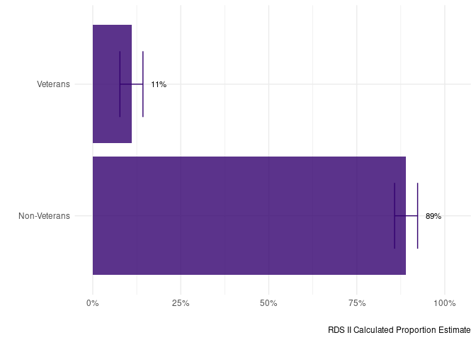

The proportion of the population experiencing homeless who are Veterans
is 11%. The proportion of the population experiencing homeless who are
Non-Veterans is 89%.

# Demographics

## *Gender*

*Imputed based on ‘B4. How would you describe your gender?’
[UWRDS-PSD] and ‘25. Which of the following best describes your
gender?’ [UWRDS]*

<table class="table table-striped" style="margin-left: auto; margin-right: auto;">
<caption>
Veterans
</caption>
<thead>
<tr>
<th style="text-align:left;">
Gender
</th>
<th style="text-align:right;">
Sample N
</th>
<th style="text-align:left;">
Sample Proportion
</th>
<th style="text-align:left;">
RDS II Estimate
</th>
<th style="text-align:left;">
RDS II 95% CI
</th>
</tr>
</thead>
<tbody>
<tr>
<td style="text-align:left;">
A gender other than singularly female or male (e.g., nonbinary,
genderfluid, agender, culturally specific gender)
</td>
<td style="text-align:right;">
1
</td>
<td style="text-align:left;">
0.90%
</td>
<td style="text-align:left;">
2.20%
</td>
<td style="text-align:left;">
[-4.05%, 8.45%]
</td>
</tr>
<tr>
<td style="text-align:left;">
Do not know
</td>
<td style="text-align:right;">
0
</td>
<td style="text-align:left;">
NA
</td>
<td style="text-align:left;">
NA
</td>
<td style="text-align:left;">
NA
</td>
</tr>
<tr>
<td style="text-align:left;">
Female
</td>
<td style="text-align:right;">
6
</td>
<td style="text-align:left;">
5.41%
</td>
<td style="text-align:left;">
3.03%
</td>
<td style="text-align:left;">
[0.55%, 5.51%]
</td>
</tr>
<tr>
<td style="text-align:left;">
Male
</td>
<td style="text-align:right;">
102
</td>
<td style="text-align:left;">
91.89%
</td>
<td style="text-align:left;">
93.42%
</td>
<td style="text-align:left;">
[86.43%, 100.42%]
</td>
</tr>
<tr>
<td style="text-align:left;">
Questioning
</td>
<td style="text-align:right;">
1
</td>
<td style="text-align:left;">
0.90%
</td>
<td style="text-align:left;">
0.24%
</td>
<td style="text-align:left;">
[0.05%, 0.44%]
</td>
</tr>
<tr>
<td style="text-align:left;">
Transgender
</td>
<td style="text-align:right;">
1
</td>
<td style="text-align:left;">
0.90%
</td>
<td style="text-align:left;">
1.10%
</td>
<td style="text-align:left;">
[-1.65%, 3.85%]
</td>
</tr>
<tr>
<td style="text-align:left;">
Total
</td>
<td style="text-align:right;">
111
</td>
<td style="text-align:left;">

-   </td>
    <td style="text-align:left;">

    -   </td>
        <td style="text-align:left;">

        -   </td>
            </tr>
            </tbody>
            </table>
            <table class="table table-striped" style="margin-left: auto; margin-right: auto;">
            <caption>
            Non-Veterans
            </caption>
            <thead>
            <tr>
            <th style="text-align:left;">
            Gender
            </th>
            <th style="text-align:right;">
            Sample N
            </th>
            <th style="text-align:left;">
            Sample Proportion
            </th>
            <th style="text-align:left;">
            RDS II Estimate
            </th>
            <th style="text-align:left;">
            RDS II 95% CI
            </th>
            </tr>
            </thead>
            <tbody>
            <tr>
            <td style="text-align:left;">
            A gender other than singularly female or male (e.g.,
            nonbinary, genderfluid, agender, culturally specific gender)
            </td>
            <td style="text-align:right;">
            9
            </td>
            <td style="text-align:left;">
            1.01%
            </td>
            <td style="text-align:left;">
            1.15%
            </td>
            <td style="text-align:left;">
            [0.36%, 1.94%]
            </td>
            </tr>
            <tr>
            <td style="text-align:left;">
            Do not know
            </td>
            <td style="text-align:right;">
            1
            </td>
            <td style="text-align:left;">
            0.11%
            </td>
            <td style="text-align:left;">
            0.15%
            </td>
            <td style="text-align:left;">
            [-0.06%, 0.36%]
            </td>
            </tr>
            <tr>
            <td style="text-align:left;">
            Female
            </td>
            <td style="text-align:right;">
            269
            </td>
            <td style="text-align:left;">
            30.06%
            </td>
            <td style="text-align:left;">
            29.74%
            </td>
            <td style="text-align:left;">
            [23.33%, 36.16%]
            </td>
            </tr>
            <tr>
            <td style="text-align:left;">
            Male
            </td>
            <td style="text-align:right;">
            610
            </td>
            <td style="text-align:left;">
            68.16%
            </td>
            <td style="text-align:left;">
            68.27%
            </td>
            <td style="text-align:left;">
            [61.87%, 74.67%]
            </td>
            </tr>
            <tr>
            <td style="text-align:left;">
            Questioning
            </td>
            <td style="text-align:right;">
            4
            </td>
            <td style="text-align:left;">
            0.45%
            </td>
            <td style="text-align:left;">
            0.43%
            </td>
            <td style="text-align:left;">
            [0.30%, 0.56%]
            </td>
            </tr>
            <tr>
            <td style="text-align:left;">
            Transgender
            </td>
            <td style="text-align:right;">
            2
            </td>
            <td style="text-align:left;">
            0.22%
            </td>
            <td style="text-align:left;">
            0.25%
            </td>
            <td style="text-align:left;">
            [-0.03%, 0.53%]
            </td>
            </tr>
            <tr>
            <td style="text-align:left;">
            Total
            </td>
            <td style="text-align:right;">
            895
            </td>
            <td style="text-align:left;">

            -   </td>
                <td style="text-align:left;">

                -   </td>
                    <td style="text-align:left;">

                    -   </td>
                        </tr>
                        </tbody>
                        </table>
                        

*The difference between individual veterans and non-veterans is not
significant, *χ*2 = 40.52, (p = 0.277). These results were
calculated based on the mean of 1000 bootstrapped tests. *

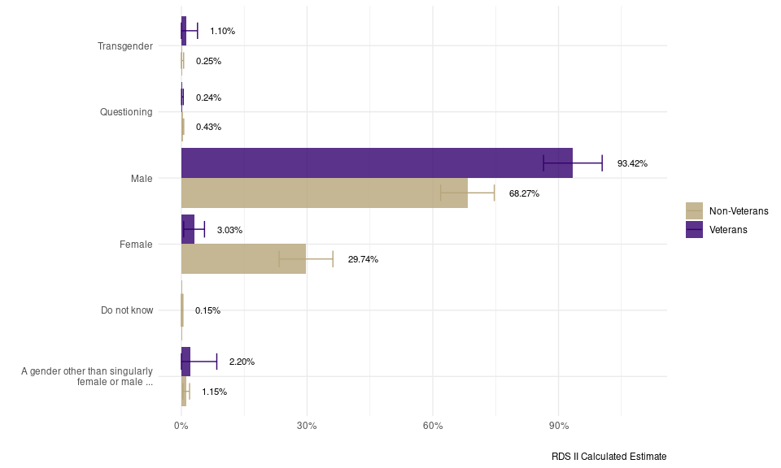

## *Race*

*Imputed based on ‘B18. Which one or more of the following would you say
best describes your race, heritage, or ancestry?’ [UWRDS-PSD] and ‘23.
Which racial groups do you identify with?’ [UWRDS]*

### *Race (Overall)*

<table class="table table-striped" style="margin-left: auto; margin-right: auto;">
<caption>
Veterans
</caption>
<thead>
<tr>
<th style="text-align:left;">
Race
</th>
<th style="text-align:right;">
Sample N
</th>
<th style="text-align:left;">
Sample Proportion
</th>
<th style="text-align:left;">
RDS II Estimate
</th>
<th style="text-align:left;">
RDS II 95% CI
</th>
</tr>
</thead>
<tbody>
<tr>
<td style="text-align:left;">
American Indian, Alaskan Native or Indigenous
</td>
<td style="text-align:right;">
8
</td>
<td style="text-align:left;">
7.62%
</td>
<td style="text-align:left;">
11.64%
</td>
<td style="text-align:left;">
[-2.50%, 25.77%]
</td>
</tr>
<tr>
<td style="text-align:left;">
Another race
</td>
<td style="text-align:right;">
0
</td>
<td style="text-align:left;">
NA
</td>
<td style="text-align:left;">
NA
</td>
<td style="text-align:left;">
NA
</td>
</tr>
<tr>
<td style="text-align:left;">
Asian or Asian American
</td>
<td style="text-align:right;">
1
</td>
<td style="text-align:left;">
0.95%
</td>
<td style="text-align:left;">
0.29%
</td>
<td style="text-align:left;">
[0.04%, 0.54%]
</td>
</tr>
<tr>
<td style="text-align:left;">
Black, African American, or African
</td>
<td style="text-align:right;">
23
</td>
<td style="text-align:left;">
21.90%
</td>
<td style="text-align:left;">
20.90%
</td>
<td style="text-align:left;">
[8.77%, 33.03%]
</td>
</tr>
<tr>
<td style="text-align:left;">
Do not know
</td>
<td style="text-align:right;">
1
</td>
<td style="text-align:left;">
0.95%
</td>
<td style="text-align:left;">
2.34%
</td>
<td style="text-align:left;">
[-9.05%, 13.73%]
</td>
</tr>
<tr>
<td style="text-align:left;">
Multiracial
</td>
<td style="text-align:right;">
12
</td>
<td style="text-align:left;">
11.43%
</td>
<td style="text-align:left;">
10.55%
</td>
<td style="text-align:left;">
[4.75%, 16.35%]
</td>
</tr>
<tr>
<td style="text-align:left;">
Native Hawaiian or Pacific Islander
</td>
<td style="text-align:right;">
1
</td>
<td style="text-align:left;">
0.95%
</td>
<td style="text-align:left;">
0.16%
</td>
<td style="text-align:left;">
[0.03%, 0.28%]
</td>
</tr>
<tr>
<td style="text-align:left;">
White
</td>
<td style="text-align:right;">
59
</td>
<td style="text-align:left;">
56.19%
</td>
<td style="text-align:left;">
54.12%
</td>
<td style="text-align:left;">
[37.20%, 71.04%]
</td>
</tr>
<tr>
<td style="text-align:left;">
Total
</td>
<td style="text-align:right;">
105
</td>
<td style="text-align:left;">

-   </td>
    <td style="text-align:left;">

    -   </td>
        <td style="text-align:left;">

        -   </td>
            </tr>
            </tbody>
            </table>
            <table class="table table-striped" style="margin-left: auto; margin-right: auto;">
            <caption>
            Non-Veterans
            </caption>
            <thead>
            <tr>
            <th style="text-align:left;">
            Race
            </th>
            <th style="text-align:right;">
            Sample N
            </th>
            <th style="text-align:left;">
            Sample Proportion
            </th>
            <th style="text-align:left;">
            RDS II Estimate
            </th>
            <th style="text-align:left;">
            RDS II 95% CI
            </th>
            </tr>
            </thead>
            <tbody>
            <tr>
            <td style="text-align:left;">
            American Indian, Alaskan Native or Indigenous
            </td>
            <td style="text-align:right;">
            69
            </td>
            <td style="text-align:left;">
            8.06%
            </td>
            <td style="text-align:left;">
            8.59%
            </td>
            <td style="text-align:left;">
            [4.82%, 12.37%]
            </td>
            </tr>
            <tr>
            <td style="text-align:left;">
            Another race
            </td>
            <td style="text-align:right;">
            14
            </td>
            <td style="text-align:left;">
            1.64%
            </td>
            <td style="text-align:left;">
            2.48%
            </td>
            <td style="text-align:left;">
            [0.20%, 4.76%]
            </td>
            </tr>
            <tr>
            <td style="text-align:left;">
            Asian or Asian American
            </td>
            <td style="text-align:right;">
            19
            </td>
            <td style="text-align:left;">
            2.22%
            </td>
            <td style="text-align:left;">
            3.08%
            </td>
            <td style="text-align:left;">
            [-0.10%, 6.27%]
            </td>
            </tr>
            <tr>
            <td style="text-align:left;">
            Black, African American, or African
            </td>
            <td style="text-align:right;">
            140
            </td>
            <td style="text-align:left;">
            16.36%
            </td>
            <td style="text-align:left;">
            18.42%
            </td>
            <td style="text-align:left;">
            [12.79%, 24.06%]
            </td>
            </tr>
            <tr>
            <td style="text-align:left;">
            Do not know
            </td>
            <td style="text-align:right;">
            16
            </td>
            <td style="text-align:left;">
            1.87%
            </td>
            <td style="text-align:left;">
            2.14%
            </td>
            <td style="text-align:left;">
            [-0.26%, 4.54%]
            </td>
            </tr>
            <tr>
            <td style="text-align:left;">
            Multiracial
            </td>
            <td style="text-align:right;">
            114
            </td>
            <td style="text-align:left;">
            13.32%
            </td>
            <td style="text-align:left;">
            13.55%
            </td>
            <td style="text-align:left;">
            [8.92%, 18.18%]
            </td>
            </tr>
            <tr>
            <td style="text-align:left;">
            Native Hawaiian or Pacific Islander
            </td>
            <td style="text-align:right;">
            22
            </td>
            <td style="text-align:left;">
            2.57%
            </td>
            <td style="text-align:left;">
            2.55%
            </td>
            <td style="text-align:left;">
            [0.88%, 4.22%]
            </td>
            </tr>
            <tr>
            <td style="text-align:left;">
            White
            </td>
            <td style="text-align:right;">
            462
            </td>
            <td style="text-align:left;">
            53.97%
            </td>
            <td style="text-align:left;">
            49.18%
            </td>
            <td style="text-align:left;">
            [42.49%, 55.87%]
            </td>
            </tr>
            <tr>
            <td style="text-align:left;">
            Total
            </td>
            <td style="text-align:right;">
            856
            </td>
            <td style="text-align:left;">

            -   </td>
                <td style="text-align:left;">

                -   </td>
                    <td style="text-align:left;">

                    -   </td>
                        </tr>
                        </tbody>
                        </table>
                        

*The difference between individual veterans and non-veterans is not
significant, *χ*2 = 10.5, (p = 0.93). These results were
calculated based on the mean of 1000 bootstrapped tests. This value was
calculated with replacement.*

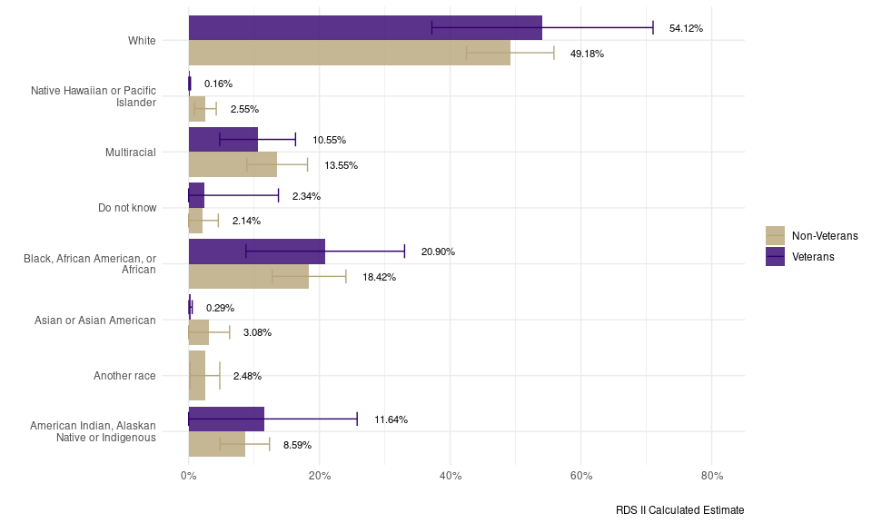

### *Race - Multiracial (Black)*

*Imputed racial category that classifies multiracial individuals as one
race with preference to Black based on ‘23. Which racial groups do you
identify with?’*

<table class="table table-striped" style="margin-left: auto; margin-right: auto;">
<caption>
Veterans
</caption>
<thead>
<tr>
<th style="text-align:left;">
Race
</th>
<th style="text-align:right;">
Sample N
</th>
<th style="text-align:left;">
Sample Proportion
</th>
<th style="text-align:left;">
RDS II Estimate
</th>
<th style="text-align:left;">
RDS II 95% CI
</th>
</tr>
</thead>
<tbody>
<tr>
<td style="text-align:left;">
American Indian, Alaskan Native or Indigenous
</td>
<td style="text-align:right;">
12
</td>
<td style="text-align:left;">
11.43%
</td>
<td style="text-align:left;">
17.11%
</td>
<td style="text-align:left;">
[2.94%, 31.27%]
</td>
</tr>
<tr>
<td style="text-align:left;">
Another race
</td>
<td style="text-align:right;">
0
</td>
<td style="text-align:left;">
NA
</td>
<td style="text-align:left;">
NA
</td>
<td style="text-align:left;">
NA
</td>
</tr>
<tr>
<td style="text-align:left;">
Asian or Asian American
</td>
<td style="text-align:right;">
2
</td>
<td style="text-align:left;">
1.90%
</td>
<td style="text-align:left;">
1.46%
</td>
<td style="text-align:left;">
[-1.96%, 4.88%]
</td>
</tr>
<tr>
<td style="text-align:left;">
Black, African American, or African
</td>
<td style="text-align:right;">
29
</td>
<td style="text-align:left;">
27.62%
</td>
<td style="text-align:left;">
24.34%
</td>
<td style="text-align:left;">
[11.69%, 36.99%]
</td>
</tr>
<tr>
<td style="text-align:left;">
Do not know
</td>
<td style="text-align:right;">
1
</td>
<td style="text-align:left;">
0.95%
</td>
<td style="text-align:left;">
2.34%
</td>
<td style="text-align:left;">
[-9.05%, 13.73%]
</td>
</tr>
<tr>
<td style="text-align:left;">
Native Hawaiian or Pacific Islander
</td>
<td style="text-align:right;">
2
</td>
<td style="text-align:left;">
1.90%
</td>
<td style="text-align:left;">
0.62%
</td>
<td style="text-align:left;">
[0.04%, 1.21%]
</td>
</tr>
<tr>
<td style="text-align:left;">
White
</td>
<td style="text-align:right;">
59
</td>
<td style="text-align:left;">
56.19%
</td>
<td style="text-align:left;">
54.12%
</td>
<td style="text-align:left;">
[37.20%, 71.04%]
</td>
</tr>
<tr>
<td style="text-align:left;">
Total
</td>
<td style="text-align:right;">
105
</td>
<td style="text-align:left;">

-   </td>
    <td style="text-align:left;">

    -   </td>
        <td style="text-align:left;">

        -   </td>
            </tr>
            </tbody>
            </table>
            <table class="table table-striped" style="margin-left: auto; margin-right: auto;">
            <caption>
            Non-Veterans
            </caption>
            <thead>
            <tr>
            <th style="text-align:left;">
            Race
            </th>
            <th style="text-align:right;">
            Sample N
            </th>
            <th style="text-align:left;">
            Sample Proportion
            </th>
            <th style="text-align:left;">
            RDS II Estimate
            </th>
            <th style="text-align:left;">
            RDS II 95% CI
            </th>
            </tr>
            </thead>
            <tbody>
            <tr>
            <td style="text-align:left;">
            American Indian, Alaskan Native or Indigenous
            </td>
            <td style="text-align:right;">
            124
            </td>
            <td style="text-align:left;">
            14.49%
            </td>
            <td style="text-align:left;">
            15.09%
            </td>
            <td style="text-align:left;">
            [10.19%, 19.98%]
            </td>
            </tr>
            <tr>
            <td style="text-align:left;">
            Another race
            </td>
            <td style="text-align:right;">
            14
            </td>
            <td style="text-align:left;">
            1.64%
            </td>
            <td style="text-align:left;">
            2.48%
            </td>
            <td style="text-align:left;">
            [0.20%, 4.76%]
            </td>
            </tr>
            <tr>
            <td style="text-align:left;">
            Asian or Asian American
            </td>
            <td style="text-align:right;">
            23
            </td>
            <td style="text-align:left;">
            2.69%
            </td>
            <td style="text-align:left;">
            3.52%
            </td>
            <td style="text-align:left;">
            [0.31%, 6.72%]
            </td>
            </tr>
            <tr>
            <td style="text-align:left;">
            Black, African American, or African
            </td>
            <td style="text-align:right;">
            185
            </td>
            <td style="text-align:left;">
            21.61%
            </td>
            <td style="text-align:left;">
            23.33%
            </td>
            <td style="text-align:left;">
            [17.50%, 29.16%]
            </td>
            </tr>
            <tr>
            <td style="text-align:left;">
            Do not know
            </td>
            <td style="text-align:right;">
            16
            </td>
            <td style="text-align:left;">
            1.87%
            </td>
            <td style="text-align:left;">
            2.14%
            </td>
            <td style="text-align:left;">
            [-0.26%, 4.54%]
            </td>
            </tr>
            <tr>
            <td style="text-align:left;">
            Native Hawaiian or Pacific Islander
            </td>
            <td style="text-align:right;">
            29
            </td>
            <td style="text-align:left;">
            3.39%
            </td>
            <td style="text-align:left;">
            3.94%
            </td>
            <td style="text-align:left;">
            [0.93%, 6.94%]
            </td>
            </tr>
            <tr>
            <td style="text-align:left;">
            White
            </td>
            <td style="text-align:right;">
            465
            </td>
            <td style="text-align:left;">
            54.32%
            </td>
            <td style="text-align:left;">
            49.51%
            </td>
            <td style="text-align:left;">
            [42.80%, 56.21%]
            </td>
            </tr>
            <tr>
            <td style="text-align:left;">
            Total
            </td>
            <td style="text-align:right;">
            856
            </td>
            <td style="text-align:left;">

            -   </td>
                <td style="text-align:left;">

                -   </td>
                    <td style="text-align:left;">

                    -   </td>
                        </tr>
                        </tbody>
                        </table>
                        

*The difference between individual veterans and non-veterans is not
significant, *χ*2 = 7.78, (p = 0.973). These results were
calculated based on the mean of 1000 bootstrapped tests. This value was
calculated with replacement.*

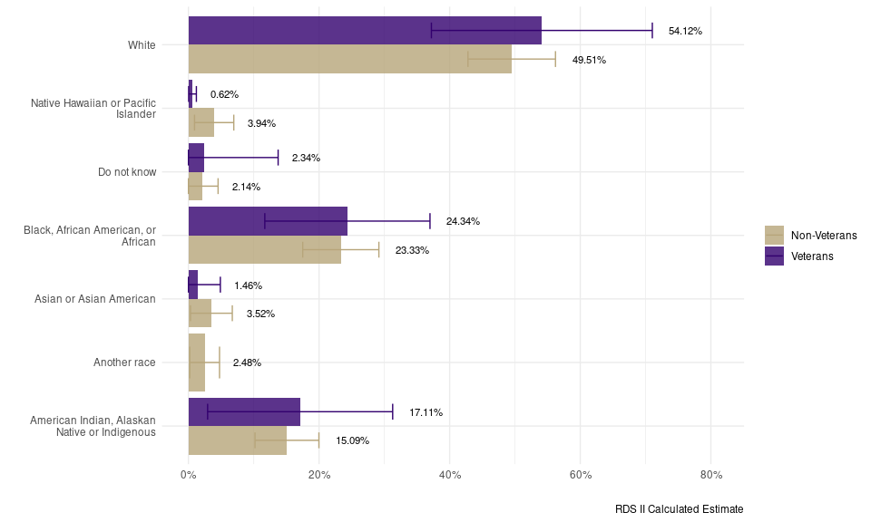

### *Race - Multiracial (Indigenous)*

*Imputed racial category that classifies multiracial individuals as one
race with preference to Indigenous based on ‘23. Which racial groups do
you identify with?’*

<table class="table table-striped" style="margin-left: auto; margin-right: auto;">
<caption>
Veterans
</caption>
<thead>
<tr>
<th style="text-align:left;">
Race (Indigeneous)
</th>
<th style="text-align:right;">
Sample N
</th>
<th style="text-align:left;">
Sample Proportion
</th>
<th style="text-align:left;">
RDS II Estimate
</th>
<th style="text-align:left;">
RDS II 95% CI
</th>
</tr>
</thead>
<tbody>
<tr>
<td style="text-align:left;">
American Indian, Alaskan Native or Indigenous
</td>
<td style="text-align:right;">
18
</td>
<td style="text-align:left;">
17.14%
</td>
<td style="text-align:left;">
20.55%
</td>
<td style="text-align:left;">
[6.45%, 34.65%]
</td>
</tr>
<tr>
<td style="text-align:left;">
Another race
</td>
<td style="text-align:right;">
0
</td>
<td style="text-align:left;">
NA
</td>
<td style="text-align:left;">
NA
</td>
<td style="text-align:left;">
NA
</td>
</tr>
<tr>
<td style="text-align:left;">
Asian or Asian American
</td>
<td style="text-align:right;">
2
</td>
<td style="text-align:left;">
1.90%
</td>
<td style="text-align:left;">
1.46%
</td>
<td style="text-align:left;">
[-1.96%, 4.88%]
</td>
</tr>
<tr>
<td style="text-align:left;">
Black, African American, or African
</td>
<td style="text-align:right;">
23
</td>
<td style="text-align:left;">
21.90%
</td>
<td style="text-align:left;">
20.90%
</td>
<td style="text-align:left;">
[8.77%, 33.03%]
</td>
</tr>
<tr>
<td style="text-align:left;">
Do not know
</td>
<td style="text-align:right;">
1
</td>
<td style="text-align:left;">
0.95%
</td>
<td style="text-align:left;">
2.34%
</td>
<td style="text-align:left;">
[-9.05%, 13.73%]
</td>
</tr>
<tr>
<td style="text-align:left;">
Native Hawaiian or Pacific Islander
</td>
<td style="text-align:right;">
2
</td>
<td style="text-align:left;">
1.90%
</td>
<td style="text-align:left;">
0.62%
</td>
<td style="text-align:left;">
[0.04%, 1.21%]
</td>
</tr>
<tr>
<td style="text-align:left;">
White
</td>
<td style="text-align:right;">
59
</td>
<td style="text-align:left;">
56.19%
</td>
<td style="text-align:left;">
54.12%
</td>
<td style="text-align:left;">
[37.20%, 71.04%]
</td>
</tr>
<tr>
<td style="text-align:left;">
Total
</td>
<td style="text-align:right;">
105
</td>
<td style="text-align:left;">

-   </td>
    <td style="text-align:left;">

    -   </td>
        <td style="text-align:left;">

        -   </td>
            </tr>
            </tbody>
            </table>
            <table class="table table-striped" style="margin-left: auto; margin-right: auto;">
            <caption>
            Non-Veterans
            </caption>
            <thead>
            <tr>
            <th style="text-align:left;">
            Race (Indigeneous)
            </th>
            <th style="text-align:right;">
            Sample N
            </th>
            <th style="text-align:left;">
            Sample Proportion
            </th>
            <th style="text-align:left;">
            RDS II Estimate
            </th>
            <th style="text-align:left;">
            RDS II 95% CI
            </th>
            </tr>
            </thead>
            <tbody>
            <tr>
            <td style="text-align:left;">
            American Indian, Alaskan Native or Indigenous
            </td>
            <td style="text-align:right;">
            156
            </td>
            <td style="text-align:left;">
            18.22%
            </td>
            <td style="text-align:left;">
            18.57%
            </td>
            <td style="text-align:left;">
            [13.43%, 23.72%]
            </td>
            </tr>
            <tr>
            <td style="text-align:left;">
            Another race
            </td>
            <td style="text-align:right;">
            14
            </td>
            <td style="text-align:left;">
            1.64%
            </td>
            <td style="text-align:left;">
            2.48%
            </td>
            <td style="text-align:left;">
            [0.20%, 4.76%]
            </td>
            </tr>
            <tr>
            <td style="text-align:left;">
            Asian or Asian American
            </td>
            <td style="text-align:right;">
            23
            </td>
            <td style="text-align:left;">
            2.69%
            </td>
            <td style="text-align:left;">
            3.52%
            </td>
            <td style="text-align:left;">
            [0.31%, 6.72%]
            </td>
            </tr>
            <tr>
            <td style="text-align:left;">
            Black, African American, or African
            </td>
            <td style="text-align:right;">
            153
            </td>
            <td style="text-align:left;">
            17.87%
            </td>
            <td style="text-align:left;">
            19.85%
            </td>
            <td style="text-align:left;">
            [14.17%, 25.52%]
            </td>
            </tr>
            <tr>
            <td style="text-align:left;">
            Do not know
            </td>
            <td style="text-align:right;">
            16
            </td>
            <td style="text-align:left;">
            1.87%
            </td>
            <td style="text-align:left;">
            2.14%
            </td>
            <td style="text-align:left;">
            [-0.26%, 4.54%]
            </td>
            </tr>
            <tr>
            <td style="text-align:left;">
            Native Hawaiian or Pacific Islander
            </td>
            <td style="text-align:right;">
            29
            </td>
            <td style="text-align:left;">
            3.39%
            </td>
            <td style="text-align:left;">
            3.94%
            </td>
            <td style="text-align:left;">
            [0.93%, 6.94%]
            </td>
            </tr>
            <tr>
            <td style="text-align:left;">
            White
            </td>
            <td style="text-align:right;">
            465
            </td>
            <td style="text-align:left;">
            54.32%
            </td>
            <td style="text-align:left;">
            49.51%
            </td>
            <td style="text-align:left;">
            [42.80%, 56.21%]
            </td>
            </tr>
            <tr>
            <td style="text-align:left;">
            Total
            </td>
            <td style="text-align:right;">
            856
            </td>
            <td style="text-align:left;">

            -   </td>
                <td style="text-align:left;">

                -   </td>
                    <td style="text-align:left;">

                    -   </td>
                        </tr>
                        </tbody>
                        </table>
                        

*The difference between individual veterans and non-veterans is not
significant, *χ*2 = 7.74, (p = 0.957). These results were
calculated based on the mean of 1000 bootstrapped tests. This value was
calculated with replacement.*

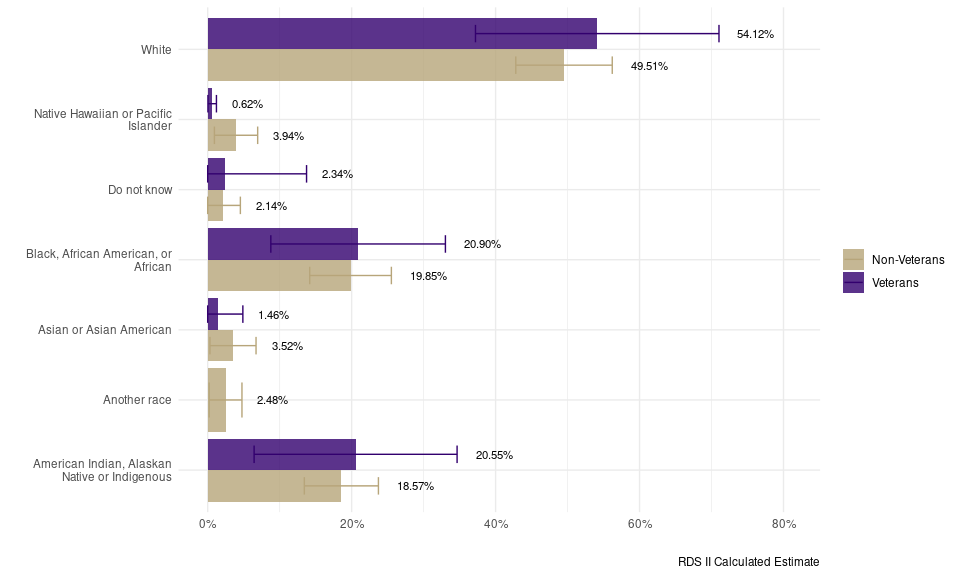

### *Race - Multiracial (Native Hawaiian or Pacific Islander)*

*Imputed racial category that classifies multiracial individuals as one
race with preference to Native Hawaiian or Pacific Islander based on
‘23. Which racial groups do you identify with?’*

<table class="table table-striped" style="margin-left: auto; margin-right: auto;">
<caption>
Veterans
</caption>
<thead>
<tr>
<th style="text-align:left;">
Race (PI)
</th>
<th style="text-align:right;">
Sample N
</th>
<th style="text-align:left;">
Sample Proportion
</th>
<th style="text-align:left;">
RDS II Estimate
</th>
<th style="text-align:left;">
RDS II 95% CI
</th>
</tr>
</thead>
<tbody>
<tr>
<td style="text-align:left;">
American Indian, Alaskan Native or Indigenous
</td>
<td style="text-align:right;">
11
</td>
<td style="text-align:left;">
10.48%
</td>
<td style="text-align:left;">
14.76%
</td>
<td style="text-align:left;">
[0.72%, 28.80%]
</td>
</tr>
<tr>
<td style="text-align:left;">
Another race
</td>
<td style="text-align:right;">
0
</td>
<td style="text-align:left;">
NA
</td>
<td style="text-align:left;">
NA
</td>
<td style="text-align:left;">
NA
</td>
</tr>
<tr>
<td style="text-align:left;">
Asian or Asian American
</td>
<td style="text-align:right;">
2
</td>
<td style="text-align:left;">
1.90%
</td>
<td style="text-align:left;">
1.46%
</td>
<td style="text-align:left;">
[-1.96%, 4.88%]
</td>
</tr>
<tr>
<td style="text-align:left;">
Black, African American, or African
</td>
<td style="text-align:right;">
26
</td>
<td style="text-align:left;">
24.76%
</td>
<td style="text-align:left;">
22.75%
</td>
<td style="text-align:left;">
[10.37%, 35.14%]
</td>
</tr>
<tr>
<td style="text-align:left;">
Do not know
</td>
<td style="text-align:right;">
1
</td>
<td style="text-align:left;">
0.95%
</td>
<td style="text-align:left;">
2.34%
</td>
<td style="text-align:left;">
[-9.05%, 13.73%]
</td>
</tr>
<tr>
<td style="text-align:left;">
Native Hawaiian or Pacific Islander
</td>
<td style="text-align:right;">
6
</td>
<td style="text-align:left;">
5.71%
</td>
<td style="text-align:left;">
4.56%
</td>
<td style="text-align:left;">
[1.67%, 7.44%]
</td>
</tr>
<tr>
<td style="text-align:left;">
White
</td>
<td style="text-align:right;">
59
</td>
<td style="text-align:left;">
56.19%
</td>
<td style="text-align:left;">
54.12%
</td>
<td style="text-align:left;">
[37.20%, 71.04%]
</td>
</tr>
<tr>
<td style="text-align:left;">
Total
</td>
<td style="text-align:right;">
105
</td>
<td style="text-align:left;">

-   </td>
    <td style="text-align:left;">

    -   </td>
        <td style="text-align:left;">

        -   </td>
            </tr>
            </tbody>
            </table>
            <table class="table table-striped" style="margin-left: auto; margin-right: auto;">
            <caption>
            Non-Veterans
            </caption>
            <thead>
            <tr>
            <th style="text-align:left;">
            Race (PI)
            </th>
            <th style="text-align:right;">
            Sample N
            </th>
            <th style="text-align:left;">
            Sample Proportion
            </th>
            <th style="text-align:left;">
            RDS II Estimate
            </th>
            <th style="text-align:left;">
            RDS II 95% CI
            </th>
            </tr>
            </thead>
            <tbody>
            <tr>
            <td style="text-align:left;">
            American Indian, Alaskan Native or Indigenous
            </td>
            <td style="text-align:right;">
            118
            </td>
            <td style="text-align:left;">
            13.79%
            </td>
            <td style="text-align:left;">
            14.22%
            </td>
            <td style="text-align:left;">
            [9.45%, 19.00%]
            </td>
            </tr>
            <tr>
            <td style="text-align:left;">
            Another race
            </td>
            <td style="text-align:right;">
            14
            </td>
            <td style="text-align:left;">
            1.64%
            </td>
            <td style="text-align:left;">
            2.48%
            </td>
            <td style="text-align:left;">
            [0.20%, 4.76%]
            </td>
            </tr>
            <tr>
            <td style="text-align:left;">
            Asian or Asian American
            </td>
            <td style="text-align:right;">
            23
            </td>
            <td style="text-align:left;">
            2.69%
            </td>
            <td style="text-align:left;">
            3.52%
            </td>
            <td style="text-align:left;">
            [0.31%, 6.72%]
            </td>
            </tr>
            <tr>
            <td style="text-align:left;">
            Black, African American, or African
            </td>
            <td style="text-align:right;">
            169
            </td>
            <td style="text-align:left;">
            19.74%
            </td>
            <td style="text-align:left;">
            21.36%
            </td>
            <td style="text-align:left;">
            [15.55%, 27.16%]
            </td>
            </tr>
            <tr>
            <td style="text-align:left;">
            Do not know
            </td>
            <td style="text-align:right;">
            16
            </td>
            <td style="text-align:left;">
            1.87%
            </td>
            <td style="text-align:left;">
            2.14%
            </td>
            <td style="text-align:left;">
            [-0.26%, 4.54%]
            </td>
            </tr>
            <tr>
            <td style="text-align:left;">
            Native Hawaiian or Pacific Islander
            </td>
            <td style="text-align:right;">
            51
            </td>
            <td style="text-align:left;">
            5.96%
            </td>
            <td style="text-align:left;">
            6.77%
            </td>
            <td style="text-align:left;">
            [3.41%, 10.14%]
            </td>
            </tr>
            <tr>
            <td style="text-align:left;">
            White
            </td>
            <td style="text-align:right;">
            465
            </td>
            <td style="text-align:left;">
            54.32%
            </td>
            <td style="text-align:left;">
            49.51%
            </td>
            <td style="text-align:left;">
            [42.80%, 56.21%]
            </td>
            </tr>
            <tr>
            <td style="text-align:left;">
            Total
            </td>
            <td style="text-align:right;">
            856
            </td>
            <td style="text-align:left;">

            -   </td>
                <td style="text-align:left;">

                -   </td>
                    <td style="text-align:left;">

                    -   </td>
                        </tr>
                        </tbody>
                        </table>
                        

*The difference between individual veterans and non-veterans is not
significant, *χ*2 = 5.3, (p = 0.955). These results were
calculated based on the mean of 1000 bootstrapped tests. This value was
calculated with replacement.*

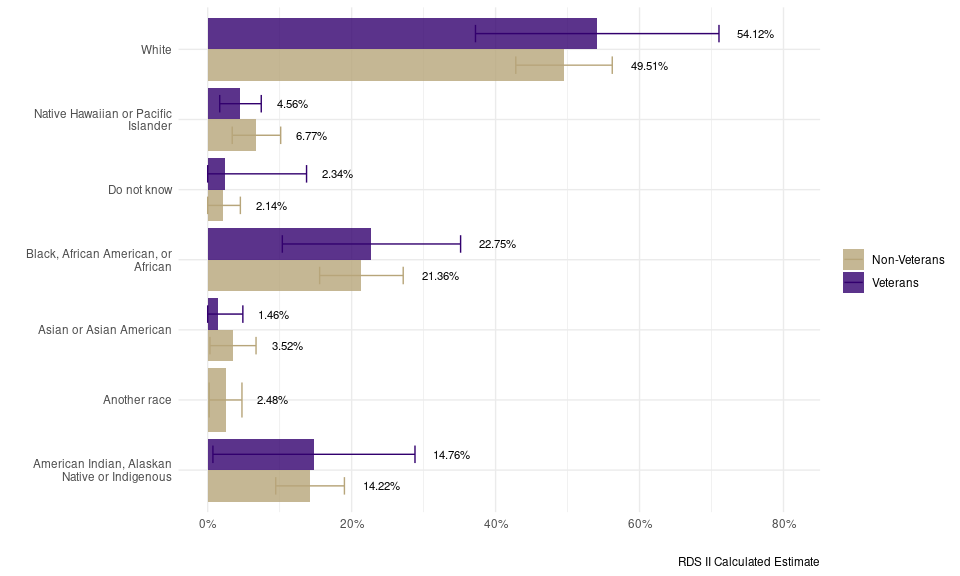

## *Ethnicity*

*Imputed based on ‘B16. Do you consider yourself Hispanic or Latinx’
[UWRDS-PSD] and ‘24. What is your ethnicity?’ [UWRDS]*

<table class="table table-striped" style="margin-left: auto; margin-right: auto;">
<caption>
Veterans
</caption>
<thead>
<tr>
<th style="text-align:left;">
Ethnicity
</th>
<th style="text-align:right;">
Sample N
</th>
<th style="text-align:left;">
Sample Proportion
</th>
<th style="text-align:left;">
RDS II Estimate
</th>
<th style="text-align:left;">
RDS II 95% CI
</th>
</tr>
</thead>
<tbody>
<tr>
<td style="text-align:left;">
Do not know
</td>
<td style="text-align:right;">
5
</td>
<td style="text-align:left;">
4.7%
</td>
<td style="text-align:left;">
8.2%
</td>
<td style="text-align:left;">
[-4.13%, 20.6%]
</td>
</tr>
<tr>
<td style="text-align:left;">
Hispanic/Latin(a)(o)(x)
</td>
<td style="text-align:right;">
9
</td>
<td style="text-align:left;">
8.5%
</td>
<td style="text-align:left;">
6.3%
</td>
<td style="text-align:left;">
[0.70%, 11.9%]
</td>
</tr>
<tr>
<td style="text-align:left;">
Non-Hispanic/Non-Latin(a)(o)(x)
</td>
<td style="text-align:right;">
92
</td>
<td style="text-align:left;">
86.8%
</td>
<td style="text-align:left;">
85.5%
</td>
<td style="text-align:left;">
[72.72%, 98.3%]
</td>
</tr>
<tr>
<td style="text-align:left;">
Total
</td>
<td style="text-align:right;">
106
</td>
<td style="text-align:left;">

-   </td>
    <td style="text-align:left;">

    -   </td>
        <td style="text-align:left;">

        -   </td>
            </tr>
            </tbody>
            </table>
            <table class="table table-striped" style="margin-left: auto; margin-right: auto;">
            <caption>
            Non-Veterans
            </caption>
            <thead>
            <tr>
            <th style="text-align:left;">
            Ethnicity
            </th>
            <th style="text-align:right;">
            Sample N
            </th>
            <th style="text-align:left;">
            Sample Proportion
            </th>
            <th style="text-align:left;">
            RDS II Estimate
            </th>
            <th style="text-align:left;">
            RDS II 95% CI
            </th>
            </tr>
            </thead>
            <tbody>
            <tr>
            <td style="text-align:left;">
            Do not know
            </td>
            <td style="text-align:right;">
            16
            </td>
            <td style="text-align:left;">
            1.8%
            </td>
            <td style="text-align:left;">
            1.3%
            </td>
            <td style="text-align:left;">
            [0.65%, 2.0%]
            </td>
            </tr>
            <tr>
            <td style="text-align:left;">
            Hispanic/Latin(a)(o)(x)
            </td>
            <td style="text-align:right;">
            135
            </td>
            <td style="text-align:left;">
            15.4%
            </td>
            <td style="text-align:left;">
            16.4%
            </td>
            <td style="text-align:left;">
            [11.06%, 21.7%]
            </td>
            </tr>
            <tr>
            <td style="text-align:left;">
            Non-Hispanic/Non-Latin(a)(o)(x)
            </td>
            <td style="text-align:right;">
            724
            </td>
            <td style="text-align:left;">
            82.7%
            </td>
            <td style="text-align:left;">
            82.3%
            </td>
            <td style="text-align:left;">
            [76.96%, 87.6%]
            </td>
            </tr>
            <tr>
            <td style="text-align:left;">
            Total
            </td>
            <td style="text-align:right;">
            875
            </td>
            <td style="text-align:left;">

            -   </td>
                <td style="text-align:left;">

                -   </td>
                    <td style="text-align:left;">

                    -   </td>
                        </tr>
                        </tbody>
                        </table>
                        

*The difference between individual veterans and non-veterans is not
significant, *χ*2 = 28.65, (p = 0.255). These results were
calculated based on the mean of 1000 bootstrapped tests. This value was
calculated with replacement.*

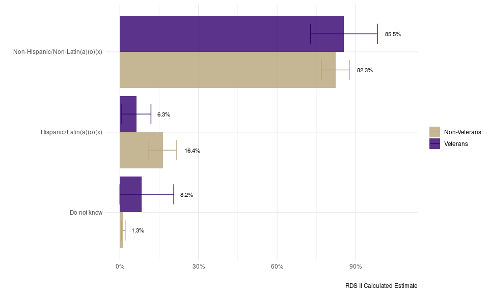

## *Age*

*Date of Birth*

### *Age (Categorical)*

*Imputed based on ‘A2. How old are you?’ [UWRDS-PSD] and ‘4. Date of
Birth’ [UWRDS]*

<table class="table table-striped" style="margin-left: auto; margin-right: auto;">
<caption>
Veterans
</caption>
<thead>
<tr>
<th style="text-align:left;">
Age Category
</th>
<th style="text-align:right;">
Sample N
</th>
<th style="text-align:left;">
Sample Proportion
</th>
<th style="text-align:left;">
RDS II Estimate
</th>
<th style="text-align:left;">
RDS II 95% CI
</th>
</tr>
</thead>
<tbody>
<tr>
<td style="text-align:left;">
18-24
</td>
<td style="text-align:right;">
0
</td>
<td style="text-align:left;">
NA
</td>
<td style="text-align:left;">
NA
</td>
<td style="text-align:left;">
NA
</td>
</tr>
<tr>
<td style="text-align:left;">
25-34
</td>
<td style="text-align:right;">
10
</td>
<td style="text-align:left;">
9.09%
</td>
<td style="text-align:left;">
8.74%
</td>
<td style="text-align:left;">
[-2.13%, 19.620%]
</td>
</tr>
<tr>
<td style="text-align:left;">
35-44
</td>
<td style="text-align:right;">
23
</td>
<td style="text-align:left;">
20.91%
</td>
<td style="text-align:left;">
24.40%
</td>
<td style="text-align:left;">
[5.06%, 43.750%]
</td>
</tr>
<tr>
<td style="text-align:left;">
45-54
</td>
<td style="text-align:right;">
31
</td>
<td style="text-align:left;">
28.18%
</td>
<td style="text-align:left;">
28.12%
</td>
<td style="text-align:left;">
[16.31%, 39.930%]
</td>
</tr>
<tr>
<td style="text-align:left;">
55-64
</td>
<td style="text-align:right;">
25
</td>
<td style="text-align:left;">
22.73%
</td>
<td style="text-align:left;">
18.45%
</td>
<td style="text-align:left;">
[7.97%, 28.930%]
</td>
</tr>
<tr>
<td style="text-align:left;">
65+
</td>
<td style="text-align:right;">
21
</td>
<td style="text-align:left;">
19.09%
</td>
<td style="text-align:left;">
20.28%
</td>
<td style="text-align:left;">
[5.56%, 35.000%]
</td>
</tr>
<tr>
<td style="text-align:left;">
Total
</td>
<td style="text-align:right;">
110
</td>
<td style="text-align:left;">

-   </td>
    <td style="text-align:left;">

    -   </td>
        <td style="text-align:left;">

        -   </td>
            </tr>
            </tbody>
            </table>
            <table class="table table-striped" style="margin-left: auto; margin-right: auto;">
            <caption>
            Non-Veterans
            </caption>
            <thead>
            <tr>
            <th style="text-align:left;">
            Age Category
            </th>
            <th style="text-align:right;">
            Sample N
            </th>
            <th style="text-align:left;">
            Sample Proportion
            </th>
            <th style="text-align:left;">
            RDS II Estimate
            </th>
            <th style="text-align:left;">
            RDS II 95% CI
            </th>
            </tr>
            </thead>
            <tbody>
            <tr>
            <td style="text-align:left;">
            18-24
            </td>
            <td style="text-align:right;">
            25
            </td>
            <td style="text-align:left;">
            2.79%
            </td>
            <td style="text-align:left;">
            3.78%
            </td>
            <td style="text-align:left;">
            [0.48%, 7.090%]
            </td>
            </tr>
            <tr>
            <td style="text-align:left;">
            25-34
            </td>
            <td style="text-align:right;">
            198
            </td>
            <td style="text-align:left;">
            22.10%
            </td>
            <td style="text-align:left;">
            23.18%
            </td>
            <td style="text-align:left;">
            [17.43%, 28.920%]
            </td>
            </tr>
            <tr>
            <td style="text-align:left;">
            35-44
            </td>
            <td style="text-align:right;">
            275
            </td>
            <td style="text-align:left;">
            30.69%
            </td>
            <td style="text-align:left;">
            29.27%
            </td>
            <td style="text-align:left;">
            [23.59%, 34.940%]
            </td>
            </tr>
            <tr>
            <td style="text-align:left;">
            45-54
            </td>
            <td style="text-align:right;">
            209
            </td>
            <td style="text-align:left;">
            23.33%
            </td>
            <td style="text-align:left;">
            22.49%
            </td>
            <td style="text-align:left;">
            [16.83%, 28.150%]
            </td>
            </tr>
            <tr>
            <td style="text-align:left;">
            55-64
            </td>
            <td style="text-align:right;">
            149
            </td>
            <td style="text-align:left;">
            16.63%
            </td>
            <td style="text-align:left;">
            16.16%
            </td>
            <td style="text-align:left;">
            [12.10%, 20.210%]
            </td>
            </tr>
            <tr>
            <td style="text-align:left;">
            65+
            </td>
            <td style="text-align:right;">
            40
            </td>
            <td style="text-align:left;">
            4.46%
            </td>
            <td style="text-align:left;">
            5.13%
            </td>
            <td style="text-align:left;">
            [2.22%, 8.040%]
            </td>
            </tr>
            <tr>
            <td style="text-align:left;">
            Total
            </td>
            <td style="text-align:right;">
            896
            </td>
            <td style="text-align:left;">

            -   </td>
                <td style="text-align:left;">

                -   </td>
                    <td style="text-align:left;">

                    -   </td>
                        </tr>
                        </tbody>
                        </table>
                        

*The difference between individual veterans and non-veterans is
significant at the .05 level, *χ*2 = 51.43, (p = 0.039).
These results were calculated based on the mean of 1000 bootstrapped
tests. *

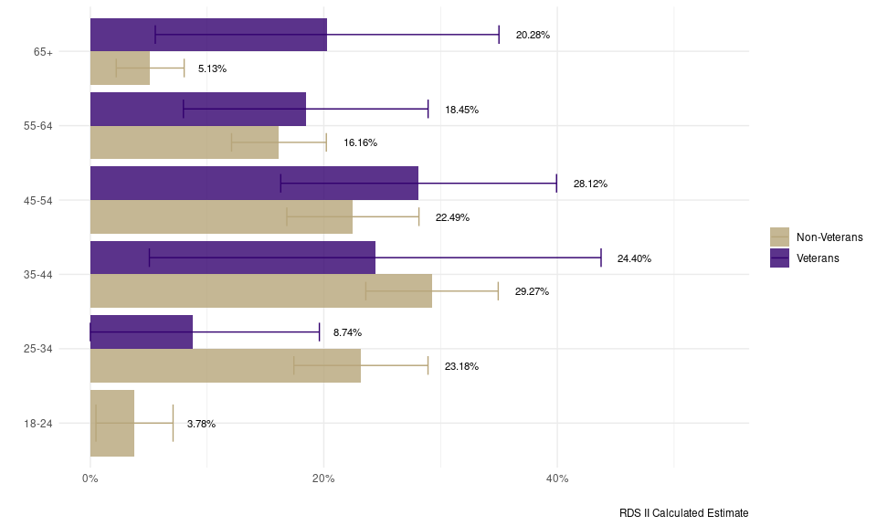

### *Age (Continuous)*

*Age - Imputed from ‘4. Date of Birth’*

<table class="table table-striped" style="margin-left: auto; margin-right: auto;">
<thead>
<tr>
<th style="text-align:left;">
Veteran Status
</th>
<th style="text-align:right;">
Sample N
</th>
<th style="text-align:right;">
Sample Median
</th>
<th style="text-align:right;">
Sample Mean
</th>
<th style="text-align:right;">
Sample SE
</th>
<th style="text-align:right;">
RDS II Estimate
</th>
<th style="text-align:left;">
RDS II 95% CI
</th>
</tr>
</thead>
<tbody>
<tr>
<td style="text-align:left;">
Non-Veterans
</td>
<td style="text-align:right;">
896
</td>
<td style="text-align:right;">
42
</td>
<td style="text-align:right;">
43.77
</td>
<td style="text-align:right;">
0.41
</td>
<td style="text-align:right;">
43.50
</td>
<td style="text-align:left;">
[41.81, 45.18]
</td>
</tr>
<tr>
<td style="text-align:left;">
Veterans
</td>
<td style="text-align:right;">
110
</td>
<td style="text-align:right;">
52
</td>
<td style="text-align:right;">
51.83
</td>
<td style="text-align:right;">
1.20
</td>
<td style="text-align:right;">
51.38
</td>
<td style="text-align:left;">
[46.54, 56.22]
</td>
</tr>
</tbody>
</table>

*The difference between individual veterans and non-veterans is
significant at the .05 level, t(435.22) = 3.01, (p= 0.003).*

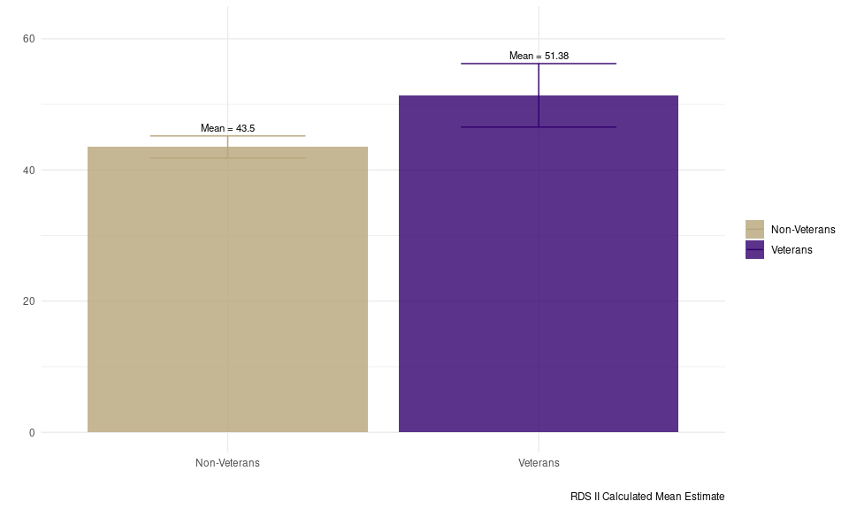

## *Birthplace*

### *Birth State*

*‘8. Birthplace: - State - In what city and state were you born? -
Imputed’ This variable is not included for UWRDS-PSD survey
observations.*

<table class="table table-striped" style="margin-left: auto; margin-right: auto;">
<caption>
Veterans
</caption>
<thead>
<tr>
<th style="text-align:left;">
Birth State
</th>
<th style="text-align:right;">
Sample N
</th>
<th style="text-align:left;">
Sample Proportion
</th>
<th style="text-align:left;">
RDS II Estimate
</th>
<th style="text-align:left;">
RDS II 95% CI
</th>
</tr>
</thead>
<tbody>
<tr>
<td style="text-align:left;">
Alabama
</td>
<td style="text-align:right;">
0
</td>
<td style="text-align:left;">
NA
</td>
<td style="text-align:left;">
NA
</td>
<td style="text-align:left;">
NA
</td>
</tr>
<tr>
<td style="text-align:left;">
Alaska
</td>
<td style="text-align:right;">
0
</td>
<td style="text-align:left;">
NA
</td>
<td style="text-align:left;">
NA
</td>
<td style="text-align:left;">
NA
</td>
</tr>
<tr>
<td style="text-align:left;">
Arizona
</td>
<td style="text-align:right;">
0
</td>
<td style="text-align:left;">
NA
</td>
<td style="text-align:left;">
NA
</td>
<td style="text-align:left;">
NA
</td>
</tr>
<tr>
<td style="text-align:left;">
Arkansas
</td>
<td style="text-align:right;">
3
</td>
<td style="text-align:left;">
3.45%
</td>
<td style="text-align:left;">
3.890%
</td>
<td style="text-align:left;">
[-5.24%, 13.030%]
</td>
</tr>
<tr>
<td style="text-align:left;">
California
</td>
<td style="text-align:right;">
7
</td>
<td style="text-align:left;">
8.05%
</td>
<td style="text-align:left;">
5.100%
</td>
<td style="text-align:left;">
[0.32%, 9.880%]
</td>
</tr>
<tr>
<td style="text-align:left;">
Colorado
</td>
<td style="text-align:right;">
1
</td>
<td style="text-align:left;">
1.15%
</td>
<td style="text-align:left;">
1.420%
</td>
<td style="text-align:left;">
[0.74%, 2.110%]
</td>
</tr>
<tr>
<td style="text-align:left;">
Connecticut
</td>
<td style="text-align:right;">
0
</td>
<td style="text-align:left;">
NA
</td>
<td style="text-align:left;">
NA
</td>
<td style="text-align:left;">
NA
</td>
</tr>
<tr>
<td style="text-align:left;">
Florida
</td>
<td style="text-align:right;">
3
</td>
<td style="text-align:left;">
3.45%
</td>
<td style="text-align:left;">
7.120%
</td>
<td style="text-align:left;">
[-7.73%, 21.970%]
</td>
</tr>
<tr>
<td style="text-align:left;">
Georgia
</td>
<td style="text-align:right;">
2
</td>
<td style="text-align:left;">
2.30%
</td>
<td style="text-align:left;">
1.520%
</td>
<td style="text-align:left;">
[-0.65%, 3.680%]
</td>
</tr>
<tr>
<td style="text-align:left;">
Hawaii
</td>
<td style="text-align:right;">
1
</td>
<td style="text-align:left;">
1.15%
</td>
<td style="text-align:left;">
0.950%
</td>
<td style="text-align:left;">
[-1.40%, 3.300%]
</td>
</tr>
<tr>
<td style="text-align:left;">
Idaho
</td>
<td style="text-align:right;">
0
</td>
<td style="text-align:left;">
NA
</td>
<td style="text-align:left;">
NA
</td>
<td style="text-align:left;">
NA
</td>
</tr>
<tr>
<td style="text-align:left;">
Illinois
</td>
<td style="text-align:right;">
5
</td>
<td style="text-align:left;">
5.75%
</td>
<td style="text-align:left;">
5.390%
</td>
<td style="text-align:left;">
[1.96%, 8.820%]
</td>
</tr>
<tr>
<td style="text-align:left;">
Indiana
</td>
<td style="text-align:right;">
1
</td>
<td style="text-align:left;">
1.15%
</td>
<td style="text-align:left;">
1.420%
</td>
<td style="text-align:left;">
[-0.54%, 3.390%]
</td>
</tr>
<tr>
<td style="text-align:left;">
Iowa
</td>
<td style="text-align:right;">
4
</td>
<td style="text-align:left;">
4.60%
</td>
<td style="text-align:left;">
5.410%
</td>
<td style="text-align:left;">
[-8.84%, 19.660%]
</td>
</tr>
<tr>
<td style="text-align:left;">
Kansas
</td>
<td style="text-align:right;">
2
</td>
<td style="text-align:left;">
2.30%
</td>
<td style="text-align:left;">
1.740%
</td>
<td style="text-align:left;">
[-1.05%, 4.530%]
</td>
</tr>
<tr>
<td style="text-align:left;">
Kentucky
</td>
<td style="text-align:right;">
0
</td>
<td style="text-align:left;">
NA
</td>
<td style="text-align:left;">
NA
</td>
<td style="text-align:left;">
NA
</td>
</tr>
<tr>
<td style="text-align:left;">
Louisiana
</td>
<td style="text-align:right;">
0
</td>
<td style="text-align:left;">
NA
</td>
<td style="text-align:left;">
NA
</td>
<td style="text-align:left;">
NA
</td>
</tr>
<tr>
<td style="text-align:left;">
Maine
</td>
<td style="text-align:right;">
0
</td>
<td style="text-align:left;">
NA
</td>
<td style="text-align:left;">
NA
</td>
<td style="text-align:left;">
NA
</td>
</tr>
<tr>
<td style="text-align:left;">
Massachusetts
</td>
<td style="text-align:right;">
0
</td>
<td style="text-align:left;">
NA
</td>
<td style="text-align:left;">
NA
</td>
<td style="text-align:left;">
NA
</td>
</tr>
<tr>
<td style="text-align:left;">
Michigan
</td>
<td style="text-align:right;">
2
</td>
<td style="text-align:left;">
2.30%
</td>
<td style="text-align:left;">
0.950%
</td>
<td style="text-align:left;">
[0.33%, 1.570%]
</td>
</tr>
<tr>
<td style="text-align:left;">
Minnesota
</td>
<td style="text-align:right;">
1
</td>
<td style="text-align:left;">
1.15%
</td>
<td style="text-align:left;">
1.420%
</td>
<td style="text-align:left;">
[-1.67%, 4.520%]
</td>
</tr>
<tr>
<td style="text-align:left;">
Mississippi
</td>
<td style="text-align:right;">
0
</td>
<td style="text-align:left;">
NA
</td>
<td style="text-align:left;">
NA
</td>
<td style="text-align:left;">
NA
</td>
</tr>
<tr>
<td style="text-align:left;">
Missouri
</td>
<td style="text-align:right;">
1
</td>
<td style="text-align:left;">
1.15%
</td>
<td style="text-align:left;">
0.470%
</td>
<td style="text-align:left;">
[0.00%, 0.950%]
</td>
</tr>
<tr>
<td style="text-align:left;">
Montana
</td>
<td style="text-align:right;">
1
</td>
<td style="text-align:left;">
1.15%
</td>
<td style="text-align:left;">
0.190%
</td>
<td style="text-align:left;">
[0.02%, 0.360%]
</td>
</tr>
<tr>
<td style="text-align:left;">
Nebraska
</td>
<td style="text-align:right;">
1
</td>
<td style="text-align:left;">
1.15%
</td>
<td style="text-align:left;">
2.850%
</td>
<td style="text-align:left;">
[-11.08%, 16.780%]
</td>
</tr>
<tr>
<td style="text-align:left;">
Nevada
</td>
<td style="text-align:right;">
0
</td>
<td style="text-align:left;">
NA
</td>
<td style="text-align:left;">
NA
</td>
<td style="text-align:left;">
NA
</td>
</tr>
<tr>
<td style="text-align:left;">
New Hampshire
</td>
<td style="text-align:right;">
0
</td>
<td style="text-align:left;">
NA
</td>
<td style="text-align:left;">
NA
</td>
<td style="text-align:left;">
NA
</td>
</tr>
<tr>
<td style="text-align:left;">
New Jersey
</td>
<td style="text-align:right;">
1
</td>
<td style="text-align:left;">
1.15%
</td>
<td style="text-align:left;">
2.850%
</td>
<td style="text-align:left;">
[0.40%, 5.300%]
</td>
</tr>
<tr>
<td style="text-align:left;">
New Mexico
</td>
<td style="text-align:right;">
0
</td>
<td style="text-align:left;">
NA
</td>
<td style="text-align:left;">
NA
</td>
<td style="text-align:left;">
NA
</td>
</tr>
<tr>
<td style="text-align:left;">
New York
</td>
<td style="text-align:right;">
5
</td>
<td style="text-align:left;">
5.75%
</td>
<td style="text-align:left;">
4.830%
</td>
<td style="text-align:left;">
[-0.50%, 10.150%]
</td>
</tr>
<tr>
<td style="text-align:left;">
North Carolina
</td>
<td style="text-align:right;">
1
</td>
<td style="text-align:left;">
1.15%
</td>
<td style="text-align:left;">
1.420%
</td>
<td style="text-align:left;">
[-2.22%, 5.070%]
</td>
</tr>
<tr>
<td style="text-align:left;">
North Dakota
</td>
<td style="text-align:right;">
1
</td>
<td style="text-align:left;">
1.15%
</td>
<td style="text-align:left;">
0.320%
</td>
<td style="text-align:left;">
[0.00%, 0.630%]
</td>
</tr>
<tr>
<td style="text-align:left;">
Ohio
</td>
<td style="text-align:right;">
4
</td>
<td style="text-align:left;">
4.60%
</td>
<td style="text-align:left;">
8.540%
</td>
<td style="text-align:left;">
[-3.06%, 20.150%]
</td>
</tr>
<tr>
<td style="text-align:left;">
Oklahoma
</td>
<td style="text-align:right;">
2
</td>
<td style="text-align:left;">
2.30%
</td>
<td style="text-align:left;">
4.270%
</td>
<td style="text-align:left;">
[-1.20%, 9.750%]
</td>
</tr>
<tr>
<td style="text-align:left;">
Oregon
</td>
<td style="text-align:right;">
2
</td>
<td style="text-align:left;">
2.30%
</td>
<td style="text-align:left;">
3.800%
</td>
<td style="text-align:left;">
[-0.44%, 8.030%]
</td>
</tr>
<tr>
<td style="text-align:left;">
Pennsylvania
</td>
<td style="text-align:right;">
2
</td>
<td style="text-align:left;">
2.30%
</td>
<td style="text-align:left;">
0.850%
</td>
<td style="text-align:left;">
[0.25%, 1.460%]
</td>
</tr>
<tr>
<td style="text-align:left;">
South Carolina
</td>
<td style="text-align:right;">
0
</td>
<td style="text-align:left;">
NA
</td>
<td style="text-align:left;">
NA
</td>
<td style="text-align:left;">
NA
</td>
</tr>
<tr>
<td style="text-align:left;">
South Dakota
</td>
<td style="text-align:right;">
1
</td>
<td style="text-align:left;">
1.15%
</td>
<td style="text-align:left;">
0.190%
</td>
<td style="text-align:left;">
[0.03%, 0.350%]
</td>
</tr>
<tr>
<td style="text-align:left;">
Tennessee
</td>
<td style="text-align:right;">
0
</td>
<td style="text-align:left;">
NA
</td>
<td style="text-align:left;">
NA
</td>
<td style="text-align:left;">
NA
</td>
</tr>
<tr>
<td style="text-align:left;">
Texas
</td>
<td style="text-align:right;">
6
</td>
<td style="text-align:left;">
6.90%
</td>
<td style="text-align:left;">
6.740%
</td>
<td style="text-align:left;">
[1.20%, 12.280%]
</td>
</tr>
<tr>
<td style="text-align:left;">
Utah
</td>
<td style="text-align:right;">
0
</td>
<td style="text-align:left;">
NA
</td>
<td style="text-align:left;">
NA
</td>
<td style="text-align:left;">
NA
</td>
</tr>
<tr>
<td style="text-align:left;">
Vermont
</td>
<td style="text-align:right;">
0
</td>
<td style="text-align:left;">
NA
</td>
<td style="text-align:left;">
NA
</td>
<td style="text-align:left;">
NA
</td>
</tr>
<tr>
<td style="text-align:left;">
Virginia
</td>
<td style="text-align:right;">
2
</td>
<td style="text-align:left;">
2.30%
</td>
<td style="text-align:left;">
3.800%
</td>
<td style="text-align:left;">
[-8.93%, 16.530%]
</td>
</tr>
<tr>
<td style="text-align:left;">
Washington
</td>
<td style="text-align:right;">
21
</td>
<td style="text-align:left;">
24.14%
</td>
<td style="text-align:left;">
17.800%
</td>
<td style="text-align:left;">
[6.02%, 29.590%]
</td>
</tr>
<tr>
<td style="text-align:left;">
West Virginia
</td>
<td style="text-align:right;">
2
</td>
<td style="text-align:left;">
2.30%
</td>
<td style="text-align:left;">
1.310%
</td>
<td style="text-align:left;">
[-0.43%, 3.040%]
</td>
</tr>
<tr>
<td style="text-align:left;">
Wisconsin
</td>
<td style="text-align:right;">
2
</td>
<td style="text-align:left;">
2.30%
</td>
<td style="text-align:left;">
3.420%
</td>
<td style="text-align:left;">
[-3.27%, 10.110%]
</td>
</tr>
<tr>
<td style="text-align:left;">
Wyoming
</td>
<td style="text-align:right;">
0
</td>
<td style="text-align:left;">
NA
</td>
<td style="text-align:left;">
NA
</td>
<td style="text-align:left;">
NA
</td>
</tr>
<tr>
<td style="text-align:left;">
Total
</td>
<td style="text-align:right;">
87
</td>
<td style="text-align:left;">

-   </td>
    <td style="text-align:left;">

    -   </td>
        <td style="text-align:left;">

        -   </td>
            </tr>
            </tbody>
            </table>
            <table class="table table-striped" style="margin-left: auto; margin-right: auto;">
            <caption>
            Non-Veterans
            </caption>
            <thead>
            <tr>
            <th style="text-align:left;">
            Birth State
            </th>
            <th style="text-align:right;">
            Sample N
            </th>
            <th style="text-align:left;">
            Sample Proportion
            </th>
            <th style="text-align:left;">
            RDS II Estimate
            </th>
            <th style="text-align:left;">
            RDS II 95% CI
            </th>
            </tr>
            </thead>
            <tbody>
            <tr>
            <td style="text-align:left;">
            Alabama
            </td>
            <td style="text-align:right;">
            6
            </td>
            <td style="text-align:left;">
            0.88%
            </td>
            <td style="text-align:left;">
            1.330%
            </td>
            <td style="text-align:left;">
            [-1.55%, 4.210%]
            </td>
            </tr>
            <tr>
            <td style="text-align:left;">
            Alaska
            </td>
            <td style="text-align:right;">
            16
            </td>
            <td style="text-align:left;">
            2.35%
            </td>
            <td style="text-align:left;">
            1.970%
            </td>
            <td style="text-align:left;">
            [1.05%, 2.900%]
            </td>
            </tr>
            <tr>
            <td style="text-align:left;">
            Arizona
            </td>
            <td style="text-align:right;">
            8
            </td>
            <td style="text-align:left;">
            1.18%
            </td>
            <td style="text-align:left;">
            1.810%
            </td>
            <td style="text-align:left;">
            [-1.13%, 4.760%]
            </td>
            </tr>
            <tr>
            <td style="text-align:left;">
            Arkansas
            </td>
            <td style="text-align:right;">
            2
            </td>
            <td style="text-align:left;">
            0.29%
            </td>
            <td style="text-align:left;">
            0.360%
            </td>
            <td style="text-align:left;">
            [0.06%, 0.660%]
            </td>
            </tr>
            <tr>
            <td style="text-align:left;">
            California
            </td>
            <td style="text-align:right;">
            78
            </td>
            <td style="text-align:left;">
            11.47%
            </td>
            <td style="text-align:left;">
            10.650%
            </td>
            <td style="text-align:left;">
            [6.45%, 14.860%]
            </td>
            </tr>
            <tr>
            <td style="text-align:left;">
            Colorado
            </td>
            <td style="text-align:right;">
            11
            </td>
            <td style="text-align:left;">
            1.62%
            </td>
            <td style="text-align:left;">
            1.120%
            </td>
            <td style="text-align:left;">
            [0.65%, 1.580%]
            </td>
            </tr>
            <tr>
            <td style="text-align:left;">
            Connecticut
            </td>
            <td style="text-align:right;">
            2
            </td>
            <td style="text-align:left;">
            0.29%
            </td>
            <td style="text-align:left;">
            0.100%
            </td>
            <td style="text-align:left;">
            [0.07%, 0.130%]
            </td>
            </tr>
            <tr>
            <td style="text-align:left;">
            Florida
            </td>
            <td style="text-align:right;">
            22
            </td>
            <td style="text-align:left;">
            3.24%
            </td>
            <td style="text-align:left;">
            4.480%
            </td>
            <td style="text-align:left;">
            [0.65%, 8.310%]
            </td>
            </tr>
            <tr>
            <td style="text-align:left;">
            Georgia
            </td>
            <td style="text-align:right;">
            3
            </td>
            <td style="text-align:left;">
            0.44%
            </td>
            <td style="text-align:left;">
            0.860%
            </td>
            <td style="text-align:left;">
            [-0.70%, 2.420%]
            </td>
            </tr>
            <tr>
            <td style="text-align:left;">
            Hawaii
            </td>
            <td style="text-align:right;">
            4
            </td>
            <td style="text-align:left;">
            0.59%
            </td>
            <td style="text-align:left;">
            0.840%
            </td>
            <td style="text-align:left;">
            [-1.67%, 3.350%]
            </td>
            </tr>
            <tr>
            <td style="text-align:left;">
            Idaho
            </td>
            <td style="text-align:right;">
            6
            </td>
            <td style="text-align:left;">
            0.88%
            </td>
            <td style="text-align:left;">
            1.170%
            </td>
            <td style="text-align:left;">
            [-0.81%, 3.150%]
            </td>
            </tr>
            <tr>
            <td style="text-align:left;">
            Illinois
            </td>
            <td style="text-align:right;">
            10
            </td>
            <td style="text-align:left;">
            1.47%
            </td>
            <td style="text-align:left;">
            1.730%
            </td>
            <td style="text-align:left;">
            [0.46%, 3.000%]
            </td>
            </tr>
            <tr>
            <td style="text-align:left;">
            Indiana
            </td>
            <td style="text-align:right;">
            3
            </td>
            <td style="text-align:left;">
            0.44%
            </td>
            <td style="text-align:left;">
            0.500%
            </td>
            <td style="text-align:left;">
            [0.38%, 0.620%]
            </td>
            </tr>
            <tr>
            <td style="text-align:left;">
            Iowa
            </td>
            <td style="text-align:right;">
            1
            </td>
            <td style="text-align:left;">
            0.15%
            </td>
            <td style="text-align:left;">
            0.430%
            </td>
            <td style="text-align:left;">
            [-2.05%, 2.900%]
            </td>
            </tr>
            <tr>
            <td style="text-align:left;">
            Kansas
            </td>
            <td style="text-align:right;">
            8
            </td>
            <td style="text-align:left;">
            1.18%
            </td>
            <td style="text-align:left;">
            1.600%
            </td>
            <td style="text-align:left;">
            [-1.27%, 4.470%]
            </td>
            </tr>
            <tr>
            <td style="text-align:left;">
            Kentucky
            </td>
            <td style="text-align:right;">
            6
            </td>
            <td style="text-align:left;">
            0.88%
            </td>
            <td style="text-align:left;">
            0.630%
            </td>
            <td style="text-align:left;">
            [-0.18%, 1.450%]
            </td>
            </tr>
            <tr>
            <td style="text-align:left;">
            Louisiana
            </td>
            <td style="text-align:right;">
            8
            </td>
            <td style="text-align:left;">
            1.18%
            </td>
            <td style="text-align:left;">
            1.270%
            </td>
            <td style="text-align:left;">
            [-0.83%, 3.380%]
            </td>
            </tr>
            <tr>
            <td style="text-align:left;">
            Maine
            </td>
            <td style="text-align:right;">
            1
            </td>
            <td style="text-align:left;">
            0.15%
            </td>
            <td style="text-align:left;">
            0.110%
            </td>
            <td style="text-align:left;">
            [0.08%, 0.130%]
            </td>
            </tr>
            <tr>
            <td style="text-align:left;">
            Massachusetts
            </td>
            <td style="text-align:right;">
            4
            </td>
            <td style="text-align:left;">
            0.59%
            </td>
            <td style="text-align:left;">
            0.690%
            </td>
            <td style="text-align:left;">
            [0.37%, 1.010%]
            </td>
            </tr>
            <tr>
            <td style="text-align:left;">
            Michigan
            </td>
            <td style="text-align:right;">
            11
            </td>
            <td style="text-align:left;">
            1.62%
            </td>
            <td style="text-align:left;">
            1.550%
            </td>
            <td style="text-align:left;">
            [0.78%, 2.330%]
            </td>
            </tr>
            <tr>
            <td style="text-align:left;">
            Minnesota
            </td>
            <td style="text-align:right;">
            9
            </td>
            <td style="text-align:left;">
            1.32%
            </td>
            <td style="text-align:left;">
            2.340%
            </td>
            <td style="text-align:left;">
            [-0.15%, 4.820%]
            </td>
            </tr>
            <tr>
            <td style="text-align:left;">
            Mississippi
            </td>
            <td style="text-align:right;">
            2
            </td>
            <td style="text-align:left;">
            0.29%
            </td>
            <td style="text-align:left;">
            0.200%
            </td>
            <td style="text-align:left;">
            [0.00%, 0.390%]
            </td>
            </tr>
            <tr>
            <td style="text-align:left;">
            Missouri
            </td>
            <td style="text-align:right;">
            7
            </td>
            <td style="text-align:left;">
            1.03%
            </td>
            <td style="text-align:left;">
            0.770%
            </td>
            <td style="text-align:left;">
            [0.04%, 1.510%]
            </td>
            </tr>
            <tr>
            <td style="text-align:left;">
            Montana
            </td>
            <td style="text-align:right;">
            16
            </td>
            <td style="text-align:left;">
            2.35%
            </td>
            <td style="text-align:left;">
            2.070%
            </td>
            <td style="text-align:left;">
            [-0.53%, 4.680%]
            </td>
            </tr>
            <tr>
            <td style="text-align:left;">
            Nebraska
            </td>
            <td style="text-align:right;">
            3
            </td>
            <td style="text-align:left;">
            0.44%
            </td>
            <td style="text-align:left;">
            0.220%
            </td>
            <td style="text-align:left;">
            [0.16%, 0.270%]
            </td>
            </tr>
            <tr>
            <td style="text-align:left;">
            Nevada
            </td>
            <td style="text-align:right;">
            1
            </td>
            <td style="text-align:left;">
            0.15%
            </td>
            <td style="text-align:left;">
            0.430%
            </td>
            <td style="text-align:left;">
            [0.21%, 0.650%]
            </td>
            </tr>
            <tr>
            <td style="text-align:left;">
            New Hampshire
            </td>
            <td style="text-align:right;">
            1
            </td>
            <td style="text-align:left;">
            0.15%
            </td>
            <td style="text-align:left;">
            0.210%
            </td>
            <td style="text-align:left;">
            [-0.57%, 1.000%]
            </td>
            </tr>
            <tr>
            <td style="text-align:left;">
            New Jersey
            </td>
            <td style="text-align:right;">
            7
            </td>
            <td style="text-align:left;">
            1.03%
            </td>
            <td style="text-align:left;">
            0.950%
            </td>
            <td style="text-align:left;">
            [-0.87%, 2.780%]
            </td>
            </tr>
            <tr>
            <td style="text-align:left;">
            New Mexico
            </td>
            <td style="text-align:right;">
            7
            </td>
            <td style="text-align:left;">
            1.03%
            </td>
            <td style="text-align:left;">
            1.240%
            </td>
            <td style="text-align:left;">
            [-1.47%, 3.950%]
            </td>
            </tr>
            <tr>
            <td style="text-align:left;">
            New York
            </td>
            <td style="text-align:right;">
            6
            </td>
            <td style="text-align:left;">
            0.88%
            </td>
            <td style="text-align:left;">
            1.010%
            </td>
            <td style="text-align:left;">
            [-1.13%, 3.140%]
            </td>
            </tr>
            <tr>
            <td style="text-align:left;">
            North Carolina
            </td>
            <td style="text-align:right;">
            3
            </td>
            <td style="text-align:left;">
            0.44%
            </td>
            <td style="text-align:left;">
            0.470%
            </td>
            <td style="text-align:left;">
            [-0.12%, 1.050%]
            </td>
            </tr>
            <tr>
            <td style="text-align:left;">
            North Dakota
            </td>
            <td style="text-align:right;">
            4
            </td>
            <td style="text-align:left;">
            0.59%
            </td>
            <td style="text-align:left;">
            0.560%
            </td>
            <td style="text-align:left;">
            [0.35%, 0.770%]
            </td>
            </tr>
            <tr>
            <td style="text-align:left;">
            Ohio
            </td>
            <td style="text-align:right;">
            6
            </td>
            <td style="text-align:left;">
            0.88%
            </td>
            <td style="text-align:left;">
            0.950%
            </td>
            <td style="text-align:left;">
            [-1.21%, 3.110%]
            </td>
            </tr>
            <tr>
            <td style="text-align:left;">
            Oklahoma
            </td>
            <td style="text-align:right;">
            5
            </td>
            <td style="text-align:left;">
            0.74%
            </td>
            <td style="text-align:left;">
            0.710%
            </td>
            <td style="text-align:left;">
            [-1.51%, 2.930%]
            </td>
            </tr>
            <tr>
            <td style="text-align:left;">
            Oregon
            </td>
            <td style="text-align:right;">
            18
            </td>
            <td style="text-align:left;">
            2.65%
            </td>
            <td style="text-align:left;">
            2.590%
            </td>
            <td style="text-align:left;">
            [1.17%, 4.010%]
            </td>
            </tr>
            <tr>
            <td style="text-align:left;">
            Pennsylvania
            </td>
            <td style="text-align:right;">
            6
            </td>
            <td style="text-align:left;">
            0.88%
            </td>
            <td style="text-align:left;">
            1.090%
            </td>
            <td style="text-align:left;">
            [-1.39%, 3.570%]
            </td>
            </tr>
            <tr>
            <td style="text-align:left;">
            South Carolina
            </td>
            <td style="text-align:right;">
            4
            </td>
            <td style="text-align:left;">
            0.59%
            </td>
            <td style="text-align:left;">
            0.290%
            </td>
            <td style="text-align:left;">
            [0.13%, 0.460%]
            </td>
            </tr>
            <tr>
            <td style="text-align:left;">
            South Dakota
            </td>
            <td style="text-align:right;">
            1
            </td>
            <td style="text-align:left;">
            0.15%
            </td>
            <td style="text-align:left;">
            0.210%
            </td>
            <td style="text-align:left;">
            [-0.62%, 1.050%]
            </td>
            </tr>
            <tr>
            <td style="text-align:left;">
            Tennessee
            </td>
            <td style="text-align:right;">
            9
            </td>
            <td style="text-align:left;">
            1.32%
            </td>
            <td style="text-align:left;">
            0.780%
            </td>
            <td style="text-align:left;">
            [-0.05%, 1.610%]
            </td>
            </tr>
            <tr>
            <td style="text-align:left;">
            Texas
            </td>
            <td style="text-align:right;">
            15
            </td>
            <td style="text-align:left;">
            2.21%
            </td>
            <td style="text-align:left;">
            2.610%
            </td>
            <td style="text-align:left;">
            [1.05%, 4.170%]
            </td>
            </tr>
            <tr>
            <td style="text-align:left;">
            Utah
            </td>
            <td style="text-align:right;">
            4
            </td>
            <td style="text-align:left;">
            0.59%
            </td>
            <td style="text-align:left;">
            0.600%
            </td>
            <td style="text-align:left;">
            [-0.17%, 1.380%]
            </td>
            </tr>
            <tr>
            <td style="text-align:left;">
            Vermont
            </td>
            <td style="text-align:right;">
            1
            </td>
            <td style="text-align:left;">
            0.15%
            </td>
            <td style="text-align:left;">
            0.110%
            </td>
            <td style="text-align:left;">
            [0.02%, 0.200%]
            </td>
            </tr>
            <tr>
            <td style="text-align:left;">
            Virginia
            </td>
            <td style="text-align:right;">
            1
            </td>
            <td style="text-align:left;">
            0.15%
            </td>
            <td style="text-align:left;">
            0.090%
            </td>
            <td style="text-align:left;">
            [0.01%, 0.160%]
            </td>
            </tr>
            <tr>
            <td style="text-align:left;">
            Washington
            </td>
            <td style="text-align:right;">
            328
            </td>
            <td style="text-align:left;">
            48.24%
            </td>
            <td style="text-align:left;">
            45.380%
            </td>
            <td style="text-align:left;">
            [37.93%, 52.820%]
            </td>
            </tr>
            <tr>
            <td style="text-align:left;">
            West Virginia
            </td>
            <td style="text-align:right;">
            2
            </td>
            <td style="text-align:left;">
            0.29%
            </td>
            <td style="text-align:left;">
            0.360%
            </td>
            <td style="text-align:left;">
            [-0.39%, 1.110%]
            </td>
            </tr>
            <tr>
            <td style="text-align:left;">
            Wisconsin
            </td>
            <td style="text-align:right;">
            3
            </td>
            <td style="text-align:left;">
            0.44%
            </td>
            <td style="text-align:left;">
            0.410%
            </td>
            <td style="text-align:left;">
            [0.15%, 0.670%]
            </td>
            </tr>
            <tr>
            <td style="text-align:left;">
            Wyoming
            </td>
            <td style="text-align:right;">
            1
            </td>
            <td style="text-align:left;">
            0.15%
            </td>
            <td style="text-align:left;">
            0.140%
            </td>
            <td style="text-align:left;">
            [0.11%, 0.180%]
            </td>
            </tr>
            <tr>
            <td style="text-align:left;">
            Total
            </td>
            <td style="text-align:right;">
            680
            </td>
            <td style="text-align:left;">

            -   </td>
                <td style="text-align:left;">

                -   </td>
                    <td style="text-align:left;">

                    -   </td>
                        </tr>
                        </tbody>
                        </table>
                        

*The difference between individual veterans and non-veterans is not
significant, *χ*2 = 156.42, (p = 0.996). These results were
calculated based on the mean of 1000 bootstrapped tests. *

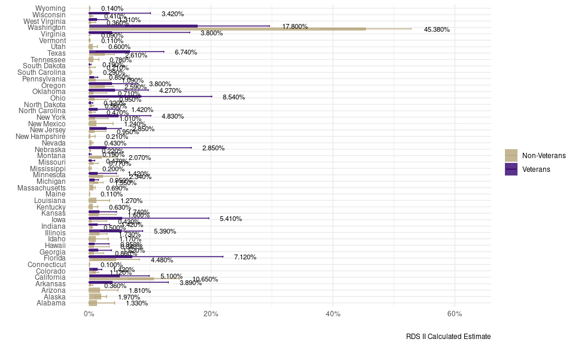

### *Birth Country*

*‘8. Birthplace: - Country - In what city and state were you born? -
Imputed’ This variable is not included for UWRDS-PSD survey
observations.*

<table class="table table-striped" style="margin-left: auto; margin-right: auto;">
<caption>
Veterans
</caption>
<thead>
<tr>
<th style="text-align:left;">
Birth Country
</th>
<th style="text-align:right;">
Sample N
</th>
<th style="text-align:left;">
Sample Proportion
</th>
<th style="text-align:left;">
RDS II Estimate
</th>
<th style="text-align:left;">
RDS II 95% CI
</th>
</tr>
</thead>
<tbody>
<tr>
<td style="text-align:left;">
Burma
</td>
<td style="text-align:right;">
0
</td>
<td style="text-align:left;">
NA
</td>
<td style="text-align:left;">
NA
</td>
<td style="text-align:left;">
NA
</td>
</tr>
<tr>
<td style="text-align:left;">
Canada
</td>
<td style="text-align:right;">
0
</td>
<td style="text-align:left;">
NA
</td>
<td style="text-align:left;">
NA
</td>
<td style="text-align:left;">
NA
</td>
</tr>
<tr>
<td style="text-align:left;">
Costa Rica
</td>
<td style="text-align:right;">
0
</td>
<td style="text-align:left;">
NA
</td>
<td style="text-align:left;">
NA
</td>
<td style="text-align:left;">
NA
</td>
</tr>
<tr>
<td style="text-align:left;">
Dominican Republic
</td>
<td style="text-align:right;">
0
</td>
<td style="text-align:left;">
NA
</td>
<td style="text-align:left;">
NA
</td>
<td style="text-align:left;">
NA
</td>
</tr>
<tr>
<td style="text-align:left;">
Ethiopia
</td>
<td style="text-align:right;">
0
</td>
<td style="text-align:left;">
NA
</td>
<td style="text-align:left;">
NA
</td>
<td style="text-align:left;">
NA
</td>
</tr>
<tr>
<td style="text-align:left;">
France
</td>
<td style="text-align:right;">
0
</td>
<td style="text-align:left;">
NA
</td>
<td style="text-align:left;">
NA
</td>
<td style="text-align:left;">
NA
</td>
</tr>
<tr>
<td style="text-align:left;">
Germany
</td>
<td style="text-align:right;">
0
</td>
<td style="text-align:left;">
NA
</td>
<td style="text-align:left;">
NA
</td>
<td style="text-align:left;">
NA
</td>
</tr>
<tr>
<td style="text-align:left;">
Grenada
</td>
<td style="text-align:right;">
0
</td>
<td style="text-align:left;">
NA
</td>
<td style="text-align:left;">
NA
</td>
<td style="text-align:left;">
NA
</td>
</tr>
<tr>
<td style="text-align:left;">
Guam
</td>
<td style="text-align:right;">
0
</td>
<td style="text-align:left;">
NA
</td>
<td style="text-align:left;">
NA
</td>
<td style="text-align:left;">
NA
</td>
</tr>
<tr>
<td style="text-align:left;">
Haiti
</td>
<td style="text-align:right;">
0
</td>
<td style="text-align:left;">
NA
</td>
<td style="text-align:left;">
NA
</td>
<td style="text-align:left;">
NA
</td>
</tr>
<tr>
<td style="text-align:left;">
Honduras
</td>
<td style="text-align:right;">
0
</td>
<td style="text-align:left;">
NA
</td>
<td style="text-align:left;">
NA
</td>
<td style="text-align:left;">
NA
</td>
</tr>
<tr>
<td style="text-align:left;">
India
</td>
<td style="text-align:right;">
0
</td>
<td style="text-align:left;">
NA
</td>
<td style="text-align:left;">
NA
</td>
<td style="text-align:left;">
NA
</td>
</tr>
<tr>
<td style="text-align:left;">
Iran
</td>
<td style="text-align:right;">
0
</td>
<td style="text-align:left;">
NA
</td>
<td style="text-align:left;">
NA
</td>
<td style="text-align:left;">
NA
</td>
</tr>
<tr>
<td style="text-align:left;">
Italy
</td>
<td style="text-align:right;">
0
</td>
<td style="text-align:left;">
NA
</td>
<td style="text-align:left;">
NA
</td>
<td style="text-align:left;">
NA
</td>
</tr>
<tr>
<td style="text-align:left;">
Japan
</td>
<td style="text-align:right;">
0
</td>
<td style="text-align:left;">
NA
</td>
<td style="text-align:left;">
NA
</td>
<td style="text-align:left;">
NA
</td>
</tr>
<tr>
<td style="text-align:left;">
Jordan
</td>
<td style="text-align:right;">
0
</td>
<td style="text-align:left;">
NA
</td>
<td style="text-align:left;">
NA
</td>
<td style="text-align:left;">
NA
</td>
</tr>
<tr>
<td style="text-align:left;">
Kazakhstan
</td>
<td style="text-align:right;">
0
</td>
<td style="text-align:left;">
NA
</td>
<td style="text-align:left;">
NA
</td>
<td style="text-align:left;">
NA
</td>
</tr>
<tr>
<td style="text-align:left;">
Kenya
</td>
<td style="text-align:right;">
0
</td>
<td style="text-align:left;">
NA
</td>
<td style="text-align:left;">
NA
</td>
<td style="text-align:left;">
NA
</td>
</tr>
<tr>
<td style="text-align:left;">
Korea
</td>
<td style="text-align:right;">
0
</td>
<td style="text-align:left;">
NA
</td>
<td style="text-align:left;">
NA
</td>
<td style="text-align:left;">
NA
</td>
</tr>
<tr>
<td style="text-align:left;">
Laos
</td>
<td style="text-align:right;">
0
</td>
<td style="text-align:left;">
NA
</td>
<td style="text-align:left;">
NA
</td>
<td style="text-align:left;">
NA
</td>
</tr>
<tr>
<td style="text-align:left;">
Lebanon
</td>
<td style="text-align:right;">
0
</td>
<td style="text-align:left;">
NA
</td>
<td style="text-align:left;">
NA
</td>
<td style="text-align:left;">
NA
</td>
</tr>
<tr>
<td style="text-align:left;">
Lunpranba
</td>
<td style="text-align:right;">
0
</td>
<td style="text-align:left;">
NA
</td>
<td style="text-align:left;">
NA
</td>
<td style="text-align:left;">
NA
</td>
</tr>
<tr>
<td style="text-align:left;">
Mexico
</td>
<td style="text-align:right;">
1
</td>
<td style="text-align:left;">
1.10%
</td>
<td style="text-align:left;">
1.37%
</td>
<td style="text-align:left;">
[-0.99%, 3.730%]
</td>
</tr>
<tr>
<td style="text-align:left;">
Mumbai india
</td>
<td style="text-align:right;">
0
</td>
<td style="text-align:left;">
NA
</td>
<td style="text-align:left;">
NA
</td>
<td style="text-align:left;">
NA
</td>
</tr>
<tr>
<td style="text-align:left;">
Palau
</td>
<td style="text-align:right;">
0
</td>
<td style="text-align:left;">
NA
</td>
<td style="text-align:left;">
NA
</td>
<td style="text-align:left;">
NA
</td>
</tr>
<tr>
<td style="text-align:left;">
Philippines
</td>
<td style="text-align:right;">
0
</td>
<td style="text-align:left;">
NA
</td>
<td style="text-align:left;">
NA
</td>
<td style="text-align:left;">
NA
</td>
</tr>
<tr>
<td style="text-align:left;">
Romania
</td>
<td style="text-align:right;">
0
</td>
<td style="text-align:left;">
NA
</td>
<td style="text-align:left;">
NA
</td>
<td style="text-align:left;">
NA
</td>
</tr>
<tr>
<td style="text-align:left;">
Somalia
</td>
<td style="text-align:right;">
0
</td>
<td style="text-align:left;">
NA
</td>
<td style="text-align:left;">
NA
</td>
<td style="text-align:left;">
NA
</td>
</tr>
<tr>
<td style="text-align:left;">
South korea
</td>
<td style="text-align:right;">
0
</td>
<td style="text-align:left;">
NA
</td>
<td style="text-align:left;">
NA
</td>
<td style="text-align:left;">
NA
</td>
</tr>
<tr>
<td style="text-align:left;">
UK
</td>
<td style="text-align:right;">
0
</td>
<td style="text-align:left;">
NA
</td>
<td style="text-align:left;">
NA
</td>
<td style="text-align:left;">
NA
</td>
</tr>
<tr>
<td style="text-align:left;">
Ukraine
</td>
<td style="text-align:right;">
0
</td>
<td style="text-align:left;">
NA
</td>
<td style="text-align:left;">
NA
</td>
<td style="text-align:left;">
NA
</td>
</tr>
<tr>
<td style="text-align:left;">
United States
</td>
<td style="text-align:right;">
87
</td>
<td style="text-align:left;">
95.60%
</td>
<td style="text-align:left;">
96.17%
</td>
<td style="text-align:left;">
[90.25%, 102.080%]
</td>
</tr>
<tr>
<td style="text-align:left;">
Marianas islands
</td>
<td style="text-align:right;">
1
</td>
<td style="text-align:left;">
1.10%
</td>
<td style="text-align:left;">
0.18%
</td>
<td style="text-align:left;">
[0.03%, 0.340%]
</td>
</tr>
<tr>
<td style="text-align:left;">
Puerto Rico
</td>
<td style="text-align:right;">
1
</td>
<td style="text-align:left;">
1.10%
</td>
<td style="text-align:left;">
0.91%
</td>
<td style="text-align:left;">
[-1.34%, 3.170%]
</td>
</tr>
<tr>
<td style="text-align:left;">
Russia
</td>
<td style="text-align:right;">
1
</td>
<td style="text-align:left;">
1.10%
</td>
<td style="text-align:left;">
1.37%
</td>
<td style="text-align:left;">
[-3.44%, 6.180%]
</td>
</tr>
<tr>
<td style="text-align:left;">
Total
</td>
<td style="text-align:right;">
91
</td>
<td style="text-align:left;">

-   </td>
    <td style="text-align:left;">

    -   </td>
        <td style="text-align:left;">

        -   </td>
            </tr>
            </tbody>
            </table>
            <table class="table table-striped" style="margin-left: auto; margin-right: auto;">
            <caption>
            Non-Veterans
            </caption>
            <thead>
            <tr>
            <th style="text-align:left;">
            Birth Country
            </th>
            <th style="text-align:right;">
            Sample N
            </th>
            <th style="text-align:left;">
            Sample Proportion
            </th>
            <th style="text-align:left;">
            RDS II Estimate
            </th>
            <th style="text-align:left;">
            RDS II 95% CI
            </th>
            </tr>
            </thead>
            <tbody>
            <tr>
            <td style="text-align:left;">
            Burma
            </td>
            <td style="text-align:right;">
            1
            </td>
            <td style="text-align:left;">
            0.14%
            </td>
            <td style="text-align:left;">
            0.39%
            </td>
            <td style="text-align:left;">
            [-1.22%, 2.000%]
            </td>
            </tr>
            <tr>
            <td style="text-align:left;">
            Canada
            </td>
            <td style="text-align:right;">
            4
            </td>
            <td style="text-align:left;">
            0.55%
            </td>
            <td style="text-align:left;">
            0.94%
            </td>
            <td style="text-align:left;">
            [-1.34%, 3.230%]
            </td>
            </tr>
            <tr>
            <td style="text-align:left;">
            Costa Rica
            </td>
            <td style="text-align:right;">
            1
            </td>
            <td style="text-align:left;">
            0.14%
            </td>
            <td style="text-align:left;">
            0.39%
            </td>
            <td style="text-align:left;">
            [0.32%, 0.470%]
            </td>
            </tr>
            <tr>
            <td style="text-align:left;">
            Dominican Republic
            </td>
            <td style="text-align:right;">
            1
            </td>
            <td style="text-align:left;">
            0.14%
            </td>
            <td style="text-align:left;">
            0.04%
            </td>
            <td style="text-align:left;">
            [0.02%, 0.060%]
            </td>
            </tr>
            <tr>
            <td style="text-align:left;">
            Ethiopia
            </td>
            <td style="text-align:right;">
            3
            </td>
            <td style="text-align:left;">
            0.41%
            </td>
            <td style="text-align:left;">
            0.69%
            </td>
            <td style="text-align:left;">
            [0.42%, 0.950%]
            </td>
            </tr>
            <tr>
            <td style="text-align:left;">
            France
            </td>
            <td style="text-align:right;">
            1
            </td>
            <td style="text-align:left;">
            0.14%
            </td>
            <td style="text-align:left;">
            0.20%
            </td>
            <td style="text-align:left;">
            [-0.17%, 0.560%]
            </td>
            </tr>
            <tr>
            <td style="text-align:left;">
            Germany
            </td>
            <td style="text-align:right;">
            3
            </td>
            <td style="text-align:left;">
            0.41%
            </td>
            <td style="text-align:left;">
            0.48%
            </td>
            <td style="text-align:left;">
            [-1.35%, 2.310%]
            </td>
            </tr>
            <tr>
            <td style="text-align:left;">
            Grenada
            </td>
            <td style="text-align:right;">
            1
            </td>
            <td style="text-align:left;">
            0.14%
            </td>
            <td style="text-align:left;">
            0.20%
            </td>
            <td style="text-align:left;">
            [-0.34%, 0.730%]
            </td>
            </tr>
            <tr>
            <td style="text-align:left;">
            Guam
            </td>
            <td style="text-align:right;">
            2
            </td>
            <td style="text-align:left;">
            0.27%
            </td>
            <td style="text-align:left;">
            0.52%
            </td>
            <td style="text-align:left;">
            [-1.01%, 2.060%]
            </td>
            </tr>
            <tr>
            <td style="text-align:left;">
            Haiti
            </td>
            <td style="text-align:right;">
            1
            </td>
            <td style="text-align:left;">
            0.14%
            </td>
            <td style="text-align:left;">
            0.10%
            </td>
            <td style="text-align:left;">
            [0.07%, 0.130%]
            </td>
            </tr>
            <tr>
            <td style="text-align:left;">
            Honduras
            </td>
            <td style="text-align:right;">
            1
            </td>
            <td style="text-align:left;">
            0.14%
            </td>
            <td style="text-align:left;">
            0.13%
            </td>
            <td style="text-align:left;">
            [-0.02%, 0.280%]
            </td>
            </tr>
            <tr>
            <td style="text-align:left;">
            India
            </td>
            <td style="text-align:right;">
            2
            </td>
            <td style="text-align:left;">
            0.27%
            </td>
            <td style="text-align:left;">
            0.20%
            </td>
            <td style="text-align:left;">
            [0.14%, 0.250%]
            </td>
            </tr>
            <tr>
            <td style="text-align:left;">
            Iran
            </td>
            <td style="text-align:right;">
            1
            </td>
            <td style="text-align:left;">
            0.14%
            </td>
            <td style="text-align:left;">
            0.20%
            </td>
            <td style="text-align:left;">
            [0.15%, 0.240%]
            </td>
            </tr>
            <tr>
            <td style="text-align:left;">
            Italy
            </td>
            <td style="text-align:right;">
            1
            </td>
            <td style="text-align:left;">
            0.14%
            </td>
            <td style="text-align:left;">
            0.20%
            </td>
            <td style="text-align:left;">
            [-0.12%, 0.510%]
            </td>
            </tr>
            <tr>
            <td style="text-align:left;">
            Japan
            </td>
            <td style="text-align:right;">
            1
            </td>
            <td style="text-align:left;">
            0.14%
            </td>
            <td style="text-align:left;">
            0.07%
            </td>
            <td style="text-align:left;">
            [0.04%, 0.090%]
            </td>
            </tr>
            <tr>
            <td style="text-align:left;">
            Jordan
            </td>
            <td style="text-align:right;">
            1
            </td>
            <td style="text-align:left;">
            0.14%
            </td>
            <td style="text-align:left;">
            0.20%
            </td>
            <td style="text-align:left;">
            [-0.59%, 0.980%]
            </td>
            </tr>
            <tr>
            <td style="text-align:left;">
            Kazakhstan
            </td>
            <td style="text-align:right;">
            2
            </td>
            <td style="text-align:left;">
            0.27%
            </td>
            <td style="text-align:left;">
            0.22%
            </td>
            <td style="text-align:left;">
            [-0.02%, 0.460%]
            </td>
            </tr>
            <tr>
            <td style="text-align:left;">
            Kenya
            </td>
            <td style="text-align:right;">
            2
            </td>
            <td style="text-align:left;">
            0.27%
            </td>
            <td style="text-align:left;">
            0.09%
            </td>
            <td style="text-align:left;">
            [0.02%, 0.160%]
            </td>
            </tr>
            <tr>
            <td style="text-align:left;">
            Korea
            </td>
            <td style="text-align:right;">
            1
            </td>
            <td style="text-align:left;">
            0.14%
            </td>
            <td style="text-align:left;">
            0.04%
            </td>
            <td style="text-align:left;">
            [0.01%, 0.070%]
            </td>
            </tr>
            <tr>
            <td style="text-align:left;">
            Laos
            </td>
            <td style="text-align:right;">
            1
            </td>
            <td style="text-align:left;">
            0.14%
            </td>
            <td style="text-align:left;">
            0.20%
            </td>
            <td style="text-align:left;">
            [0.09%, 0.300%]
            </td>
            </tr>
            <tr>
            <td style="text-align:left;">
            Lebanon
            </td>
            <td style="text-align:right;">
            1
            </td>
            <td style="text-align:left;">
            0.14%
            </td>
            <td style="text-align:left;">
            0.13%
            </td>
            <td style="text-align:left;">
            [0.04%, 0.220%]
            </td>
            </tr>
            <tr>
            <td style="text-align:left;">
            Lunpranba
            </td>
            <td style="text-align:right;">
            1
            </td>
            <td style="text-align:left;">
            0.14%
            </td>
            <td style="text-align:left;">
            0.20%
            </td>
            <td style="text-align:left;">
            [0.04%, 0.350%]
            </td>
            </tr>
            <tr>
            <td style="text-align:left;">
            Mexico
            </td>
            <td style="text-align:right;">
            4
            </td>
            <td style="text-align:left;">
            0.55%
            </td>
            <td style="text-align:left;">
            0.80%
            </td>
            <td style="text-align:left;">
            [0.01%, 1.580%]
            </td>
            </tr>
            <tr>
            <td style="text-align:left;">
            Mumbai india
            </td>
            <td style="text-align:right;">
            1
            </td>
            <td style="text-align:left;">
            0.14%
            </td>
            <td style="text-align:left;">
            0.39%
            </td>
            <td style="text-align:left;">
            [-1.57%, 2.350%]
            </td>
            </tr>
            <tr>
            <td style="text-align:left;">
            Palau
            </td>
            <td style="text-align:right;">
            1
            </td>
            <td style="text-align:left;">
            0.14%
            </td>
            <td style="text-align:left;">
            0.10%
            </td>
            <td style="text-align:left;">
            [-0.03%, 0.230%]
            </td>
            </tr>
            <tr>
            <td style="text-align:left;">
            Philippines
            </td>
            <td style="text-align:right;">
            4
            </td>
            <td style="text-align:left;">
            0.55%
            </td>
            <td style="text-align:left;">
            0.77%
            </td>
            <td style="text-align:left;">
            [-1.16%, 2.690%]
            </td>
            </tr>
            <tr>
            <td style="text-align:left;">
            Romania
            </td>
            <td style="text-align:right;">
            1
            </td>
            <td style="text-align:left;">
            0.14%
            </td>
            <td style="text-align:left;">
            0.13%
            </td>
            <td style="text-align:left;">
            [0.06%, 0.200%]
            </td>
            </tr>
            <tr>
            <td style="text-align:left;">
            Somalia
            </td>
            <td style="text-align:right;">
            2
            </td>
            <td style="text-align:left;">
            0.27%
            </td>
            <td style="text-align:left;">
            0.16%
            </td>
            <td style="text-align:left;">
            [0.03%, 0.280%]
            </td>
            </tr>
            <tr>
            <td style="text-align:left;">
            South korea
            </td>
            <td style="text-align:right;">
            1
            </td>
            <td style="text-align:left;">
            0.14%
            </td>
            <td style="text-align:left;">
            0.13%
            </td>
            <td style="text-align:left;">
            [0.09%, 0.170%]
            </td>
            </tr>
            <tr>
            <td style="text-align:left;">
            UK
            </td>
            <td style="text-align:right;">
            1
            </td>
            <td style="text-align:left;">
            0.14%
            </td>
            <td style="text-align:left;">
            0.13%
            </td>
            <td style="text-align:left;">
            [-0.17%, 0.430%]
            </td>
            </tr>
            <tr>
            <td style="text-align:left;">
            Ukraine
            </td>
            <td style="text-align:right;">
            1
            </td>
            <td style="text-align:left;">
            0.14%
            </td>
            <td style="text-align:left;">
            0.13%
            </td>
            <td style="text-align:left;">
            [-0.06%, 0.320%]
            </td>
            </tr>
            <tr>
            <td style="text-align:left;">
            United States
            </td>
            <td style="text-align:right;">
            682
            </td>
            <td style="text-align:left;">
            93.30%
            </td>
            <td style="text-align:left;">
            91.46%
            </td>
            <td style="text-align:left;">
            [86.87%, 96.050%]
            </td>
            </tr>
            <tr>
            <td style="text-align:left;">
            Marianas islands
            </td>
            <td style="text-align:right;">
            0
            </td>
            <td style="text-align:left;">
            NA
            </td>
            <td style="text-align:left;">
            NA
            </td>
            <td style="text-align:left;">
            NA
            </td>
            </tr>
            <tr>
            <td style="text-align:left;">
            Puerto Rico
            </td>
            <td style="text-align:right;">
            0
            </td>
            <td style="text-align:left;">
            NA
            </td>
            <td style="text-align:left;">
            NA
            </td>
            <td style="text-align:left;">
            NA
            </td>
            </tr>
            <tr>
            <td style="text-align:left;">
            Russia
            </td>
            <td style="text-align:right;">
            0
            </td>
            <td style="text-align:left;">
            NA
            </td>
            <td style="text-align:left;">
            NA
            </td>
            <td style="text-align:left;">
            NA
            </td>
            </tr>
            <tr>
            <td style="text-align:left;">
            Total
            </td>
            <td style="text-align:right;">
            731
            </td>
            <td style="text-align:left;">

            -   </td>
                <td style="text-align:left;">

                -   </td>
                    <td style="text-align:left;">

                    -   </td>
                        </tr>
                        </tbody>
                        </table>
                        

*The difference between individual veterans and non-veterans is not
significant, *χ*2 = 24.25, (p = 1). These results were
calculated based on the mean of 1000 bootstrapped tests. *

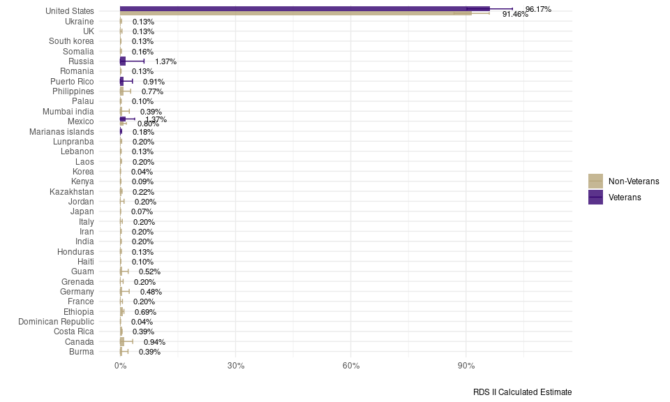

## *Years Lived in King County*

*‘9. How long have you lived in King County? - Imputed’ This variable is
not included for UWRDS-PSD survey observations.*

<table class="table table-striped" style="margin-left: auto; margin-right: auto;">
<thead>
<tr>
<th style="text-align:left;">
Veteran Status
</th>
<th style="text-align:right;">
Sample N
</th>
<th style="text-align:right;">
Sample Median
</th>
<th style="text-align:right;">
Sample Mean
</th>
<th style="text-align:right;">
Sample SE
</th>
<th style="text-align:right;">
RDS II Estimate
</th>
<th style="text-align:left;">
RDS II 95% CI
</th>
</tr>
</thead>
<tbody>
<tr>
<td style="text-align:left;">
Non-Veterans
</td>
<td style="text-align:right;">
749
</td>
<td style="text-align:right;">
20
</td>
<td style="text-align:right;">
21.75
</td>
<td style="text-align:right;">
0.64
</td>
<td style="text-align:right;">
20.83
</td>
<td style="text-align:left;">
[18.23, 23.42]
</td>
</tr>
<tr>
<td style="text-align:left;">
Veterans
</td>
<td style="text-align:right;">
95
</td>
<td style="text-align:right;">
15
</td>
<td style="text-align:right;">
19.72
</td>
<td style="text-align:right;">
1.79
</td>
<td style="text-align:right;">
16.42
</td>
<td style="text-align:left;">
[11.78, 21.06]
</td>
</tr>
</tbody>
</table>

*The difference between individual veterans and non-veterans is not
significant, t(371.42) = -1.63, (p= 0.105).*

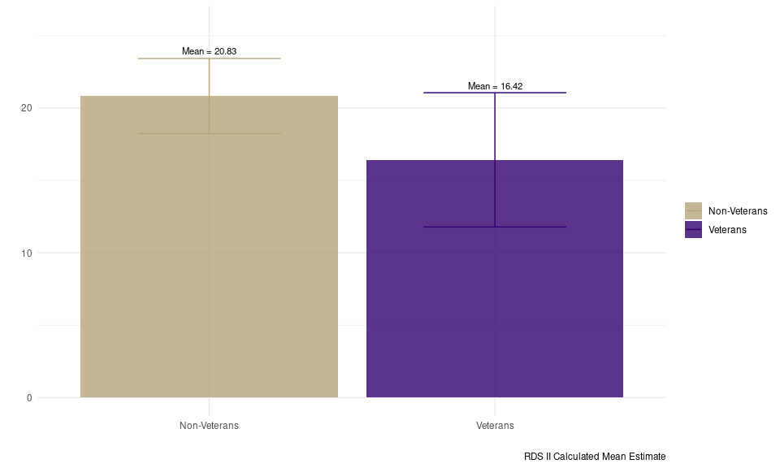

# Health

## *Health Status*

*Imputed based on ‘D1. In general, would you say your health is’
[UWRDS-PSD] and ‘16. How would you rate your health status?’
[UWRDS]*

<table class="table table-striped" style="margin-left: auto; margin-right: auto;">
<caption>
Veterans
</caption>
<thead>
<tr>
<th style="text-align:left;">
Ego Health Status
</th>
<th style="text-align:right;">
Sample N
</th>
<th style="text-align:left;">
Sample Proportion
</th>
<th style="text-align:left;">
RDS II Estimate
</th>
<th style="text-align:left;">
RDS II 95% CI
</th>
</tr>
</thead>
<tbody>
<tr>
<td style="text-align:left;">
Excellent
</td>
<td style="text-align:right;">
16
</td>
<td style="text-align:left;">
14.41%
</td>
<td style="text-align:left;">
18.01%
</td>
<td style="text-align:left;">
[7.5%, 28.51%]
</td>
</tr>
<tr>
<td style="text-align:left;">
Fair
</td>
<td style="text-align:right;">
33
</td>
<td style="text-align:left;">
29.73%
</td>
<td style="text-align:left;">
24.35%
</td>
<td style="text-align:left;">
[10.3%, 38.43%]
</td>
</tr>
<tr>
<td style="text-align:left;">
Good
</td>
<td style="text-align:right;">
49
</td>
<td style="text-align:left;">
44.14%
</td>
<td style="text-align:left;">
43.43%
</td>
<td style="text-align:left;">
[26.2%, 60.71%]
</td>
</tr>
<tr>
<td style="text-align:left;">
Poor
</td>
<td style="text-align:right;">
13
</td>
<td style="text-align:left;">
11.71%
</td>
<td style="text-align:left;">
14.21%
</td>
<td style="text-align:left;">
[-0.7%, 29.11%]
</td>
</tr>
<tr>
<td style="text-align:left;">
Total
</td>
<td style="text-align:right;">
111
</td>
<td style="text-align:left;">

-   </td>
    <td style="text-align:left;">

    -   </td>
        <td style="text-align:left;">

        -   </td>
            </tr>
            </tbody>
            </table>
            <table class="table table-striped" style="margin-left: auto; margin-right: auto;">
            <caption>
            Non-Veterans
            </caption>
            <thead>
            <tr>
            <th style="text-align:left;">
            Ego Health Status
            </th>
            <th style="text-align:right;">
            Sample N
            </th>
            <th style="text-align:left;">
            Sample Proportion
            </th>
            <th style="text-align:left;">
            RDS II Estimate
            </th>
            <th style="text-align:left;">
            RDS II 95% CI
            </th>
            </tr>
            </thead>
            <tbody>
            <tr>
            <td style="text-align:left;">
            Excellent
            </td>
            <td style="text-align:right;">
            85
            </td>
            <td style="text-align:left;">
            9.50%
            </td>
            <td style="text-align:left;">
            10.08%
            </td>
            <td style="text-align:left;">
            [6.5%, 13.69%]
            </td>
            </tr>
            <tr>
            <td style="text-align:left;">
            Fair
            </td>
            <td style="text-align:right;">
            352
            </td>
            <td style="text-align:left;">
            39.33%
            </td>
            <td style="text-align:left;">
            39.49%
            </td>
            <td style="text-align:left;">
            [33.1%, 45.92%]
            </td>
            </tr>
            <tr>
            <td style="text-align:left;">
            Good
            </td>
            <td style="text-align:right;">
            344
            </td>
            <td style="text-align:left;">
            38.44%
            </td>
            <td style="text-align:left;">
            36.50%
            </td>
            <td style="text-align:left;">
            [30.4%, 42.56%]
            </td>
            </tr>
            <tr>
            <td style="text-align:left;">
            Poor
            </td>
            <td style="text-align:right;">
            114
            </td>
            <td style="text-align:left;">
            12.74%
            </td>
            <td style="text-align:left;">
            13.94%
            </td>
            <td style="text-align:left;">
            [9.1%, 18.81%]
            </td>
            </tr>
            <tr>
            <td style="text-align:left;">
            Total
            </td>
            <td style="text-align:right;">
            895
            </td>
            <td style="text-align:left;">

            -   </td>
                <td style="text-align:left;">

                -   </td>
                    <td style="text-align:left;">

                    -   </td>
                        </tr>
                        </tbody>
                        </table>
                        

*The difference between individual veterans and non-veterans is not
significant, *χ*2 = 13.64, (p = 0.452). These results were
calculated based on the mean of 1000 bootstrapped tests. This value was
calculated with replacement.*

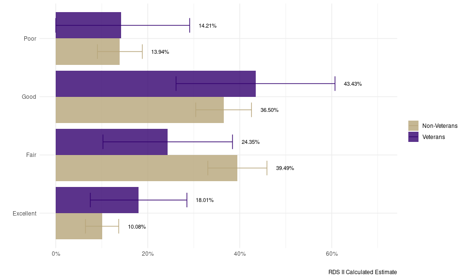

## *Disability*

*‘21. Do you identify as having a disability?’ This variable is not
included for UWRDS-PSD survey observations.*

<table class="table table-striped" style="margin-left: auto; margin-right: auto;">
<caption>
Veterans
</caption>
<thead>
<tr>
<th style="text-align:left;">
Have a Disability
</th>
<th style="text-align:right;">
Sample N
</th>
<th style="text-align:left;">
Sample Proportion
</th>
<th style="text-align:left;">
RDS II Estimate
</th>
<th style="text-align:left;">
RDS II 95% CI
</th>
</tr>
</thead>
<tbody>
<tr>
<td style="text-align:left;">
Choose not to answer
</td>
<td style="text-align:right;">
1
</td>
<td style="text-align:left;">
1.05%
</td>
<td style="text-align:left;">
0.32%
</td>
<td style="text-align:left;">
[0.03%, 0.62%]
</td>
</tr>
<tr>
<td style="text-align:left;">
Do not know
</td>
<td style="text-align:right;">
0
</td>
<td style="text-align:left;">
NA
</td>
<td style="text-align:left;">
NA
</td>
<td style="text-align:left;">
NA
</td>
</tr>
<tr>
<td style="text-align:left;">
No
</td>
<td style="text-align:right;">
37
</td>
<td style="text-align:left;">
38.95%
</td>
<td style="text-align:left;">
44.49%
</td>
<td style="text-align:left;">
[25.67%, 63.30%]
</td>
</tr>
<tr>
<td style="text-align:left;">
Yes
</td>
<td style="text-align:right;">
57
</td>
<td style="text-align:left;">
60.00%
</td>
<td style="text-align:left;">
55.19%
</td>
<td style="text-align:left;">
[36.46%, 73.91%]
</td>
</tr>
<tr>
<td style="text-align:left;">
Total
</td>
<td style="text-align:right;">
95
</td>
<td style="text-align:left;">

-   </td>
    <td style="text-align:left;">

    -   </td>
        <td style="text-align:left;">

        -   </td>
            </tr>
            </tbody>
            </table>
            <table class="table table-striped" style="margin-left: auto; margin-right: auto;">
            <caption>
            Non-Veterans
            </caption>
            <thead>
            <tr>
            <th style="text-align:left;">
            Have a Disability
            </th>
            <th style="text-align:right;">
            Sample N
            </th>
            <th style="text-align:left;">
            Sample Proportion
            </th>
            <th style="text-align:left;">
            RDS II Estimate
            </th>
            <th style="text-align:left;">
            RDS II 95% CI
            </th>
            </tr>
            </thead>
            <tbody>
            <tr>
            <td style="text-align:left;">
            Choose not to answer
            </td>
            <td style="text-align:right;">
            5
            </td>
            <td style="text-align:left;">
            0.67%
            </td>
            <td style="text-align:left;">
            1.04%
            </td>
            <td style="text-align:left;">
            [-0.85%, 2.94%]
            </td>
            </tr>
            <tr>
            <td style="text-align:left;">
            Do not know
            </td>
            <td style="text-align:right;">
            22
            </td>
            <td style="text-align:left;">
            2.93%
            </td>
            <td style="text-align:left;">
            3.66%
            </td>
            <td style="text-align:left;">
            [0.98%, 6.35%]
            </td>
            </tr>
            <tr>
            <td style="text-align:left;">
            No
            </td>
            <td style="text-align:right;">
            340
            </td>
            <td style="text-align:left;">
            45.33%
            </td>
            <td style="text-align:left;">
            47.16%
            </td>
            <td style="text-align:left;">
            [39.97%, 54.35%]
            </td>
            </tr>
            <tr>
            <td style="text-align:left;">
            Yes
            </td>
            <td style="text-align:right;">
            383
            </td>
            <td style="text-align:left;">
            51.07%
            </td>
            <td style="text-align:left;">
            48.13%
            </td>
            <td style="text-align:left;">
            [40.96%, 55.30%]
            </td>
            </tr>
            <tr>
            <td style="text-align:left;">
            Total
            </td>
            <td style="text-align:right;">
            750
            </td>
            <td style="text-align:left;">

            -   </td>
                <td style="text-align:left;">

                -   </td>
                    <td style="text-align:left;">

                    -   </td>
                        </tr>
                        </tbody>
                        </table>
                        

*The difference between individual veterans and non-veterans is not
significant, *χ*2 = 5.19, (p = 0.764). These results were
calculated based on the mean of 1000 bootstrapped tests. This value was
calculated with replacement.*

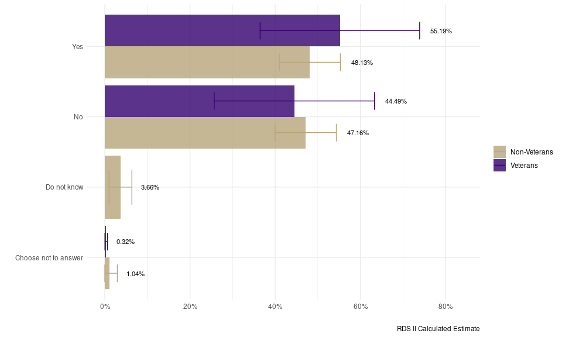

## *Mental Illness*

*‘20. Do you identify as having a serious mental illness?’ This variable
is not included for UWRDS-PSD survey observations.*

<table class="table table-striped" style="margin-left: auto; margin-right: auto;">
<caption>
Veterans
</caption>
<thead>
<tr>
<th style="text-align:left;">
Have a Mental Illness
</th>
<th style="text-align:right;">
Sample N
</th>
<th style="text-align:left;">
Sample Proportion
</th>
<th style="text-align:left;">
RDS II Estimate
</th>
<th style="text-align:left;">
RDS II 95% CI
</th>
</tr>
</thead>
<tbody>
<tr>
<td style="text-align:left;">
Choose not to answer
</td>
<td style="text-align:right;">
3
</td>
<td style="text-align:left;">
3.16%
</td>
<td style="text-align:left;">
3.6%
</td>
<td style="text-align:left;">
[-6.54%, 13.8%]
</td>
</tr>
<tr>
<td style="text-align:left;">
Do not know
</td>
<td style="text-align:right;">
0
</td>
<td style="text-align:left;">
NA
</td>
<td style="text-align:left;">
NA
</td>
<td style="text-align:left;">
NA
</td>
</tr>
<tr>
<td style="text-align:left;">
No
</td>
<td style="text-align:right;">
52
</td>
<td style="text-align:left;">
54.74%
</td>
<td style="text-align:left;">
55.8%
</td>
<td style="text-align:left;">
[38.94%, 72.7%]
</td>
</tr>
<tr>
<td style="text-align:left;">
Yes
</td>
<td style="text-align:right;">
40
</td>
<td style="text-align:left;">
42.11%
</td>
<td style="text-align:left;">
40.6%
</td>
<td style="text-align:left;">
[25.01%, 56.1%]
</td>
</tr>
<tr>
<td style="text-align:left;">
Total
</td>
<td style="text-align:right;">
95
</td>
<td style="text-align:left;">

-   </td>
    <td style="text-align:left;">

    -   </td>
        <td style="text-align:left;">

        -   </td>
            </tr>
            </tbody>
            </table>
            <table class="table table-striped" style="margin-left: auto; margin-right: auto;">
            <caption>
            Non-Veterans
            </caption>
            <thead>
            <tr>
            <th style="text-align:left;">
            Have a Mental Illness
            </th>
            <th style="text-align:right;">
            Sample N
            </th>
            <th style="text-align:left;">
            Sample Proportion
            </th>
            <th style="text-align:left;">
            RDS II Estimate
            </th>
            <th style="text-align:left;">
            RDS II 95% CI
            </th>
            </tr>
            </thead>
            <tbody>
            <tr>
            <td style="text-align:left;">
            Choose not to answer
            </td>
            <td style="text-align:right;">
            7
            </td>
            <td style="text-align:left;">
            0.93%
            </td>
            <td style="text-align:left;">
            1.4%
            </td>
            <td style="text-align:left;">
            [-0.46%, 3.4%]
            </td>
            </tr>
            <tr>
            <td style="text-align:left;">
            Do not know
            </td>
            <td style="text-align:right;">
            23
            </td>
            <td style="text-align:left;">
            3.06%
            </td>
            <td style="text-align:left;">
            3.6%
            </td>
            <td style="text-align:left;">
            [0.16%, 7.1%]
            </td>
            </tr>
            <tr>
            <td style="text-align:left;">
            No
            </td>
            <td style="text-align:right;">
            452
            </td>
            <td style="text-align:left;">
            60.19%
            </td>
            <td style="text-align:left;">
            63.1%
            </td>
            <td style="text-align:left;">
            [56.18%, 70.0%]
            </td>
            </tr>
            <tr>
            <td style="text-align:left;">
            Yes
            </td>
            <td style="text-align:right;">
            269
            </td>
            <td style="text-align:left;">
            35.82%
            </td>
            <td style="text-align:left;">
            31.8%
            </td>
            <td style="text-align:left;">
            [25.33%, 38.4%]
            </td>
            </tr>
            <tr>
            <td style="text-align:left;">
            Total
            </td>
            <td style="text-align:right;">
            751
            </td>
            <td style="text-align:left;">

            -   </td>
                <td style="text-align:left;">

                -   </td>
                    <td style="text-align:left;">

                    -   </td>
                        </tr>
                        </tbody>
                        </table>
                        

*The difference between individual veterans and non-veterans is not
significant, *χ*2 = 8.8, (p = 0.159). These results were
calculated based on the mean of 1000 bootstrapped tests. This value was
calculated with replacement.*

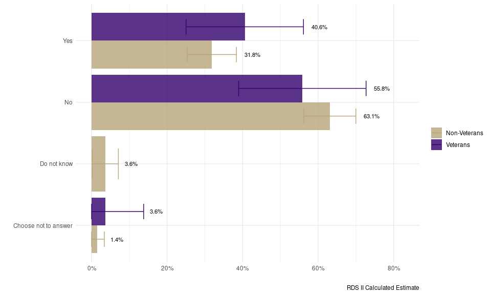

## *Substance Use*

*‘22. Do you identify as having a substance use disorder?’ This variable
is not included for UWRDS-PSD survey observations.*

<table class="table table-striped" style="margin-left: auto; margin-right: auto;">
<caption>
Veterans
</caption>
<thead>
<tr>
<th style="text-align:left;">
Have a Substance Use Disorder
</th>
<th style="text-align:right;">
Sample N
</th>
<th style="text-align:left;">
Sample Proportion
</th>
<th style="text-align:left;">
RDS II Estimate
</th>
<th style="text-align:left;">
RDS II 95% CI
</th>
</tr>
</thead>
<tbody>
<tr>
<td style="text-align:left;">
Choose not to answer
</td>
<td style="text-align:right;">
1
</td>
<td style="text-align:left;">
1.05%
</td>
<td style="text-align:left;">
2.59%
</td>
<td style="text-align:left;">
[-7.68%, 12.86%]
</td>
</tr>
<tr>
<td style="text-align:left;">
Do not know
</td>
<td style="text-align:right;">
0
</td>
<td style="text-align:left;">
NA
</td>
<td style="text-align:left;">
NA
</td>
<td style="text-align:left;">
NA
</td>
</tr>
<tr>
<td style="text-align:left;">
No
</td>
<td style="text-align:right;">
62
</td>
<td style="text-align:left;">
65.26%
</td>
<td style="text-align:left;">
72.15%
</td>
<td style="text-align:left;">
[55.56%, 88.74%]
</td>
</tr>
<tr>
<td style="text-align:left;">
Yes
</td>
<td style="text-align:right;">
32
</td>
<td style="text-align:left;">
33.68%
</td>
<td style="text-align:left;">
25.26%
</td>
<td style="text-align:left;">
[10.28%, 40.24%]
</td>
</tr>
<tr>
<td style="text-align:left;">
Total
</td>
<td style="text-align:right;">
95
</td>
<td style="text-align:left;">

-   </td>
    <td style="text-align:left;">

    -   </td>
        <td style="text-align:left;">

        -   </td>
            </tr>
            </tbody>
            </table>
            <table class="table table-striped" style="margin-left: auto; margin-right: auto;">
            <caption>
            Non-Veterans
            </caption>
            <thead>
            <tr>
            <th style="text-align:left;">
            Have a Substance Use Disorder
            </th>
            <th style="text-align:right;">
            Sample N
            </th>
            <th style="text-align:left;">
            Sample Proportion
            </th>
            <th style="text-align:left;">
            RDS II Estimate
            </th>
            <th style="text-align:left;">
            RDS II 95% CI
            </th>
            </tr>
            </thead>
            <tbody>
            <tr>
            <td style="text-align:left;">
            Choose not to answer
            </td>
            <td style="text-align:right;">
            7
            </td>
            <td style="text-align:left;">
            0.93%
            </td>
            <td style="text-align:left;">
            1.28%
            </td>
            <td style="text-align:left;">
            [-1.19%, 3.75%]
            </td>
            </tr>
            <tr>
            <td style="text-align:left;">
            Do not know
            </td>
            <td style="text-align:right;">
            7
            </td>
            <td style="text-align:left;">
            0.93%
            </td>
            <td style="text-align:left;">
            1.59%
            </td>
            <td style="text-align:left;">
            [-1.07%, 4.25%]
            </td>
            </tr>
            <tr>
            <td style="text-align:left;">
            No
            </td>
            <td style="text-align:right;">
            363
            </td>
            <td style="text-align:left;">
            48.40%
            </td>
            <td style="text-align:left;">
            51.34%
            </td>
            <td style="text-align:left;">
            [44.19%, 58.50%]
            </td>
            </tr>
            <tr>
            <td style="text-align:left;">
            Yes
            </td>
            <td style="text-align:right;">
            373
            </td>
            <td style="text-align:left;">
            49.73%
            </td>
            <td style="text-align:left;">
            45.79%
            </td>
            <td style="text-align:left;">
            [38.72%, 52.85%]
            </td>
            </tr>
            <tr>
            <td style="text-align:left;">
            Total
            </td>
            <td style="text-align:right;">
            750
            </td>
            <td style="text-align:left;">

            -   </td>
                <td style="text-align:left;">

                -   </td>
                    <td style="text-align:left;">

                    -   </td>
                        </tr>
                        </tbody>
                        </table>
                        

*The difference between individual veterans and non-veterans is not
significant, *χ*2 = 18.23, (p = 0.269). These results were
calculated based on the mean of 1000 bootstrapped tests. This value was
calculated with replacement.*

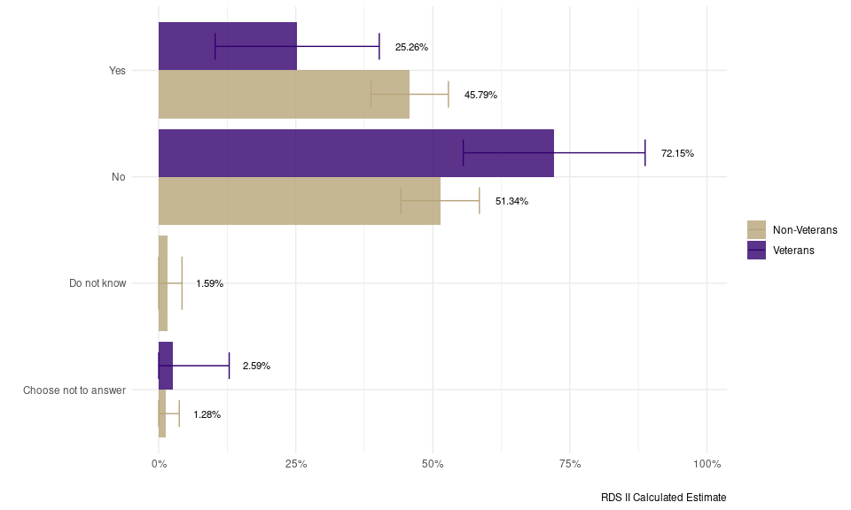

# Eviction

## *Ever Evicted*

*Imputed based on ‘15. Have you ever been evicted from a rental
property?’ [UWRDS] and ‘Now think about the last place you lived,
before you moved to your current residence. Were you forcibly evicted
from that last place you lived?’ [UWRDS-PSD]*

<table class="table table-striped" style="margin-left: auto; margin-right: auto;">
<caption>
Veterans
</caption>
<thead>
<tr>
<th style="text-align:left;">
Ever Evicted
</th>
<th style="text-align:right;">
Sample N
</th>
<th style="text-align:left;">
Sample Proportion
</th>
<th style="text-align:left;">
RDS II Estimate
</th>
<th style="text-align:left;">
RDS II 95% CI
</th>
</tr>
</thead>
<tbody>
<tr>
<td style="text-align:left;">
No
</td>
<td style="text-align:right;">
78
</td>
<td style="text-align:left;">
74.29%
</td>
<td style="text-align:left;">
78.9%
</td>
<td style="text-align:left;">
[64.4%, 93.4%]
</td>
</tr>
<tr>
<td style="text-align:left;">
Yes
</td>
<td style="text-align:right;">
27
</td>
<td style="text-align:left;">
25.71%
</td>
<td style="text-align:left;">
21.1%
</td>
<td style="text-align:left;">
[6.6%, 35.6%]
</td>
</tr>
<tr>
<td style="text-align:left;">
Total
</td>
<td style="text-align:right;">
105
</td>
<td style="text-align:left;">

-   </td>
    <td style="text-align:left;">

    -   </td>
        <td style="text-align:left;">

        -   </td>
            </tr>
            </tbody>
            </table>
            <table class="table table-striped" style="margin-left: auto; margin-right: auto;">
            <caption>
            Non-Veterans
            </caption>
            <thead>
            <tr>
            <th style="text-align:left;">
            Ever Evicted
            </th>
            <th style="text-align:right;">
            Sample N
            </th>
            <th style="text-align:left;">
            Sample Proportion
            </th>
            <th style="text-align:left;">
            RDS II Estimate
            </th>
            <th style="text-align:left;">
            RDS II 95% CI
            </th>
            </tr>
            </thead>
            <tbody>
            <tr>
            <td style="text-align:left;">
            No
            </td>
            <td style="text-align:right;">
            610
            </td>
            <td style="text-align:left;">
            74.75%
            </td>
            <td style="text-align:left;">
            75.4%
            </td>
            <td style="text-align:left;">
            [69.5%, 81.3%]
            </td>
            </tr>
            <tr>
            <td style="text-align:left;">
            Yes
            </td>
            <td style="text-align:right;">
            206
            </td>
            <td style="text-align:left;">
            25.25%
            </td>
            <td style="text-align:left;">
            24.6%
            </td>
            <td style="text-align:left;">
            [18.7%, 30.5%]
            </td>
            </tr>
            <tr>
            <td style="text-align:left;">
            Total
            </td>
            <td style="text-align:right;">
            816
            </td>
            <td style="text-align:left;">

            -   </td>
                <td style="text-align:left;">

                -   </td>
                    <td style="text-align:left;">

                    -   </td>
                        </tr>
                        </tbody>
                        </table>
                        

*The difference between individual veterans and non-veterans is not
significant, *χ*2 = 0.65, (p = 0.622). These results were
calculated based on the mean of 1000 bootstrapped tests. This value was
calculated with replacement.*

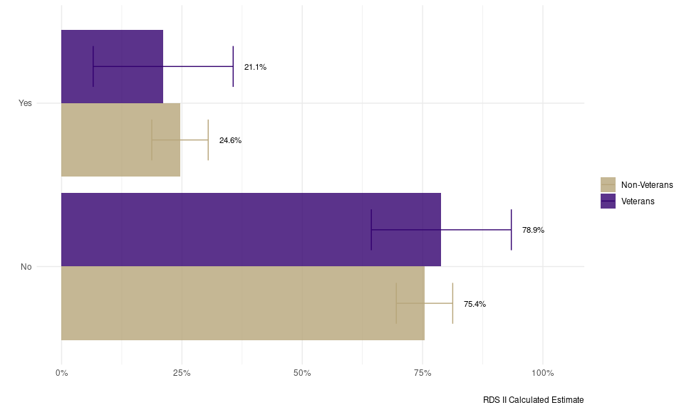

## *Age at Eviction*

*Imputed based on ‘15.1 How old were you? (please enter a number, for
example: 30) [if yes to ’15. Have you ever been evicted from a rental
property?’]’ This variable is not included for UWRDS-PSD survey
observations.*

<table class="table table-striped" style="margin-left: auto; margin-right: auto;">
<thead>
<tr>
<th style="text-align:left;">
Veteran Status
</th>
<th style="text-align:right;">
Sample N
</th>
<th style="text-align:right;">
Sample Median
</th>
<th style="text-align:right;">
Sample Mean
</th>
<th style="text-align:right;">
Sample SE
</th>
<th style="text-align:right;">
RDS II Estimate
</th>
<th style="text-align:left;">
RDS II 95% CI
</th>
</tr>
</thead>
<tbody>
<tr>
<td style="text-align:left;">
Non-Veterans
</td>
<td style="text-align:right;">
183
</td>
<td style="text-align:right;">
28
</td>
<td style="text-align:right;">
30.02
</td>
<td style="text-align:right;">
0.88
</td>
<td style="text-align:right;">
30.97
</td>
<td style="text-align:left;">
[27.24, 34.7]
</td>
</tr>
<tr>
<td style="text-align:left;">
Veterans
</td>
<td style="text-align:right;">
23
</td>
<td style="text-align:right;">
38
</td>
<td style="text-align:right;">
39.74
</td>
<td style="text-align:right;">
3.22
</td>
<td style="text-align:right;">
35.93
</td>
<td style="text-align:left;">
[29.92, 41.95]
</td>
</tr>
</tbody>
</table>

*The difference between individual veterans and non-veterans is not
significant, t(86.45) = 1.37, (p= 0.173).*

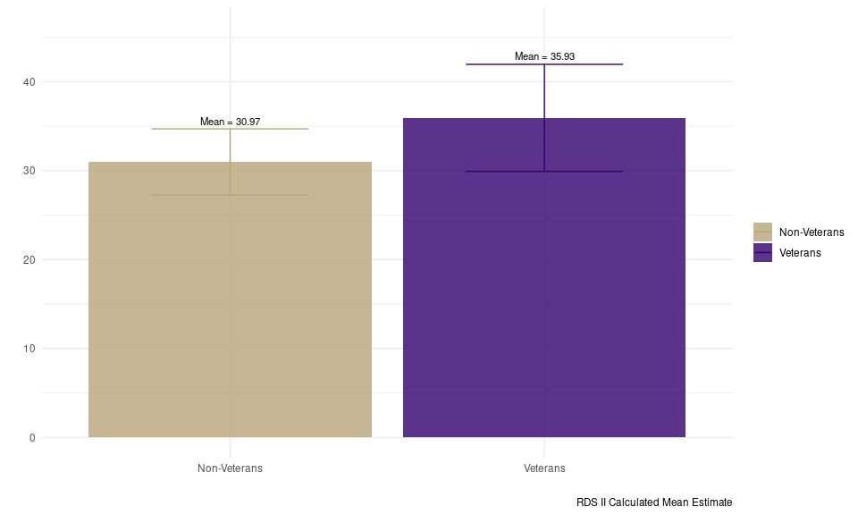

## *If Evicted, Ever Formally Evicted*

*‘15.2 Were you formally evicted by court order?’ This variable is not
included for UWRDS-PSD survey observations.*

<table class="table table-striped" style="margin-left: auto; margin-right: auto;">
<caption>
Veterans
</caption>
<thead>
<tr>
<th style="text-align:left;">
Ever Formally Evicted
</th>
<th style="text-align:right;">
Sample N
</th>
<th style="text-align:left;">
Sample Proportion
</th>
<th style="text-align:left;">
RDS II Estimate
</th>
<th style="text-align:left;">
RDS II 95% CI
</th>
</tr>
</thead>
<tbody>
<tr>
<td style="text-align:left;">
No
</td>
<td style="text-align:right;">
10
</td>
<td style="text-align:left;">
43.5%
</td>
<td style="text-align:left;">
45.7%
</td>
<td style="text-align:left;">
[7.7%, 83.7%]
</td>
</tr>
<tr>
<td style="text-align:left;">
Yes
</td>
<td style="text-align:right;">
13
</td>
<td style="text-align:left;">
56.5%
</td>
<td style="text-align:left;">
54.3%
</td>
<td style="text-align:left;">
[16.3%, 92.3%]
</td>
</tr>
<tr>
<td style="text-align:left;">
Total
</td>
<td style="text-align:right;">
23
</td>
<td style="text-align:left;">

-   </td>
    <td style="text-align:left;">

    -   </td>
        <td style="text-align:left;">

        -   </td>
            </tr>
            </tbody>
            </table>
            <table class="table table-striped" style="margin-left: auto; margin-right: auto;">
            <caption>
            Non-Veterans
            </caption>
            <thead>
            <tr>
            <th style="text-align:left;">
            Ever Formally Evicted
            </th>
            <th style="text-align:right;">
            Sample N
            </th>
            <th style="text-align:left;">
            Sample Proportion
            </th>
            <th style="text-align:left;">
            RDS II Estimate
            </th>
            <th style="text-align:left;">
            RDS II 95% CI
            </th>
            </tr>
            </thead>
            <tbody>
            <tr>
            <td style="text-align:left;">
            No
            </td>
            <td style="text-align:right;">
            97
            </td>
            <td style="text-align:left;">
            53.3%
            </td>
            <td style="text-align:left;">
            53.0%
            </td>
            <td style="text-align:left;">
            [38.1%, 67.8%]
            </td>
            </tr>
            <tr>
            <td style="text-align:left;">
            Yes
            </td>
            <td style="text-align:right;">
            85
            </td>
            <td style="text-align:left;">
            46.7%
            </td>
            <td style="text-align:left;">
            47.0%
            </td>
            <td style="text-align:left;">
            [32.2%, 61.9%]
            </td>
            </tr>
            <tr>
            <td style="text-align:left;">
            Total
            </td>
            <td style="text-align:right;">
            182
            </td>
            <td style="text-align:left;">

            -   </td>
                <td style="text-align:left;">

                -   </td>
                    <td style="text-align:left;">

                    -   </td>
                        </tr>
                        </tbody>
                        </table>
                        

*The difference between individual veterans and non-veterans is not
significant, *χ*2 = 0.34, (p = 0.54). These results were
calculated based on the mean of 1000 bootstrapped tests. This value was
calculated with replacement.*

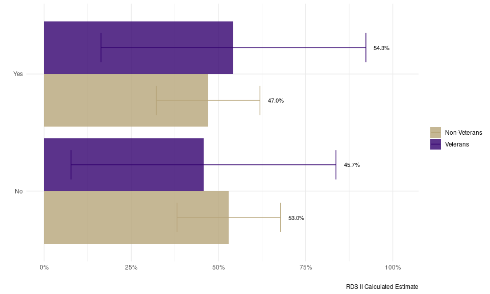

# Sleep Status

## *Location Slept Previous Night*

### *Where did you sleep last night?*

*Respondent’s sleep location based on ‘A. Regular residence’ in
[UWRDS-PSD] and ‘7. Where did you sleep last night?’ [UWRDS]*

<table class="table table-striped" style="margin-left: auto; margin-right: auto;">
<caption>
Veterans
</caption>
<thead>
<tr>
<th style="text-align:left;">
Sleep Location
</th>
<th style="text-align:right;">
Sample N
</th>
<th style="text-align:left;">
Sample Proportion
</th>
<th style="text-align:left;">
RDS II Estimate
</th>
<th style="text-align:left;">
RDS II 95% CI
</th>
</tr>
</thead>
<tbody>
<tr>
<td style="text-align:left;">
“Tiny home”
</td>
<td style="text-align:right;">
1
</td>
<td style="text-align:left;">
0.91%
</td>
<td style="text-align:left;">
0.15%
</td>
<td style="text-align:left;">
[0.04%, 0.25%]
</td>
</tr>
<tr>
<td style="text-align:left;">
Apartment
</td>
<td style="text-align:right;">
0
</td>
<td style="text-align:left;">
NA
</td>
<td style="text-align:left;">
NA
</td>
<td style="text-align:left;">
NA
</td>
</tr>
<tr>
<td style="text-align:left;">
Car or RV
</td>
<td style="text-align:right;">
10
</td>
<td style="text-align:left;">
9.09%
</td>
<td style="text-align:left;">
5.42%
</td>
<td style="text-align:left;">
[1.66%, 9.19%]
</td>
</tr>
<tr>
<td style="text-align:left;">
Homeless shelter or hotel
</td>
<td style="text-align:right;">
17
</td>
<td style="text-align:left;">
15.45%
</td>
<td style="text-align:left;">
14.89%
</td>
<td style="text-align:left;">
[5.02%, 24.77%]
</td>
</tr>
<tr>
<td style="text-align:left;">
Mobile home or trailer
</td>
<td style="text-align:right;">
0
</td>
<td style="text-align:left;">
NA
</td>
<td style="text-align:left;">
NA
</td>
<td style="text-align:left;">
NA
</td>
</tr>
<tr>
<td style="text-align:left;">
No residence, I sleep outdoors
</td>
<td style="text-align:right;">
29
</td>
<td style="text-align:left;">
26.36%
</td>
<td style="text-align:left;">
30.05%
</td>
<td style="text-align:left;">
[14.48%, 45.62%]
</td>
</tr>
<tr>
<td style="text-align:left;">
Single-family house
</td>
<td style="text-align:right;">
0
</td>
<td style="text-align:left;">
NA
</td>
<td style="text-align:left;">
NA
</td>
<td style="text-align:left;">
NA
</td>
</tr>
<tr>
<td style="text-align:left;">
Something else
</td>
<td style="text-align:right;">
34
</td>
<td style="text-align:left;">
30.91%
</td>
<td style="text-align:left;">
31.28%
</td>
<td style="text-align:left;">
[14.05%, 48.51%]
</td>
</tr>
<tr>
<td style="text-align:left;">
Tent or homemade structure
</td>
<td style="text-align:right;">
19
</td>
<td style="text-align:left;">
17.27%
</td>
<td style="text-align:left;">
18.21%
</td>
<td style="text-align:left;">
[4.11%, 32.30%]
</td>
</tr>
<tr>
<td style="text-align:left;">
Total
</td>
<td style="text-align:right;">
110
</td>
<td style="text-align:left;">

-   </td>
    <td style="text-align:left;">

    -   </td>
        <td style="text-align:left;">

        -   </td>
            </tr>
            </tbody>
            </table>
            <table class="table table-striped" style="margin-left: auto; margin-right: auto;">
            <caption>
            Non-Veterans
            </caption>
            <thead>
            <tr>
            <th style="text-align:left;">
            Sleep Location
            </th>
            <th style="text-align:right;">
            Sample N
            </th>
            <th style="text-align:left;">
            Sample Proportion
            </th>
            <th style="text-align:left;">
            RDS II Estimate
            </th>
            <th style="text-align:left;">
            RDS II 95% CI
            </th>
            </tr>
            </thead>
            <tbody>
            <tr>
            <td style="text-align:left;">
            “Tiny home”
            </td>
            <td style="text-align:right;">
            3
            </td>
            <td style="text-align:left;">
            0.31%
            </td>
            <td style="text-align:left;">
            0.32%
            </td>
            <td style="text-align:left;">
            [-0.02%, 0.65%]
            </td>
            </tr>
            <tr>
            <td style="text-align:left;">
            Apartment
            </td>
            <td style="text-align:right;">
            8
            </td>
            <td style="text-align:left;">
            0.83%
            </td>
            <td style="text-align:left;">
            1.34%
            </td>
            <td style="text-align:left;">
            [-0.35%, 3.02%]
            </td>
            </tr>
            <tr>
            <td style="text-align:left;">
            Car or RV
            </td>
            <td style="text-align:right;">
            148
            </td>
            <td style="text-align:left;">
            15.43%
            </td>
            <td style="text-align:left;">
            14.17%
            </td>
            <td style="text-align:left;">
            [10.14%, 18.19%]
            </td>
            </tr>
            <tr>
            <td style="text-align:left;">
            Homeless shelter or hotel
            </td>
            <td style="text-align:right;">
            82
            </td>
            <td style="text-align:left;">
            8.55%
            </td>
            <td style="text-align:left;">
            9.70%
            </td>
            <td style="text-align:left;">
            [5.02%, 14.37%]
            </td>
            </tr>
            <tr>
            <td style="text-align:left;">
            Mobile home or trailer
            </td>
            <td style="text-align:right;">
            2
            </td>
            <td style="text-align:left;">
            0.21%
            </td>
            <td style="text-align:left;">
            0.28%
            </td>
            <td style="text-align:left;">
            [-0.12%, 0.68%]
            </td>
            </tr>
            <tr>
            <td style="text-align:left;">
            No residence, I sleep outdoors
            </td>
            <td style="text-align:right;">
            219
            </td>
            <td style="text-align:left;">
            22.84%
            </td>
            <td style="text-align:left;">
            25.43%
            </td>
            <td style="text-align:left;">
            [19.61%, 31.24%]
            </td>
            </tr>
            <tr>
            <td style="text-align:left;">
            Single-family house
            </td>
            <td style="text-align:right;">
            3
            </td>
            <td style="text-align:left;">
            0.31%
            </td>
            <td style="text-align:left;">
            0.41%
            </td>
            <td style="text-align:left;">
            [-0.04%, 0.87%]
            </td>
            </tr>
            <tr>
            <td style="text-align:left;">
            Something else
            </td>
            <td style="text-align:right;">
            259
            </td>
            <td style="text-align:left;">
            27.01%
            </td>
            <td style="text-align:left;">
            26.30%
            </td>
            <td style="text-align:left;">
            [21.02%, 31.59%]
            </td>
            </tr>
            <tr>
            <td style="text-align:left;">
            Tent or homemade structure
            </td>
            <td style="text-align:right;">
            235
            </td>
            <td style="text-align:left;">
            24.50%
            </td>
            <td style="text-align:left;">
            22.06%
            </td>
            <td style="text-align:left;">
            [17.57%, 26.56%]
            </td>
            </tr>
            <tr>
            <td style="text-align:left;">
            Total
            </td>
            <td style="text-align:right;">
            959
            </td>
            <td style="text-align:left;">

            -   </td>
                <td style="text-align:left;">

                -   </td>
                    <td style="text-align:left;">

                    -   </td>
                        </tr>
                        </tbody>
                        </table>
                        

*The difference between individual veterans and non-veterans is not
significant, *χ*2 = 13.89, (p = 0.767). These results were
calculated based on the mean of 1000 bootstrapped tests. *

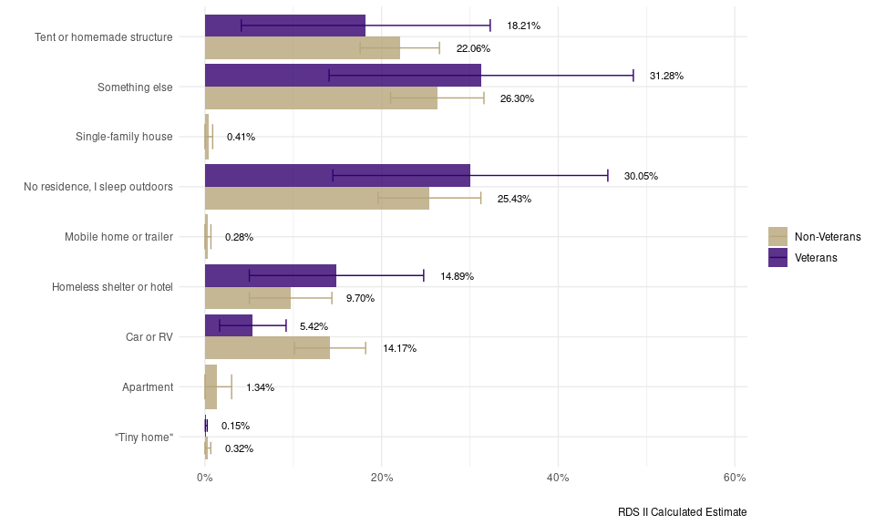

### *Re-coded: Where did you sleep last night?*

*7. Where did you sleep last night? - Imputed*

<table class="table table-striped" style="margin-left: auto; margin-right: auto;">
<caption>
Veterans
</caption>
<thead>
<tr>
<th style="text-align:left;">
Sleep Location
</th>
<th style="text-align:right;">
Sample N
</th>
<th style="text-align:left;">
Sample Proportion
</th>
<th style="text-align:left;">
RDS II Estimate
</th>
<th style="text-align:left;">
RDS II 95% CI
</th>
</tr>
</thead>
<tbody>
<tr>
<td style="text-align:left;">
Chose not to answer
</td>
<td style="text-align:right;">
0
</td>
<td style="text-align:left;">
NA
</td>
<td style="text-align:left;">
NA
</td>
<td style="text-align:left;">
NA
</td>
</tr>
<tr>
<td style="text-align:left;">
Commercial property (e.g. shops)
</td>
<td style="text-align:right;">
0
</td>
<td style="text-align:left;">
NA
</td>
<td style="text-align:left;">
NA
</td>
<td style="text-align:left;">
NA
</td>
</tr>
<tr>
<td style="text-align:left;">
Did not sleep
</td>
<td style="text-align:right;">
1
</td>
<td style="text-align:left;">
1.06%
</td>
<td style="text-align:left;">
0.26%
</td>
<td style="text-align:left;">
[0.09%, 0.43%]
</td>
</tr>
<tr>
<td style="text-align:left;">
Doubled-up: couchsurfing, staying with friend or family
</td>
<td style="text-align:right;">
8
</td>
<td style="text-align:left;">
8.51%
</td>
<td style="text-align:left;">
8.01%
</td>
<td style="text-align:left;">
[-2.80%, 18.83%]
</td>
</tr>
<tr>
<td style="text-align:left;">
Housed, other (e.g. in apartment, house)
</td>
<td style="text-align:right;">
7
</td>
<td style="text-align:left;">
7.45%
</td>
<td style="text-align:left;">
6.94%
</td>
<td style="text-align:left;">
[-1.05%, 14.93%]
</td>
</tr>
<tr>
<td style="text-align:left;">
In a car, truck, or van (smaller vehicle)
</td>
<td style="text-align:right;">
7
</td>
<td style="text-align:left;">
7.45%
</td>
<td style="text-align:left;">
3.46%
</td>
<td style="text-align:left;">
[1.14%, 5.79%]
</td>
</tr>
<tr>
<td style="text-align:left;">
In a hotel or motel
</td>
<td style="text-align:right;">
2
</td>
<td style="text-align:left;">
2.13%
</td>
<td style="text-align:left;">
1.62%
</td>
<td style="text-align:left;">
[0.95%, 2.29%]
</td>
</tr>
<tr>
<td style="text-align:left;">
In a park (uncovered, like on a bench)
</td>
<td style="text-align:right;">
2
</td>
<td style="text-align:left;">
2.13%
</td>
<td style="text-align:left;">
3.89%
</td>
<td style="text-align:left;">
[0.25%, 7.53%]
</td>
</tr>
<tr>
<td style="text-align:left;">
In a public facility or transit (bus/train station, transit center,
hospital waiting room)
</td>
<td style="text-align:right;">
6
</td>
<td style="text-align:left;">
6.38%
</td>
<td style="text-align:left;">
8.82%
</td>
<td style="text-align:left;">
[2.30%, 15.33%]
</td>
</tr>
<tr>
<td style="text-align:left;">
In an RV, trailer, or bus (larger vehicle)
</td>
<td style="text-align:right;">
2
</td>
<td style="text-align:left;">
2.13%
</td>
<td style="text-align:left;">
1.62%
</td>
<td style="text-align:left;">
[0.93%, 2.31%]
</td>
</tr>
<tr>
<td style="text-align:left;">
In an abandoned building/backyard or storage structure
</td>
<td style="text-align:right;">
1
</td>
<td style="text-align:left;">
1.06%
</td>
<td style="text-align:left;">
2.59%
</td>
<td style="text-align:left;">
[-10.02%, 15.20%]
</td>
</tr>
<tr>
<td style="text-align:left;">
In an overnight shelter (e.g. mission, church, resource shelter, etc.)
</td>
<td style="text-align:right;">
14
</td>
<td style="text-align:left;">
14.89%
</td>
<td style="text-align:left;">
15.25%
</td>
<td style="text-align:left;">
[4.05%, 26.46%]
</td>
</tr>
<tr>
<td style="text-align:left;">
Institutions such as jails, hospitals, or nursing facilities
</td>
<td style="text-align:right;">
0
</td>
<td style="text-align:left;">
NA
</td>
<td style="text-align:left;">
NA
</td>
<td style="text-align:left;">
NA
</td>
</tr>
<tr>
<td style="text-align:left;">
Maritime accommodation (e.g. boats, cargo)
</td>
<td style="text-align:right;">
1
</td>
<td style="text-align:left;">
1.06%
</td>
<td style="text-align:left;">
0.22%
</td>
<td style="text-align:left;">
[0.03%, 0.40%]
</td>
</tr>
<tr>
<td style="text-align:left;">
Outside in a tent (or tent-like structure)
</td>
<td style="text-align:right;">
14
</td>
<td style="text-align:left;">
14.89%
</td>
<td style="text-align:left;">
16.02%
</td>
<td style="text-align:left;">
[1.14%, 30.90%]
</td>
</tr>
<tr>
<td style="text-align:left;">
Outside, not in a tent
</td>
<td style="text-align:right;">
22
</td>
<td style="text-align:left;">
23.40%
</td>
<td style="text-align:left;">
24.72%
</td>
<td style="text-align:left;">
[10.12%, 39.33%]
</td>
</tr>
<tr>
<td style="text-align:left;">
Subsidized housing, housing vouchers
</td>
<td style="text-align:right;">
1
</td>
<td style="text-align:left;">
1.06%
</td>
<td style="text-align:left;">
0.86%
</td>
<td style="text-align:left;">
[-1.25%, 2.98%]
</td>
</tr>
<tr>
<td style="text-align:left;">
Tiny homes (not self-constructed)
</td>
<td style="text-align:right;">
1
</td>
<td style="text-align:left;">
1.06%
</td>
<td style="text-align:left;">
0.17%
</td>
<td style="text-align:left;">
[0.03%, 0.31%]
</td>
</tr>
<tr>
<td style="text-align:left;">
Transitional, supportive, or halfway housing
</td>
<td style="text-align:right;">
2
</td>
<td style="text-align:left;">
2.13%
</td>
<td style="text-align:left;">
2.77%
</td>
<td style="text-align:left;">
[-9.32%, 14.85%]
</td>
</tr>
<tr>
<td style="text-align:left;">
Unsure, unknown, ambiguous
</td>
<td style="text-align:right;">
3
</td>
<td style="text-align:left;">
3.19%
</td>
<td style="text-align:left;">
2.77%
</td>
<td style="text-align:left;">
[-0.54%, 6.07%]
</td>
</tr>
<tr>
<td style="text-align:left;">
Workplace
</td>
<td style="text-align:right;">
0
</td>
<td style="text-align:left;">
NA
</td>
<td style="text-align:left;">
NA
</td>
<td style="text-align:left;">
NA
</td>
</tr>
<tr>
<td style="text-align:left;">
Total
</td>
<td style="text-align:right;">
94
</td>
<td style="text-align:left;">

-   </td>
    <td style="text-align:left;">

    -   </td>
        <td style="text-align:left;">

        -   </td>
            </tr>
            </tbody>
            </table>
            <table class="table table-striped" style="margin-left: auto; margin-right: auto;">
            <caption>
            Non-Veterans
            </caption>
            <thead>
            <tr>
            <th style="text-align:left;">
            Sleep Location
            </th>
            <th style="text-align:right;">
            Sample N
            </th>
            <th style="text-align:left;">
            Sample Proportion
            </th>
            <th style="text-align:left;">
            RDS II Estimate
            </th>
            <th style="text-align:left;">
            RDS II 95% CI
            </th>
            </tr>
            </thead>
            <tbody>
            <tr>
            <td style="text-align:left;">
            Chose not to answer
            </td>
            <td style="text-align:right;">
            2
            </td>
            <td style="text-align:left;">
            0.27%
            </td>
            <td style="text-align:left;">
            0.24%
            </td>
            <td style="text-align:left;">
            [-0.24%, 0.71%]
            </td>
            </tr>
            <tr>
            <td style="text-align:left;">
            Commercial property (e.g. shops)
            </td>
            <td style="text-align:right;">
            1
            </td>
            <td style="text-align:left;">
            0.13%
            </td>
            <td style="text-align:left;">
            0.19%
            </td>
            <td style="text-align:left;">
            [-0.40%, 0.78%]
            </td>
            </tr>
            <tr>
            <td style="text-align:left;">
            Did not sleep
            </td>
            <td style="text-align:right;">
            17
            </td>
            <td style="text-align:left;">
            2.27%
            </td>
            <td style="text-align:left;">
            1.86%
            </td>
            <td style="text-align:left;">
            [0.87%, 2.85%]
            </td>
            </tr>
            <tr>
            <td style="text-align:left;">
            Doubled-up: couchsurfing, staying with friend or family
            </td>
            <td style="text-align:right;">
            103
            </td>
            <td style="text-align:left;">
            13.73%
            </td>
            <td style="text-align:left;">
            12.78%
            </td>
            <td style="text-align:left;">
            [8.15%, 17.41%]
            </td>
            </tr>
            <tr>
            <td style="text-align:left;">
            Housed, other (e.g. in apartment, house)
            </td>
            <td style="text-align:right;">
            42
            </td>
            <td style="text-align:left;">
            5.60%
            </td>
            <td style="text-align:left;">
            5.44%
            </td>
            <td style="text-align:left;">
            [2.87%, 8.00%]
            </td>
            </tr>
            <tr>
            <td style="text-align:left;">
            In a car, truck, or van (smaller vehicle)
            </td>
            <td style="text-align:right;">
            73
            </td>
            <td style="text-align:left;">
            9.73%
            </td>
            <td style="text-align:left;">
            9.92%
            </td>
            <td style="text-align:left;">
            [5.45%, 14.38%]
            </td>
            </tr>
            <tr>
            <td style="text-align:left;">
            In a hotel or motel
            </td>
            <td style="text-align:right;">
            18
            </td>
            <td style="text-align:left;">
            2.40%
            </td>
            <td style="text-align:left;">
            3.12%
            </td>
            <td style="text-align:left;">
            [0.09%, 6.16%]
            </td>
            </tr>
            <tr>
            <td style="text-align:left;">
            In a park (uncovered, like on a bench)
            </td>
            <td style="text-align:right;">
            17
            </td>
            <td style="text-align:left;">
            2.27%
            </td>
            <td style="text-align:left;">
            2.16%
            </td>
            <td style="text-align:left;">
            [1.22%, 3.10%]
            </td>
            </tr>
            <tr>
            <td style="text-align:left;">
            In a public facility or transit (bus/train station, transit
            center, hospital waiting room)
            </td>
            <td style="text-align:right;">
            35
            </td>
            <td style="text-align:left;">
            4.67%
            </td>
            <td style="text-align:left;">
            5.40%
            </td>
            <td style="text-align:left;">
            [2.11%, 8.70%]
            </td>
            </tr>
            <tr>
            <td style="text-align:left;">
            In an RV, trailer, or bus (larger vehicle)
            </td>
            <td style="text-align:right;">
            44
            </td>
            <td style="text-align:left;">
            5.87%
            </td>
            <td style="text-align:left;">
            4.69%
            </td>
            <td style="text-align:left;">
            [2.71%, 6.67%]
            </td>
            </tr>
            <tr>
            <td style="text-align:left;">
            In an abandoned building/backyard or storage structure
            </td>
            <td style="text-align:right;">
            14
            </td>
            <td style="text-align:left;">
            1.87%
            </td>
            <td style="text-align:left;">
            1.65%
            </td>
            <td style="text-align:left;">
            [1.14%, 2.16%]
            </td>
            </tr>
            <tr>
            <td style="text-align:left;">
            In an overnight shelter (e.g. mission, church, resource
            shelter, etc.)
            </td>
            <td style="text-align:right;">
            48
            </td>
            <td style="text-align:left;">
            6.40%
            </td>
            <td style="text-align:left;">
            7.69%
            </td>
            <td style="text-align:left;">
            [2.39%, 13.00%]
            </td>
            </tr>
            <tr>
            <td style="text-align:left;">
            Institutions such as jails, hospitals, or nursing facilities
            </td>
            <td style="text-align:right;">
            2
            </td>
            <td style="text-align:left;">
            0.27%
            </td>
            <td style="text-align:left;">
            0.32%
            </td>
            <td style="text-align:left;">
            [-0.04%, 0.67%]
            </td>
            </tr>
            <tr>
            <td style="text-align:left;">
            Maritime accommodation (e.g. boats, cargo)
            </td>
            <td style="text-align:right;">
            1
            </td>
            <td style="text-align:left;">
            0.13%
            </td>
            <td style="text-align:left;">
            0.13%
            </td>
            <td style="text-align:left;">
            [0.07%, 0.19%]
            </td>
            </tr>
            <tr>
            <td style="text-align:left;">
            Outside in a tent (or tent-like structure)
            </td>
            <td style="text-align:right;">
            179
            </td>
            <td style="text-align:left;">
            23.87%
            </td>
            <td style="text-align:left;">
            21.22%
            </td>
            <td style="text-align:left;">
            [16.17%, 26.28%]
            </td>
            </tr>
            <tr>
            <td style="text-align:left;">
            Outside, not in a tent
            </td>
            <td style="text-align:right;">
            140
            </td>
            <td style="text-align:left;">
            18.67%
            </td>
            <td style="text-align:left;">
            21.08%
            </td>
            <td style="text-align:left;">
            [14.47%, 27.68%]
            </td>
            </tr>
            <tr>
            <td style="text-align:left;">
            Subsidized housing, housing vouchers
            </td>
            <td style="text-align:right;">
            3
            </td>
            <td style="text-align:left;">
            0.40%
            </td>
            <td style="text-align:left;">
            0.54%
            </td>
            <td style="text-align:left;">
            [-1.34%, 2.43%]
            </td>
            </tr>
            <tr>
            <td style="text-align:left;">
            Tiny homes (not self-constructed)
            </td>
            <td style="text-align:right;">
            2
            </td>
            <td style="text-align:left;">
            0.27%
            </td>
            <td style="text-align:left;">
            0.24%
            </td>
            <td style="text-align:left;">
            [-0.09%, 0.57%]
            </td>
            </tr>
            <tr>
            <td style="text-align:left;">
            Transitional, supportive, or halfway housing
            </td>
            <td style="text-align:right;">
            1
            </td>
            <td style="text-align:left;">
            0.13%
            </td>
            <td style="text-align:left;">
            0.05%
            </td>
            <td style="text-align:left;">
            [0.04%, 0.07%]
            </td>
            </tr>
            <tr>
            <td style="text-align:left;">
            Unsure, unknown, ambiguous
            </td>
            <td style="text-align:right;">
            7
            </td>
            <td style="text-align:left;">
            0.93%
            </td>
            <td style="text-align:left;">
            1.15%
            </td>
            <td style="text-align:left;">
            [-0.35%, 2.65%]
            </td>
            </tr>
            <tr>
            <td style="text-align:left;">
            Workplace
            </td>
            <td style="text-align:right;">
            1
            </td>
            <td style="text-align:left;">
            0.13%
            </td>
            <td style="text-align:left;">
            0.13%
            </td>
            <td style="text-align:left;">
            [0.10%, 0.16%]
            </td>
            </tr>
            <tr>
            <td style="text-align:left;">
            Total
            </td>
            <td style="text-align:right;">
            750
            </td>
            <td style="text-align:left;">

            -   </td>
                <td style="text-align:left;">

                -   </td>
                    <td style="text-align:left;">

                    -   </td>
                        </tr>
                        </tbody>
                        </table>
                        

*The difference between individual veterans and non-veterans is not
significant, *χ*2 = 39.58, (p = 0.892). These results were
calculated based on the mean of 1000 bootstrapped tests. *

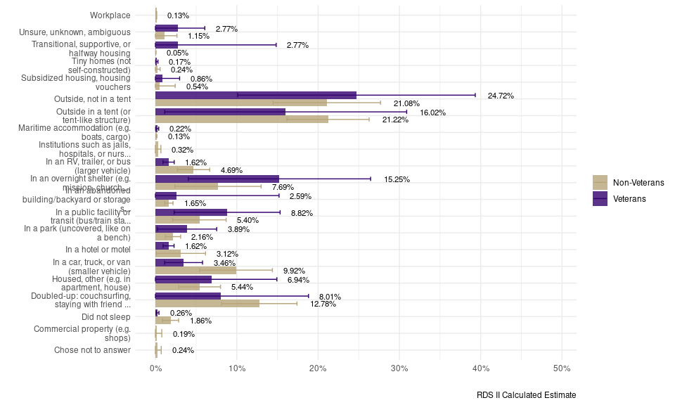

## *Sheltered vs. Unsheltered*

*Binary variable representing sheltered status based on previous sleep
location for respondent*

<table class="table table-striped" style="margin-left: auto; margin-right: auto;">
<caption>
Veterans
</caption>
<thead>
<tr>
<th style="text-align:left;">
Sheltered vs. Unsheltered
</th>
<th style="text-align:right;">
Sample N
</th>
<th style="text-align:left;">
Sample Proportion
</th>
<th style="text-align:left;">
RDS II Estimate
</th>
<th style="text-align:left;">
RDS II 95% CI
</th>
</tr>
</thead>
<tbody>
<tr>
<td style="text-align:left;">
Sheltered
</td>
<td style="text-align:right;">
21
</td>
<td style="text-align:left;">
24%
</td>
<td style="text-align:left;">
22.1%
</td>
<td style="text-align:left;">
[5.9%, 38.4%]
</td>
</tr>
<tr>
<td style="text-align:left;">
Unsheltered
</td>
<td style="text-align:right;">
67
</td>
<td style="text-align:left;">
76%
</td>
<td style="text-align:left;">
77.9%
</td>
<td style="text-align:left;">
[61.6%, 94.1%]
</td>
</tr>
<tr>
<td style="text-align:left;">
Total
</td>
<td style="text-align:right;">
88
</td>
<td style="text-align:left;">

-   </td>
    <td style="text-align:left;">

    -   </td>
        <td style="text-align:left;">

        -   </td>
            </tr>
            </tbody>
            </table>
            <table class="table table-striped" style="margin-left: auto; margin-right: auto;">
            <caption>
            Non-Veterans
            </caption>
            <thead>
            <tr>
            <th style="text-align:left;">
            Sheltered vs. Unsheltered
            </th>
            <th style="text-align:right;">
            Sample N
            </th>
            <th style="text-align:left;">
            Sample Proportion
            </th>
            <th style="text-align:left;">
            RDS II Estimate
            </th>
            <th style="text-align:left;">
            RDS II 95% CI
            </th>
            </tr>
            </thead>
            <tbody>
            <tr>
            <td style="text-align:left;">
            Sheltered
            </td>
            <td style="text-align:right;">
            89
            </td>
            <td style="text-align:left;">
            12%
            </td>
            <td style="text-align:left;">
            13.2%
            </td>
            <td style="text-align:left;">
            [7.2%, 19.1%]
            </td>
            </tr>
            <tr>
            <td style="text-align:left;">
            Unsheltered
            </td>
            <td style="text-align:right;">
            673
            </td>
            <td style="text-align:left;">
            88%
            </td>
            <td style="text-align:left;">
            86.8%
            </td>
            <td style="text-align:left;">
            [80.9%, 92.8%]
            </td>
            </tr>
            <tr>
            <td style="text-align:left;">
            Total
            </td>
            <td style="text-align:right;">
            762
            </td>
            <td style="text-align:left;">

            -   </td>
                <td style="text-align:left;">

                -   </td>
                    <td style="text-align:left;">

                    -   </td>
                        </tr>
                        </tbody>
                        </table>
                        

*The difference between individual veterans and non-veterans is not
significant, *χ*2 = 5.61, (p = 0.321). These results were
calculated based on the mean of 1000 bootstrapped tests. This value was
calculated with replacement.*

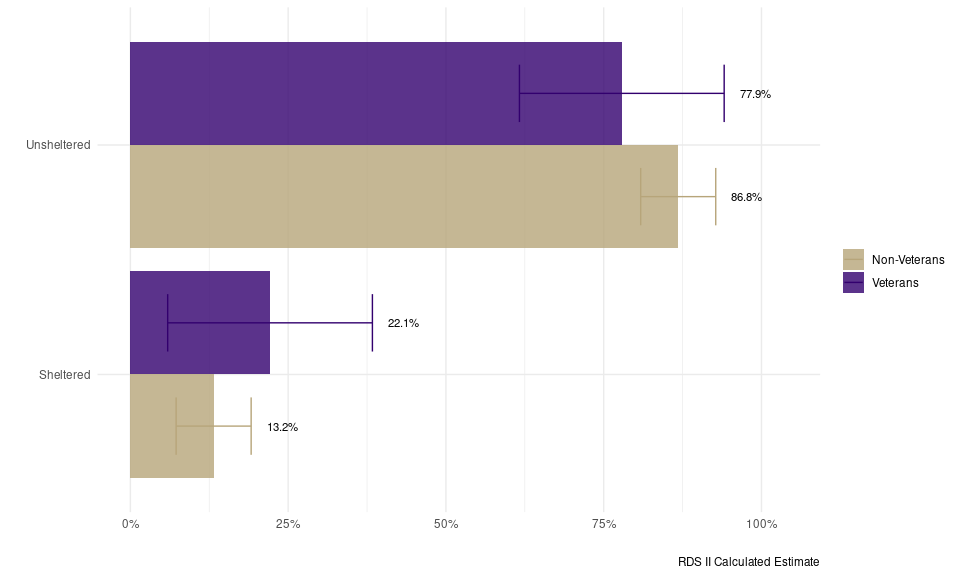

## *Would Accept Shelter*

*‘12. If you were offered a space in an emergency shelter this week,
would you accept?’ This variable is not included for UWRDS-PSD survey
observations.*

<table class="table table-striped" style="margin-left: auto; margin-right: auto;">
<caption>
Veterans
</caption>
<thead>
<tr>
<th style="text-align:left;">
Would Accept Shelter
</th>
<th style="text-align:right;">
Sample N
</th>
<th style="text-align:left;">
Sample Proportion
</th>
<th style="text-align:left;">
RDS II Estimate
</th>
<th style="text-align:left;">
RDS II 95% CI
</th>
</tr>
</thead>
<tbody>
<tr>
<td style="text-align:left;">
No
</td>
<td style="text-align:right;">
49
</td>
<td style="text-align:left;">
51.58%
</td>
<td style="text-align:left;">
51.8%
</td>
<td style="text-align:left;">
[33.78%, 69.9%]
</td>
</tr>
<tr>
<td style="text-align:left;">
Prefer not to answer
</td>
<td style="text-align:right;">
3
</td>
<td style="text-align:left;">
3.16%
</td>
<td style="text-align:left;">
2.0%
</td>
<td style="text-align:left;">
[0.12%, 3.8%]
</td>
</tr>
<tr>
<td style="text-align:left;">
Yes
</td>
<td style="text-align:right;">
43
</td>
<td style="text-align:left;">
45.26%
</td>
<td style="text-align:left;">
46.2%
</td>
<td style="text-align:left;">
[28.10%, 64.3%]
</td>
</tr>
<tr>
<td style="text-align:left;">
Total
</td>
<td style="text-align:right;">
95
</td>
<td style="text-align:left;">

-   </td>
    <td style="text-align:left;">

    -   </td>
        <td style="text-align:left;">

        -   </td>
            </tr>
            </tbody>
            </table>
            <table class="table table-striped" style="margin-left: auto; margin-right: auto;">
            <caption>
            Non-Veterans
            </caption>
            <thead>
            <tr>
            <th style="text-align:left;">
            Would Accept Shelter
            </th>
            <th style="text-align:right;">
            Sample N
            </th>
            <th style="text-align:left;">
            Sample Proportion
            </th>
            <th style="text-align:left;">
            RDS II Estimate
            </th>
            <th style="text-align:left;">
            RDS II 95% CI
            </th>
            </tr>
            </thead>
            <tbody>
            <tr>
            <td style="text-align:left;">
            No
            </td>
            <td style="text-align:right;">
            295
            </td>
            <td style="text-align:left;">
            39.39%
            </td>
            <td style="text-align:left;">
            40.0%
            </td>
            <td style="text-align:left;">
            [33.12%, 46.9%]
            </td>
            </tr>
            <tr>
            <td style="text-align:left;">
            Prefer not to answer
            </td>
            <td style="text-align:right;">
            29
            </td>
            <td style="text-align:left;">
            3.87%
            </td>
            <td style="text-align:left;">
            4.2%
            </td>
            <td style="text-align:left;">
            [0.71%, 7.7%]
            </td>
            </tr>
            <tr>
            <td style="text-align:left;">
            Yes
            </td>
            <td style="text-align:right;">
            425
            </td>
            <td style="text-align:left;">
            56.74%
            </td>
            <td style="text-align:left;">
            55.8%
            </td>
            <td style="text-align:left;">
            [48.72%, 62.9%]
            </td>
            </tr>
            <tr>
            <td style="text-align:left;">
            Total
            </td>
            <td style="text-align:right;">
            749
            </td>
            <td style="text-align:left;">

            -   </td>
                <td style="text-align:left;">

                -   </td>
                    <td style="text-align:left;">

                    -   </td>
                        </tr>
                        </tbody>
                        </table>
                        

*The difference between individual veterans and non-veterans is not
significant, *χ*2 = 5.55, (p = 0.099). These results were
calculated based on the mean of 1000 bootstrapped tests. This value was
calculated with replacement.*

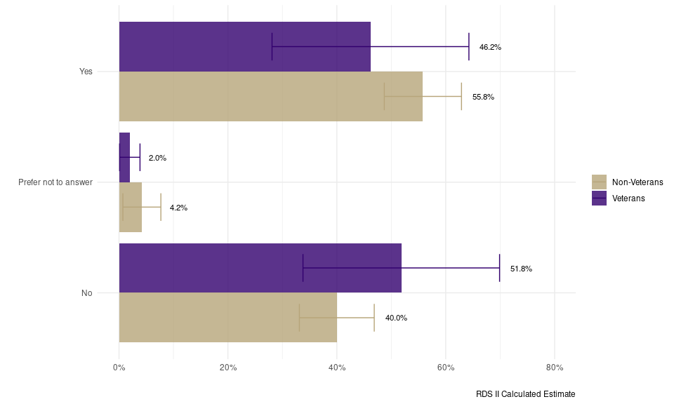

## *If Accepting, Shelter Preference*

*Variable based on Which of the following would you prefer for an
emergency shelter? - Imputed. This variable is not included for
UWRDS-PSD survey observations.*

<table class="table table-striped" style="margin-left: auto; margin-right: auto;">
<caption>
Veterans
</caption>
<thead>
<tr>
<th style="text-align:left;">
Shelter Preference
</th>
<th style="text-align:right;">
Sample N
</th>
<th style="text-align:left;">
Sample Proportion
</th>
<th style="text-align:left;">
RDS II Estimate
</th>
<th style="text-align:left;">
RDS II 95% CI
</th>
</tr>
</thead>
<tbody>
<tr>
<td style="text-align:left;">
Prefers Hotel or Motel
</td>
<td style="text-align:right;">
5
</td>
<td style="text-align:left;">
50.0%
</td>
<td style="text-align:left;">
65.8%
</td>
<td style="text-align:left;">
[16.3%, 115.3%]
</td>
</tr>
<tr>
<td style="text-align:left;">
Prefers Indoor Overnight Shelter
</td>
<td style="text-align:right;">
1
</td>
<td style="text-align:left;">
10.0%
</td>
<td style="text-align:left;">
2.2%
</td>
<td style="text-align:left;">
[-2.1%, 6.5%]
</td>
</tr>
<tr>
<td style="text-align:left;">
Prefers Safe Parking Space to Live in Vehicle
</td>
<td style="text-align:right;">
1
</td>
<td style="text-align:left;">
10.0%
</td>
<td style="text-align:left;">
11.0%
</td>
<td style="text-align:left;">
[3.7%, 18.2%]
</td>
</tr>
<tr>
<td style="text-align:left;">
Prefers Tiny House Village
</td>
<td style="text-align:right;">
3
</td>
<td style="text-align:left;">
30.0%
</td>
<td style="text-align:left;">
21.0%
</td>
<td style="text-align:left;">
[-26.8%, 68.8%]
</td>
</tr>
<tr>
<td style="text-align:left;">
Total
</td>
<td style="text-align:right;">
10
</td>
<td style="text-align:left;">

-   </td>
    <td style="text-align:left;">

    -   </td>
        <td style="text-align:left;">

        -   </td>
            </tr>
            </tbody>
            </table>
            <table class="table table-striped" style="margin-left: auto; margin-right: auto;">
            <caption>
            Non-Veterans
            </caption>
            <thead>
            <tr>
            <th style="text-align:left;">
            Shelter Preference
            </th>
            <th style="text-align:right;">
            Sample N
            </th>
            <th style="text-align:left;">
            Sample Proportion
            </th>
            <th style="text-align:left;">
            RDS II Estimate
            </th>
            <th style="text-align:left;">
            RDS II 95% CI
            </th>
            </tr>
            </thead>
            <tbody>
            <tr>
            <td style="text-align:left;">
            Prefers Hotel or Motel
            </td>
            <td style="text-align:right;">
            77
            </td>
            <td style="text-align:left;">
            62.1%
            </td>
            <td style="text-align:left;">
            55.3%
            </td>
            <td style="text-align:left;">
            [37.7%, 72.9%]
            </td>
            </tr>
            <tr>
            <td style="text-align:left;">
            Prefers Indoor Overnight Shelter
            </td>
            <td style="text-align:right;">
            17
            </td>
            <td style="text-align:left;">
            13.7%
            </td>
            <td style="text-align:left;">
            13.2%
            </td>
            <td style="text-align:left;">
            [6.4%, 20.0%]
            </td>
            </tr>
            <tr>
            <td style="text-align:left;">
            Prefers Safe Parking Space to Live in Vehicle
            </td>
            <td style="text-align:right;">
            4
            </td>
            <td style="text-align:left;">
            3.2%
            </td>
            <td style="text-align:left;">
            4.3%
            </td>
            <td style="text-align:left;">
            [-3.9%, 12.4%]
            </td>
            </tr>
            <tr>
            <td style="text-align:left;">
            Prefers Tiny House Village
            </td>
            <td style="text-align:right;">
            26
            </td>
            <td style="text-align:left;">
            21.0%
            </td>
            <td style="text-align:left;">
            27.2%
            </td>
            <td style="text-align:left;">
            [9.4%, 45.1%]
            </td>
            </tr>
            <tr>
            <td style="text-align:left;">
            Total
            </td>
            <td style="text-align:right;">
            124
            </td>
            <td style="text-align:left;">

            -   </td>
                <td style="text-align:left;">

                -   </td>
                    <td style="text-align:left;">

                    -   </td>
                        </tr>
                        </tbody>
                        </table>
                        

*The difference between individual veterans and non-veterans is not
significant, *χ*2 = 2.43, (p = 0.837). These results were
calculated based on the mean of 1000 bootstrapped tests. This value was
calculated with replacement.*

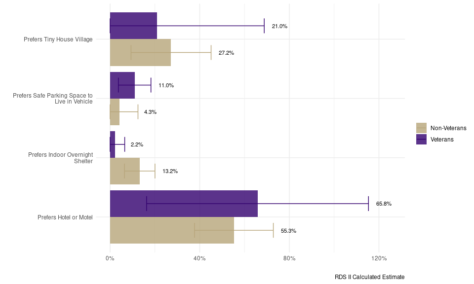

# Experience of Homelessness

## *First Year Experiencing Homelessness*

*‘10. What year was your first experience of homelessness?’ This
variable is not included for UWRDS-PSD survey observations.*

<table class="table table-striped" style="margin-left: auto; margin-right: auto;">
<thead>
<tr>
<th style="text-align:left;">
Veteran Status
</th>
<th style="text-align:right;">
Sample N
</th>
<th style="text-align:right;">
Sample Median
</th>
<th style="text-align:right;">
Sample Mean
</th>
<th style="text-align:right;">
Sample SE
</th>
<th style="text-align:right;">
RDS II Estimate
</th>
<th style="text-align:left;">
RDS II 95% CI
</th>
</tr>
</thead>
<tbody>
<tr>
<td style="text-align:left;">
Non-Veterans
</td>
<td style="text-align:right;">
744
</td>
<td style="text-align:right;">
2014
</td>
<td style="text-align:right;">
2010.40
</td>
<td style="text-align:right;">
0.42
</td>
<td style="text-align:right;">
2010.73
</td>
<td style="text-align:left;">
[2009.02, 2012.44]
</td>
</tr>
<tr>
<td style="text-align:left;">
Veterans
</td>
<td style="text-align:right;">
95
</td>
<td style="text-align:right;">
2012
</td>
<td style="text-align:right;">
2006.99
</td>
<td style="text-align:right;">
1.54
</td>
<td style="text-align:right;">
2007.37
</td>
<td style="text-align:left;">
[2002.57, 2012.18]
</td>
</tr>
</tbody>
</table>

*The difference between individual veterans and non-veterans is not
significant, t(375.24) = -1.29, (p= 0.198).*

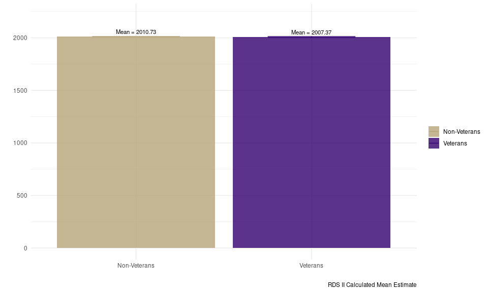

## *Time Experiencing Homelessness*

*Imputed based on ‘About how long have you been homeless’ [UWRDS-PSD]
and ‘17. How long have you been homeless this time?’ [UWRDS-PSD]*

<table class="table table-striped" style="margin-left: auto; margin-right: auto;">
<caption>
Veterans
</caption>
<thead>
<tr>
<th style="text-align:left;">
Duration Homeless
</th>
<th style="text-align:right;">
Sample N
</th>
<th style="text-align:left;">
Sample Proportion
</th>
<th style="text-align:left;">
RDS II Estimate
</th>
<th style="text-align:left;">
RDS II 95% CI
</th>
</tr>
</thead>
<tbody>
<tr>
<td style="text-align:left;">
Above one year
</td>
<td style="text-align:right;">
77
</td>
<td style="text-align:left;">
71.30%
</td>
<td style="text-align:left;">
68.13%
</td>
<td style="text-align:left;">
[52.98%, 83.28%]
</td>
</tr>
<tr>
<td style="text-align:left;">
Choose not to answer
</td>
<td style="text-align:right;">
0
</td>
<td style="text-align:left;">
NA
</td>
<td style="text-align:left;">
NA
</td>
<td style="text-align:left;">
NA
</td>
</tr>
<tr>
<td style="text-align:left;">
Do not know
</td>
<td style="text-align:right;">
3
</td>
<td style="text-align:left;">
2.78%
</td>
<td style="text-align:left;">
0.85%
</td>
<td style="text-align:left;">
[0.13%, 1.57%]
</td>
</tr>
<tr>
<td style="text-align:left;">
Less than a month
</td>
<td style="text-align:right;">
2
</td>
<td style="text-align:left;">
1.85%
</td>
<td style="text-align:left;">
3.37%
</td>
<td style="text-align:left;">
[-5.64%, 12.37%]
</td>
</tr>
<tr>
<td style="text-align:left;">
More than a month but Less than a year
</td>
<td style="text-align:right;">
26
</td>
<td style="text-align:left;">
24.07%
</td>
<td style="text-align:left;">
27.66%
</td>
<td style="text-align:left;">
[13.99%, 41.33%]
</td>
</tr>
<tr>
<td style="text-align:left;">
Total
</td>
<td style="text-align:right;">
108
</td>
<td style="text-align:left;">

-   </td>
    <td style="text-align:left;">

    -   </td>
        <td style="text-align:left;">

        -   </td>
            </tr>
            </tbody>
            </table>
            <table class="table table-striped" style="margin-left: auto; margin-right: auto;">
            <caption>
            Non-Veterans
            </caption>
            <thead>
            <tr>
            <th style="text-align:left;">
            Duration Homeless
            </th>
            <th style="text-align:right;">
            Sample N
            </th>
            <th style="text-align:left;">
            Sample Proportion
            </th>
            <th style="text-align:left;">
            RDS II Estimate
            </th>
            <th style="text-align:left;">
            RDS II 95% CI
            </th>
            </tr>
            </thead>
            <tbody>
            <tr>
            <td style="text-align:left;">
            Above one year
            </td>
            <td style="text-align:right;">
            639
            </td>
            <td style="text-align:left;">
            73.20%
            </td>
            <td style="text-align:left;">
            69.85%
            </td>
            <td style="text-align:left;">
            [63.29%, 76.42%]
            </td>
            </tr>
            <tr>
            <td style="text-align:left;">
            Choose not to answer
            </td>
            <td style="text-align:right;">
            13
            </td>
            <td style="text-align:left;">
            1.49%
            </td>
            <td style="text-align:left;">
            1.79%
            </td>
            <td style="text-align:left;">
            [-0.61%, 4.19%]
            </td>
            </tr>
            <tr>
            <td style="text-align:left;">
            Do not know
            </td>
            <td style="text-align:right;">
            7
            </td>
            <td style="text-align:left;">
            0.80%
            </td>
            <td style="text-align:left;">
            0.73%
            </td>
            <td style="text-align:left;">
            [0.10%, 1.36%]
            </td>
            </tr>
            <tr>
            <td style="text-align:left;">
            Less than a month
            </td>
            <td style="text-align:right;">
            46
            </td>
            <td style="text-align:left;">
            5.27%
            </td>
            <td style="text-align:left;">
            6.45%
            </td>
            <td style="text-align:left;">
            [2.76%, 10.13%]
            </td>
            </tr>
            <tr>
            <td style="text-align:left;">
            More than a month but Less than a year
            </td>
            <td style="text-align:right;">
            168
            </td>
            <td style="text-align:left;">
            19.24%
            </td>
            <td style="text-align:left;">
            21.18%
            </td>
            <td style="text-align:left;">
            [15.26%, 27.09%]
            </td>
            </tr>
            <tr>
            <td style="text-align:left;">
            Total
            </td>
            <td style="text-align:right;">
            873
            </td>
            <td style="text-align:left;">

            -   </td>
                <td style="text-align:left;">

                -   </td>
                    <td style="text-align:left;">

                    -   </td>
                        </tr>
                        </tbody>
                        </table>
                        

*The difference between individual veterans and non-veterans is not
significant, *χ*2 = 5.68, (p = 0.786). These results were
calculated based on the mean of 1000 bootstrapped tests. This value was
calculated with replacement.*

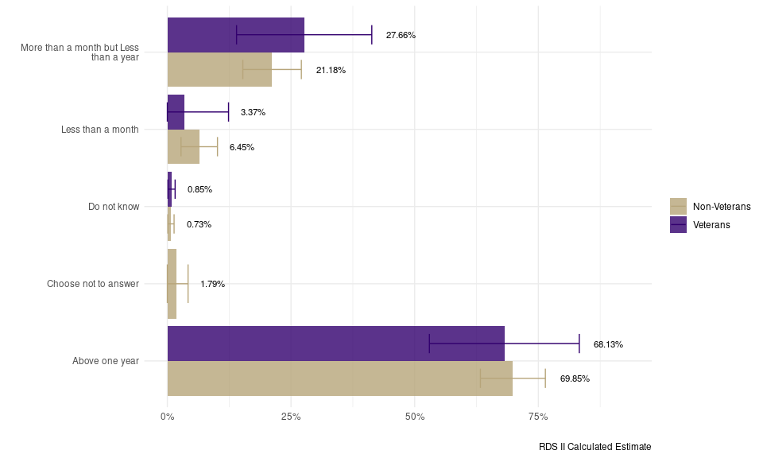

## *Days Homeless in Past Three Years*

*‘If you added up all the times you have been homeless in the last 3
years, about how long have you been homeless? - Imputed Total Days’ This
variable is not included for UWRDS-PSD survey observations.*

<table class="table table-striped" style="margin-left: auto; margin-right: auto;">
<thead>
<tr>
<th style="text-align:left;">
Veteran Status
</th>
<th style="text-align:right;">
Sample N
</th>
<th style="text-align:right;">
Sample Median
</th>
<th style="text-align:right;">
Sample Mean
</th>
<th style="text-align:right;">
Sample SE
</th>
<th style="text-align:right;">
RDS II Estimate
</th>
<th style="text-align:left;">
RDS II 95% CI
</th>
</tr>
</thead>
<tbody>
<tr>
<td style="text-align:left;">
Non-Veterans
</td>
<td style="text-align:right;">
751
</td>
<td style="text-align:right;">
1095.00
</td>
<td style="text-align:right;">
816.88
</td>
<td style="text-align:right;">
13.77
</td>
<td style="text-align:right;">
807.87
</td>
<td style="text-align:left;">
[747.71, 868.03]
</td>
</tr>
<tr>
<td style="text-align:left;">
Veterans
</td>
<td style="text-align:right;">
95
</td>
<td style="text-align:right;">
913.14
</td>
<td style="text-align:right;">
734.24
</td>
<td style="text-align:right;">
41.38
</td>
<td style="text-align:right;">
705.85
</td>
<td style="text-align:left;">
[579.64, 832.05]
</td>
</tr>
</tbody>
</table>

*The difference between individual veterans and non-veterans is not
significant, t(373.58) = -1.43, (p= 0.153).*

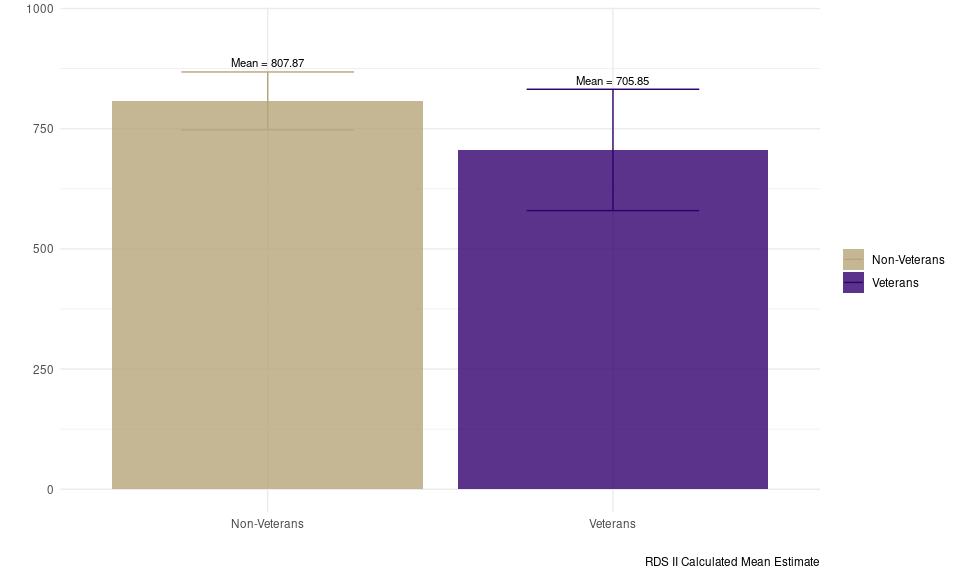

## *Number of Times Homeless in Past Three Years*

*‘18. Including this time, how many different times have you been
homeless in the past 3 years, that is since April 2020?’ This variable
is not included for UWRDS-PSD survey observations.*

<table class="table table-striped" style="margin-left: auto; margin-right: auto;">
<caption>
Veterans
</caption>
<thead>
<tr>
<th style="text-align:left;">
Times Homeless
</th>
<th style="text-align:right;">
Sample N
</th>
<th style="text-align:left;">
Sample Proportion
</th>
<th style="text-align:left;">
RDS II Estimate
</th>
<th style="text-align:left;">
RDS II 95% CI
</th>
</tr>
</thead>
<tbody>
<tr>
<td style="text-align:left;">
1 time
</td>
<td style="text-align:right;">
66
</td>
<td style="text-align:left;">
69.47%
</td>
<td style="text-align:left;">
68.01%
</td>
<td style="text-align:left;">
[51.22%, 84.81%]
</td>
</tr>
<tr>
<td style="text-align:left;">
2 times
</td>
<td style="text-align:right;">
11
</td>
<td style="text-align:left;">
11.58%
</td>
<td style="text-align:left;">
8.83%
</td>
<td style="text-align:left;">
[-3.18%, 20.85%]
</td>
</tr>
<tr>
<td style="text-align:left;">
3 times
</td>
<td style="text-align:right;">
3
</td>
<td style="text-align:left;">
3.16%
</td>
<td style="text-align:left;">
5.69%
</td>
<td style="text-align:left;">
[-2.25%, 13.64%]
</td>
</tr>
<tr>
<td style="text-align:left;">
4 or more times
</td>
<td style="text-align:right;">
10
</td>
<td style="text-align:left;">
10.53%
</td>
<td style="text-align:left;">
11.91%
</td>
<td style="text-align:left;">
[-0.73%, 24.54%]
</td>
</tr>
<tr>
<td style="text-align:left;">
Choose not to answer
</td>
<td style="text-align:right;">
2
</td>
<td style="text-align:left;">
2.11%
</td>
<td style="text-align:left;">
3.45%
</td>
<td style="text-align:left;">
[1.68%, 5.22%]
</td>
</tr>
<tr>
<td style="text-align:left;">
Do not know
</td>
<td style="text-align:right;">
3
</td>
<td style="text-align:left;">
3.16%
</td>
<td style="text-align:left;">
2.10%
</td>
<td style="text-align:left;">
[1.12%, 3.08%]
</td>
</tr>
<tr>
<td style="text-align:left;">
Total
</td>
<td style="text-align:right;">
95
</td>
<td style="text-align:left;">

-   </td>
    <td style="text-align:left;">

    -   </td>
        <td style="text-align:left;">

        -   </td>
            </tr>
            </tbody>
            </table>
            <table class="table table-striped" style="margin-left: auto; margin-right: auto;">
            <caption>
            Non-Veterans
            </caption>
            <thead>
            <tr>
            <th style="text-align:left;">
            Times Homeless
            </th>
            <th style="text-align:right;">
            Sample N
            </th>
            <th style="text-align:left;">
            Sample Proportion
            </th>
            <th style="text-align:left;">
            RDS II Estimate
            </th>
            <th style="text-align:left;">
            RDS II 95% CI
            </th>
            </tr>
            </thead>
            <tbody>
            <tr>
            <td style="text-align:left;">
            1 time
            </td>
            <td style="text-align:right;">
            497
            </td>
            <td style="text-align:left;">
            66.27%
            </td>
            <td style="text-align:left;">
            65.47%
            </td>
            <td style="text-align:left;">
            [58.45%, 72.49%]
            </td>
            </tr>
            <tr>
            <td style="text-align:left;">
            2 times
            </td>
            <td style="text-align:right;">
            103
            </td>
            <td style="text-align:left;">
            13.73%
            </td>
            <td style="text-align:left;">
            15.47%
            </td>
            <td style="text-align:left;">
            [9.41%, 21.53%]
            </td>
            </tr>
            <tr>
            <td style="text-align:left;">
            3 times
            </td>
            <td style="text-align:right;">
            46
            </td>
            <td style="text-align:left;">
            6.13%
            </td>
            <td style="text-align:left;">
            6.29%
            </td>
            <td style="text-align:left;">
            [3.70%, 8.88%]
            </td>
            </tr>
            <tr>
            <td style="text-align:left;">
            4 or more times
            </td>
            <td style="text-align:right;">
            78
            </td>
            <td style="text-align:left;">
            10.40%
            </td>
            <td style="text-align:left;">
            9.04%
            </td>
            <td style="text-align:left;">
            [5.08%, 13.00%]
            </td>
            </tr>
            <tr>
            <td style="text-align:left;">
            Choose not to answer
            </td>
            <td style="text-align:right;">
            11
            </td>
            <td style="text-align:left;">
            1.47%
            </td>
            <td style="text-align:left;">
            1.36%
            </td>
            <td style="text-align:left;">
            [-0.53%, 3.24%]
            </td>
            </tr>
            <tr>
            <td style="text-align:left;">
            Do not know
            </td>
            <td style="text-align:right;">
            15
            </td>
            <td style="text-align:left;">
            2.00%
            </td>
            <td style="text-align:left;">
            2.37%
            </td>
            <td style="text-align:left;">
            [-0.27%, 5.01%]
            </td>
            </tr>
            <tr>
            <td style="text-align:left;">
            Total
            </td>
            <td style="text-align:right;">
            750
            </td>
            <td style="text-align:left;">

            -   </td>
                <td style="text-align:left;">

                -   </td>
                    <td style="text-align:left;">

                    -   </td>
                        </tr>
                        </tbody>
                        </table>
                        

*The difference between individual veterans and non-veterans is not
significant, *χ*2 = 5.94, (p = 0.824). These results were
calculated based on the mean of 1000 bootstrapped tests. This value was
calculated with replacement.*

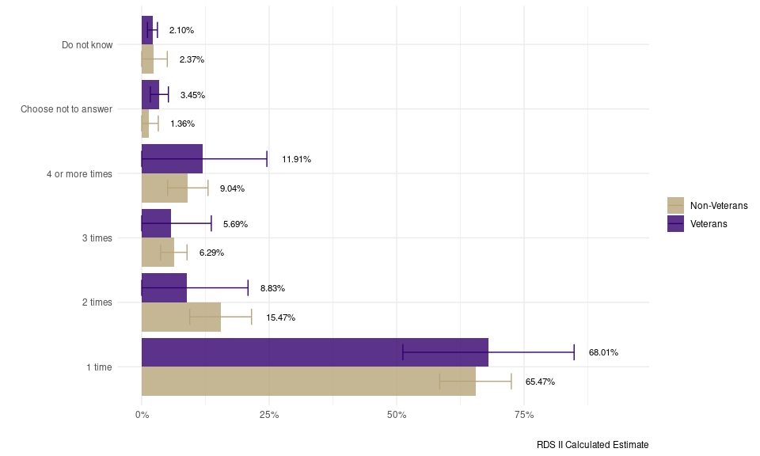

## *Experiencing Chronic Homelessness*

*Binary imputed variable for HUD’s chronic homelessness designation*

<table class="table table-striped" style="margin-left: auto; margin-right: auto;">
<caption>
Veterans
</caption>
<thead>
<tr>
<th style="text-align:left;">
Experiencing Chronic Homelessness
</th>
<th style="text-align:right;">
Sample N
</th>
<th style="text-align:left;">
Sample Proportion
</th>
<th style="text-align:left;">
RDS II Estimate
</th>
<th style="text-align:left;">
RDS II 95% CI
</th>
</tr>
</thead>
<tbody>
<tr>
<td style="text-align:left;">
No
</td>
<td style="text-align:right;">
49
</td>
<td style="text-align:left;">
51.6%
</td>
<td style="text-align:left;">
57.0%
</td>
<td style="text-align:left;">
[39.5%, 74.5%]
</td>
</tr>
<tr>
<td style="text-align:left;">
Yes
</td>
<td style="text-align:right;">
46
</td>
<td style="text-align:left;">
48.4%
</td>
<td style="text-align:left;">
43.0%
</td>
<td style="text-align:left;">
[25.5%, 60.5%]
</td>
</tr>
<tr>
<td style="text-align:left;">
Total
</td>
<td style="text-align:right;">
95
</td>
<td style="text-align:left;">

-   </td>
    <td style="text-align:left;">

    -   </td>
        <td style="text-align:left;">

        -   </td>
            </tr>
            </tbody>
            </table>
            <table class="table table-striped" style="margin-left: auto; margin-right: auto;">
            <caption>
            Non-Veterans
            </caption>
            <thead>
            <tr>
            <th style="text-align:left;">
            Experiencing Chronic Homelessness
            </th>
            <th style="text-align:right;">
            Sample N
            </th>
            <th style="text-align:left;">
            Sample Proportion
            </th>
            <th style="text-align:left;">
            RDS II Estimate
            </th>
            <th style="text-align:left;">
            RDS II 95% CI
            </th>
            </tr>
            </thead>
            <tbody>
            <tr>
            <td style="text-align:left;">
            No
            </td>
            <td style="text-align:right;">
            296
            </td>
            <td style="text-align:left;">
            39.4%
            </td>
            <td style="text-align:left;">
            44.8%
            </td>
            <td style="text-align:left;">
            [37.4%, 52.1%]
            </td>
            </tr>
            <tr>
            <td style="text-align:left;">
            Yes
            </td>
            <td style="text-align:right;">
            455
            </td>
            <td style="text-align:left;">
            60.6%
            </td>
            <td style="text-align:left;">
            55.2%
            </td>
            <td style="text-align:left;">
            [47.9%, 62.6%]
            </td>
            </tr>
            <tr>
            <td style="text-align:left;">
            Total
            </td>
            <td style="text-align:right;">
            751
            </td>
            <td style="text-align:left;">

            -   </td>
                <td style="text-align:left;">

                -   </td>
                    <td style="text-align:left;">

                    -   </td>
                        </tr>
                        </tbody>
                        </table>
                        

*The difference between individual veterans and non-veterans is not
significant, *χ*2 = 5.3, (p = 0.173). These results were
calculated based on the mean of 1000 bootstrapped tests. This value was
calculated with replacement.*

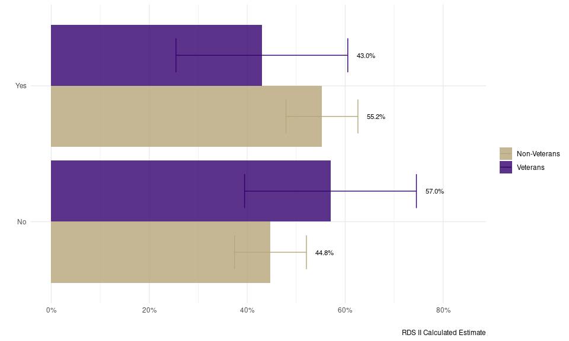

# Connections

## *Number of Estimated Homeless People Known*

*Outside of your family living with you, how many people do you
personally know who are unhoused or experiencing homelessness? -
Imputed*

<table class="table table-striped" style="margin-left: auto; margin-right: auto;">
<thead>
<tr>
<th style="text-align:left;">
Veteran Status
</th>
<th style="text-align:right;">
Sample N
</th>
<th style="text-align:right;">
Sample Median
</th>
<th style="text-align:right;">
Sample Mean
</th>
<th style="text-align:right;">
Sample SE
</th>
<th style="text-align:right;">
RDS II Estimate
</th>
<th style="text-align:left;">
RDS II 95% CI
</th>
</tr>
</thead>
<tbody>
<tr>
<td style="text-align:left;">
Non-Veterans
</td>
<td style="text-align:right;">
924
</td>
<td style="text-align:right;">
12
</td>
<td style="text-align:right;">
78.93
</td>
<td style="text-align:right;">
25.04
</td>
<td style="text-align:right;">
87.60
</td>
<td style="text-align:left;">
[-32.77, 207.97]
</td>
</tr>
<tr>
<td style="text-align:left;">
Veterans
</td>
<td style="text-align:right;">
108
</td>
<td style="text-align:right;">
10
</td>
<td style="text-align:right;">
69.99
</td>
<td style="text-align:right;">
23.21
</td>
<td style="text-align:right;">
51.52
</td>
<td style="text-align:left;">
[6.44, 96.61]
</td>
</tr>
</tbody>
</table>

*The difference between individual veterans and non-veterans is not
significant, t(62.13) = -0.55, (p= 0.584).*

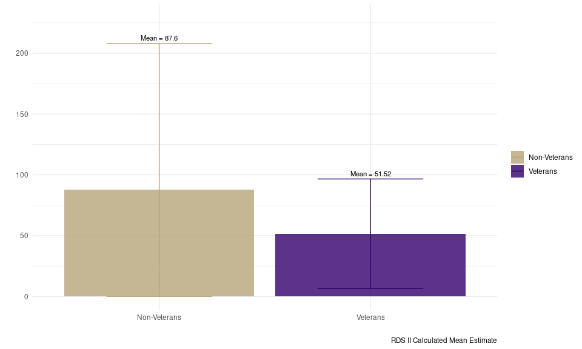

## *Number of Named Homeless People Known*

*Number of named non-household contacts*

<table class="table table-striped" style="margin-left: auto; margin-right: auto;">
<thead>
<tr>
<th style="text-align:left;">
Veteran Status
</th>
<th style="text-align:right;">
Sample N
</th>
<th style="text-align:right;">
Sample Median
</th>
<th style="text-align:right;">
Sample Mean
</th>
<th style="text-align:right;">
Sample SE
</th>
<th style="text-align:right;">
RDS II Estimate
</th>
<th style="text-align:left;">
RDS II 95% CI
</th>
</tr>
</thead>
<tbody>
<tr>
<td style="text-align:left;">
Non-Veterans
</td>
<td style="text-align:right;">
960
</td>
<td style="text-align:right;">
3
</td>
<td style="text-align:right;">
4.10
</td>
<td style="text-align:right;">
0.14
</td>
<td style="text-align:right;">
1.89
</td>
<td style="text-align:left;">
[1.61, 2.16]
</td>
</tr>
<tr>
<td style="text-align:left;">
Veterans
</td>
<td style="text-align:right;">
111
</td>
<td style="text-align:right;">
3
</td>
<td style="text-align:right;">
4.23
</td>
<td style="text-align:right;">
0.46
</td>
<td style="text-align:right;">
1.61
</td>
<td style="text-align:left;">
[0.89, 2.32]
</td>
</tr>
</tbody>
</table>

*The difference between individual veterans and non-veterans is not
significant, t(438.91) = -0.55, (p= 0.583).*

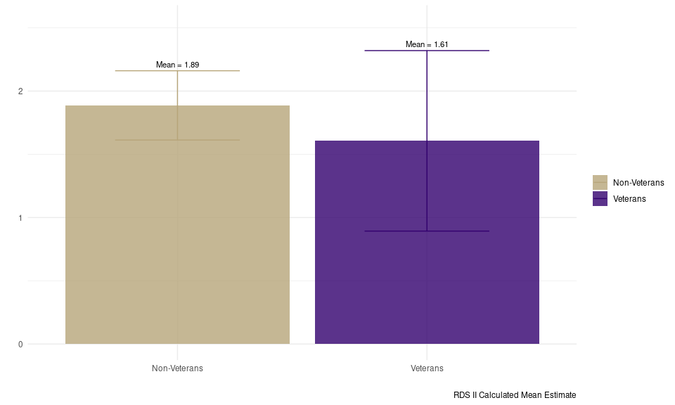

## *Number of Household Members*

*Imputed count of household members based on ‘27. Please list the
initials of all the people in your household.’*

<table class="table table-striped" style="margin-left: auto; margin-right: auto;">
<thead>
<tr>
<th style="text-align:left;">
Veteran Status
</th>
<th style="text-align:right;">
Sample N
</th>
<th style="text-align:right;">
Sample Median
</th>
<th style="text-align:right;">
Sample Mean
</th>
<th style="text-align:right;">
Sample SE
</th>
<th style="text-align:right;">
RDS II Estimate
</th>
<th style="text-align:left;">
RDS II 95% CI
</th>
</tr>
</thead>
<tbody>
<tr>
<td style="text-align:left;">
Non-Veterans
</td>
<td style="text-align:right;">
764
</td>
<td style="text-align:right;">
0
</td>
<td style="text-align:right;">
0.69
</td>
<td style="text-align:right;">
0.05
</td>
<td style="text-align:right;">
0.63
</td>
<td style="text-align:left;">
[0.51, 0.76]
</td>
</tr>
<tr>
<td style="text-align:left;">
Veterans
</td>
<td style="text-align:right;">
95
</td>
<td style="text-align:right;">
0
</td>
<td style="text-align:right;">
0.53
</td>
<td style="text-align:right;">
0.14
</td>
<td style="text-align:right;">
0.43
</td>
<td style="text-align:left;">
[0.2, 0.65]
</td>
</tr>
</tbody>
</table>

*The difference between individual veterans and non-veterans is not
significant, t(371.72) = -1.59, (p= 0.112).*

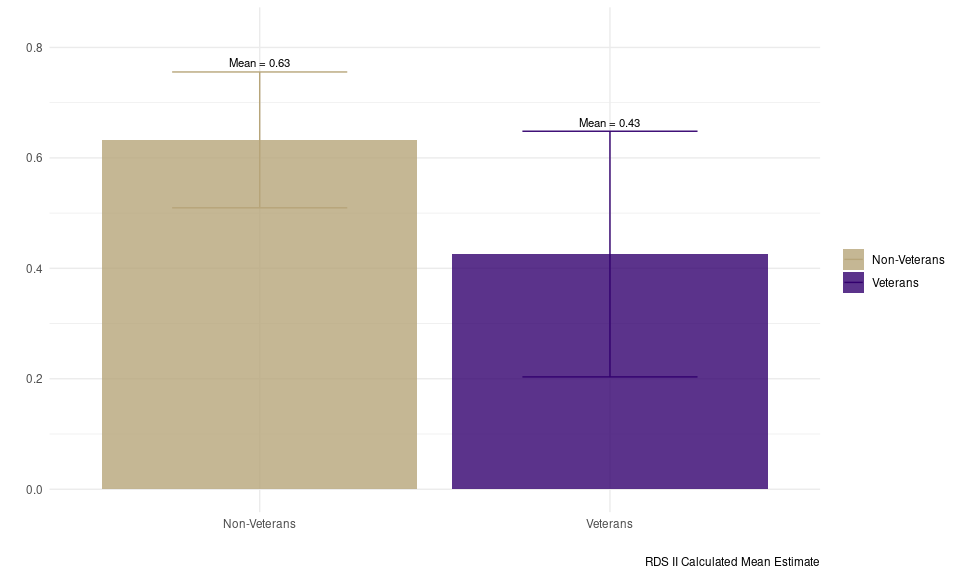

## *Number of Coupons Distributed*

*Total number of individuals the respondent referred who took the
survey*

<table class="table table-striped" style="margin-left: auto; margin-right: auto;">
<thead>
<tr>
<th style="text-align:left;">
Veteran Status
</th>
<th style="text-align:right;">
Sample N
</th>
<th style="text-align:right;">
Sample Median
</th>
<th style="text-align:right;">
Sample Mean
</th>
<th style="text-align:right;">
Sample SE
</th>
<th style="text-align:right;">
RDS II Estimate
</th>
<th style="text-align:left;">
RDS II 95% CI
</th>
</tr>
</thead>
<tbody>
<tr>
<td style="text-align:left;">
Non-Veterans
</td>
<td style="text-align:right;">
971
</td>
<td style="text-align:right;">
3
</td>
<td style="text-align:right;">
2.88
</td>
<td style="text-align:right;">
0.02
</td>
<td style="text-align:right;">
2.86
</td>
<td style="text-align:left;">
[2.77, 2.95]
</td>
</tr>
<tr>
<td style="text-align:left;">
Veterans
</td>
<td style="text-align:right;">
111
</td>
<td style="text-align:right;">
3
</td>
<td style="text-align:right;">
2.93
</td>
<td style="text-align:right;">
0.04
</td>
<td style="text-align:right;">
2.93
</td>
<td style="text-align:left;">
[2.83, 3.03]
</td>
</tr>
</tbody>
</table>

*The difference between individual veterans and non-veterans is not
significant, t(409.1) = 1.01, (p= 0.315).*

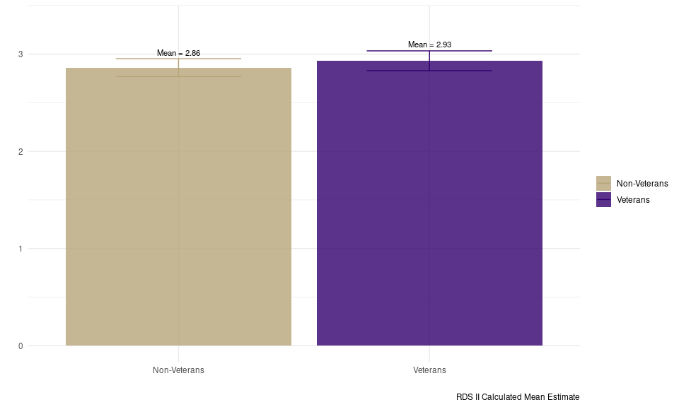

# Benefits

## *Veteran Affairs Benefits*

*‘13. Are you receiving any of the following benefits? (Select all that
apply) - Selected Choice Veteran’s Administration (VA)’ This variable is
not included for UWRDS-PSD survey observations.*

<table class="table table-striped" style="margin-left: auto; margin-right: auto;">
<caption>
Veterans
</caption>
<thead>
<tr>
<th style="text-align:left;">
Receiving VA Benefits
</th>
<th style="text-align:right;">
Sample N
</th>
<th style="text-align:left;">
Sample Proportion
</th>
<th style="text-align:left;">
RDS II Estimate
</th>
<th style="text-align:left;">
RDS II 95% CI
</th>
</tr>
</thead>
<tbody>
<tr>
<td style="text-align:left;">
No or Chose Not to Answer
</td>
<td style="text-align:right;">
68
</td>
<td style="text-align:left;">
72%
</td>
<td style="text-align:left;">
75%
</td>
<td style="text-align:left;">
[61%, 89%]
</td>
</tr>
<tr>
<td style="text-align:left;">
Yes
</td>
<td style="text-align:right;">
27
</td>
<td style="text-align:left;">
28%
</td>
<td style="text-align:left;">
25%
</td>
<td style="text-align:left;">
[11%, 39%]
</td>
</tr>
<tr>
<td style="text-align:left;">
Total
</td>
<td style="text-align:right;">
95
</td>
<td style="text-align:left;">

-   </td>
    <td style="text-align:left;">

    -   </td>
        <td style="text-align:left;">

        -   </td>
            </tr>
            </tbody>
            </table>
            <table class="table table-striped" style="margin-left: auto; margin-right: auto;">
            <caption>
            Non-Veterans
            </caption>
            <thead>
            <tr>
            <th style="text-align:left;">
            Receiving VA Benefits
            </th>
            <th style="text-align:right;">
            Sample N
            </th>
            <th style="text-align:left;">
            Sample Proportion
            </th>
            <th style="text-align:left;">
            RDS II Estimate
            </th>
            <th style="text-align:left;">
            RDS II 95% CI
            </th>
            </tr>
            </thead>
            <tbody>
            <tr>
            <td style="text-align:left;">
            No or Chose Not to Answer
            </td>
            <td style="text-align:right;">
            749
            </td>
            <td style="text-align:left;">
            100%
            </td>
            <td style="text-align:left;">
            100%
            </td>
            <td style="text-align:left;">
            [100%, 100%]
            </td>
            </tr>
            <tr>
            <td style="text-align:left;">
            Yes
            </td>
            <td style="text-align:right;">
            2
            </td>
            <td style="text-align:left;">
            0%
            </td>
            <td style="text-align:left;">
            0%
            </td>
            <td style="text-align:left;">
            [0%, 0%]
            </td>
            </tr>
            <tr>
            <td style="text-align:left;">
            Total
            </td>
            <td style="text-align:right;">
            751
            </td>
            <td style="text-align:left;">

            -   </td>
                <td style="text-align:left;">

                -   </td>
                    <td style="text-align:left;">

                    -   </td>
                        </tr>
                        </tbody>
                        </table>
                        

*The difference between individual veterans and non-veterans is
significant at the .05 level, *χ*2 = 168.07, (p = 0). These
results were calculated based on the mean of 1000 bootstrapped tests.
This value was calculated with replacement.*

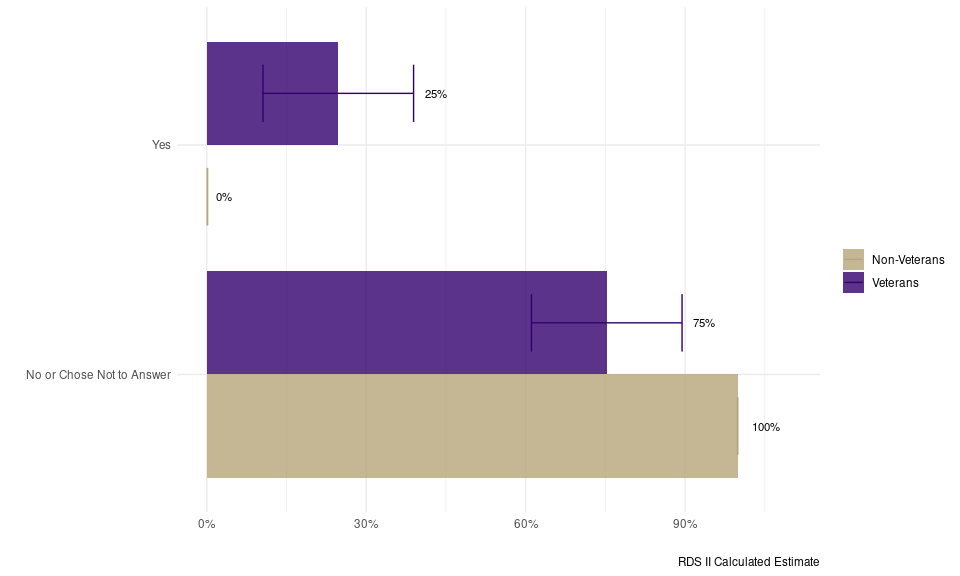

## *Disability Benefits*

*‘13. Are you receiving any of the following benefits? (Select all that
apply) - Selected Choice WA Aged, Blind, or Disabled cash assistance’
This variable is not included for UWRDS-PSD survey observations.*

<table class="table table-striped" style="margin-left: auto; margin-right: auto;">
<caption>
Veterans
</caption>
<thead>
<tr>
<th style="text-align:left;">
Receiving Disability Benefits
</th>
<th style="text-align:right;">
Sample N
</th>
<th style="text-align:left;">
Sample Proportion
</th>
<th style="text-align:left;">
RDS II Estimate
</th>
<th style="text-align:left;">
RDS II 95% CI
</th>
</tr>
</thead>
<tbody>
<tr>
<td style="text-align:left;">
No or Chose Not to Answer
</td>
<td style="text-align:right;">
90
</td>
<td style="text-align:left;">
94.7%
</td>
<td style="text-align:left;">
94.1%
</td>
<td style="text-align:left;">
[89.62%, 98.59%]
</td>
</tr>
<tr>
<td style="text-align:left;">
Yes
</td>
<td style="text-align:right;">
5
</td>
<td style="text-align:left;">
5.3%
</td>
<td style="text-align:left;">
5.9%
</td>
<td style="text-align:left;">
[1.41%, 10.38%]
</td>
</tr>
<tr>
<td style="text-align:left;">
Total
</td>
<td style="text-align:right;">
95
</td>
<td style="text-align:left;">

-   </td>
    <td style="text-align:left;">

    -   </td>
        <td style="text-align:left;">

        -   </td>
            </tr>
            </tbody>
            </table>
            <table class="table table-striped" style="margin-left: auto; margin-right: auto;">
            <caption>
            Non-Veterans
            </caption>
            <thead>
            <tr>
            <th style="text-align:left;">
            Receiving Disability Benefits
            </th>
            <th style="text-align:right;">
            Sample N
            </th>
            <th style="text-align:left;">
            Sample Proportion
            </th>
            <th style="text-align:left;">
            RDS II Estimate
            </th>
            <th style="text-align:left;">
            RDS II 95% CI
            </th>
            </tr>
            </thead>
            <tbody>
            <tr>
            <td style="text-align:left;">
            No or Chose Not to Answer
            </td>
            <td style="text-align:right;">
            683
            </td>
            <td style="text-align:left;">
            91.0%
            </td>
            <td style="text-align:left;">
            92.2%
            </td>
            <td style="text-align:left;">
            [88.85%, 95.44%]
            </td>
            </tr>
            <tr>
            <td style="text-align:left;">
            Yes
            </td>
            <td style="text-align:right;">
            68
            </td>
            <td style="text-align:left;">
            9.0%
            </td>
            <td style="text-align:left;">
            7.8%
            </td>
            <td style="text-align:left;">
            [4.56%, 11.15%]
            </td>
            </tr>
            <tr>
            <td style="text-align:left;">
            Total
            </td>
            <td style="text-align:right;">
            751
            </td>
            <td style="text-align:left;">

            -   </td>
                <td style="text-align:left;">

                -   </td>
                    <td style="text-align:left;">

                    -   </td>
                        </tr>
                        </tbody>
                        </table>
                        

*The difference between individual veterans and non-veterans is not
significant, *χ*2 = 0.48, (p = 0.533). These results were
calculated based on the mean of 1000 bootstrapped tests. This value was
calculated with replacement.*

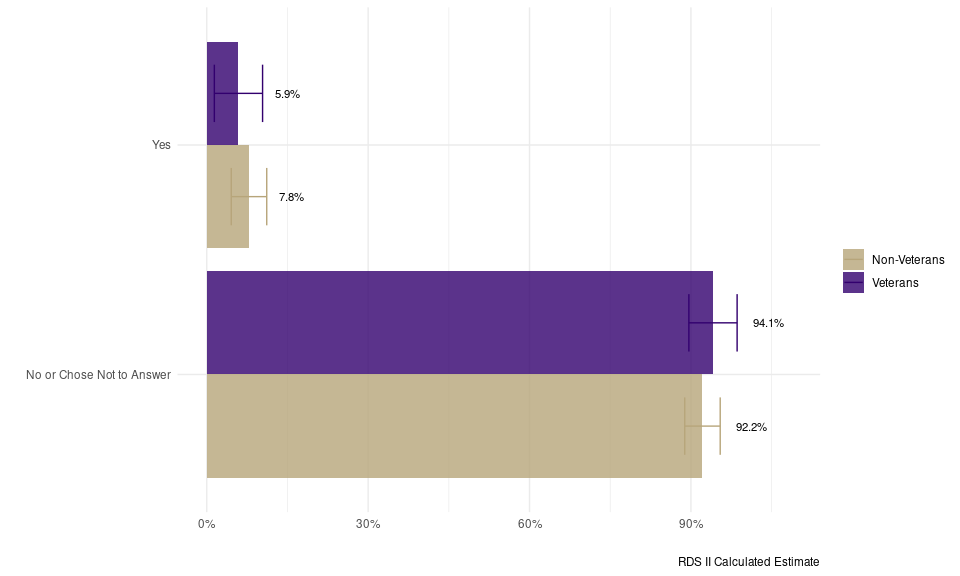

## *Housing Benefits*

*‘13. Are you receiving any of the following benefits? (Select all that
apply) - Selected Choice: ’WA Housing and Essential Needs program’ -
Imputed with text response.’ This variable is not included for UWRDS-PSD
survey observations.*

<table class="table table-striped" style="margin-left: auto; margin-right: auto;">
<caption>
Veterans
</caption>
<thead>
<tr>
<th style="text-align:left;">
Receiving Housing Benefits
</th>
<th style="text-align:right;">
Sample N
</th>
<th style="text-align:left;">
Sample Proportion
</th>
<th style="text-align:left;">
RDS II Estimate
</th>
<th style="text-align:left;">
RDS II 95% CI
</th>
</tr>
</thead>
<tbody>
<tr>
<td style="text-align:left;">
No or Chose Not to Answer
</td>
<td style="text-align:right;">
87
</td>
<td style="text-align:left;">
91.6%
</td>
<td style="text-align:left;">
94.9%
</td>
<td style="text-align:left;">
[90.43%, 99.33%]
</td>
</tr>
<tr>
<td style="text-align:left;">
Yes
</td>
<td style="text-align:right;">
8
</td>
<td style="text-align:left;">
8.4%
</td>
<td style="text-align:left;">
5.1%
</td>
<td style="text-align:left;">
[0.67%, 9.57%]
</td>
</tr>
<tr>
<td style="text-align:left;">
Total
</td>
<td style="text-align:right;">
95
</td>
<td style="text-align:left;">

-   </td>
    <td style="text-align:left;">

    -   </td>
        <td style="text-align:left;">

        -   </td>
            </tr>
            </tbody>
            </table>
            <table class="table table-striped" style="margin-left: auto; margin-right: auto;">
            <caption>
            Non-Veterans
            </caption>
            <thead>
            <tr>
            <th style="text-align:left;">
            Receiving Housing Benefits
            </th>
            <th style="text-align:right;">
            Sample N
            </th>
            <th style="text-align:left;">
            Sample Proportion
            </th>
            <th style="text-align:left;">
            RDS II Estimate
            </th>
            <th style="text-align:left;">
            RDS II 95% CI
            </th>
            </tr>
            </thead>
            <tbody>
            <tr>
            <td style="text-align:left;">
            No or Chose Not to Answer
            </td>
            <td style="text-align:right;">
            722
            </td>
            <td style="text-align:left;">
            96.1%
            </td>
            <td style="text-align:left;">
            97.4%
            </td>
            <td style="text-align:left;">
            [96.26%, 98.49%]
            </td>
            </tr>
            <tr>
            <td style="text-align:left;">
            Yes
            </td>
            <td style="text-align:right;">
            29
            </td>
            <td style="text-align:left;">
            3.9%
            </td>
            <td style="text-align:left;">
            2.6%
            </td>
            <td style="text-align:left;">
            [1.51%, 3.74%]
            </td>
            </tr>
            <tr>
            <td style="text-align:left;">
            Total
            </td>
            <td style="text-align:right;">
            751
            </td>
            <td style="text-align:left;">

            -   </td>
                <td style="text-align:left;">

                -   </td>
                    <td style="text-align:left;">

                    -   </td>
                        </tr>
                        </tbody>
                        </table>
                        

*The difference between individual veterans and non-veterans is not
significant, *χ*2 = 1.91, (p = 0.27). These results were
calculated based on the mean of 1000 bootstrapped tests. This value was
calculated with replacement.*

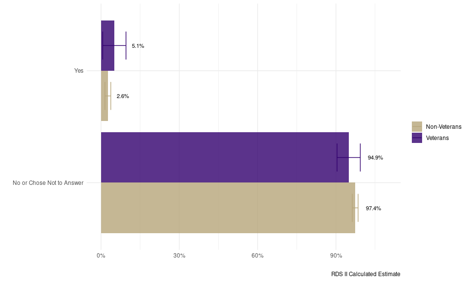

## *SSI Benefits*

*‘13. Are you receiving any of the following benefits? (Select all that
apply) - Selected Choice: ’Federal Supplemental Security Income (SSI),
Social Security Disability Insurance (SSDI), or other social security
benefit’ - Imputed with text response.’ This variable is not included
for UWRDS-PSD survey observations.*

<table class="table table-striped" style="margin-left: auto; margin-right: auto;">
<caption>
Veterans
</caption>
<thead>
<tr>
<th style="text-align:left;">
Receiving SSI Benefits
</th>
<th style="text-align:right;">
Sample N
</th>
<th style="text-align:left;">
Sample Proportion
</th>
<th style="text-align:left;">
RDS II Estimate
</th>
<th style="text-align:left;">
RDS II 95% CI
</th>
</tr>
</thead>
<tbody>
<tr>
<td style="text-align:left;">
No or Chose Not to Answer
</td>
<td style="text-align:right;">
69
</td>
<td style="text-align:left;">
73%
</td>
<td style="text-align:left;">
73%
</td>
<td style="text-align:left;">
[59.8%, 85.4%]
</td>
</tr>
<tr>
<td style="text-align:left;">
Yes
</td>
<td style="text-align:right;">
26
</td>
<td style="text-align:left;">
27%
</td>
<td style="text-align:left;">
27%
</td>
<td style="text-align:left;">
[14.6%, 40.2%]
</td>
</tr>
<tr>
<td style="text-align:left;">
Total
</td>
<td style="text-align:right;">
95
</td>
<td style="text-align:left;">

-   </td>
    <td style="text-align:left;">

    -   </td>
        <td style="text-align:left;">

        -   </td>
            </tr>
            </tbody>
            </table>
            <table class="table table-striped" style="margin-left: auto; margin-right: auto;">
            <caption>
            Non-Veterans
            </caption>
            <thead>
            <tr>
            <th style="text-align:left;">
            Receiving SSI Benefits
            </th>
            <th style="text-align:right;">
            Sample N
            </th>
            <th style="text-align:left;">
            Sample Proportion
            </th>
            <th style="text-align:left;">
            RDS II Estimate
            </th>
            <th style="text-align:left;">
            RDS II 95% CI
            </th>
            </tr>
            </thead>
            <tbody>
            <tr>
            <td style="text-align:left;">
            No or Chose Not to Answer
            </td>
            <td style="text-align:right;">
            627
            </td>
            <td style="text-align:left;">
            83%
            </td>
            <td style="text-align:left;">
            84%
            </td>
            <td style="text-align:left;">
            [78.9%, 88.7%]
            </td>
            </tr>
            <tr>
            <td style="text-align:left;">
            Yes
            </td>
            <td style="text-align:right;">
            124
            </td>
            <td style="text-align:left;">
            17%
            </td>
            <td style="text-align:left;">
            16%
            </td>
            <td style="text-align:left;">
            [11.3%, 21.1%]
            </td>
            </tr>
            <tr>
            <td style="text-align:left;">
            Total
            </td>
            <td style="text-align:right;">
            751
            </td>
            <td style="text-align:left;">

            -   </td>
                <td style="text-align:left;">

                -   </td>
                    <td style="text-align:left;">

                    -   </td>
                        </tr>
                        </tbody>
                        </table>
                        

*The difference between individual veterans and non-veterans is not
significant, *χ*2 = 7.54, (p = 0.649). These results were
calculated based on the mean of 1000 bootstrapped tests. This value was
calculated with replacement.*

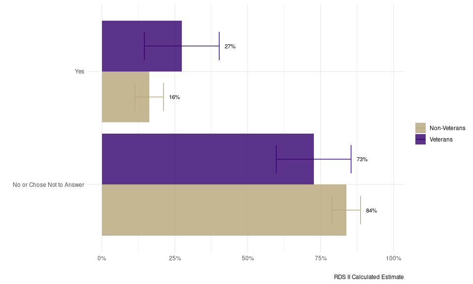

## *Medicaid Benefits*

*‘13. Are you receiving any of the following benefits? (Select all that
apply) - Selected Choice: ’Medicaid (in Washington state, this is Apple
Health)’ - Imputed with text response.’ This variable is not included
for UWRDS-PSD survey observations.*

<table class="table table-striped" style="margin-left: auto; margin-right: auto;">
<caption>
Veterans
</caption>
<thead>
<tr>
<th style="text-align:left;">
Receiving Medicaid Benefits
</th>
<th style="text-align:right;">
Sample N
</th>
<th style="text-align:left;">
Sample Proportion
</th>
<th style="text-align:left;">
RDS II Estimate
</th>
<th style="text-align:left;">
RDS II 95% CI
</th>
</tr>
</thead>
<tbody>
<tr>
<td style="text-align:left;">
No or Chose Not to Answer
</td>
<td style="text-align:right;">
53
</td>
<td style="text-align:left;">
55.79%
</td>
<td style="text-align:left;">
63.7%
</td>
<td style="text-align:left;">
[47.0%, 80.3%]
</td>
</tr>
<tr>
<td style="text-align:left;">
Yes
</td>
<td style="text-align:right;">
42
</td>
<td style="text-align:left;">
44.21%
</td>
<td style="text-align:left;">
36.3%
</td>
<td style="text-align:left;">
[19.7%, 53.0%]
</td>
</tr>
<tr>
<td style="text-align:left;">
Total
</td>
<td style="text-align:right;">
95
</td>
<td style="text-align:left;">

-   </td>
    <td style="text-align:left;">

    -   </td>
        <td style="text-align:left;">

        -   </td>
            </tr>
            </tbody>
            </table>
            <table class="table table-striped" style="margin-left: auto; margin-right: auto;">
            <caption>
            Non-Veterans
            </caption>
            <thead>
            <tr>
            <th style="text-align:left;">
            Receiving Medicaid Benefits
            </th>
            <th style="text-align:right;">
            Sample N
            </th>
            <th style="text-align:left;">
            Sample Proportion
            </th>
            <th style="text-align:left;">
            RDS II Estimate
            </th>
            <th style="text-align:left;">
            RDS II 95% CI
            </th>
            </tr>
            </thead>
            <tbody>
            <tr>
            <td style="text-align:left;">
            No or Chose Not to Answer
            </td>
            <td style="text-align:right;">
            339
            </td>
            <td style="text-align:left;">
            45.14%
            </td>
            <td style="text-align:left;">
            48.7%
            </td>
            <td style="text-align:left;">
            [41.5%, 55.9%]
            </td>
            </tr>
            <tr>
            <td style="text-align:left;">
            Yes
            </td>
            <td style="text-align:right;">
            412
            </td>
            <td style="text-align:left;">
            54.86%
            </td>
            <td style="text-align:left;">
            51.3%
            </td>
            <td style="text-align:left;">
            [44.1%, 58.5%]
            </td>
            </tr>
            <tr>
            <td style="text-align:left;">
            Total
            </td>
            <td style="text-align:right;">
            751
            </td>
            <td style="text-align:left;">

            -   </td>
                <td style="text-align:left;">

                -   </td>
                    <td style="text-align:left;">

                    -   </td>
                        </tr>
                        </tbody>
                        </table>
                        

*The difference between individual veterans and non-veterans is not
significant, *χ*2 = 7.85, (p = 0.209). These results were
calculated based on the mean of 1000 bootstrapped tests. This value was
calculated with replacement.*

## *Medicare Benefits*

*‘13. Are you receiving any of the following benefits? (Select all that
apply) - Selected Choice Medicare’ This variable is not included for
UWRDS-PSD survey observations.*

<table class="table table-striped" style="margin-left: auto; margin-right: auto;">
<caption>
Veterans
</caption>
<thead>
<tr>
<th style="text-align:left;">
Receiving Medicare Benefits
</th>
<th style="text-align:right;">
Sample N
</th>
<th style="text-align:left;">
Sample Proportion
</th>
<th style="text-align:left;">
RDS II Estimate
</th>
<th style="text-align:left;">
RDS II 95% CI
</th>
</tr>
</thead>
<tbody>
<tr>
<td style="text-align:left;">
No or Chose Not to Answer
</td>
<td style="text-align:right;">
71
</td>
<td style="text-align:left;">
75%
</td>
<td style="text-align:left;">
78.7%
</td>
<td style="text-align:left;">
[65.59%, 91.86%]
</td>
</tr>
<tr>
<td style="text-align:left;">
Yes
</td>
<td style="text-align:right;">
24
</td>
<td style="text-align:left;">
25%
</td>
<td style="text-align:left;">
21.3%
</td>
<td style="text-align:left;">
[8.14%, 34.41%]
</td>
</tr>
<tr>
<td style="text-align:left;">
Total
</td>
<td style="text-align:right;">
95
</td>
<td style="text-align:left;">

-   </td>
    <td style="text-align:left;">

    -   </td>
        <td style="text-align:left;">

        -   </td>
            </tr>
            </tbody>
            </table>
            <table class="table table-striped" style="margin-left: auto; margin-right: auto;">
            <caption>
            Non-Veterans
            </caption>
            <thead>
            <tr>
            <th style="text-align:left;">
            Receiving Medicare Benefits
            </th>
            <th style="text-align:right;">
            Sample N
            </th>
            <th style="text-align:left;">
            Sample Proportion
            </th>
            <th style="text-align:left;">
            RDS II Estimate
            </th>
            <th style="text-align:left;">
            RDS II 95% CI
            </th>
            </tr>
            </thead>
            <tbody>
            <tr>
            <td style="text-align:left;">
            No or Chose Not to Answer
            </td>
            <td style="text-align:right;">
            667
            </td>
            <td style="text-align:left;">
            89%
            </td>
            <td style="text-align:left;">
            88.1%
            </td>
            <td style="text-align:left;">
            [84.49%, 91.79%]
            </td>
            </tr>
            <tr>
            <td style="text-align:left;">
            Yes
            </td>
            <td style="text-align:right;">
            84
            </td>
            <td style="text-align:left;">
            11%
            </td>
            <td style="text-align:left;">
            11.9%
            </td>
            <td style="text-align:left;">
            [8.21%, 15.51%]
            </td>
            </tr>
            <tr>
            <td style="text-align:left;">
            Total
            </td>
            <td style="text-align:right;">
            751
            </td>
            <td style="text-align:left;">

            -   </td>
                <td style="text-align:left;">

                -   </td>
                    <td style="text-align:left;">

                    -   </td>
                        </tr>
                        </tbody>
                        </table>
                        

*The difference between individual veterans and non-veterans is
significant at the .05 level, *χ*2 = 6.86, (p = 0.016). These
results were calculated based on the mean of 1000 bootstrapped tests.
This value was calculated with replacement.*

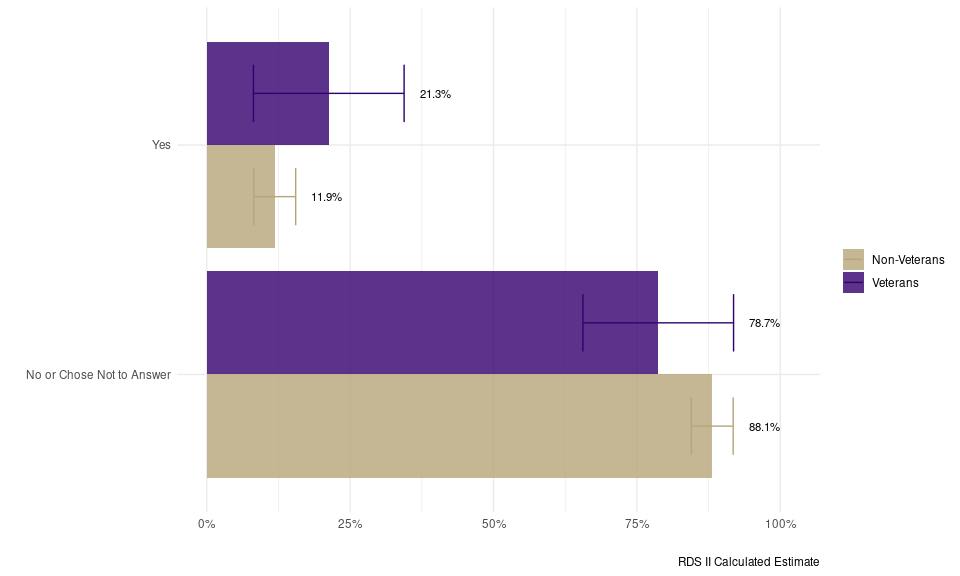

## *Indian Health Service Benefits*

*‘13. Are you receiving any of the following benefits? (Select all that
apply) - Selected Choice: ’Indian Health Services’ - Imputed with text
response.’ This variable is not included for UWRDS-PSD survey
observations.*

<table class="table table-striped" style="margin-left: auto; margin-right: auto;">
<caption>
Veterans
</caption>
<thead>
<tr>
<th style="text-align:left;">
Receiving IHS Benefits
</th>
<th style="text-align:right;">
Sample N
</th>
<th style="text-align:left;">
Sample Proportion
</th>
<th style="text-align:left;">
RDS II Estimate
</th>
<th style="text-align:left;">
RDS II 95% CI
</th>
</tr>
</thead>
<tbody>
<tr>
<td style="text-align:left;">
No or Chose Not to Answer
</td>
<td style="text-align:right;">
94
</td>
<td style="text-align:left;">
99.0%
</td>
<td style="text-align:left;">
99.8%
</td>
<td style="text-align:left;">
[99.70%, 99.95%]
</td>
</tr>
<tr>
<td style="text-align:left;">
Yes
</td>
<td style="text-align:right;">
1
</td>
<td style="text-align:left;">
1.0%
</td>
<td style="text-align:left;">
0.2%
</td>
<td style="text-align:left;">
[0.05%, 0.30%]
</td>
</tr>
<tr>
<td style="text-align:left;">
Total
</td>
<td style="text-align:right;">
95
</td>
<td style="text-align:left;">

-   </td>
    <td style="text-align:left;">

    -   </td>
        <td style="text-align:left;">

        -   </td>
            </tr>
            </tbody>
            </table>
            <table class="table table-striped" style="margin-left: auto; margin-right: auto;">
            <caption>
            Non-Veterans
            </caption>
            <thead>
            <tr>
            <th style="text-align:left;">
            Receiving IHS Benefits
            </th>
            <th style="text-align:right;">
            Sample N
            </th>
            <th style="text-align:left;">
            Sample Proportion
            </th>
            <th style="text-align:left;">
            RDS II Estimate
            </th>
            <th style="text-align:left;">
            RDS II 95% CI
            </th>
            </tr>
            </thead>
            <tbody>
            <tr>
            <td style="text-align:left;">
            No or Chose Not to Answer
            </td>
            <td style="text-align:right;">
            733
            </td>
            <td style="text-align:left;">
            97.6%
            </td>
            <td style="text-align:left;">
            98.2%
            </td>
            <td style="text-align:left;">
            [96.78%, 99.53%]
            </td>
            </tr>
            <tr>
            <td style="text-align:left;">
            Yes
            </td>
            <td style="text-align:right;">
            18
            </td>
            <td style="text-align:left;">
            2.4%
            </td>
            <td style="text-align:left;">
            1.8%
            </td>
            <td style="text-align:left;">
            [0.47%, 3.22%]
            </td>
            </tr>
            <tr>
            <td style="text-align:left;">
            Total
            </td>
            <td style="text-align:right;">
            751
            </td>
            <td style="text-align:left;">

            -   </td>
                <td style="text-align:left;">

                -   </td>
                    <td style="text-align:left;">

                    -   </td>
                        </tr>
                        </tbody>
                        </table>
                        

*The difference between individual veterans and non-veterans is not
significant, *χ*2 = 1.53, (p = 0.247). These results were
calculated based on the mean of 1000 bootstrapped tests. This value was
calculated with replacement.*

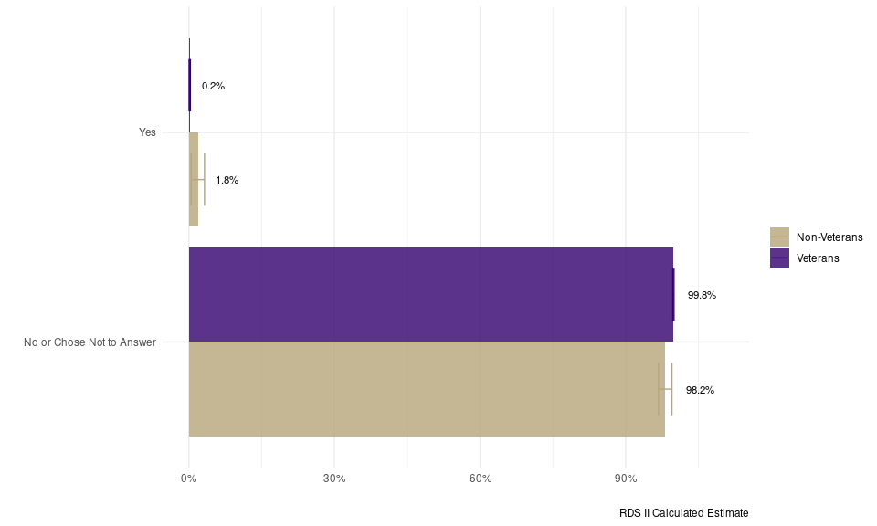

## *Other Benefits*

*‘13. Are you receiving any of the following benefits? - Other -
Imputed’ This variable is not included for UWRDS-PSD survey
observations.*

<table class="table table-striped" style="margin-left: auto; margin-right: auto;">
<caption>
Veterans
</caption>
<thead>
<tr>
<th style="text-align:left;">
Receiving Other Benefits
</th>
<th style="text-align:right;">
Sample N
</th>
<th style="text-align:left;">
Sample Proportion
</th>
<th style="text-align:left;">
RDS II Estimate
</th>
<th style="text-align:left;">
RDS II 95% CI
</th>
</tr>
</thead>
<tbody>
<tr>
<td style="text-align:left;">
No or Chose Not to Answer
</td>
<td style="text-align:right;">
56
</td>
<td style="text-align:left;">
59.0%
</td>
<td style="text-align:left;">
62.2%
</td>
<td style="text-align:left;">
[45.97%, 78.42%]
</td>
</tr>
<tr>
<td style="text-align:left;">
Yes
</td>
<td style="text-align:right;">
39
</td>
<td style="text-align:left;">
41.0%
</td>
<td style="text-align:left;">
37.8%
</td>
<td style="text-align:left;">
[21.58%, 54.03%]
</td>
</tr>
<tr>
<td style="text-align:left;">
Total
</td>
<td style="text-align:right;">
95
</td>
<td style="text-align:left;">

-   </td>
    <td style="text-align:left;">

    -   </td>
        <td style="text-align:left;">

        -   </td>
            </tr>
            </tbody>
            </table>
            <table class="table table-striped" style="margin-left: auto; margin-right: auto;">
            <caption>
            Non-Veterans
            </caption>
            <thead>
            <tr>
            <th style="text-align:left;">
            Receiving Other Benefits
            </th>
            <th style="text-align:right;">
            Sample N
            </th>
            <th style="text-align:left;">
            Sample Proportion
            </th>
            <th style="text-align:left;">
            RDS II Estimate
            </th>
            <th style="text-align:left;">
            RDS II 95% CI
            </th>
            </tr>
            </thead>
            <tbody>
            <tr>
            <td style="text-align:left;">
            No or Chose Not to Answer
            </td>
            <td style="text-align:right;">
            344
            </td>
            <td style="text-align:left;">
            45.8%
            </td>
            <td style="text-align:left;">
            46.2%
            </td>
            <td style="text-align:left;">
            [39.16%, 53.15%]
            </td>
            </tr>
            <tr>
            <td style="text-align:left;">
            Yes
            </td>
            <td style="text-align:right;">
            407
            </td>
            <td style="text-align:left;">
            54.2%
            </td>
            <td style="text-align:left;">
            53.8%
            </td>
            <td style="text-align:left;">
            [46.85%, 60.84%]
            </td>
            </tr>
            <tr>
            <td style="text-align:left;">
            Total
            </td>
            <td style="text-align:right;">
            751
            </td>
            <td style="text-align:left;">

            -   </td>
                <td style="text-align:left;">

                -   </td>
                    <td style="text-align:left;">

                    -   </td>
                        </tr>
                        </tbody>
                        </table>
                        

*The difference between individual veterans and non-veterans is not
significant, *χ*2 = 9.04, (p = 0.109). These results were
calculated based on the mean of 1000 bootstrapped tests. This value was
calculated with replacement.*

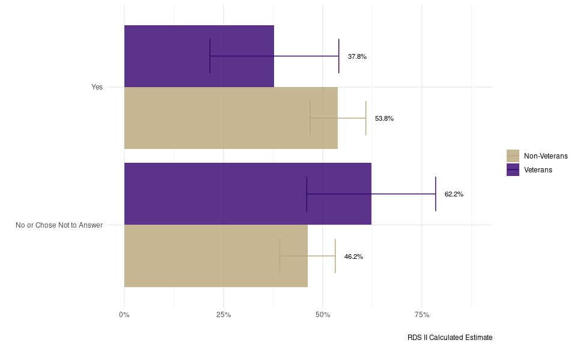
